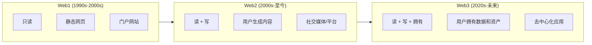

# 1.1 Web3 是什么，不是什么

> **学习目标**：完成本节后，你将能够……
> - 用 1-3 句话准确描述 Web3 的核心定义
> - 说出 Web3 的 3 个核心特征
> - 识别并澄清关于 Web3 的常见误解

---

## 核心内容

### 1. Web3 的定义

**Web3**（也称 Web 3.0）是互联网的第三次演进，代表了一个**去中心化的互联网愿景**。

这个概念最早由 Polkadot 创始人、以太坊联合创始人 Gavin Wood 在 2014 年提出，指的是「基于区块链的去中心化在线生态系统」。

用一句话概括 Web3 的本质：

> **Web3 = 读 + 写 + 拥有**

这句话怎么理解？让我们回顾互联网的演进：

| 维度 | Web1 | Web2 | Web3 |
|-----|------|------|------|
| **你能做什么** | 浏览信息 | 创建和分享内容 | 拥有你的数据和资产 |
| **数据归谁** | 网站所有者 | 平台（如微信、抖音） | 你自己 |
| **信任谁** | 机构 | 平台 | 代码和协议 |
| **典型代表** | Yahoo、新浪 | 微信、Facebook、抖音 | 以太坊、Uniswap |

> **Tips**：理解 Web3，关键是理解「**拥有**」这个词。在 Web2 时代，你在微信上的聊天记录、在抖音上的粉丝、在游戏里的装备，本质上都不属于你——平台可以随时封禁你的账号。而 Web3 试图改变这一点：让你真正拥有自己的数字资产和身份。

### 2. Web3 的核心特征

以太坊基金会为 Web3 定义了四个核心原则：

#### 2.1 去中心化（Decentralized）

网络不再被单一公司或机构控制，而是由众多参与者共同维护。

- 没有「总开关」可以关闭整个网络
- 数据分布存储，而非集中在某个公司的服务器上

#### 2.2 无需许可（Permissionless）

任何人都可以参与，不需要申请或审批。

- 创建钱包不需要实名认证
- 使用应用不需要平台批准
- 人人平等，没有「VIP」特权

#### 2.3 原生支付（Native Payments）

使用加密货币（Cryptocurrency）进行支付，不依赖传统银行系统。

- 跨境转账无需中间银行
- 7×24 小时可用
- 费用通常更低（取决于网络状况）

#### 2.4 无需信任（Trustless）

不是说「不需要信任」，而是**不需要信任某个特定的第三方**。

- 信任代码，而非公司承诺
- 交易规则写在智能合约（Smart Contract）里，自动执行
- 「代码即法律」（Code is Law）

> **Tips**：「无需信任」听起来有点反直觉。你可以这样理解：在 Web2 世界，你要相信银行不会冻结你的账户、相信平台不会删除你的数据。而在 Web3 世界，规则由代码保证执行，不依赖任何机构的「承诺」。

### 3. Web3 不是什么（常见误解）

Web3 是一个经常被误解的概念。让我们澄清一些常见的误区：

#### 误解 1：Web3 就是加密货币 / 炒币

**真相**：加密货币只是 Web3 的**一部分**，而非全部。

Web3 的范畴远比「币」更广，包括：
- 去中心化应用（DApp）
- 去中心化金融（DeFi）
- 非同质化代币（NFT）
- 去中心化身份（DID）
- 去中心化自治组织（DAO）

#### 误解 2：Web3 = 区块链

**真相**：区块链是 Web3 的**底层技术之一**，但 Web3 还包括其他技术。

Web3 的技术栈包括：
- 区块链（执行层和结算层）
- 分布式存储（如 IPFS）
- 去中心化预言机（如 Chainlink）
- P2P 网络

#### 误解 3：Web3 = 元宇宙（Metaverse）

**真相**：两者有交集，但**不是同一个东西**。

- **元宇宙**侧重于沉浸式虚拟现实体验
- **Web3**侧重于去中心化和用户所有权
- 元宇宙可以用 Web3 技术构建，但也可以是中心化的

#### 误解 4：Web3 会完全取代 Web2

**真相**：更可能是**共存和互补**。

- Web2 应用依然有其价值和使用场景
- Web3 提供了新的可能性，但不会让 Web2 消失
- 很多应用会是「Web2.5」——结合两者的优点

#### 误解 5：Web3 是完全匿名和安全的

**真相**：链上交易是**公开可追溯**的。

- 区块链上的交易记录永久公开
- 虽然不需要实名，但地址的交易历史可被追踪
- 安全性取决于用户自己的操作（如私钥管理）

> **Tips**：Web3 增强了隐私，但并不等于完全匿名。链上数据分析公司（如 Chainalysis）可以追踪资金流向。如果你的钱包地址与真实身份产生关联，你的所有交易历史都可能被追溯。

---

## 案例/故事

### 从「账号被封」看 Web2 与 Web3 的区别

2021 年 1 月，美国前总统特朗普的 Twitter 账号被永久封禁。无论你对这个决定持何种立场，这件事揭示了一个事实：**在 Web2 世界，平台拥有绝对的控制权**。

你在社交媒体上积累的粉丝、发布的内容、建立的影响力——这些看似「属于你」的东西，实际上都存储在平台的服务器上，受平台规则约束。

如果同样的场景发生在 Web3 世界会怎样？

在 Web3 的社交应用（如 Lens Protocol、Farcaster）中：
- 你的社交图谱（粉丝关系）存储在区块链上，由你自己控制
- 你可以带着你的粉丝关系，自由迁移到任何支持该协议的应用
- 没有任何单一平台可以「封禁」你的社交身份

这就是 Web3 倡导的「**可组合性**」和「**用户主权**」——你的数字身份和资产真正属于你。

当然，这也意味着更大的责任：没有「忘记密码」的找回功能，丢失私钥就意味着永久失去访问权。Web3 给你自由，也要求你为这份自由负责。

---

## 关键概念速查

| 概念 | 一句话解释 |
|-----|-----------|
| **Web3** | 基于区块链的去中心化互联网，核心是用户拥有数据和资产 |
| **去中心化** | 没有单一控制方，由众多参与者共同维护网络 |
| **无需许可** | 任何人都可以参与，不需要申请或审批 |
| **无需信任** | 信任代码和协议，而非特定的公司或机构 |
| **智能合约** | 部署在区块链上、自动执行的程序代码 |
| **DApp** | 去中心化应用（Decentralized Application），运行在区块链上的应用 |

---

## 学习资料

### 必读
- [一文读懂Web3](https://blog.chain.link/web3-zh/) - Chainlink 官方博客，中文，全面系统介绍 Web3（预计阅读 20 分钟）
- [What is Web3?](https://ethereum.org/en/web3/) - 以太坊官方介绍，英文，权威定义（预计阅读 10 分钟）

### 选读（进阶）
- [Web3 - 维基百科](https://zh.m.wikipedia.org/zh/Web3) - 中立客观的百科介绍，了解不同观点
- [Web3 myths debunked](https://www.bitpanda.com/en/academy/web3-myths-debunked-misconceptions-challenges-and-what-s-next) - Bitpanda Academy，英文，深入了解 Web3 的误解与挑战

---

## 学习任务

完成以下任务以检验学习效果：

- [ ] **任务 1**：用 3 句话向一个完全不懂的朋友解释「什么是 Web3」
  - 提示：可以用 Web1 → Web2 → Web3 的演进来解释
  - 要求：不使用「区块链」「加密货币」等专业术语

- [ ] **任务 2**：列出 3 个你之前对 Web3 的误解（如果有的话），以及现在的正确理解

> **提交方式**：将任务输出记录在个人学习笔记中

---

## 常见问题 FAQ

**Q1: Web3 是不是就是骗局 / 泡沫？**

A: Web3 领域确实存在很多骗局和泡沫项目，但这不意味着 Web3 本身是骗局。就像互联网泡沫时期有很多公司倒闭，但互联网本身改变了世界。关键是学会辨别，这也是本课程的目标之一。

**Q2: 普通人有必要了解 Web3 吗？**

A: 取决于你的目标。如果你对新技术感兴趣、想了解互联网的发展方向、或考虑在这个领域工作/投资，那么了解 Web3 是有价值的。但这不意味着每个人都必须「参与」Web3。了解 ≠ 参与。

**Q3: Web3 什么时候会普及？**

A: 没有人能准确预测。Web3 目前仍处于早期阶段，面临用户体验、扩展性、监管等多方面挑战。它可能像互联网一样逐渐渗透到生活中，也可能演变成与最初设想不同的形态。保持开放心态，持续观察。

---

## 下一步

了解了 Web3 的定义和核心特征后，下一节我们将从历史的角度，看看互联网是如何一步步演进到 Web3 的。

→ [1.2 从 Web1 到 Web3：互联网的三次演变](./1.2-从Web1到Web3互联网的三次演变.md)

---

最后更新：2025-01-09
编写：Antony
审核：待审核
