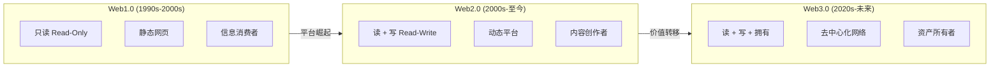

# 1.2 从 Web1 到 Web3：互联网的三次演变

> **学习目标**：完成本节后，你将能够……
> - 清晰描述 Web1、Web2、Web3 三代互联网的核心特征
> - 理解每一代互联网「用户角色」的根本变化
> - 用「只读 → 读写 → 读写拥有」的框架向他人解释互联网演进

---

## 核心内容

### 1. 互联网演进的主线

如果用一句话概括互联网的演进历程，那就是：

> **从「信息」到「平台」再到「价值」**

或者更形象地说：

```
Web1：你可以看
Web2：你可以看，还可以写
Web3：你可以看，可以写，还可以拥有
```



### 2. Web1.0：只读的静态网页（1990s-2000s）

**时代背景**：

1991 年，Tim Berners-Lee 发明了万维网（World Wide Web），标志着互联网从学术工具走向大众。这个时代的互联网就像一个巨大的「电子图书馆」。

**核心特征**：

- **只读（Read-Only）**：用户只能浏览信息，无法互动
- **静态页面**：网页内容由网站管理员手动更新
- **单向传播**：信息从网站流向用户，没有反馈机制

**代表产品**：
- Yahoo!（门户网站）
- 新浪、搜狐、网易（国内三大门户）
- GeoCities（个人主页托管）
- 早期的企业官网

**用户角色**：**消费者（Consumer）**

你只能「看」，不能「说」。就像看报纸或电视一样，内容由专业人士生产，你负责消费。

> **Tips**：回想一下 90 年代末上网冲浪的场景——打开电脑，拨号上网（嘟嘟嘟的声音），然后打开 Yahoo 或新浪，浏览今天的新闻和信息。这就是典型的 Web1 体验。

### 3. Web2.0：可读可写的平台经济（2000s-至今）

**时代背景**：

2004 年前后，「Web 2.0」概念被提出。随着宽带普及和技术进步，互联网从「看」变成了「用」。社交网络、博客、视频平台相继出现，用户从消费者变成了创作者。

**核心特征**：

- **读 + 写（Read-Write）**：用户既能消费内容，也能创作内容
- **平台主导**：大型平台汇聚用户和内容，成为流量入口
- **数据集中**：用户数据存储在平台服务器上
- **免费 + 广告**：用数据换服务，平台靠广告盈利

**代表产品**：
- 社交：Facebook、微信、微博、抖音
- 内容：YouTube、B 站、知乎、小红书
- 电商：淘宝、亚马逊
- 出行：Uber、滴滴

**用户角色**：**创作者（Creator）**——但不是所有者

你可以发微博、拍抖音、写公众号，甚至成为「网红」赚到钱。但有一个关键问题：

> **你创作的内容、积累的粉丝、产生的数据——这些真的属于你吗？**

答案是：**不属于**。

- 平台可以删除你的内容
- 平台可以封禁你的账号
- 平台可以修改算法，让你的内容「消失」
- 你无法把微信粉丝「带走」到抖音

这就是 Web2 的核心矛盾：**用户创造价值，平台拥有价值**。

> **Tips**：想想看，如果微信明天封禁了你的账号，你会失去什么？聊天记录、朋友圈、公众号粉丝、小程序……这些看似「属于你」的东西，实际上都在腾讯的服务器上。

### 4. Web3.0：可读可写可拥有的价值网络（2020s-未来）

**时代背景**：

2014 年，以太坊联合创始人 Gavin Wood 提出「Web3」概念。2020 年 DeFi Summer 和 2021 年 NFT 热潮后，Web3 开始进入大众视野。

Web3 试图回答 Web2 遗留的核心问题：**如何让用户真正拥有自己的数据和数字资产？**

**核心特征**：

- **读 + 写 + 拥有（Read-Write-Own）**：用户可以真正拥有数字资产
- **去中心化**：数据存储在区块链上，不依赖单一平台
- **用户主权**：私钥即身份，资产自我托管
- **可组合性**：不同应用之间可以互操作

**代表产品**：
- 公链：以太坊（Ethereum）、Solana、比特币
- DeFi：Uniswap（去中心化交易所）、Aave（借贷协议）
- NFT：OpenSea、Blur
- 社交：Lens Protocol、Farcaster
- 身份：ENS（以太坊域名服务）

**用户角色**：**所有者（Owner）**

在 Web3 世界：
- 你的钱包地址就是你的身份
- 你持有的 Token 和 NFT 是真正属于你的资产
- 你可以带着资产和身份，在不同应用之间自由移动
- 没有任何中心化机构可以「封禁」你的区块链账户

> **Tips**：「拥有」的本质是什么？是控制权。在 Web3 中，只要你掌握私钥，你的资产就完全由你控制——没有客服可以帮你「找回密码」，也没有平台可以「冻结你的账户」。这既是自由，也是责任。

### 5. 三代互联网对比

| 维度 | Web1.0 | Web2.0 | Web3.0 |
|-----|--------|--------|--------|
| **时代** | 1990s-2000s | 2000s-至今 | 2020s-未来 |
| **核心特征** | 只读 | 读写 | 读写拥有 |
| **内容生产** | 专业机构 | 用户（UGC） | 用户（拥有所有权） |
| **数据存储** | 网站服务器 | 平台服务器 | 区块链/去中心化存储 |
| **用户角色** | 消费者 | 创作者 | 所有者 |
| **商业模式** | 广告/订阅 | 平台抽成/广告 | 协议费/Token 激励 |
| **信任基础** | 机构背书 | 平台信誉 | 代码和协议 |
| **代表产品** | Yahoo、门户网站 | 微信、抖音、Facebook | 以太坊、Uniswap |

---

## 案例/故事

### 从「创作者困境」看三代互联网

小明是一个音乐人，让我们看看他在三代互联网中的不同处境：

**Web1 时代**：
小明想让更多人听到自己的音乐，但他只能把 CD 寄给唱片公司，祈祷被签约。互联网对他来说只是一个「看新闻」的地方。

**Web2 时代**：
小明在网易云音乐、QQ 音乐上传了自己的歌曲，积累了 100 万粉丝。但他发现：
- 播放收入的大部分被平台拿走
- 粉丝数据他看不到，也带不走
- 平台算法一变，新歌推荐量暴跌
- 如果和平台发生纠纷，账号可能被封

**Web3 时代**：
小明尝试在 Sound.xyz（Web3 音乐平台）发布音乐 NFT：
- 粉丝可以购买他音乐的 NFT，直接支持他
- 每次 NFT 转手，小明都能获得版税
- 粉丝的持有记录永远在链上，无法被删除
- 小明可以给 NFT 持有者空投新歌、演唱会门票
- 没有任何平台可以「下架」他的音乐

这就是「拥有」带来的改变：**创作者和粉丝之间建立了直接的价值连接，不再需要平台作为中介。**

当然，Web3 目前还处于早期，用户体验、用户规模都无法和 Web2 相比。但它指向的方向——让创作者真正拥有自己的作品和粉丝关系——是真实的需求。

---

## 关键概念速查

| 概念 | 一句话解释 |
|-----|-----------|
| **Web1.0** | 只读互联网，用户只能浏览信息 |
| **Web2.0** | 读写互联网，用户可以创作内容但不拥有 |
| **Web3.0** | 读写拥有互联网，用户真正拥有数据和资产 |
| **平台经济** | Web2 的主导模式，平台汇聚用户和数据，靠广告/抽成盈利 |
| **用户主权** | Web3 的核心理念，用户控制自己的数据、身份和资产 |
| **可组合性** | Web3 应用之间可以互操作，像乐高积木一样组合 |

---

## 学习资料

### 必读
- [从 Web 1.0 到 Web 3.0 的演变](https://www.gemini.com/zh-HK/cryptopedia/web-3-0-definition-open-internet-decentralized) - Gemini 中文，清晰介绍三代互联网差异（预计阅读 10 分钟）
- [What is Web3?](https://ethereum.org/en/web3/) - 以太坊官方介绍，英文，权威定义和演进说明（预计阅读 10 分钟）

### 选读（进阶）
- [Why Web3 Matters](https://cdixon.org/2021/10/25/why-web3-matters) - a16z 合伙人 Chris Dixon 的经典文章，英文，深入理解 Web3 的价值主张
- [Web3 是什么](https://mirror.xyz/peinan.eth/RdnV5e8YlXXFfDKBJvO2vgBKXVrPGPKrSGTKMYxI_vs) - 中文 Mirror 文章，本土视角解读

---

## 学习任务

完成以下任务以检验学习效果：

- [ ] **任务 1**：用一个表格对比 Web1、Web2、Web3 在「用户角色」「数据归属」「代表产品」三个维度的差异

- [ ] **任务 2**：思考一个你常用的 Web2 产品（如微信、抖音、微博），列出它存在的「平台控制」问题，并设想如果有 Web3 版本会有什么不同

> **提交方式**：将任务输出记录在个人学习笔记中

---

## 常见问题 FAQ

**Q1: Web3 会取代 Web2 吗？**

A: 短期内不会。Web3 目前仍处于早期阶段，用户体验、扩展性都无法和成熟的 Web2 产品相比。更可能的情况是两者共存——Web2 继续服务大多数场景，Web3 在特定领域（如金融、创作者经济、数字收藏品）发挥优势。很多产品会是「Web2.5」，结合两者的优点。

**Q2: 为什么 Web3 一定要用区块链？**

A: 区块链的核心价值是提供「无需信任的共识」——你不需要相信某个公司或机构，就能确认数据的真实性和资产的所有权。这是实现「用户拥有」的技术基础。当然，区块链不是唯一的技术路线，但目前是最成熟的方案。

**Q3: Web1、Web2、Web3 的界限是绝对的吗？**

A: 不是。这三代互联网的划分更多是一种理解框架，而非严格的技术分类。实际上很多产品横跨多个时代——比如 Gmail 是 Web2 产品，但它的前身（电子邮件协议）更像 Web1 的去中心化精神。重要的是理解背后的演进逻辑，而非纠结具体的分类。

---

## 下一步

理解了互联网的演进脉络后，下一节我们将探讨：**Web3 在整个互联网和金融体系中处于什么位置？**它和传统互联网、传统金融是什么关系？

→ [1.3 Web3 在互联网与金融体系中的位置](./1.3-Web3在互联网与金融体系中的位置.md)

---

最后更新：2025-01-09
编写：AI Assistant
审核：待审核
