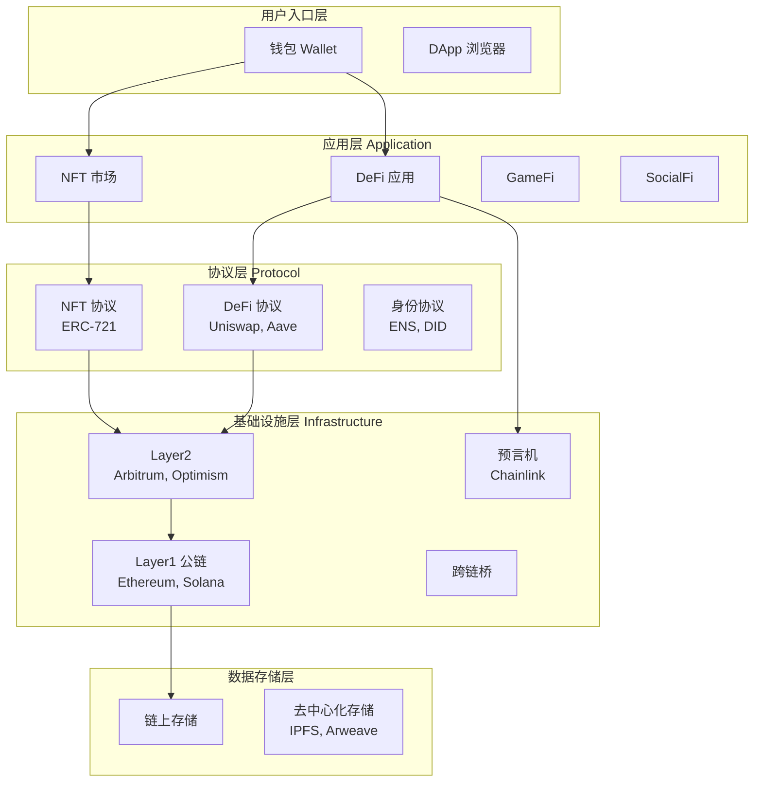
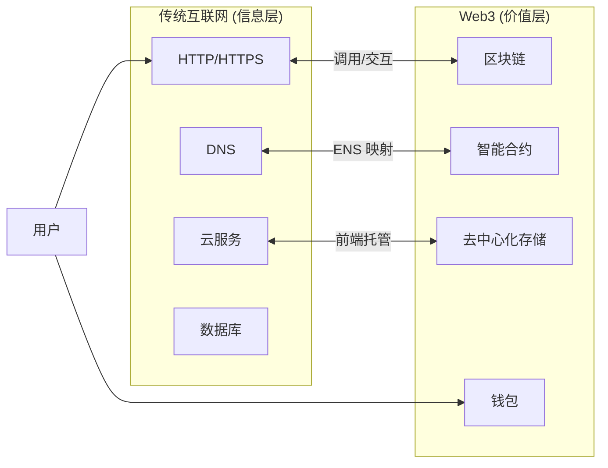
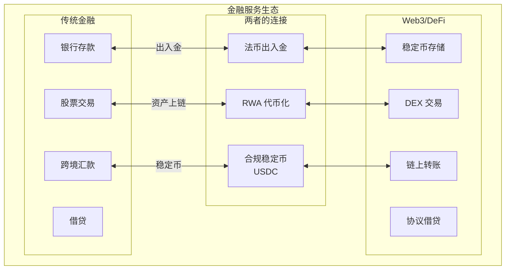
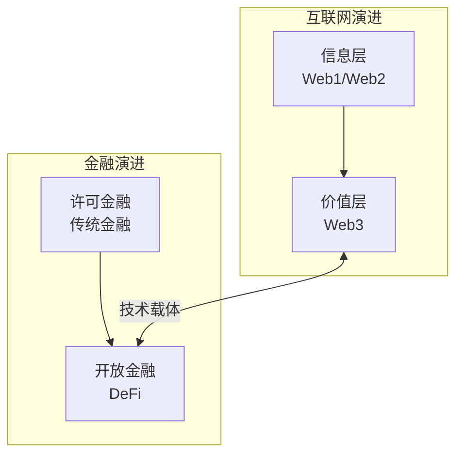

# 1.3 Web3 在互联网与金融体系中的位置

> **学习目标**：完成本节后，你将能够……
> - 理解 Web3 在互联网技术栈中的分层位置
> - 说明 Web3 与传统金融系统的关系（补充而非取代）
> - 用一个框架向他人解释「Web3 到底是什么领域的东西」

---

## 核心内容

### 1. Web3 不是独立的「平行世界」

很多人第一次接触 Web3 时，会产生一种感觉：这是一个完全独立的「平行世界」，和现有的互联网、金融系统毫无关系。

**这个理解是错误的。**

Web3 不是凭空出现的新世界，而是：
- 互联网的**延伸**——在现有互联网基础上增加了「价值层」
- 金融系统的**补充**——提供了一种「开放金融」的新可能

理解 Web3 的位置，需要从两个视角来看：**技术视角**和**金融视角**。

### 2. 技术视角：Web3 的技术栈分层

从技术角度看，Web3 是在现有互联网基础上，新增了一套「价值传输」的基础设施。

**各层解释**：

| 层级 | 功能 | 代表项目 |
|-----|------|---------|
| **用户入口层** | 用户与 Web3 交互的界面 | MetaMask、OKX Wallet、Rainbow |
| **应用层** | 直接面向用户的产品 | Uniswap（交易）、OpenSea（NFT）、Axie Infinity（游戏） |
| **协议层** | 定义规则和标准的智能合约 | ERC-20（代币标准）、ERC-721（NFT 标准）、Aave（借贷协议） |
| **基础设施层** | 底层区块链和配套设施 | Ethereum、Solana、Chainlink、Arbitrum |
| **数据存储层** | 数据的持久化存储 | 链上存储、IPFS、Arweave |

> **Tips**：可以把这个技术栈想象成「互联网 2.0」——我们现在用的互联网（HTTP/HTTPS）主要传输「信息」，而 Web3 的技术栈在此基础上，增加了传输「价值」的能力。

**Web3 与传统互联网的关系**：

**关键结论**：Web3 是**建立在传统互联网之上**的，而非独立运行。你使用 Web3 应用时，底层仍然在用 HTTP、DNS 这些传统互联网协议。

### 3. 金融视角：Web3 与传统金融的关系

从金融角度看，Web3（尤其是 DeFi）提供了一种「开放金融」的新范式，但它和传统金融是**补充关系**，而非替代关系。

**传统金融（TradFi）vs 去中心化金融（DeFi）**：

| 维度 | 传统金融 TradFi | Web3/DeFi |
|-----|----------------|-----------|
| **准入门槛** | 需要身份认证、银行账户 | 只需一个钱包地址 |
| **运营时间** | 工作日、工作时间 | 7×24 小时 |
| **中介机构** | 银行、券商、清算所 | 智能合约自动执行 |
| **透明度** | 内部账本，用户不可见 | 链上公开可查 |
| **资产托管** | 机构托管 | 自我托管（私钥） |
| **监管状态** | 完善的监管框架 | 监管发展中 |
| **用户保护** | 存款保险、投诉机制 | 自负其责 |
| **适用场景** | 大额交易、合规需求 | 小额实验、全球无障碍 |

**两者的关系**：

**关键结论**：

1. **DeFi 不是要「消灭」银行**，而是提供了一种新的金融服务范式
2. **两者各有优势**：传统金融有完善的监管和用户保护，DeFi 有更高的透明度和可访问性
3. **桥接越来越多**：稳定币、法币出入金、RWA（现实资产代币化）正在连接两个世界
4. **未来可能是融合**：传统金融机构也在探索区块链技术，「合规 DeFi」正在兴起

> **Tips**：一个常见的误解是「Web3 要颠覆一切」。实际上，对于大多数人来说，Web3 更像是金融工具箱里的**新工具**——有些场景它特别好用（如跨境转账、透明治理），有些场景传统金融依然更优（如大额房贷、退休金管理）。

### 4. 一个统一的定位框架

综合技术和金融两个视角，我们可以这样定位 Web3：

> **Web3 = 互联网的「价值层」+ 金融系统的「开放分支」**

**Web3 的独特价值**：

1. **无需许可的参与**：任何人都可以参与，不需要审批
2. **可编程的价值**：资产可以通过智能合约自动执行复杂逻辑
3. **全球无障碍**：不受地理边界限制
4. **透明可审计**：所有交易记录公开可查
5. **用户主权**：用户真正控制自己的资产

**Web3 的局限**：

1. **用户体验差**：操作复杂，容易出错
2. **扩展性问题**：链上交易容量有限
3. **监管不确定**：各国政策不一
4. **安全风险**：智能合约漏洞、钓鱼攻击
5. **没有「找回密码」**：丢失私钥 = 永久失去资产

---

## 案例/故事

### 一次跨境转账的对比

小王在中国，需要给在美国读书的朋友小李转 1000 美元。让我们看看两种方式的对比：

**传统银行汇款**：
1. 小王去银行，填写汇款申请
2. 提供身份证明、资金来源说明
3. 银行审核（可能需要 1-2 天）
4. 通过 SWIFT 系统转账（2-5 个工作日）
5. 中间行扣除手续费（20-50 美元）
6. 小李的银行可能还要换汇
7. **总耗时：3-7 天，总成本：30-80 美元**

**Web3/稳定币转账**：
1. 小王用人民币在交易所买入 USDC（合规稳定币）
2. 将 USDC 转到自己的钱包
3. 从钱包转账到小李的钱包地址
4. 小李收到 USDC，可以持有或兑换成美元
5. **总耗时：几分钟到几小时，总成本：几美元 Gas 费**

当然，这个对比简化了很多细节（如出入金的合规问题、交易所的安全风险等）。但它展示了 Web3 在特定场景下的效率优势。

**关键启示**：Web3 不是在所有场景下都更好，但在「跨境、小额、即时、无需许可」这类场景中，它确实提供了传统金融难以比拟的体验。

---

## 关键概念速查

| 概念 | 一句话解释 |
|-----|-----------|
| **价值层** | Web3 在传统互联网上增加的「可传输价值」的能力 |
| **TradFi** | Traditional Finance，传统金融系统 |
| **DeFi** | Decentralized Finance，去中心化金融 |
| **许可金融** | 需要审批、准入门槛的金融服务 |
| **开放金融** | 无需许可、人人可参与的金融服务 |
| **RWA** | Real World Assets，现实世界资产代币化 |
| **技术栈** | 支撑某个系统运行的分层技术组件 |

---

## 学习资料

### 必读
- [一文读懂Web3](https://blog.chain.link/web3-zh/) - Chainlink 官方博客，中文，对 Web3 技术栈有清晰介绍（预计阅读 15 分钟）
- [DeFi vs. Traditional Finance](https://www.coinbase.com/learn/crypto-basics/what-is-defi) - Coinbase Learn，英文，对比两种金融范式（预计阅读 10 分钟）

### 选读（进阶）
- [The Web3 Stack](https://edgeandnode.com/blog/defining-the-web3-stack/) - Edge & Node，英文，技术栈深度解析
- [DeFi 入门完整指南](https://academy.binance.com/zh/articles/the-complete-beginners-guide-to-decentralized-finance-defi) - Binance Academy，中文，全面介绍 DeFi 生态

---

## 学习任务

完成以下任务以检验学习效果：

- [ ] **任务 1**：画一张简图，展示 Web3 技术栈的四个主要层级（用户入口层、应用层、协议层、基础设施层），并各举一个例子

- [ ] **任务 2**：列出传统金融和 DeFi 各自的 2 个优势、2 个劣势

> **提交方式**：将任务输出记录在个人学习笔记中

---

## 常见问题 FAQ

**Q1: 我需要完全离开传统金融才能使用 Web3 吗？**

A: 完全不需要。实际上，大多数 Web3 用户同时使用两套系统。你可以把大部分资产放在银行，只用一小部分在 Web3 探索。两者是互补的，不是非此即彼。

**Q2: Web3 的「无需许可」是否意味着没有监管？**

A: 「无需许可」指的是参与网络本身不需要审批，但这不意味着没有监管。各国政府正在建立针对加密资产的监管框架，交易所需要牌照，某些行为仍然受法律约束。「代码是法律」是一个理想，现实中法律依然是法律。

**Q3: DeFi 真的能取代银行吗？**

A: 短期内不能，长期可能部分功能会被替代。银行提供的不只是转账和借贷，还有身份验证、合规审核、争议解决、存款保险等服务。DeFi 目前能提供的是「金融乐高」——基础的金融积木，但完整的金融服务体系还需要很多配套。

---

## 下一步

理解了 Web3 的位置后，你可能会好奇：**为什么 Web3/加密货币市场总是大起大落？**下一节我们将探讨这个现象背后的原因。

→ [1.4 为什么 Web3 周期性爆发又回落](./1.4-为什么Web3周期性爆发又回落.md)

---

最后更新：2025-01-09
编写：AI Assistant
审核：待审核
