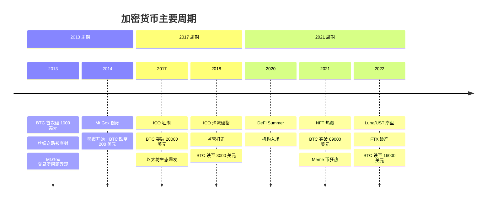
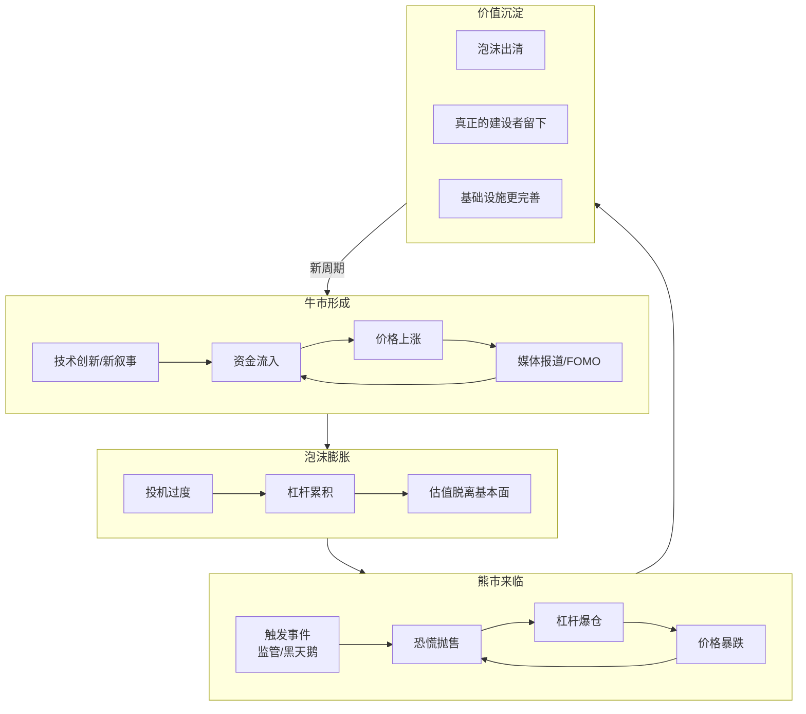

# 1.4 为什么 Web3 周期性爆发又回落

> **学习目标**：完成本节后，你将能够……
> - 了解加密货币市场的历史周期规律
> - 理解推动周期的核心因素
> - 建立「周期是正常现象」的理性认知，避免情绪化决策

---

## 核心内容

### 1. 加密市场的「过山车」特性

如果你关注过比特币或加密货币市场，一定会对它的剧烈波动印象深刻：

- 2017 年，比特币从 1000 美元涨到近 20000 美元，随后跌去 80%
- 2021 年，比特币突破 69000 美元历史新高，之后又跌到 16000 美元
- 很多山寨币（Altcoins）的涨跌幅度更是惊人，10 倍涨幅和 90% 跌幅都很常见

这种剧烈波动不是偶然的，而是这个行业的**结构性特征**。理解周期，是在 Web3 生存的必修课。

### 2. 加密货币历史周期回顾

让我们简单回顾几个主要周期：

#### 2013 周期：比特币首次被大众关注

**背景**：比特币首次突破 1000 美元，引发媒体关注。同时，暗网市场「丝绸之路」使用比特币的新闻让它进入公众视野。

**高潮**：比特币价格飙升，Mt.Gox 交易所交易量激增

**崩盘触发**：Mt.Gox 交易所因安全问题倒闭，导致市场信心崩溃

**留下的遗产**：比特币的「数字黄金」叙事开始形成，更多人开始认真研究区块链技术

#### 2017 周期：ICO 狂潮与泡沫

**背景**：以太坊的智能合约功能让「发币」变得极其简单。任何人都可以写一份白皮书，发行一个 Token，募集资金。

**高潮**：
- 数千个 ICO（Initial Coin Offering）项目涌现
- 比特币突破 20000 美元
- 「区块链」成为全球热词
- 无数人一夜暴富（或自以为暴富）

**崩盘触发**：
- 绝大多数 ICO 项目毫无实际价值
- 各国监管开始打击非法募资
- 市场泡沫破裂，比特币跌至 3000 美元

**留下的遗产**：
- 以太坊生态成型
- DeFi 的早期协议（如 MakerDAO）开始发展
- 行业开始重视「实际应用」而非「白皮书」

#### 2021 周期：DeFi、NFT 与机构入场

**背景**：
- 2020 年 DeFi Summer，去中心化金融协议爆发
- 机构投资者（如 MicroStrategy、Tesla）开始购买比特币
- NFT 概念出圈，Beeple 的 NFT 作品拍出 6900 万美元

**高潮**：
- 比特币突破 69000 美元历史新高
- NFT 市场火爆，各种 PFP（头像）项目天价成交
- Meme 币（如 DOGE、SHIB）狂热
- 名人、品牌纷纷入局

**崩盘触发**：
- 2022 年 5 月：Terra/Luna 算法稳定币崩盘，400 亿美元蒸发
- 2022 年 11 月：FTX 交易所破产，创始人 SBF 被捕
- 全球加息周期，流动性收紧

**留下的遗产**：
- DeFi 基础设施更加成熟
- NFT 在艺术、游戏、身份领域的应用探索
- 监管框架加速建立
- 「实体」资产上链（RWA）成为新叙事

### 3. 周期背后的驱动因素

为什么加密市场会呈现如此明显的周期性？有几个关键因素：

#### 3.1 技术创新周期

每一轮牛市的启动，通常都有技术层面的突破：
- 2013：比特币证明了区块链的可行性
- 2017：以太坊智能合约开启了可编程区块链时代
- 2021：DeFi 证明了去中心化金融的可行性

**新技术 → 新叙事 → 资金流入 → 价格上涨 → 吸引更多关注**

#### 3.2 叙事与投机共振

加密市场的一个特点是：**叙事比实际产品更早到来**。

- 当一个新概念出现（如 DeFi、NFT、AI+Crypto），资金会立刻涌入
- 早期参与者获得巨额回报，吸引更多人进入
- FOMO（Fear of Missing Out，错过恐惧）情绪蔓延
- 价格与实际价值严重脱节
- 泡沫终究破裂

#### 3.3 杠杆放大波动

加密市场的杠杆使用非常普遍：
- 合约交易可以 100 倍杠杆
- DeFi 协议的循环借贷
- 机构的杠杆套利

**杠杆在上涨时放大收益，在下跌时放大亏损，导致市场波动更加剧烈。**

#### 3.4 宏观经济影响

加密市场并非与传统金融完全隔绝：
- 低利率环境 → 资金寻找高风险高回报资产 → 流入加密市场
- 加息周期 → 流动性收紧 → 风险资产被抛售 → 加密市场下跌

2022 年的熊市，很大程度上与美联储激进加息有关。

#### 3.5 监管与黑天鹅事件

- 监管利好（如比特币 ETF 获批）可以推动上涨
- 监管打击（如中国禁止挖矿）可以引发下跌
- 黑天鹅事件（如交易所跑路、协议被黑）会加速恐慌

### 4. 如何理性看待周期

#### 4.1 周期不是「坏事」

很多人把熊市视为「灾难」，但换个角度看：

- **泡沫是创新的副产品**：没有 2017 年的 ICO 泡沫，就不会有以太坊生态的繁荣
- **熊市是行业的「净化器」**：淘汰劣质项目，让真正有价值的项目脱颖而出
- **每轮周期后基础设施都更完善**：更好的钱包、更高效的协议、更清晰的监管

#### 4.2 泡沫中有价值沉淀

| 周期 | 泡沫表象 | 留下的真实价值 |
|-----|---------|---------------|
| 2017 | 99% 的 ICO 归零 | 以太坊生态、MakerDAO、DeFi 基础 |
| 2021 | NFT 天价炒作、Meme 币狂热 | NFT 基础设施、创作者经济探索、机构采用 |

**类比**：2000 年互联网泡沫破裂，很多公司倒闭了，但 Google、Amazon、阿里巴巴活了下来，并改变了世界。加密行业也是如此。

#### 4.3 对普通人的建议

1. **不要试图「抄底」或「逃顶」**：没有人能准确预测周期的转折点
2. **用「可失去」的钱参与**：不要投入影响生活的资金
3. **关注长期价值，而非短期价格**：问自己「这个项目在 5 年后还会存在吗？」
4. **熊市是最好的学习时机**：市场冷静时，噪音更少，更容易看清本质
5. **警惕「这次不一样」的说法**：每轮牛市都有人说「这次不一样」，但周期规律从未失效

---

## 案例/故事

### 2022 年的「完美风暴」

2022 年可以说是加密历史上最戏剧性的一年，多个重大事件接连发生：

**5 月 - Terra/Luna 崩盘**：
- UST（算法稳定币）脱锚，从 1 美元跌至几乎归零
- Luna（Terra 生态代币）从 100 多美元跌到不足 0.01 美元
- 约 400 亿美元市值在几天内蒸发
- 无数人的毕生积蓄化为乌有

**6 月 - 三箭资本破产**：
- 曾经管理 100 亿美元的加密对冲基金
- 因 Luna 崩盘和杠杆过高而资不抵债
- 引发一系列连锁清算

**11 月 - FTX 崩盘**：
- 全球第二大加密交易所
- 创始人 SBF 被曝挪用用户资金
- 几天内从「行业领袖」变成「阶下囚」
- 数十亿美元用户资金被套

**这一系列事件告诉我们什么？**

1. **风险总是比你想象的更近**：FTX 曾被认为是「最合规」的交易所
2. **过度杠杆是毁灭之源**：三箭、FTX 都死于杠杆
3. **熊市才能看清谁在「裸泳」**：很多问题在牛市被掩盖
4. **但行业依然在前进**：比特币和以太坊的底层网络从未停止运行

---

## 关键概念速查

| 概念 | 一句话解释 |
|-----|-----------|
| **牛市 / Bear Market** | 市场持续上涨的阶段 |
| **熊市 / Bull Market** | 市场持续下跌的阶段 |
| **FOMO** | Fear of Missing Out，错过恐惧，害怕错过机会而冲动入场 |
| **FUD** | Fear, Uncertainty, Doubt，恐惧、不确定、怀疑，负面情绪 |
| **ICO** | Initial Coin Offering，首次代币发行，2017 年流行的募资方式 |
| **黑天鹅事件** | 罕见但影响巨大的意外事件 |
| **杠杆** | 借钱投资，放大收益和风险 |

---

## 学习资料

### 必读
- [比特币历史周期回顾](https://academy.binance.com/zh/articles/bitcoin-halving-and-the-market) - Binance Academy，中文，了解比特币减半与周期的关系（预计阅读 10 分钟）
- [Crypto Cycles: The Complete History](https://www.gemini.com/cryptopedia/crypto-market-cycles-bitcoin-price-history) - Gemini，英文，完整的周期历史回顾（预计阅读 15 分钟）

### 选读（进阶）
- [Why Crypto Crashed](https://www.youtube.com/watch?v=BGaT_E0DQLA) - Bankless 视频，英文，2022 年崩盘深度分析
- [a]16z 加密市场状态报告](https://a16zcrypto.com/posts/article/state-of-crypto-report-2024/) - a16z，英文，每年更新的行业数据报告

---

## 学习任务

完成以下任务以检验学习效果：

- [ ] **任务 1**：用时间线的形式，列出 2017-2022 年间加密市场的 3 个重要事件，并简述每个事件的影响

- [ ] **任务 2**：回答问题：「如果有朋友说『现在是牛市，一定要赶紧入场』，你会如何回应？」写下你的思考（100-200 字）

> **提交方式**：将任务输出记录在个人学习笔记中

---

## 常见问题 FAQ

**Q1: 我们现在处于周期的哪个阶段？**

A: 这个问题没有标准答案。即使是专业分析师，也无法准确判断周期位置。重要的是：1）不要试图「精准择时」；2）做好应对任何情况的准备；3）专注于长期价值而非短期波动。

**Q2: 牛市还会再来吗？**

A: 从历史规律看，加密市场的周期性从未消失。只要技术在发展、应用在落地、新用户在进入，周期就会继续。但每一轮周期的形态可能不同，不要简单套用历史。

**Q3: 如何在熊市中保护自己？**

A: 1）不要使用杠杆；2）分散存储（不要把所有资产放在一个交易所）；3）只投资你理解的项目；4）保持现金储备，不要满仓；5）把熊市当作学习的机会，而非恐慌的理由。

**Q4: 「这次不一样」是不是真的？**

A: 每一轮周期都有其独特之处（新技术、新叙事、新监管环境），但人性（贪婪与恐惧）从未改变，周期的基本规律也从未失效。对「这次不一样」的说法，保持健康的怀疑。

---

最后更新：2025-01-09
编写：Antony
审核：待审核
