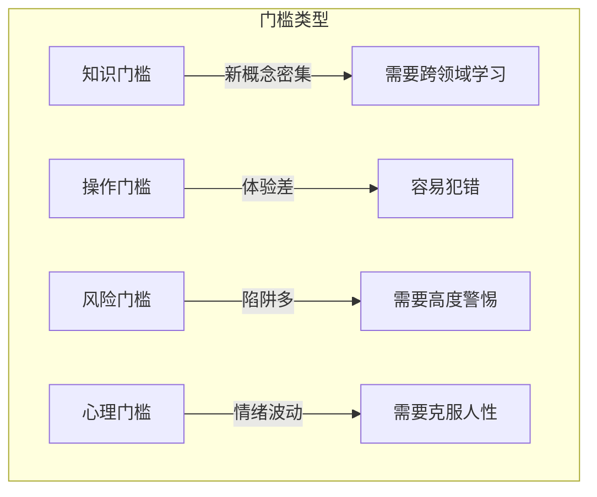
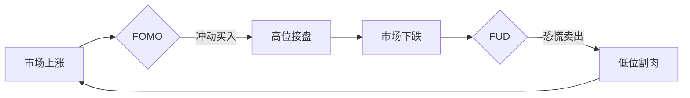
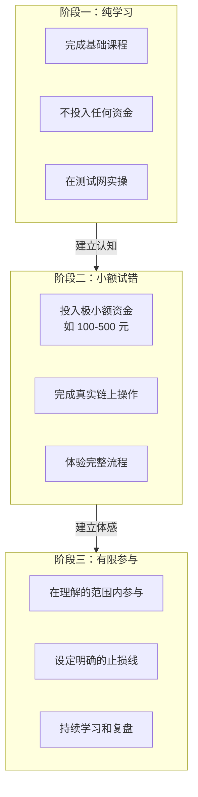

# 1.5 普通人进入 Web3 面临的真实难度

> **学习目标**：完成本节后，你将能够……
> - 客观认识进入 Web3 的四类主要门槛
> - 了解常见的陷阱和风险
> - 建立合理的预期，做好学习准备

---

## 核心内容

### 1. 为什么要谈「真实难度」

在开始 Web3 学习之旅之前，有一件事必须坦诚地说清楚：

> **进入 Web3 有真实的门槛和风险。**

这不是为了劝退你，而是为了让你：
- 做好心理准备
- 设定合理预期
- 在真正投入时间和金钱之前，了解自己将面对什么

太多人带着「快速致富」的幻想进入 Web3，最后带着亏损和失望离开。我们希望你能够：
- 带着学习心态进入
- 了解风险后做出理性决策
- 即使不继续，也能有所收获

### 2. 四类主要门槛

#### 2.1 知识门槛：新概念密集

**挑战**：

Web3 涉及的知识领域非常广泛：
- **技术层面**：区块链、智能合约、共识机制、密码学
- **金融层面**：交易、流动性、杠杆、衍生品、收益来源
- **经济层面**：代币经济学、激励机制、博弈论
- **安全层面**：私钥管理、钓鱼识别、合约风险

而且，这些概念往往**相互交织**。要理解 DeFi，你需要同时理解区块链技术、金融基础知识和智能合约原理。

**另一个挑战是**：信息更新极快。

- 新协议、新概念、新叙事层出不穷
- 去年的「热门」可能今年已经「过时」
- 需要持续学习，不能「学一次就够」

**应对建议**：
- 从基础概念入手，不要急于深入
- 遵循「先宽后深」的学习路径
- 接受「不可能什么都懂」的现实
- 建立自己的信息筛选机制

#### 2.2 操作门槛：体验差、容易出错

**挑战**：

Web3 的用户体验远不如 Web2 产品。

| Web2 体验 | Web3 现实 |
|----------|----------|
| 忘记密码可以重置 | 丢失私钥 = 永久失去资产 |
| 转错账可以追回 | 链上转账不可逆 |
| 操作简单直观 | 需要理解 Gas、签名、授权等概念 |
| 出问题可以找客服 | 大部分情况只能自己负责 |

**常见操作风险**：
- **转错地址**：一个字母之差，资产就可能永远消失
- **转错网络**：同一个地址在不同链上可能完全不同
- **Gas 设置错误**：交易可能卡住或浪费大量费用
- **授权过度**：给恶意合约「无限授权」可能导致资产被盗
- **签名陷阱**：看不懂的签名请求可能是在「签署卖身契」

**应对建议**：
- 先在测试网练习（本课程会教你）
- 首次操作用小额试错
- 每一步都仔细确认，宁慢勿错
- 养成检查地址、网络、金额的习惯

#### 2.3 风险识别门槛：陷阱无处不在

**挑战**：

Web3 领域的骗局数量和创意，可能超出你的想象。

**常见骗局类型**：

| 类型 | 手法 | 特征 |
|-----|------|------|
| **钓鱼网站** | 伪造官网，骗取私钥/助记词 | 域名微妙差异（如 uniswap vs uniswᴀp） |
| **假空投** | 发送假代币，引导用户访问恶意网站 | 「领取空投」弹窗 |
| **Rug Pull** | 项目方卷款跑路 | 突然撤走流动性，代币归零 |
| **庞氏骗局** | 用后入者资金支付「收益」 | 超高年化收益（100%+） |
| **假客服** | 冒充官方客服私聊 | 主动联系、索要私钥 |
| **合约漏洞** | 智能合约被攻击 | 资金被黑客盗取 |

> **一个重要原则**：在 Web3 里，**没有任何人需要你的私钥或助记词**。任何索要这些信息的，100% 是骗子。

**项目风险识别更难**：
- 白皮书写得天花乱坠，实际什么都没做
- 创始人匿名，出问题无处追责
- 代币经济学复杂，普通人看不懂陷阱在哪
- 「大V 背书」不等于可靠（他们可能是收费推广）

**应对建议**：
- 「太好」的机会通常是陷阱
- 不急于参与，先观察再决策
- 学会基础的项目判断方法（后续课程会教）
- 官方渠道验证，不轻信私信

#### 2.4 心理门槛：情绪是最大的敌人

**挑战**：

加密市场的剧烈波动，会极大地考验你的心理承受能力。

**常见心理陷阱**：

| 情绪 | 表现 | 后果 |
|-----|------|------|
| **FOMO** | 看到别人赚钱就想冲进去 | 高位接盘，被套 |
| **FUD** | 看到负面消息就恐慌卖出 | 低位割肉，踏空 |
| **贪婪** | 赚了还想赚更多，不愿止盈 | 利润回吐，甚至亏损 |
| **恐惧** | 亏了不敢止损，寄望反弹 | 越亏越多 |
| **过度自信** | 几次成功后认为自己是「高手」 | 加大仓位后爆亏 |

**另一个心理挑战是**：「暴富心态」vs「学习心态」

- 暴富心态：期望快速翻倍、一夜致富
- 学习心态：把参与当作学习过程，收益是副产品

带着暴富心态进入的人，更容易：
- 投入超出承受能力的资金
- 追逐高风险高收益的项目
- 被骗局蒙蔽
- 在亏损后一蹶不振

**应对建议**：
- 设定明确的投入上限（「这笔钱即使全部亏完也不影响生活」）
- 不看短期价格波动
- 制定规则并严格执行（如止盈止损线）
- 把「不亏钱」作为第一目标，而非「赚大钱」

### 3. 实际的入门建议

了解了这些门槛后，如何合理地开始？

**阶段一：纯学习（0 资金投入）**

- 完成本课程的全部内容
- 在测试网练习钱包操作、链上交互
- 关注几个高质量的信息源
- **目标**：建立基础认知框架

**阶段二：小额试错（极小资金投入）**

- 投入你**完全可以承受损失**的小额资金（如 100-500 元）
- 完成真实的链上操作：创建钱包、转账、Swap
- 体验完整的出入金流程
- **目标**：建立真实体感，了解实际操作

**阶段三：有限参与（根据个人情况）**

- 在你**理解**的范围内参与
- 设定明确的投入上限和止损线
- 持续学习，定期复盘
- **目标**：在可控风险下探索机会

> **关键原则**：区分「学习成本」和「投资风险」
> - 学习成本：为了学习而投入的小额资金，心理预期是「可能全部亏完」
> - 投资风险：带着盈利预期投入的资金，需要认真管理

### 4. 不同人群的建议

| 人群 | 建议 |
|-----|------|
| **完全新手** | 先完成课程学习，不急于投入资金。用 3-6 个月建立基础认知 |
| **Web2 技术人员** | 可以从技术角度入手（智能合约开发），技术理解是很大的优势 |
| **金融从业者** | 可以从 DeFi 协议入手，很多概念有传统金融对照 |
| **有投资经验者** | 控制仓位，不要因为熟悉「投资」而低估 Web3 的特殊风险 |
| **时间有限者** | 可以只做「观察者」，了解行业动态而不实际参与交易 |

---

## 案例/故事

### 三种人的 Web3 入门经历

**小明：冲动型**

小明在朋友圈看到有人晒「3 天 10 倍」的截图，立刻冲进去：
- 在不了解的情况下买了某个「热门」代币
- 价格上涨了一点，觉得自己是「天才」，追加投入
- 市场下跌，恐慌抛售，亏损 80%
- 愤怒地得出结论：「Web3 就是骗局」

**小红：学习型**

小红花了 3 个月时间系统学习：
- 完成了课程学习，在测试网练习
- 用 500 元进行了真实操作，体验了完整流程
- 发现自己更适合「观察」而非「交易」
- 最终决定专注学习，不做投机，在工作中应用 Web3 知识

**小李：渐进型**

小李有 5 年投资经验，理性进入 Web3：
- 先用 1% 的可投资资金「交学费」
- 在亏损中学习，逐渐理解市场规律
- 慢慢找到适合自己的参与方式
- 3 年后，Web3 资产占总投资的 10%，有盈有亏，但整体可控

**这三个案例说明什么？**

1. 「知道难度」比「没有门槛」更有利于长期发展
2. 学习心态比暴富心态更可持续
3. 每个人的正确路径不同，关键是找到适合自己的方式

---

## 关键概念速查

| 概念 | 一句话解释 |
|-----|-----------|
| **私钥/助记词** | 控制你资产的「终极密码」，丢失或泄露都会导致资产丧失 |
| **FOMO** | Fear of Missing Out，错过恐惧，导致冲动入场 |
| **FUD** | Fear, Uncertainty, Doubt，恐惧情绪，导致恐慌抛售 |
| **Rug Pull** | 项目方卷款跑路，代币归零 |
| **钓鱼攻击** | 伪造网站或信息，骗取私钥或授权 |
| **学习成本** | 为了学习而愿意「损失」的小额资金 |

---

## 学习资料

### 必读
- [加密货币新手常见错误](https://academy.binance.com/zh/articles/10-common-cryptocurrency-mistakes) - Binance Academy，中文，避免新手坑（预计阅读 10 分钟）
- [Web3 安全指南](https://support.metamask.io/zh-hans/privacy-and-security/staying-safe-in-web3/) - MetaMask 官方，中文，基础安全知识（预计阅读 15 分钟）

### 选读（进阶）
- [区块链黑暗森林自救手册](https://github.com/slowmist/Blockchain-dark-forest-selfguard-handbook) - 慢雾安全团队，中文，全面的安全指南
- [How to Stay Safe in Crypto](https://www.ledger.com/academy/security/how-to-stay-safe-in-crypto) - Ledger Academy，英文，硬件钱包厂商的安全建议

---

## 学习任务

完成以下任务以检验学习效果：

- [ ] **任务 1**：列出进入 Web3 的四类门槛，并针对每类写下一条你认为最重要的应对策略

- [ ] **任务 2**：诚实地回答以下问题，记录在学习笔记中：
  - 你进入 Web3 的主要目的是什么？（学习 / 投资 / 工作 / 好奇）
  - 你愿意投入多少「学习成本」？（可以完全损失的金额）
  - 你打算用多长时间来学习基础知识？

> **提交方式**：将任务输出记录在个人学习笔记中

---

## 常见问题 FAQ

**Q1: 听起来门槛这么高，普通人还有必要进入 Web3 吗？**

A: 有门槛不等于不能进入。关键是：1）以学习心态进入，而非暴富心态；2）投入与自己承受能力匹配的时间和金钱；3）找到适合自己的参与方式（可以只学习不投资，可以只观察不交易）。Web3 是一个重要的技术和社会趋势，了解它本身就有价值。

**Q2: 我需要技术背景才能进入 Web3 吗？**

A: 不需要。虽然技术背景有帮助，但很多成功的 Web3 参与者来自非技术背景。你可以从用户视角、投资视角、社区视角等多种角度参与。本课程就是为非技术人员设计的。

**Q3: 如果我只想「了解」而不想「投入」，可以吗？**

A: 完全可以。「了解 Web3」和「参与 Web3 投资/交易」是两回事。你可以只做一个「知情的旁观者」，在工作和生活中应用这些知识，而不实际投入资金。这也是一种完全合理的选择。

**Q4: 这门课会教我如何「赚钱」吗？**

A: 不会。这是一门「通识课」，目标是帮你建立完整的认知框架、掌握基础技能、识别风险。至于是否「赚钱」，取决于市场、时机、你的判断和运气——没有任何课程能保证这一点。对任何承诺「一定赚钱」的课程或项目，请保持警惕。

---

## 下一步

恭喜你完成了 Part 1 的全部内容！现在你应该对 Web3 有了一个全局性的认知：

- ✅ 理解了 Web3 的定义和核心特征
- ✅ 了解了互联网从 Web1 到 Web3 的演进
- ✅ 明白了 Web3 在技术和金融体系中的位置
- ✅ 认识了市场周期规律
- ✅ 对入门难度有了清醒的认识

**Part 1 学习任务**：

现在，请完成大纲中的学习任务：

> **用 3 句话向一个完全不懂的朋友解释「什么是 Web3」**

提示：
- 可以用 Web1→Web2→Web3 的演进来组织
- 尽量避免使用专业术语
- 强调「拥有」这个核心概念

准备好了吗？下一部分，我们将深入了解 Web3 的技术基础——区块链与加密系统。

→ Part 2：区块链与加密系统的最小认知

---

最后更新：2025-01-09
编写：Antony
审核：待审核
