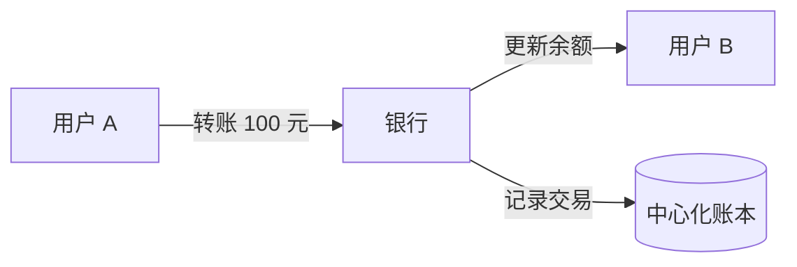
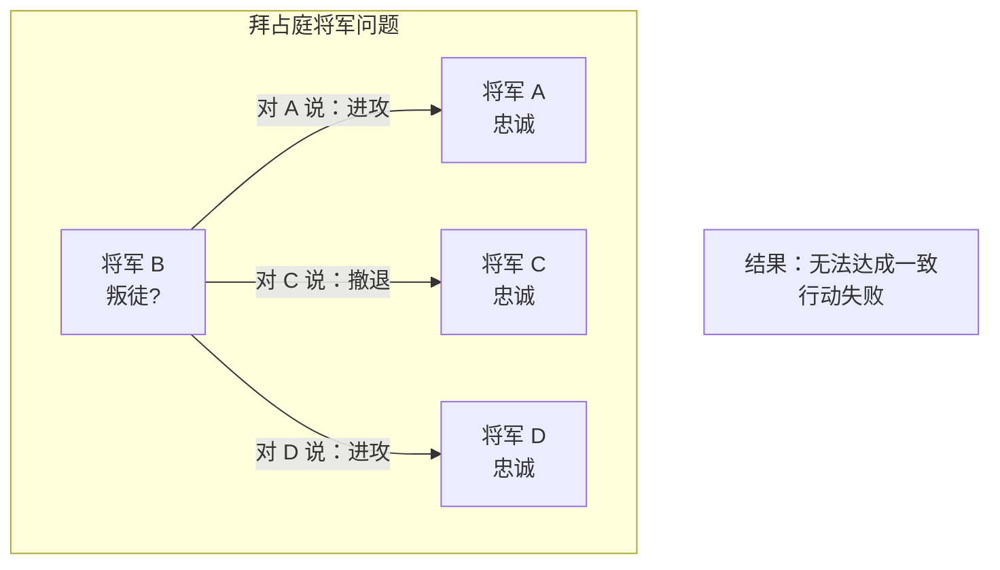
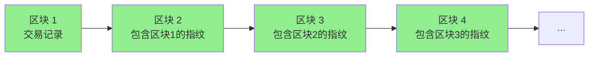

# 2.1 区块链解决的核心问题是什么

> **学习目标**：完成本节后，你将能够……
> - 解释什么是「双重支付问题」以及为什么它对数字货币至关重要
> - 用生活类比说明「拜占庭将军问题」的本质
> - 理解区块链如何实现「去信任化」

---

## 核心内容

### 1. 数字世界的信任困境

在物理世界，一张百元纸币只能在一个地方——你把它给了商家，它就不在你口袋里了。

但在数字世界，事情变得复杂了：**数字信息可以被无限复制**。一张照片可以发给一万个人，每个人手里都有一模一样的副本。

那问题来了：如果「钱」也是数字的，怎么防止一个人把同一笔钱花两次？

这就是困扰数字货币领域几十年的核心问题——**双重支付问题**（Double Spending Problem）。

> **Tips**：想象一下，如果你能把同一张电影票卖给两个人，让他们都以为自己买到了真票——这就是「双重支付」的本质。在数字世界，这种「复制」太容易了。

### 2. 传统的解决方案：找个「中间人」

在区块链出现之前，人们的解决方案是：**找一个可信的中心机构来记账**。

- 银行帮你记录「你有多少钱」
- 支付宝帮你记录「你的余额是多少」
- 游戏公司帮你记录「你有哪些装备」

这个中心机构充当「裁判」，它说你有 100 块，你就有 100 块；它说你花了 50 块，你的余额就变成 50 块。

这套系统运行了几十年，看起来没什么问题。但它有一个根本性的假设：**你必须信任这个中心机构**。

| 你需要相信…… | 如果信任被打破…… |
|-------------|-----------------|
| 银行不会冻结你的账户 | 2013 年塞浦路斯银行危机，储户存款被强制扣减 |
| 平台不会删除你的数据 | 微信封号，所有聊天记录、好友关系都没了 |
| 机构不会篡改记录 | 安然公司财务造假，股东血本无归 |

区块链的诞生，就是为了回答一个问题：**能不能在不依赖任何中心机构的情况下，也能防止双重支付？**

### 3. 拜占庭将军问题：信任难题的经典表述

1982 年，计算机科学家 Leslie Lamport 提出了一个著名的思想实验——**拜占庭将军问题**（Byzantine Generals Problem）。

故事是这样的：

> 几位拜占庭帝国的将军，各自带兵包围了一座城市。他们需要达成一致：是「进攻」还是「撤退」。
>
> - 如果所有人一起进攻 → 胜利
> - 如果所有人一起撤退 → 安全
> - 如果有人进攻、有人撤退 → 灾难
>
> 问题在于：将军们只能通过信使传递消息，而**其中可能有叛徒**——他可能给不同的将军发送不同的指令。

这个问题的本质是：**在存在恶意参与者的分布式系统中，如何达成可信共识？**

把它翻译到区块链语境：
- 将军 = 网络中的节点（计算机）
- 进攻/撤退 = 确认某笔交易是否有效
- 叛徒 = 试图作弊的恶意节点
- 达成共识 = 全网认可同一个账本版本

### 4. 区块链的天才解决方案

2008 年，中本聪（Satoshi Nakamoto）在比特币白皮书中提出了一套解决方案，核心是三个机制：

#### 4.1 时间戳：给交易排队

每笔交易都有一个时间戳，形成明确的先后顺序。如果有人试图把同一笔钱花两次，系统只承认时间靠前的那笔。

#### 4.2 工作量证明：让作弊代价高昂

想要记账（添加新区块），必须完成一道很难的数学题。这需要消耗大量计算资源和电力。

关键洞察：**让参与者「有所损失」，他们才会诚实行事**。

- 矿工投入了真金白银买矿机、付电费
- 如果作弊被发现，之前的投入全部白费
- 诚实记账反而能获得奖励（比特币）

#### 4.3 链式结构：让篡改成本指数级增长

每个区块都包含前一个区块的「指纹」（哈希值）。想要修改历史交易，必须重新计算该区块之后所有区块的工作量证明——这几乎是不可能的。

> **Tips**：想象一本账本，每一页都盖了一个章，这个章是根据前面所有页的内容计算出来的。如果有人想修改第 10 页，他必须重新计算第 10 页到最后一页的所有章——当账本有几万页的时候，这根本做不到。

### 5. 核心价值：去信任化（Trustless）

区块链真正解决的问题是：**让陌生人之间可以在没有中间人的情况下达成可信交易**。

「去信任化」不是说「不需要信任任何东西」，而是：

| 传统模式 | 区块链模式 |
|---------|-----------|
| 信任机构（银行、平台） | 信任规则（代码、协议） |
| 规则由机构制定和解释 | 规则写死在代码里，自动执行 |
| 依赖机构承诺 | 依赖数学保证 |

用一句话总结：

> **区块链让我们从「信任人」变成「信任数学」。**

---

## 案例/故事

### 塞浦路斯银行危机：当「信任」崩塌

2013 年 3 月，塞浦路斯爆发银行危机。为了获得欧盟救助，政府宣布对银行存款征收一次性「税款」——直接从储户账户里扣钱。

- 存款 10 万欧元以下：扣 6.75%
- 存款 10 万欧元以上：扣 9.9%

一夜之间，人们发现：**存在银行里的钱，并不完全「属于」自己**。

这件事发生后，比特币价格在一个月内从 30 美元涨到 230 美元。很多人第一次意识到：也许我们需要一种不依赖任何机构的价值存储方式。

这就是区块链的意义——它提供了一种选择：你可以选择信任银行，也可以选择信任数学规则。

---

## 关键概念速查

| 概念 | 一句话解释 |
|-----|-----------|
| **双重支付** | 同一笔数字货币被花费两次的问题 |
| **拜占庭将军问题** | 在存在恶意参与者的分布式系统中如何达成共识 |
| **拜占庭容错（BFT）** | 系统能够容忍部分节点故障或作恶的能力 |
| **工作量证明（PoW）** | 通过消耗计算资源来证明自己的诚意，获得记账权 |
| **去信任化（Trustless）** | 信任代码规则而非中心化机构 |
| **共识机制** | 分布式网络中节点达成一致的方法 |

---

## 学习资料

### 必读
- [比特币白皮书（中文版）前两节](https://bitcoin.org/files/bitcoin-paper/bitcoin_zh_cn.pdf) - 中本聪原文，理解问题的最佳起点（预计阅读 15 分钟）
- [Ledger Academy - Byzantine Fault Tolerance](https://www.ledger.com/academy/topics/blockchain/byzantine-fault-tolerance-in-crypto-what-is-it) - 英文，通俗解释拜占庭容错（预计阅读 10 分钟）

### 选读（进阶）
- [Wikipedia - Byzantine fault](https://en.wikipedia.org/wiki/Byzantine_fault) - 学术背景介绍
- [Cyfrin - Double Spending Attacks](https://www.cyfrin.io/blog/understanding-double-spending-in-blockchain) - 深入理解双重支付攻击类型

---

## 学习任务

完成以下任务以检验学习效果：

- [ ] **任务 1**：用 3 句话向朋友解释「为什么区块链能保证数据不可篡改」
  - 提示：可以从时间戳、工作量证明、链式结构三个角度回答

- [ ] **任务 2**：用一个生活中的例子（非区块链相关）来类比「拜占庭将军问题」
  - 例如：微信群投票、公司多部门协作等场景

> **提交方式**：将任务输出记录在个人学习笔记中

---

## 常见问题 FAQ

**Q1: 区块链真的不可篡改吗？51% 攻击怎么办？**

A: 理论上，如果有人控制了全网 51% 以上的算力，确实可以篡改账本。但对于比特币、以太坊这样的大型网络，发动 51% 攻击的成本极其高昂（数十亿美元），且即使成功，攻击者也很难从中获利——因为一旦网络被攻击，币价会暴跌，攻击者持有的币也会贬值。

**Q2: 为什么说区块链「去信任化」，难道我不需要信任任何东西？**

A: 「去信任化」是翻译问题，更准确的理解是「信任最小化」。你仍然需要信任——但你信任的是公开透明的代码和数学规则，而不是某个公司或机构的承诺。代码是开源的，任何人都可以审查。

**Q3: 拜占庭将军问题和双重支付问题是什么关系？**

A: 这是同一个问题的不同表述。拜占庭将军问题是分布式系统中的经典信任问题，双重支付问题是这个信任问题在数字货币领域的具体表现。解决了拜占庭将军问题，就解决了双重支付问题。

---

最后更新：2025-01-09
编写：Antony
审核：待审核
