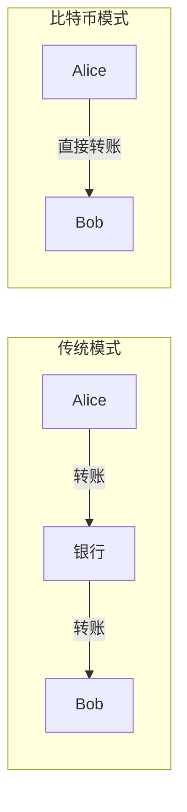
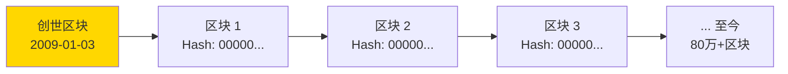
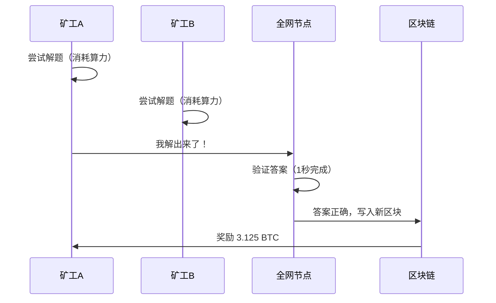

# 2.2 比特币的可信逻辑

> **学习目标**：完成本节后，你将能够……
> - 用一句话概括比特币白皮书的核心命题
> - 解释比特币实现「可信」的三个核心机制
> - 理解「无需信任」（Trustless）的真正含义

---

## 核心内容

### 1. 一篇改变世界的论文

2008 年 10 月 31 日，一个自称「中本聪」（Satoshi Nakamoto）的匿名人物，在一个密码学邮件列表中发布了一篇 9 页的论文：

**《Bitcoin: A Peer-to-Peer Electronic Cash System》**
（比特币：一种点对点的电子现金系统）

这篇论文开宗明义地提出了一个问题：

> 「互联网上的商业活动，几乎完全依赖金融机构作为可信第三方来处理电子支付。虽然这套系统对大多数交易来说还算有效，但它仍然存在基于信任模型的固有缺陷。」

中本聪想解决的问题很简单：**能不能在不依赖银行的情况下，让两个陌生人直接转账？**

### 2. 比特币解决了什么问题

在上一节中，我们讲了「双重支付问题」。中本聪在白皮书中给出了他的解决方案：

> 「我们提出了一种不依赖信任的电子交易方案。」

关键词是**不依赖信任**。

传统系统依赖银行来「保证」你的钱不会被花两次。比特币的创新在于：用**数学和代码**来保证，而不是用**机构承诺**来保证。

### 3. 比特币的三大核心机制

比特币能够运作，依赖三个精妙的设计：

#### 3.1 区块链结构：让历史不可篡改

比特币的所有交易记录被打包成「区块」（Block），每个区块都包含前一个区块的「指纹」（哈希值）。区块首尾相连，形成一条「链」（Chain）——这就是「区块链」（Blockchain）名称的由来。

为什么这个结构能保证「不可篡改」？

想象一下：如果有人想修改第 100 个区块里的一笔交易，他必须：
1. 修改第 100 个区块的内容
2. 重新计算第 100 个区块的哈希值
3. 但第 101 个区块包含了第 100 个区块的旧哈希值，所以也必须修改
4. 以此类推，必须修改第 100 个区块之后的**所有区块**

当链足够长的时候，这几乎是不可能完成的任务。

#### 3.2 工作量证明：让记账权有代价

谁有权往区块链上写入新的区块？比特币的答案是：**谁先解出一道数学难题，谁就有权写入**。

这道题的特点：
- **难解**：需要尝试大量随机数，消耗算力和电力
- **易验证**：其他人只需一次计算就能验证答案对不对

这个过程被形象地称为「挖矿」（Mining），解题的人被称为「矿工」（Miner）。

> **Tips**：工作量证明（Proof of Work, PoW）的精髓在于「一 CPU 一票」。你投入的算力越多，解出题目的概率越高。这让每一票都有「成本」，防止有人无成本地刷票作弊。

#### 3.3 激励机制：让诚实比作弊更划算

这是中本聪最天才的设计之一：**让经济激励和安全目标一致**。

矿工的收入来源：
1. **区块奖励**：成功挖出区块，获得新铸造的比特币（目前是 3.125 BTC/块）
2. **交易手续费**：区块中包含的交易会支付手续费给矿工

矿工的成本：
- 矿机购买费用
- 电费（这是大头）
- 运维成本

关键洞察：**矿工必须「有所投入」才能参与记账**。

如果矿工试图作弊（比如进行双重支付），会发生什么？
- 诚实的节点会拒绝他的无效区块
- 他投入的算力和电费全部白费
- 如果攻击成功导致比特币信任崩塌，他持有的比特币也会贬值

相反，如果矿工诚实记账：
- 获得区块奖励和手续费
- 比特币网络保持安全，币价有支撑
- 长期收益最大化

| 策略 | 成本 | 收益 | 结果 |
|-----|------|------|------|
| 诚实挖矿 | 电费 + 矿机 | 区块奖励 + 手续费 | 持续获利 |
| 作弊攻击 | 电费 + 矿机 | 可能的双重支付收益 - 币价暴跌损失 | 大概率亏损 |

这就是「博弈论」在区块链中的应用：**设计一套规则，让每个理性参与者的最优策略就是诚实行事**。

### 4. 「可信」从哪里来？

现在我们可以回答这个问题了：为什么比特币是「可信」的？

| 传统金融 | 比特币 |
|---------|--------|
| 相信银行不会冻结账户 | 没有人能冻结你的比特币（只要你保管好私钥） |
| 相信央行不会滥发货币 | 比特币总量固定 2100 万枚，写死在代码里 |
| 相信支付机构会正确处理交易 | 数学规则自动执行，没有人为干预空间 |
| 需要提交身份证明 | 创建钱包不需要任何证件 |

**「无需信任」（Trustless）**的真正含义是：
- ❌ 不是「不需要信任任何东西」
- ✅ 而是「不需要信任某个特定的人或机构」

你信任的是：
- 开源代码（任何人都可以审查）
- 数学规则（无法被人为修改）
- 经济激励（让作弊无利可图）

> **Tips**：有人说「Code is Law」（代码即法律）。在比特币网络中，规则不是由某个机构「规定」的，而是由代码「定义」的。想改变规则？需要绝大多数参与者同意升级代码。

### 5. 比特币的局限性

比特币开创了去中心化数字货币的先河，但它也有明显的局限：

| 局限 | 具体表现 | 原因 |
|-----|---------|------|
| **慢** | 每笔交易需要约 10 分钟确认 | PoW 设计，保证安全性的代价 |
| **贵** | 高峰期手续费可达数十美元 | 区块容量有限，需求大于供给 |
| **耗能** | 全网年耗电量约等于一个中等国家 | PoW 需要大量算力竞争 |
| **简单** | 只能转账，无法运行复杂程序 | 设计目标就是「电子现金」，不是「世界计算机」 |

这些局限催生了后来的以太坊（可编程）、各种 Layer2 方案（提速）、PoS 共识（节能）等创新。

---

## 案例/故事

### 2008 年金融危机：比特币诞生的背景

比特币白皮书发布于 2008 年 10 月 31 日，正值全球金融危机最黑暗的时刻。

几周前，雷曼兄弟刚刚宣布破产。这家有 158 年历史的投资银行，一夜之间轰然倒塌。紧接着，美国政府宣布了 7000 亿美元的银行救助计划——用纳税人的钱，去救那些「大到不能倒」的金融机构。

2009 年 1 月 3 日，比特币创世区块被挖出。中本聪在区块中留下了一句话：

> "The Times 03/Jan/2009 Chancellor on brink of second bailout for banks"
> （泰晤士报 2009年1月3日 财政大臣即将对银行进行第二轮救助）

这不是随机选择的新闻标题。这是中本聪对传统金融体系的无声宣言：

**我们需要一种不依赖银行的货币。**

16 年过去了，比特币从一文不值涨到数万美元一枚，总市值超过万亿美元。无论你如何看待它，不可否认的是：中本聪确实创造了一种全新的「信任机器」。

---

## 关键概念速查

| 概念 | 一句话解释 |
|-----|-----------|
| **比特币白皮书** | 2008 年中本聪发布的 9 页论文，定义了比特币的工作原理 |
| **点对点（P2P）** | 不经过中间人，双方直接交互 |
| **工作量证明（PoW）** | 通过消耗算力解题来获得记账权的共识机制 |
| **挖矿（Mining）** | 运行程序解数学题、获得记账权和奖励的过程 |
| **矿工（Miner）** | 运行挖矿程序的参与者 |
| **区块奖励** | 成功挖出区块获得的新铸造比特币 |
| **无需信任（Trustless）** | 不需要信任特定第三方，信任代码和数学规则 |

---

## 学习资料

### 必读
- [比特币白皮书（中文版）前 2-3 页](https://bitcoin.org/files/bitcoin-paper/bitcoin_zh_cn.pdf) - 中本聪原文，这是一切的起点（预计阅读 20 分钟）
- [Bitpanda Academy - Bitcoin Whitepaper Explained](https://www.bitpanda.com/academy/en/lessons/the-bitcoin-whitepaper-simply-explained) - 英文，通俗易懂的解读（预计阅读 15 分钟）

### 选读（进阶）
- [Kraken - What is Bitcoin White Paper](https://www.kraken.com/learn/what-is-bitcoin-white-paper) - 更详细的背景介绍
- [CoinMarketCap - Bitcoin Whitepaper Simplified](https://coinmarketcap.com/academy/article/bitcoin-whitepaper-simplified-for-everyone) - 入门级全文解读

---

## 学习任务

完成以下任务以检验学习效果：

- [ ] **任务 1**：阅读比特币白皮书前 2 页（中文或英文），用自己的话总结「比特币解决了什么问题」
  - 要求：不超过 100 字
  - 提示：关注「第三方」「信任」「双重支付」这几个关键词

- [ ] **任务 2**：用一个生活中的比喻，向朋友解释「工作量证明」是什么
  - 例如：可以用「考试」「排队抢票」等场景类比

> **提交方式**：将任务输出记录在个人学习笔记中

---

## 常见问题 FAQ

**Q1: 中本聪是谁？**

A: 至今没有人知道。「中本聪」是一个化名，可能是一个人，也可能是一群人。他/他们在 2010 年之后就消失了，留下了比特币的代码和约 100 万枚从未动过的比特币。这种匿名性本身也是比特币「去中心化」精神的体现——系统不依赖任何创始人。

**Q2: 比特币挖矿是不是很浪费电？**

A: 这是一个争议话题。批评者认为 PoW 消耗大量能源，不环保。支持者则认为：1）这些能源「购买」了网络的安全性；2）越来越多的矿场在使用可再生能源；3）相比传统金融体系（银行大楼、ATM、数据中心）的能耗，比特币的能耗未必更高。

**Q3: 比特币会被取代吗？**

A: 从技术上看，比特币确实有很多局限（慢、贵、功能简单）。但比特币的价值不仅在于技术，更在于它是「第一个」、最去中心化、最安全的加密货币。后来的项目在某些方面更先进，但比特币的「数字黄金」定位目前无可替代。

---

## 下一步

理解了比特币如何实现「无需信任的价值转移」后，下一节我们将深入探讨一个经常被误解的概念：「去中心化」到底「去掉了什么」？

→ [2.3 去中心化到底「去掉了什么」](./2.3-去中心化去掉了什么.md)

---

最后更新：2025-01-09
编写：AI Assistant
审核：待审核
