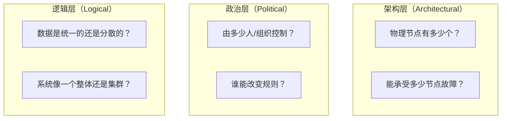
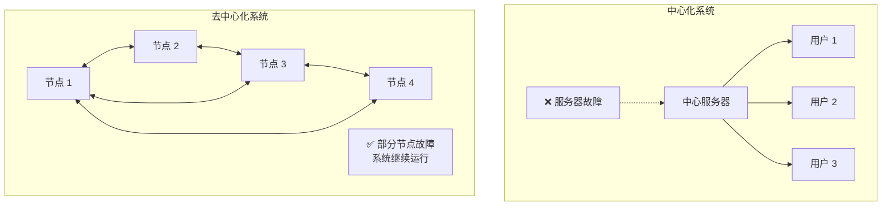

# 2.3 去中心化到底「去掉了什么」

> **学习目标**：完成本节后，你将能够……
> - 从三个维度理解「中心化」的具体含义
> - 说出去中心化「去掉」的三件事和「没去掉」的两件事
> - 认识到去中心化是一个「光谱」，而非非黑即白

---

## 核心内容

### 1. 「去中心化」是一个被滥用的词

在 Web3 世界，「去中心化」可能是被使用最多、也被误解最多的词。

几乎每个项目都会宣称自己是「去中心化」的。但如果你仔细观察，会发现：
- 有的「去中心化交易所」，关键代码只有几个人能改
- 有的「去中心化应用」，数据存储在中心化的服务器上
- 有的「去中心化网络」，前三大节点控制着 50% 的算力

那么，「去中心化」到底意味着什么？

### 2. 理解「中心化」：三个维度

以太坊创始人 Vitalik Buterin 提出了一个有用的框架：判断一个系统是否「去中心化」，可以从三个维度来看：

用更通俗的话来说：

| 维度 | 问的问题 | 中心化的例子 | 去中心化的例子 |
|-----|---------|-------------|---------------|
| **架构层** | 服务器在哪？有多少台？ | 微信：服务器都在腾讯 | 比特币：全球数万个节点 |
| **政治层** | 谁说了算？ | 抖音：字节跳动制定规则 | 比特币：没有人能单方面改规则 |
| **逻辑层** | 数据是否统一？ | 区块链：全网数据一致 | 互联网：每个网站数据独立 |

> **Tips**：有趣的是，区块链在「逻辑层」其实是中心化的——它要求全网所有节点的数据保持一致。但它在「架构层」和「政治层」是去中心化的。这告诉我们：**去中心化不是一个简单的「是或否」问题**。

### 3. 去中心化「去掉」的三件事

理解了「中心化」的含义，我们就能更准确地说明「去中心化」到底去掉了什么：

#### 3.1 去掉了「单点故障」的风险

在中心化系统中，如果核心服务器宕机，整个系统就瘫痪了。

还记得吗？
- 2021 年，Facebook 全球宕机 6 小时，旗下 WhatsApp、Instagram 全部无法访问
- 2020 年，支付宝短暂宕机，无数人无法付款

在去中心化网络中：
- 比特币网络有数万个节点分布在全球各地
- 即使一半的节点下线，网络依然正常运行
- 没有「总开关」可以关闭整个系统

#### 3.2 去掉了「审查和封禁」的权力

在 Web2 世界，平台拥有绝对的权力：
- Twitter/X 可以封禁任何账号（包括美国前总统）
- 银行可以冻结任何账户
- 应用商店可以下架任何 App

在去中心化网络中：
- 没有人能「封禁」你的比特币地址
- 没有人能阻止你发送一笔交易
- 只要你保管好私钥，资产就是你的

**「抗审查」（Censorship Resistance）**是去中心化最重要的价值之一。

#### 3.3 去掉了「任意修改规则」的权力

在中心化平台：
- 淘宝可以随时修改卖家规则
- 游戏公司可以随时改变装备属性
- 银行可以调整利率和手续费

在去中心化网络：
- 比特币 2100 万枚的总量上限，写死在代码里
- 想要修改规则？需要大多数参与者同意
- 如果社区意见分裂，会发生「分叉」（网络分裂成两条链）

| 传统平台 | 区块链 |
|---------|--------|
| 规则由平台单方面制定 | 规则由代码定义，修改需共识 |
| 用户只能被动接受 | 用户可以「用脚投票」（迁移到分叉链） |
| 规则可以偷偷修改 | 所有修改公开透明 |

### 4. 去中心化「没去掉」的东西

这才是关键：**去中心化不是无政府状态，也不是完美乌托邦**。

#### 4.1 仍然需要规则和共识

去中心化网络不是没有规则，而是规则的制定方式不同。

- 比特币有自己的协议规则（出块时间、区块大小、奖励减半等）
- 以太坊有自己的 EIP 提案流程
- 每条链都有自己的「宪法」

#### 4.2 仍然有治理和决策

代码需要有人写，漏洞需要有人修，升级需要有人提议。

- 比特币有 Core 开发者团队
- 以太坊有 Vitalik 和基金会
- 很多项目有「治理代币」，持有者可以投票

**去中心化改变的是「谁有权参与决策」，而不是「不需要决策」**。

#### 4.3 仍然可能出现权力集中

这是最容易被忽视的现实：

| 领域 | 权力集中的表现 |
|-----|---------------|
| **挖矿/验证** | 比特币前三大矿池控制约 50% 算力 |
| **持币分布** | 少数「鲸鱼」持有大量代币，能影响价格 |
| **开发** | 核心开发者对代码走向有重大影响 |
| **基础设施** | 大量 DApp 依赖 Alchemy、Infura 等中心化 API |

> **Tips**：「去中心化」是一个理想目标，现实中的项目总是在「去中心化」和「效率」之间寻找平衡。完全去中心化的系统往往很慢、很贵、很难升级。

### 5. 去中心化是一个「光谱」

不要把去中心化理解为「0 或 1」的二元对立。它更像一个光谱：

| 光谱位置 | 代表 | 特点 |
|---------|------|------|
| **完全中心化** | 传统银行系统 | 单一机构控制，高效但需信任 |
| **联盟链** | Hyperledger、某些企业链 | 特定机构联合控制，有准入门槛 |
| **公链（较中心化）** | 某些 PoS 链 | 开放参与，但验证者集中 |
| **公链（较去中心化）** | 以太坊 | 大量验证者，但有核心团队 |
| **高度去中心化** | 比特币 | 无领导者，但矿池仍集中 |

**选择哪个位置，取决于具体需求**：
- 需要快速迭代？可能需要更中心化的治理
- 需要抗审查？必须更去中心化
- 企业内部使用？联盟链可能更合适

---

## 案例/故事

### The DAO 事件：去中心化的理想与现实

2016 年，以太坊上出现了一个叫「The DAO」的项目——一个完全由代码运行的「去中心化自治组织」。它募集了相当于 1.5 亿美元的 ETH，是当时最大的众筹项目。

然后，黑客发现了智能合约中的漏洞，盗走了约 6000 万美元的 ETH。

社区面临一个艰难的选择：
- **选项 A：什么都不做**。代码就是法律，黑客利用的是合约漏洞，不是「偷窃」。
- **选项 B：回滚交易**。修改区块链历史，把被盗的钱「找回来」。

最终，以太坊社区选择了 B——通过硬分叉回滚了黑客的交易。

这个决定引发了巨大争议：
- 支持者：保护用户资产是对的
- 反对者：「代码即法律」说好的呢？今天能回滚黑客交易，明天是不是能回滚任何交易？

最终，不同意这次分叉的人继续运行原来的链，变成了「以太坊经典」（Ethereum Classic）。

这个故事告诉我们：**去中心化系统仍然需要人来做决策，而且这些决策可能非常艰难**。

---

## 关键概念速查

| 概念 | 一句话解释 |
|-----|-----------|
| **去中心化** | 没有单一控制方，由众多参与者共同维护网络 |
| **单点故障** | 系统中某一个关键环节出问题，导致整个系统崩溃 |
| **抗审查** | 没有人能阻止你使用网络或进行交易 |
| **治理** | 决定系统规则如何制定和修改的机制 |
| **分叉** | 社区对规则产生分歧时，区块链分裂成两条链 |
| **去中心化光谱** | 去中心化程度是连续的，不是非黑即白 |

---

## 学习资料

### 必读
- [登链社区 - "去中心化"到底是什么？](https://learnblockchain.cn/article/2115) - Vitalik 观点的中文解读（预计阅读 15 分钟）
- [Blockworks - Measuring Decentralization](https://blockworks.co/news/measuring-decentralization-is-your-crypto-decentralized) - 英文，如何衡量去中心化程度（预计阅读 10 分钟）

### 选读（进阶）
- [AWS - 什么是区块链去中心化](https://www.amazonaws.cn/what-is/blockchain-decentralization/) - 技术角度的解释
- [MIT Journal - Exploring Decentralization](https://jods.mitpress.mit.edu/pub/7vxemtm3) - 学术视角的深度分析

---

## 学习任务

完成以下任务以检验学习效果：

- [ ] **任务 1**：列出 3 个去中心化「去掉」的东西，和 2 个「没去掉」的东西
  - 要求：用自己的话表述，每条不超过 20 字

- [ ] **任务 2**：用一个生活中的例子，类比说明「去中心化是一个光谱」
  - 例如：可以用「公司治理」（独裁 vs 董事会 vs 股东大会 vs 全员投票）来类比

> **提交方式**：将任务输出记录在个人学习笔记中

---

## 常见问题 FAQ

**Q1: 比特币真的是去中心化的吗？矿池不是很集中吗？**

A: 这是个好问题。比特币在「协议层面」是去中心化的——没有人能单方面修改比特币的规则。但在「算力层面」，前三大矿池确实控制着约 50% 的算力。不过，矿池是由许多独立矿工组成的，矿工可以随时切换矿池。所以比特币是「相对去中心化」的，而非「完全去中心化」的。

**Q2: 去中心化一定比中心化好吗？**

A: 不一定。去中心化有代价：更慢、更贵、更难升级。对于很多场景，中心化系统更高效。去中心化的价值在于「不需要信任特定第三方」——如果你信任某个机构，用中心化服务可能更好。选择取决于你的具体需求。

**Q3: Web3 真的去中心化吗？很多 DApp 不是还要连接中心化服务器？**

A: 是的，这是一个被批评的现实。很多 DApp 前端托管在中心化服务器上，后端依赖 Alchemy、Infura 等中心化 API。这被称为「去中心化戏剧」（Decentralization Theater）。真正的去中心化需要从前端到后端全链路分布式，目前大多数项目还没做到。

---

## 下一步

理解了「去中心化」的真正含义后，下一节我们将探讨另一个容易混淆的话题：公链、Layer2、侧链——这些「链」到底有什么区别？

→ [2.4 公链、Layer2、侧链的本质区别](./2.4-公链Layer2侧链的区别.md)

---

最后更新：2025-01-09
编写：Antony
审核：待审核
