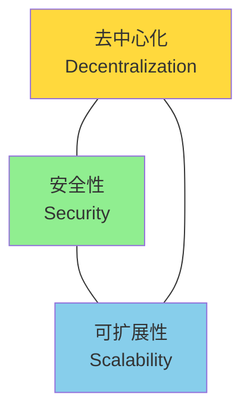
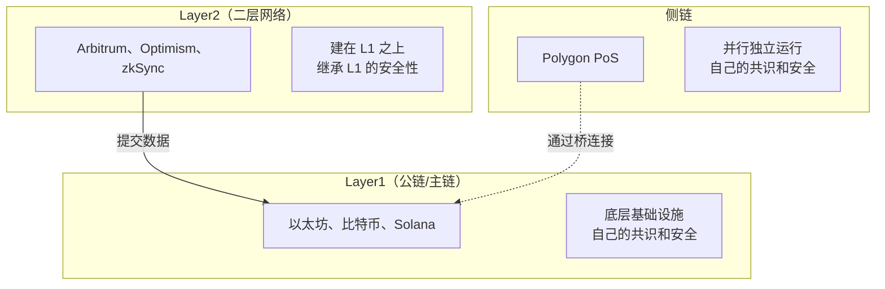
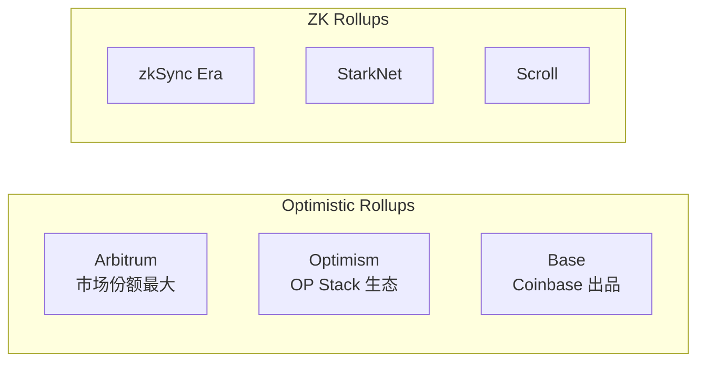
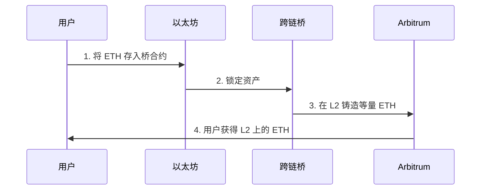

# 2.4 公链、Layer2、侧链的本质区别

> **学习目标**：完成本节后，你将能够……
> - 用「不可能三角」解释为什么需要不同类型的链
> - 区分公链（L1）、Layer2、侧链的核心差异
> - 作为普通用户，知道如何选择适合自己的链

---

## 核心内容

### 1. 为什么有这么多「链」？

如果你关注 Web3 一段时间，可能会感到困惑：

> 「以太坊不是号称世界计算机吗？怎么又冒出来 Arbitrum、Optimism、Polygon、zkSync……这么多链？它们和以太坊是什么关系？」

答案藏在一个经典的难题里——

### 2. 区块链的「不可能三角」

以太坊创始人 Vitalik Buterin 提出了一个著名的观点：区块链无法同时完美实现三个目标，必须在其中做取舍：

| 目标 | 含义 | 提高它的代价 |
|-----|------|-------------|
| **去中心化** | 节点分布广，没有中心控制 | 速度变慢，因为要等更多节点确认 |
| **安全性** | 抵抗攻击，数据不被篡改 | 需要更复杂的验证，效率降低 |
| **可扩展性** | 处理大量交易，速度快、费用低 | 可能需要牺牲去中心化或安全性 |

**现实中的取舍**：

| 链 | 选择 | 代价 |
|---|------|------|
| 比特币 | 去中心化 + 安全性 | 每秒只能处理约 7 笔交易 |
| Solana | 安全性 + 可扩展性 | 验证者数量较少，去中心化程度有限 |
| BSC | 安全性 + 可扩展性 | 只有 21 个验证者 |

这就是为什么出现了各种「扩展方案」——试图在不牺牲太多去中心化和安全性的前提下，提高可扩展性。

### 3. 三种「链」的定义

让我们先明确三个概念：

#### 3.1 Layer1（公链/主链）

**定义**：底层区块链基础设施，是整个生态系统的基石。

**特点**：
- 有自己的共识机制（PoW、PoS 等）
- 有自己的原生代币（ETH、BTC、SOL）
- 其他方案可以建在它之上

**代表项目**：以太坊、比特币、Solana、Avalanche

#### 3.2 Layer2（二层网络）

**定义**：建在 Layer1 之上的扩展解决方案。

**核心思路**：
1. 在「链下」处理大量交易（速度快、费用低）
2. 只把最终结果提交到「主链」
3. **关键：继承 L1 的安全性**

**代表项目**：Arbitrum、Optimism、zkSync、StarkNet

#### 3.3 侧链（Sidechain）

**定义**：与主链并行运行的独立区块链。

**特点**：
- 有自己的共识机制和验证者
- 通过「桥」与主链连接
- **关键：不继承 L1 的安全性**

**代表项目**：Polygon PoS、Ronin

### 4. Layer2 vs 侧链：核心区别

这是最容易混淆的一点，让我用一个比喻来解释：

> **Layer2 就像银行的分支网点**
> - 分支网点可以处理大部分业务（存取款、转账）
> - 但最终的账目必须和总行对账
> - 分支网点出了问题，总行可以介入纠正
> - **你的钱本质上还是存在总行的系统里**

> **侧链就像另一家独立的银行**
> - 它有自己的账本和员工
> - 你可以把钱从 A 银行转到 B 银行（通过「桥」）
> - 但 B 银行出了问题，A 银行管不了
> - **你的钱存在 B 银行，就要信任 B 银行**

| 维度 | Layer2 | 侧链 |
|-----|--------|------|
| 安全性来源 | 继承 L1（以太坊）的安全性 | 依赖自己的验证者 |
| 数据存储 | 交易数据提交到 L1 | 数据存储在自己的链上 |
| 如果出问题 | 可以用 L1 的数据恢复 | L1 无法帮助 |
| 代表项目 | Arbitrum, Optimism, zkSync | Polygon PoS, BSC |

> **Tips**：一个简单的判断标准——如果这条链的所有验证者都作恶，用户的资产还安全吗？Layer2：安全（因为数据在 L1 上）。侧链：不安全（依赖自己的共识）。

### 5. Layer2 的两大流派

Layer2 又分为两种主要技术路线：

#### 5.1 Optimistic Rollups（乐观 Rollup）

**原理**：「先假设你是好人」
- 默认所有交易都是有效的
- 如果有人作弊，有 7 天时间可以「挑战」
- 挑战成功，作弊者受罚

**优点**：与以太坊兼容性好，开发者迁移容易
**缺点**：提款到 L1 需要等待约 7 天

**代表项目**：Arbitrum、Optimism、Base

#### 5.2 ZK Rollups（零知识 Rollup）

**原理**：「用数学证明你是好人」
- 每笔交易都附带一个密码学证明
- 任何人都可以快速验证证明是否有效
- 无需等待挑战期

**优点**：提款快（几小时），更安全
**缺点**：技术复杂，与以太坊兼容性还在提升中

**代表项目**：zkSync Era、StarkNet、Scroll、Linea

### 6. 用户视角：我该选哪条链？

作为普通用户，最关心的是：**手续费、速度、安全性**。

| 维度 | 以太坊 L1 | Arbitrum/Optimism | Polygon PoS |
|-----|----------|-------------------|-------------|
| **Gas 费** | 高（$5-$50+） | 低（$0.1-$1） | 极低（<$0.01） |
| **确认速度** | ~15 秒 | <2 秒 | <2 秒 |
| **提款到以太坊** | N/A | 7天（Optimistic）/ 几小时（ZK） | 即时（通过桥） |
| **安全性** | 最高 | 高（继承 L1） | 中等（独立共识） |
| **适合场景** | 大额资产存储 | 日常 DeFi、NFT 交易 | 高频、小额交互 |

**简单决策建议**：

- **大额资产长期存储** → 以太坊 L1
- **日常使用 DeFi、NFT** → Arbitrum 或 Optimism
- **高频交易、游戏** → Polygon 或其他高性能链
- **追求最低费用** → Polygon PoS

### 7. 跨链桥：连接不同链的「通道」

当你想把资产从一条链转移到另一条链，需要使用「跨链桥」（Bridge）。

> **Tips**：跨链桥是风险较高的环节。历史上多起重大黑客事件都发生在桥上（如 Ronin 桥被盗 6 亿美元）。使用桥时，建议选择官方桥或经过审计的知名桥。

---

## 案例/故事

### 2021 年 Gas 费之战：为什么需要 Layer2

2021 年夏天，NFT 和 DeFi 爆发，以太坊网络严重拥堵。

一笔普通的 Uniswap 交易，Gas 费经常超过 100 美元。很多人为了抢购一个 NFT，Gas 费比 NFT 本身还贵。

这直接催生了 Layer2 的爆发：
- Arbitrum 在 2021 年 8 月上线，TVL 迅速突破 100 亿美元
- Optimism 紧随其后
- 到 2024 年，Layer2 的交易量已经是以太坊主网的 11-12 倍

Layer2 的出现，让普通用户终于可以用「正常」的价格使用以太坊生态。

---

## 关键概念速查

| 概念 | 一句话解释 |
|-----|-----------|
| **不可能三角** | 区块链无法同时实现去中心化、安全性和可扩展性 |
| **Layer1（L1）** | 底层公链，如以太坊、比特币 |
| **Layer2（L2）** | 建在 L1 之上的扩展方案，继承 L1 安全性 |
| **侧链** | 独立运行的链，有自己的共识，不继承 L1 安全性 |
| **Rollup** | L2 的主流技术，把交易打包后提交到 L1 |
| **Optimistic Rollup** | 假设交易有效，有挑战期（7天） |
| **ZK Rollup** | 用密码学证明验证，无需等待期 |
| **跨链桥** | 让资产在不同链之间转移的工具 |

---

## 学习资料

### 必读
- [登链社区 - Layer2 基本概念](https://learnblockchain.cn/article/8163) - 中文，全面介绍 L2 概念和项目（预计阅读 20 分钟）
- [L2Beat](https://l2beat.com) - 实时 L2 数据和风险评估（适合随时查阅）

### 选读（进阶）
- [Gemini - Layer-1 and Layer-2 Networks](https://www.gemini.com/cryptopedia/blockchain-layer-2-network-layer-1-network) - 英文，交易所教育内容
- [Hacken - L1 L2 Scalability](https://hacken.io/discover/l1-l2-scalability/) - 英文，安全角度解读

---

## 学习任务

完成以下任务以检验学习效果：

- [ ] **任务 1**：用一个生活中的比喻，解释 Layer1 和 Layer2 的关系
  - 提示：可以用「高速公路和辅路」「总行和分行」「机场和候机楼」等类比

- [ ] **任务 2**：访问 [L2Beat](https://l2beat.com)，找出当前 TVL 最高的 3 个 Layer2 项目
  - 记录它们的名称、TVL、使用的技术（Optimistic 还是 ZK）

> **提交方式**：将任务输出记录在个人学习笔记中

---

## 常见问题 FAQ

**Q1: Polygon 到底是 Layer2 还是侧链？**

A: 这是一个常见的困惑。Polygon 有多条链：
- **Polygon PoS**：严格来说是侧链，有自己的验证者
- **Polygon zkEVM**：是真正的 Layer2，使用 ZK Rollup 技术
Polygon 的战略是「多链」，所以两种都有。日常说的「Polygon」通常指 Polygon PoS（侧链）。

**Q2: Layer2 的提款为什么要等 7 天？**

A: 这是 Optimistic Rollup 的设计。因为它「乐观地」假设交易有效，需要留出时间让任何人可以「挑战」可疑交易。7 天后没人挑战，就默认交易确认。ZK Rollup 不需要等这么久，因为它用数学证明了交易有效。

**Q3: 用桥跨链安全吗？**

A: 跨链桥是 DeFi 中风险较高的环节。2022 年，Ronin 桥被盗 6 亿美元，Wormhole 桥被盗 3 亿美元。建议：1）使用官方桥或知名桥；2）大额资产分批转移；3）关注桥的审计状态。

---

## 下一步

了解了公链、Layer2、侧链的区别后，下一节我们将介绍一个更前沿的概念：模块化区块链与数据可用性（DA），这是区块链扩展的下一个方向。

→ [2.5 模块化区块链与数据可用性（DA）](./2.5-模块化区块链与DA.md)

---

最后更新：2025-01-09
编写：Antony
审核：待审核
