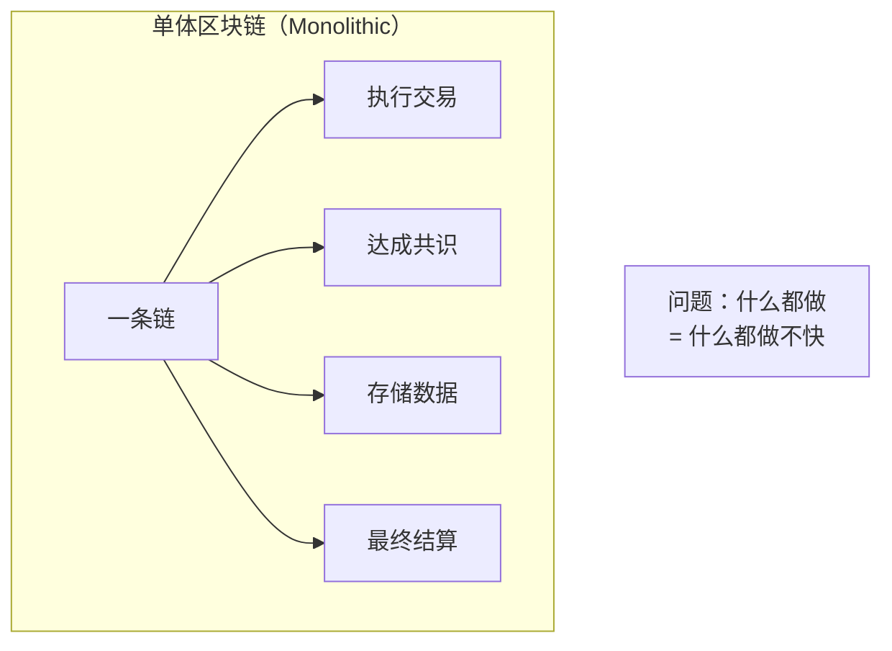
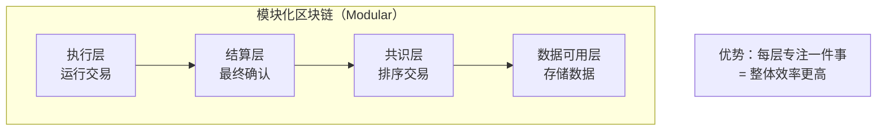
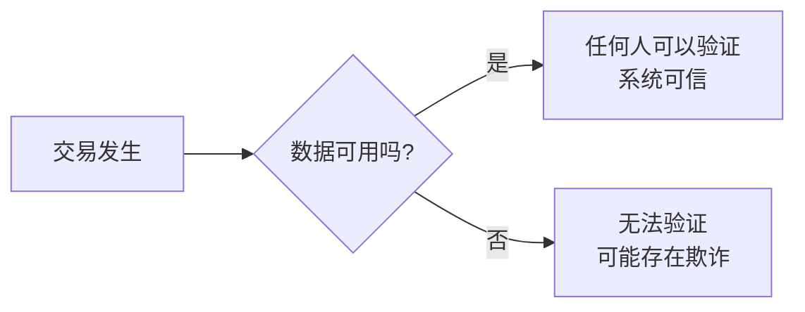
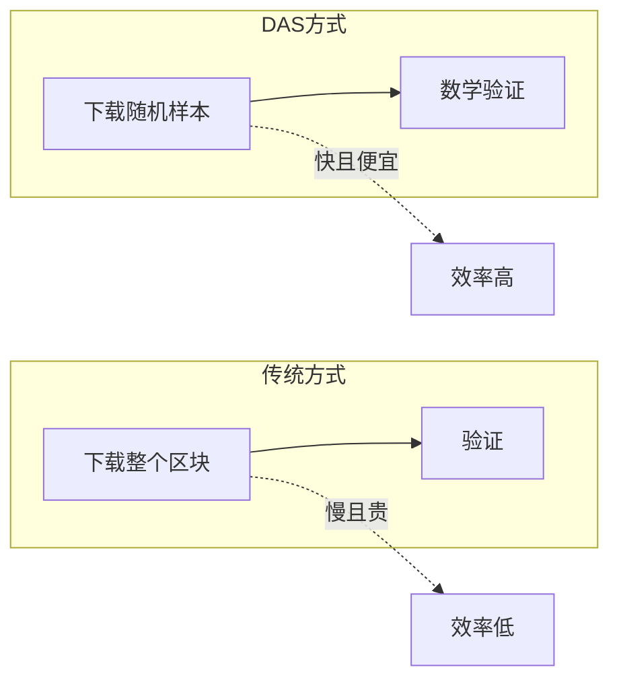
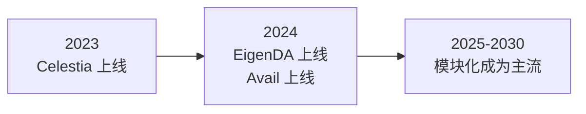

# 2.5 模块化区块链与数据可用性（DA）

> **学习目标**：完成本节后，你将能够……
> - 理解「单体区块链」和「模块化区块链」的区别
> - 知道「数据可用性」（DA）是什么以及为什么重要
> - 了解模块化趋势对普通用户的影响

---

## 核心内容

### 1. 从「单体」到「模块化」：区块链的进化

想象一家餐厅：

> **传统小餐馆**：厨师一个人负责采购、备菜、炒菜、装盘、上菜。效率有限，客人多了就忙不过来。

> **现代连锁餐厅**：有专门的采购部、配送中心、厨房、服务团队。每个环节各司其职，整体效率大大提升。

区块链正在经历类似的进化。

#### 1.1 单体区块链：一条链做所有事

早期的区块链（如比特币、以太坊）是「单体」的——一条链同时负责：

- **执行**：运行交易和智能合约
- **共识**：让所有节点对交易顺序达成一致
- **数据存储**：保存所有交易记录
- **结算**：最终确认交易

**问题**：当用户变多、交易量增加，一条链很快就会拥堵。这就是以太坊在 2021 年 Gas 费飙升的根本原因。

#### 1.2 模块化区块链：专业分工

模块化区块链的思路是：**把这些任务拆开，让不同的「层」各司其职**。

| 层 | 职责 | 类比 |
|---|------|------|
| **执行层（Execution）** | 运行智能合约，处理交易 | 工厂车间 |
| **结算层（Settlement）** | 最终确认交易，处理争议 | 法院/仲裁 |
| **共识层（Consensus）** | 决定交易的顺序 | 排队叫号系统 |
| **数据可用层（DA）** | 存储数据，确保任何人可访问 | 公告栏 |

> **Tips**：模块化不是新概念。互联网本身就是模块化的——网络层（TCP/IP）、应用层（HTTP）、表示层各司其职。区块链正在走类似的路。

### 2. 数据可用性（DA）：为什么它很重要？

在模块化架构中，有一个层特别重要，却常被忽视——**数据可用性层**（Data Availability Layer）。

#### 2.1 什么是「数据可用性」？

简单说：**确保区块链上的数据被正确发布，任何人都可以看到和验证**。

听起来很基础，对吧？但这是整个系统可信的基础：

- 如果数据「不可用」（被隐藏或删除），验证者就无法检查交易是否有效
- 没有验证，任何人都可以伪造交易
- 整个「去信任」的前提就崩塌了

#### 2.2 为什么要单独有一个「DA 层」？

传统做法：所有数据存在主链（如以太坊）上。

**问题**：存储数据很贵！

- 在以太坊上存储 1MB 数据，成本可能高达 **$100+**
- 对于 Rollup 来说，把数据发布到以太坊的成本，占用户交易费的 **90%**

**解决方案**：用专门的 DA 层来存储数据，成本可以降低 99%。

| 方案 | 数据存储成本（每 MB） |
|-----|---------------------|
| 以太坊主网 | ~$100 |
| Celestia | ~$0.81 |
| EigenDA | 更低（有免费层） |

### 3. 主流 DA 项目介绍

目前最具代表性的 DA 项目有两个：

#### 3.1 Celestia：第一个模块化 DA 网络

Celestia 是第一个专门做「数据可用性」的区块链，2023 年 10 月主网上线。

**核心技术**：数据可用性采样（Data Availability Sampling, DAS）

传统方式：每个节点必须下载整个区块才能验证数据是否可用。
DAS 方式：轻节点只需要下载区块的随机小样本，就能用数学方法验证整个区块的数据是否可用。

#### 3.2 EigenDA：以太坊生态的 DA 方案

EigenDA 是 EigenLayer 的第一个产品，基于「再质押」机制：

- 利用已经质押在以太坊上的 ETH 来保护 DA 层
- 不需要启动新的验证者网络
- 继承以太坊的部分安全性

**Celestia vs EigenDA**：

| 维度 | Celestia | EigenDA |
|-----|----------|---------|
| **定位** | 独立的 DA 网络 | 以太坊生态的 DA 服务 |
| **安全性来源** | 自己的验证者（质押 TIA 代币） | 以太坊再质押（ETH） |
| **适合谁** | 想脱离以太坊的项目 | 想留在以太坊生态的 Rollup |

### 4. 对普通用户意味着什么？

你可能会问：「我又不是开发者，模块化跟我有什么关系？」

答案是：**直接影响你的使用体验和成本**。

| 影响 | 具体表现 |
|-----|---------|
| **更便宜的 Gas 费** | DA 成本下降，Rollup 的费用也跟着下降 |
| **更快的交易** | 专业化分工提高整体效率 |
| **更多选择** | 启动新 Rollup 变得更容易，会有更多 L2 供你选择 |
| **可能的风险** | 生态碎片化，资产可能分散在不同链上 |

**一个类比**：

> 就像互联网基础设施的升级（从拨号到宽带到光纤）让你看视频更流畅、费用更低，模块化区块链的升级会让你用 DeFi 更便宜、更快。
>
> 你不需要理解光纤的技术原理，但你会享受到它带来的好处。

### 5. 模块化的未来展望

模块化区块链仍处于早期，但趋势已经很明显：

- **2023-2024**：Celestia、EigenDA 等 DA 层上线
- **预测**：到 2030 年，60% 的 L2 将使用第三方 DA 层
- **市场规模**：DA 赛道估值从 2024 年的 20 亿美元，预计增长到 2030 年的 220 亿美元

> **Tips**：作为普通用户，你不需要选择使用哪个 DA 层——这是 Rollup 开发者的决定。但了解这个趋势，可以帮助你理解为什么某些链的费用特别低，以及未来区块链可能的发展方向。

---

## 案例/故事

### 从「全能选手」到「专业团队」：以太坊的扩展之路

2020 年的以太坊，像一个「全能选手」——什么都自己干，结果 DeFi Summer 一来，网络直接堵死，Gas 费飙到天价。

2023 年，以太坊转向「教练」角色：

- 把「执行」交给 Rollup（Arbitrum、Optimism）
- 把「数据存储」交给 DA 层（EigenDA、Celestia）
- 自己专注于「安全性」和「最终结算」

这就是 Vitalik 提出的「以 Rollup 为中心的路线图」。以太坊不再试图一个人扛下所有任务，而是成为模块化堆栈的「安全锚点」。

结果？L2 的交易量已经是以太坊主网的 11-12 倍，而用户的费用大幅下降。

---

## 关键概念速查

| 概念 | 一句话解释 |
|-----|-----------|
| **单体区块链** | 一条链负责执行、共识、存储、结算所有任务 |
| **模块化区块链** | 将区块链功能拆分给不同的专业层 |
| **数据可用性（DA）** | 确保区块链数据被正确发布，任何人可以访问验证 |
| **数据可用性采样（DAS）** | 通过下载随机样本来验证整个区块数据是否可用 |
| **Celestia** | 第一个模块化 DA 网络，使用 DAS 技术 |
| **EigenDA** | 基于以太坊再质押的 DA 方案 |

---

## 学习资料

### 必读
- [登链社区 - Celestia 模块化 DA 网络](https://learnblockchain.cn/article/9909) - 中文，概念清晰（预计阅读 15 分钟）
- [Mitosis University - Understanding DA Layers](https://university.mitosis.org/understanding-data-availability-layers-celestia-eigenda/) - 英文，入门友好（预计阅读 10 分钟）

### 选读（进阶）
- [Web3Caff - DA 赛道万字研报](https://research.web3caff.com/archives/18077) - 深度行业分析
- [Celestia 官方文档](https://docs.celestia.org/learn/celestia-101/data-availability/) - 技术细节

---

## 学习任务

完成以下任务以检验学习效果：

- [ ] **任务 1**：画一张简图，展示模块化区块链的四层分工（执行、结算、共识、数据可用）
  - 可以手绘或使用工具
  - 标注每一层的核心功能

- [ ] **任务 2**：用自己的话解释「为什么数据可用性很重要」
  - 要求：不超过 50 字
  - 提示：想想如果数据「不可用」会发生什么

> **提交方式**：将任务输出记录在个人学习笔记中

---

## 常见问题 FAQ

**Q1: 我需要选择使用 Celestia 还是 EigenDA 吗？**

A: 作为普通用户，你不需要直接选择。这是 Rollup 开发者的决定——他们会选择把数据发布到哪个 DA 层。你只需要知道，使用不同 DA 层的 Rollup 可能有不同的费用和安全模型。

**Q2: 模块化会不会让区块链更复杂、更不安全？**

A: 这是一个权衡。模块化增加了系统的复杂性，但如果设计得当，每个专业层可以做到比「全能链」更安全。类比：专业的保险柜公司做的保险柜，可能比自己焊的铁箱更安全。当然，模块之间的交互点也可能引入新的风险。

**Q3: 模块化是不是意味着更多的代币？**

A: 是的。Celestia 有 TIA 代币，Avail 有 AVAIL 代币，EigenLayer 有 EIGEN 代币……模块化带来了更多的独立项目和代币。这既是机会（更多投资选择），也是挑战（生态碎片化）。

---

## 下一步

了解了区块链的技术演进后，最后一节我们将回到最实际的问题：什么业务根本不适合上链？学会判断「什么不该做」，比知道「什么能做」更重要。

→ [2.6 什么业务根本不适合上链](./2.6-什么业务不适合上链.md)

---

最后更新：2025-01-09
编写：AI Assistant
审核：待审核
