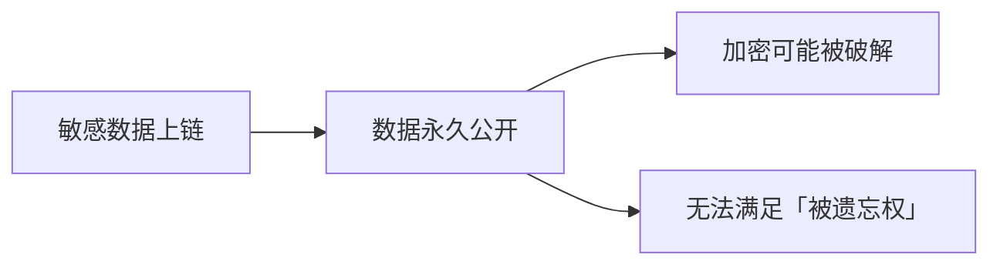
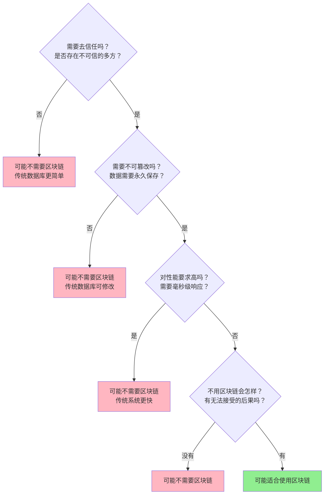

# 2.6 什么业务根本不适合上链

> **学习目标**：完成本节后，你将能够……
> - 复习区块链的核心特性和代价
> - 识别 5 类不适合上链的场景
> - 用判断框架分析一个项目是否真的需要区块链

---

## 核心内容

### 1. 先冷静一下：区块链不是万能的

在学习了区块链的原理和优势之后，很容易产生一种想法：「区块链这么厉害，是不是什么都应该上链？」

答案是：**绝对不是**。

区块链是一种特定问题的解决方案，不是通用的「银弹」。了解它**不能做什么**，和了解它**能做什么**同样重要。

### 2. 复习：区块链的特性和代价

区块链的每个优势都有对应的代价：

| 特性 | 优势 | 代价 |
|-----|------|------|
| **透明** | 任何人可验证 | 隐私性差 |
| **不可篡改** | 数据可信 | 错误无法纠正 |
| **去信任** | 不依赖中心机构 | 效率低、成本高 |
| **不可逆** | 交易最终性强 | 操作失误无法挽回 |

用一句话总结区块链的代价：**慢、贵、公开、不可逆**。

如果你的业务对这些代价无法容忍，那区块链可能不是正确的选择。

### 3. 五类不适合上链的场景

#### 3.1 需要隐私保护的数据

**例子**：
- 医疗病历（患者隐私）
- 商业机密（竞争对手可见）
- 个人身份信息（GDPR 合规问题）

**为什么不适合**：

公链上的数据对所有人可见。即使加密存储，也面临风险：
- 加密算法可能被未来的量子计算破解
- 数据永久存在，无法真正「删除」

> **Tips**：虽然有零知识证明（ZKP）等隐私技术，但目前还不够成熟，且增加了复杂度。对于高隐私要求的场景，传统数据库 + 访问控制仍是更稳妥的选择。

#### 3.2 需要频繁修改的数据

**例子**：
- 用户在线状态
- 实时库存数量
- 协作文档（如 Google Docs）

**为什么不适合**：

区块链的「不可篡改」意味着：
- 每次修改都是新增一条记录
- 存储成本线性增长
- 查询最新状态需要遍历历史

传统数据库：修改一行数据 = 1 次写操作
区块链：修改一行数据 = 新增 1 条记录 + 旧数据永久保留

#### 3.3 对延迟敏感的业务

**例子**：
- 高频交易（毫秒级响应）
- 游戏帧同步（16ms 刷新）
- 实时视频通话

**为什么不适合**：

| 系统 | 延迟 |
|-----|------|
| 传统数据库 | 毫秒级 |
| 比特币确认 | ~10 分钟 |
| 以太坊确认 | ~15 秒 |
| 最快的 L2 | 数秒 |

即使是最快的区块链，对于需要毫秒级响应的业务也远远不够。

#### 3.4 已有可信中心的场景

**例子**：
- 银行内部系统
- 企业内部流程
- 政府内部记录

**为什么不适合**：

区块链的核心价值是「去信任」——在没有可信第三方的情况下达成共识。

但如果：
- 银行已经是被监管的可信机构
- 企业内部员工已经被公司管理
- 政府系统已经有法律背书

那么区块链带来的去中心化优势就不明显，反而增加了：
- 系统复杂度
- 运维成本
- 培训成本

> **核心问题**：如果已经有一个可信的「中心」，为什么要用复杂的方式来「去中心化」？

#### 3.5 对成本敏感的小规模应用

**例子**：
- 个人博客
- 小型社区
- 低价值微交易

**为什么不适合**：

| 操作 | 以太坊成本 | 传统云服务成本 |
|-----|-----------|---------------|
| 存储 1KB 数据 | ~$1-10 | ~$0.00001 |
| 执行简单计算 | ~$0.1-1 | ~$0.000001 |

对于低价值的应用，区块链的成本可能比业务价值还高。

### 4. 识别「伪区块链」项目

在区块链热潮中，很多项目打着「区块链」的旗号，但实际上：
- 根本不需要区块链
- 或者根本没有真正使用区块链

**「伪区块链」的常见特征**：

| 特征 | 说明 |
|-----|------|
| **号称上链但实际中心化** | 数据存在公司服务器，只是用了「区块链」这个词 |
| **强行「区块链+」** | 区块链养鸡、区块链大米……把不相关的业务硬套区块链 |
| **发币是目的，应用是借口** | 白皮书讲的是宏大愿景，实际只是想发币融资 |
| **技术细节模糊** | 说不清用的什么链、什么共识机制、数据存在哪 |
| **过度承诺** | 宣称能解决一切问题，革命一切行业 |

**「区块链养鸡」的故事**：

几年前，某公司宣布要做「区块链溯源养鸡」，给每只鸡戴上传感器，把养殖数据上链，消费者扫码就能看到鸡的一生。

听起来很美好，但仔细想想：
- 传感器数据是谁上传的？——还是养殖场
- 数据真实性谁保证？——还是要信任养殖场
- 区块链解决了什么问题？——**什么也没解决**

真正的问题（数据源头的真实性）没有被解决，区块链只是让「可能虚假的数据」变得「不可篡改」。

**这就是典型的「用区块链解决不存在的问题」。**

### 5. 判断框架：是否适合上链？

当你遇到一个「区块链项目」时，可以问自己这些问题：

**两个核心问题**：

1. **这个业务真的需要「去信任」吗？**
   - 如果已经有可信的中心机构，区块链可能多此一举

2. **不用区块链会有什么无法接受的后果？**
   - 如果答案是「没什么特别的」，那可能不需要区块链

### 6. 适合上链的场景（对比）

为了完整性，我们也列出真正适合区块链的场景：

| 场景 | 为什么适合 |
|-----|-----------|
| **跨境汇款** | 需要去信任，传统银行慢且贵 |
| **资产存证** | 需要不可篡改的时间戳记录 |
| **供应链溯源（多方参与）** | 多个不互信的主体需要共享数据 |
| **去中心化金融** | 消除中间人，降低成本和门槛 |
| **数字资产所有权** | 需要可验证的稀缺性和所有权证明 |

**共同特点**：
- 涉及多方不互信的参与者
- 需要透明可验证的记录
- 去中心化带来的好处大于代价

---

## 案例/故事

### 从「万物上链」到「理性上链」

2017-2018 年的 ICO 热潮中，各种「区块链+」项目层出不穷：

- 区块链养鸡
- 区块链大米
- 区块链租房
- 区块链相亲
- 区块链发票（这个其实有一定道理）

很多项目拿到了融资，发了代币，然后……就没有然后了。

为什么？因为它们犯了同一个错误：**用区块链解决区块链解决不了的问题**。

区块链能保证「链上数据不可篡改」，但不能保证「上链数据是真实的」。

如果源头的数据就是假的（养殖场虚报数据、商家伪造产地），把它们「上链」只是让假数据更难删除而已。

**真正的创新不是「把所有东西上链」，而是「找到区块链真正能发挥作用的场景」**。

---

## 关键概念速查

| 概念 | 一句话解释 |
|-----|-----------|
| **区块链的代价** | 慢、贵、公开、不可逆 |
| **「伪区块链」项目** | 打着区块链旗号但实际不需要或没有使用区块链的项目 |
| **「区块链+」** | 把区块链强行套用到各种业务的营销概念 |
| **去信任化的前提** | 存在多方不互信的参与者 |
| **数据真实性问题** | 区块链保证链上数据不可篡改，但不保证源头数据真实 |

---

## 学习资料

### 必读
- [TechTarget - Blockchain Applications](https://www.techtarget.com/searchcio/feature/Todays-blockchain-use-cases-and-industry-applications) - 英文，平衡的行业应用分析（预计阅读 15 分钟）

### 选读（进阶）
- [AIMultiple - Blockchain Applications](https://research.aimultiple.com/blockchain-applications/) - 17 个实际应用案例分析
- [ScienceDirect - Comprehensive Review of Blockchain](https://www.sciencedirect.com/science/article/pii/S2772662223001844) - 学术视角的全面分析

---

## 学习任务

完成以下任务以检验学习效果：

- [ ] **任务 1**：找一个你听说过的「区块链+」项目（如区块链溯源、区块链存证、区块链游戏等），分析它是否真的需要区块链
  - 使用本节的判断框架
  - 写出你的分析过程和结论（200-300 字）

- [ ] **任务 2**：列出 3 个你认为「适合上链」的场景，和 3 个「不适合上链」的场景
  - 每个场景用一句话说明理由

> **提交方式**：将任务输出记录在个人学习笔记中

---

## 常见问题 FAQ

**Q1: 区块链溯源不是挺好的吗？为什么说「区块链养鸡」是伪区块链？**

A: 区块链溯源在**某些场景**是有价值的——特别是涉及多个不互信的参与者（如国际供应链、多个检测机构）。但对于单一养殖场的鸡，数据源头只有养殖场自己，区块链无法验证源头数据的真实性。这种情况下，区块链只是增加了成本，没有解决核心信任问题。

**Q2: 随着技术发展，这些「不适合」的场景会变得适合吗？**

A: 有可能。比如：
- 隐私问题可能被零知识证明（ZKP）部分解决
- 性能问题可能被新的共识机制改善
- 成本问题可能被 Layer2 和模块化架构降低
但核心问题（是否需要去信任）是业务层面的，不是技术能改变的。

**Q3: 如何判断一个项目是不是「伪区块链」？**

A: 问几个问题：
- 数据存在哪？能在区块链浏览器上查到吗？
- 去掉「区块链」这个词，项目还能运作吗？
- 发代币是为了什么？代币在业务中有实际用途吗？
如果这些问题都回答不清楚，大概率是「伪区块链」。

---

## Part02 总结

恭喜你完成了 Part02 的学习！让我们回顾一下这个模块的核心内容：

| 章节 | 核心知识点 |
|-----|-----------|
| 2.1 | 区块链解决的核心问题是「双重支付」和「拜占庭将军问题」 |
| 2.2 | 比特币通过工作量证明、链式结构、激励机制实现「无需信任的价值转移」 |
| 2.3 | 去中心化去掉了单点故障、审查权力、任意改规则，但没去掉规则、治理和可能的权力集中 |
| 2.4 | 公链是底层基础设施，L2 继承 L1 安全性，侧链有自己的共识 |
| 2.5 | 模块化区块链将执行、结算、共识、数据可用分层，DA 层大幅降低成本 |
| 2.6 | 区块链不是万能的，需要隐私、频繁修改、低延迟、已有可信中心的场景可能不适合 |

**下一步**：在 Part03 中，我们将进入更实际的话题——钱包、账户和资产安全。这是每个 Web3 参与者都必须掌握的生存技能。

---

最后更新：2025-01-09
编写：Antony
审核：待审核
