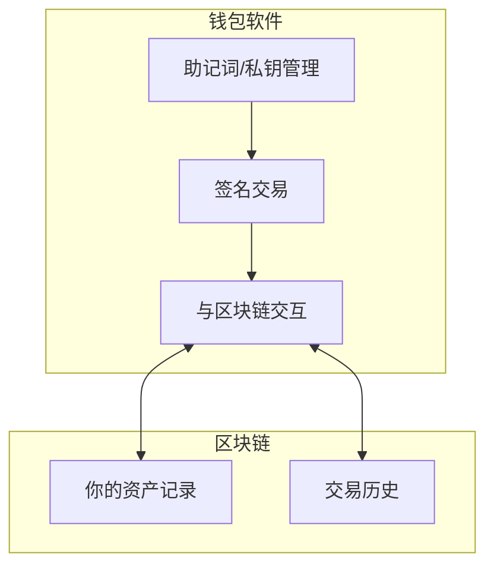

# 3.1 钱包、地址、私钥、助记词的关系

> **学习目标**：完成本节后，你将能够：
> - 解释钱包、地址、私钥、助记词各自的定义与作用
> - 理解四者之间的派生关系
> - 用生活类比向他人解释"为什么私钥如此重要"

---

## 核心内容

### 1. 四个核心概念速览

在开始之前，先记住这个最重要的结论：

> **在 Web3 世界，谁掌握私钥，谁就拥有资产的绝对控制权。**

| 概念 | 英文 | 一句话解释 |
|-----|------|-----------|
| 助记词 | Mnemonic / Seed Phrase | 12 或 24 个英文单词，用于备份和恢复钱包 |
| 私钥 | Private Key | 一串随机字符，是资产的"终极密码" |
| 公钥 | Public Key | 由私钥派生，用于验证签名 |
| 地址 | Address | 由公钥派生，是你的"收款账号" |

### 2. 派生关系：从助记词到地址

这四者之间存在严格的**单向派生关系**：


**关键理解**：
- **单向派生**：助记词可以推导出私钥，但私钥无法反推助记词
- **一对多关系**：一个助记词可以派生出无数个私钥/地址（通过不同的派生路径）
- **不可逆**：如果丢失助记词，即使知道地址也无法找回资产

### 3. 用银行账户类比理解

为了更直观地理解，我们用银行账户做一个类比：

| Web3 概念 | 银行类比 | 说明 |
|----------|---------|------|
| 助记词 | 银行卡 + 密码 + 身份证的组合 | 拥有它就能完全控制账户 |
| 私钥 | 银行卡密码（但更强） | 授权任何操作的唯一凭证 |
| 公钥 | 银行内部的账户验证信息 | 用户一般不直接接触 |
| 地址 | 银行卡号 | 可以公开，用于收款 |

> **重要区别**：银行可以帮你重置密码，但 Web3 中**没有人能帮你找回私钥**。

### 4. 各概念详解

#### 4.1 助记词（Seed Phrase）

助记词是由 12 个或 24 个英文单词组成的序列，例如：

```
apple banana cherry dog elephant fox grape honey ice juice kite lemon
```

**为什么用单词而不是随机字符？**
- 更容易抄写和记忆
- 更不容易抄错（相比十六进制字符串）
- 遵循 BIP-39 标准，通用性强

> **Tips**：助记词的单词顺序非常重要，顺序错误等于助记词错误。

#### 4.2 私钥（Private Key）

私钥是一串 64 位的十六进制字符，例如：

```
0x4c0883a69102937d6231471b5dbb6204fe512961708279f9d2607f4c3e8e4b1a
```

**私钥的特点**：
- 完全随机生成
- 数学上几乎不可能被猜中（2^256 种可能）
- 丢失 = 永久丢失资产
- 泄露 = 资产可能被盗

#### 4.3 公钥（Public Key）

公钥由私钥通过椭圆曲线加密算法（ECDSA）派生而来：
- 可以安全公开
- 主要用于验证签名
- 普通用户日常不需要直接使用

#### 4.4 地址（Address）

地址是公钥经过哈希运算后的结果，例如：

```
0x71C7656EC7ab88b098defB751B7401B5f6d8976F
```

**地址的用途**：
- 接收资产（类似银行卡号）
- 可以安全公开分享
- 在区块浏览器上查看交易记录

### 5. 钱包到底是什么？

这里要纠正一个常见误解：

> **钱包不存储你的资产，资产永远在区块链上。钱包只是管理私钥的工具。**

更准确地说：



**钱包的三个核心功能**：
1. **保管私钥**：安全存储你的私钥/助记词
2. **签名交易**：用私钥对交易进行签名
3. **广播交易**：将签名后的交易发送到区块链网络

### 6. 为什么说"私钥即一切"？

在传统金融中，即使你丢了银行卡、忘了密码，也可以通过身份证找回。但在 Web3：

| 场景 | 传统金融 | Web3 |
|-----|---------|------|
| 忘记密码 | 银行可重置 | 无人能帮你 |
| 卡片丢失 | 可补办 | 私钥丢失 = 资产永久丢失 |
| 被盗刷 | 可冻结、可追回 | 转走即无法追回 |
| 继承 | 法律程序办理 | 无私钥则无法继承 |

这就是为什么我们说：**Not Your Keys, Not Your Coins**（不是你的私钥，就不是你的币）。

---

## 案例/故事

### James Howells 的 8000 枚比特币

2013 年，英国 IT 工程师 James Howells 不小心把装有 8000 枚比特币私钥的硬盘当垃圾扔掉了。

当时这些比特币价值约 500 万美元，而到了 2024 年，这批比特币价值已超过 **5 亿美元**。

Howells 多次请求当地政府允许他挖掘垃圾填埋场，但都被拒绝。这些比特币至今仍躺在区块链上，但因为没有私钥，永远无法被取出。

**教训**：私钥/助记词的备份比什么都重要。

---

## 关键概念速查

| 概念 | 一句话解释 |
|-----|-----------|
| 助记词 | 12/24 个单词，是私钥的人类可读形式，用于备份恢复 |
| 私钥 | 64 位十六进制字符串，拥有它就拥有资产的绝对控制权 |
| 公钥 | 由私钥派生，用于验证签名，可公开 |
| 地址 | 由公钥派生，类似银行卡号，用于收款 |
| 钱包 | 管理私钥、签名交易、与区块链交互的工具 |
| BIP-39 | 助记词的行业标准，确保不同钱包间的兼容性 |

---

## 学习资料

### 必读
- [什么是加密钱包？](https://academy.binance.com/zh/articles/crypto-wallet-types-explained) - Binance Academy，全面介绍钱包类型（预计阅读 10 分钟）
- [什么是助记词？](https://www.binance.com/zh-CN/square/post/1117007) - Binance，深入理解助记词原理（预计阅读 8 分钟）

### 选读（进阶）
- [BIP-39 标准文档](https://github.com/bitcoin/bips/blob/master/bip-0039.mediawiki) - 助记词技术标准，适合想深入了解原理的学员
- [MetaMask 安全指南](https://support.metamask.io/zh-cn/privacy-and-security/what-is-a-secret-recovery-phrase-and-how-to-keep-your-crypto-wallet-secure/) - 官方安全建议
- [公钥密码学简介](https://www.cloudflare.com/zh-cn/learning/ssl/how-does-public-key-encryption-work/) - Cloudflare，理解公私钥加密原理

---

## 学习任务

完成以下任务以检验学习效果：

- [ ] **任务 1**：用一句话解释"钱包"是什么，并说明它和支付宝最大的不同
- [ ] **任务 2**：画出助记词 → 私钥 → 公钥 → 地址的派生关系图（可手绘或用工具）
- [ ] **任务 3**：向一个完全不懂 Web3 的朋友解释"为什么私钥丢了就无法找回资产"

> **提交方式**：将任务输出记录在学习笔记中

---

## 常见问题 FAQ

**Q1: 助记词和私钥是一样的吗？**

A: 不完全一样，但功能等价。助记词是私钥的"人类可读"表示形式。技术上，助记词通过特定算法可以派生出私钥。拥有助记词就等于拥有私钥。

**Q2: 我可以只备份地址吗？**

A: 不行。地址只能用于收款，无法用于操作资产。要控制资产，必须备份私钥或助记词。

**Q3: 私钥可以修改吗？**

A: 不能。私钥是随机生成的，无法修改。如果你想更换私钥，只能创建一个新钱包，然后把资产转移过去。

**Q4: 一个钱包可以有多个地址吗？**

A: 可以。一个助记词可以派生出无数个地址。很多钱包支持创建多个账户，每个账户对应不同的地址。

**Q5: 如果有人知道我的地址，能盗走我的资产吗？**

A: 不能。知道地址只能查看余额和交易记录，无法转移资产。只有掌握私钥才能操作资产。

---

## 下一步

在理解了钱包、地址、私钥、助记词的关系后，下一节我们将学习 [3.2 钱包与交易所的本质区别](./3.2-钱包与交易所的本质区别.md)，理解"自己保管私钥"和"把币放在交易所"有什么不同。

---

最后更新：2025-01-09
编写：AI Assistant
审核：待审核
