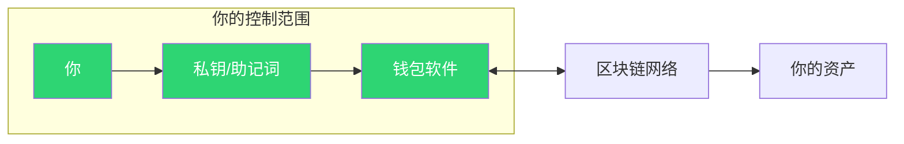
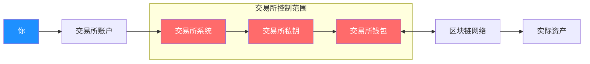
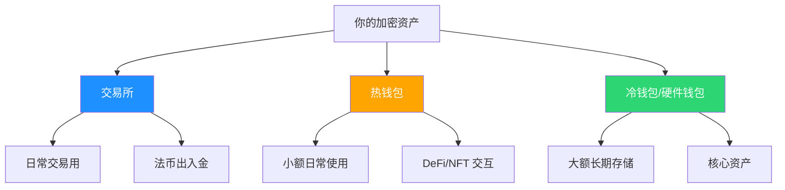

# 3.2 钱包与交易所的本质区别

> **学习目标**：完成本节后，你将能够：
> - 解释托管（Custodial）与自托管（Non-Custodial）的核心区别
> - 列出交易所和自托管钱包各自的风险点
> - 根据自身需求选择合适的资产存放方式

---

## 核心内容

### 1. 核心问题：谁控制你的私钥？

这是理解钱包与交易所区别的关键问题：

| 存放方式 | 谁控制私钥？ | 你拥有什么？ |
|---------|------------|------------|
| 自托管钱包 | **你自己** | 真正的资产所有权 |
| 交易所账户 | **交易所** | 交易所给你的"欠条" |

用一句话总结：

> **Not Your Keys, Not Your Coins.**
> 不是你的私钥，就不是你的币。

### 2. 两种模式详解

#### 2.1 自托管钱包（Non-Custodial Wallet）

自托管钱包是指私钥由用户自己保管的钱包，如 MetaMask、Trust Wallet、Ledger 硬件钱包等。

**特点**：
- ✅ 完全控制：只有你能动用资产
- ✅ 抗审查：没有人能冻结你的账户
- ✅ 无需许可：随时可以转账，无需审批
- ❌ 责任自负：私钥丢失 = 资产永久丢失
- ❌ 无客服：出问题只能自己解决

#### 2.2 托管交易所（Custodial Exchange）

托管交易所是指用户将资产存入交易所，由交易所代为保管私钥的平台，如 Binance、OKX、Coinbase 等。

**特点**：
- ✅ 使用方便：注册即用，类似传统金融
- ✅ 忘记密码可找回：有客服和验证机制
- ✅ 法币出入金方便：支持银行卡、支付宝等
- ❌ 交易所可能跑路：历史上发生过多次
- ❌ 可能被冻结：交易所可以限制你的账户
- ❌ 提现需审批：可能有额度限制和审核

### 3. 风险对比

| 风险类型 | 自托管钱包 | 托管交易所 |
|---------|----------|----------|
| 私钥丢失 | ⚠️ **高风险**：资产永久丢失 | ✅ 低风险：可找回密码 |
| 平台跑路 | ✅ 不适用 | ⚠️ **高风险**：可能血本无归 |
| 黑客攻击 | ⚠️ 中风险：个人设备安全 | ⚠️ 高风险：大目标更吸引黑客 |
| 监管冻结 | ✅ 低风险：难以审查 | ⚠️ **高风险**：可能被冻结 |
| 操作失误 | ⚠️ 高风险：转错地址无法撤回 | ✅ 低风险：内部转账可能可撤 |
| 继承问题 | ⚠️ 中风险：需提前安排 | ✅ 低风险：法律程序可办理 |

### 4. 适用场景选择

| 你的情况 | 推荐方式 | 理由 |
|---------|---------|------|
| 新手，少量资金试水 | 交易所 | 学习成本低，出错可找客服 |
| 频繁交易 | 交易所 | 交易速度快，手续费低 |
| 长期持有（HODL） | 自托管钱包 | 降低交易所风险 |
| 大额资产 | 硬件钱包 | 最高安全级别 |
| 参与 DeFi/NFT | 自托管钱包 | DApp 需要连接钱包 |
| 需要法币出入金 | 交易所 | 自托管钱包不支持 |

### 5. 最佳实践：分散存储

真正成熟的做法是**两者结合**：

**建议分配**：
- **交易所**：需要交易和出入金的部分（10-30%）
- **热钱包**（MetaMask 等）：日常使用和 DApp 交互（10-20%）
- **冷钱包**（Ledger、Trezor）：长期持有的核心资产（50-80%）

> **Tips**：具体比例根据个人情况调整，核心原则是"不要把所有鸡蛋放在一个篮子里"。

---

## 案例/故事

### FTX 暴雷：720 亿美元的教训

2022 年 11 月，全球第二大加密货币交易所 FTX 突然崩盘。

**事件经过**：
1. FTX 创始人 SBF（Sam Bankman-Fried）挪用用户存款投资其他业务
2. 市场恐慌引发挤兑，FTX 无法兑付
3. 11 月 11 日，FTX 申请破产保护
4. 超过 100 万用户的资产被冻结

**损失规模**：
- 用户资产缺口：约 **80 亿美元**
- FTX 估值从 **320 亿美元** 归零
- SBF 因欺诈罪被判处 **25 年监禁**

**受害者的真实声音**：

> "我把毕生积蓄都放在 FTX，以为大交易所是安全的。现在一切都没了。"
> —— FTX 受害者

**教训**：
1. 再大的交易所也可能倒闭
2. 交易所账户里的"余额"只是数字，不是真正的资产
3. 长期持有的资产应该转到自托管钱包

### 其他交易所暴雷事件

| 交易所 | 时间 | 损失金额 | 原因 |
|-------|------|---------|------|
| Mt.Gox | 2014 | 8.5 亿美元 | 黑客攻击 + 内部管理混乱 |
| QuadrigaCX | 2019 | 1.9 亿美元 | 创始人死亡，私钥无人知晓 |
| FTX | 2022 | 80+ 亿美元 | 挪用用户资金 |

---

## 关键概念速查

| 概念 | 一句话解释 |
|-----|-----------|
| 托管（Custodial） | 第三方（如交易所）帮你保管私钥 |
| 自托管（Non-Custodial） | 你自己保管私钥 |
| 热钱包（Hot Wallet） | 连接互联网的钱包，使用方便但安全性稍低 |
| 冷钱包（Cold Wallet） | 离线存储私钥的钱包，安全性最高 |
| 硬件钱包（Hardware Wallet） | 专用硬件设备存储私钥，如 Ledger、Trezor |
| CEX | Centralized Exchange，中心化交易所 |
| DEX | Decentralized Exchange，去中心化交易所 |

---

## 学习资料

### 必读
- [什么是托管型和非托管型钱包？](https://academy.binance.com/zh/articles/custodial-vs-non-custodial-wallets-what-s-the-difference) - Binance Academy，详细对比两种钱包类型（预计阅读 10 分钟）
- [FTX 崩盘事件回顾](https://www.coindesk.com/learn/the-fall-of-ftx-what-went-wrong-with-the-crypto-exchange/) - CoinDesk，了解历史教训（预计阅读 15 分钟）

### 选读（进阶）
- [硬件钱包工作原理](https://www.ledger.com/academy/crypto/what-is-a-hardware-wallet) - Ledger Academy，了解最安全的存储方式
- [Mt.Gox 事件始末](https://academy.binance.com/zh/articles/the-mt-gox-hack-explained) - Binance Academy，了解交易所安全史

---

## 学习任务

完成以下任务以检验学习效果：

- [ ] **任务 1**：列一个表格，对比自托管钱包和交易所的 3 个优点和 3 个缺点
- [ ] **任务 2**：假设你有价值 10,000 美元的加密资产，你会如何分配存储？请说明理由
- [ ] **任务 3**：搜索并了解一个你常用（或计划使用）的交易所的历史，是否有过安全事件？

> **提交方式**：将任务输出记录在学习笔记中

---

## 常见问题 FAQ

**Q1: 大交易所会不会更安全？**

A: 大交易所通常有更好的安全措施，但并非绝对安全。FTX 曾是全球第二大交易所，照样暴雷。规模不是安全的保证。

**Q2: 我是新手，应该先用交易所还是钱包？**

A: 建议从交易所开始。交易所使用门槛低，出错可以找客服。等熟悉后，再学习使用自托管钱包。

**Q3: 硬件钱包是不是太麻烦了？**

A: 对于大额资产，硬件钱包的"麻烦"是值得的。每次交易需要物理确认，这正是它安全的原因。日常小额操作可以用热钱包。

**Q4: 交易所被黑客攻击，我的资产会丢失吗？**

A: 取决于交易所的安全储备和保险政策。一些大交易所有 SAFU 基金等安全保障，但并非所有损失都能赔付。

**Q5: DEX（去中心化交易所）属于哪种？**

A: DEX 属于非托管模式。你用自己的钱包连接 DEX 交易，资产始终在你的钱包里，不需要存入平台。

---

## 下一步

了解了钱包与交易所的区别后，下一节我们将学习 [3.3 授权、签名与交互的基本逻辑](./3.3-授权签名与交互的基本逻辑.md)，理解每次"确认"交易时，到底发生了什么。

---

最后更新：2025-01-09
编写：Antony
审核：待审核
