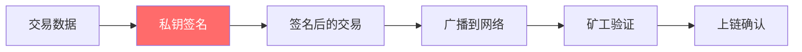
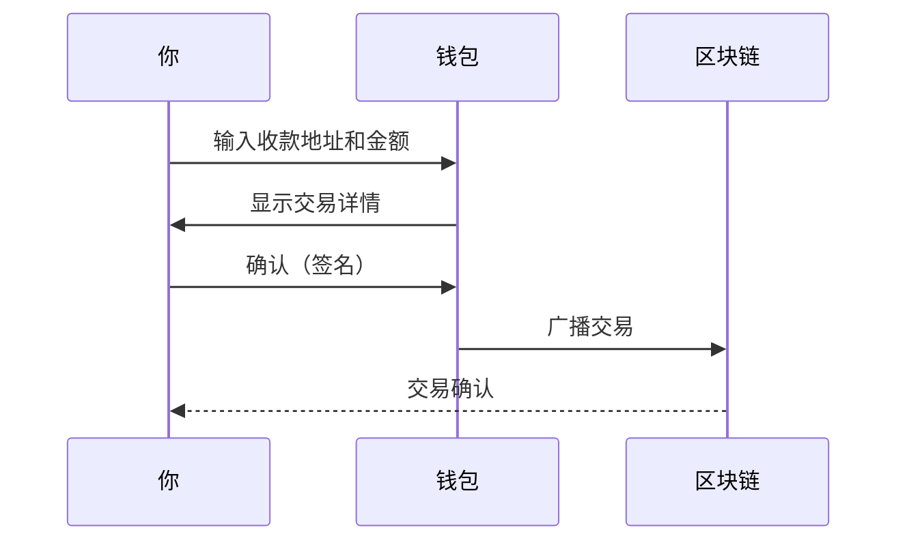
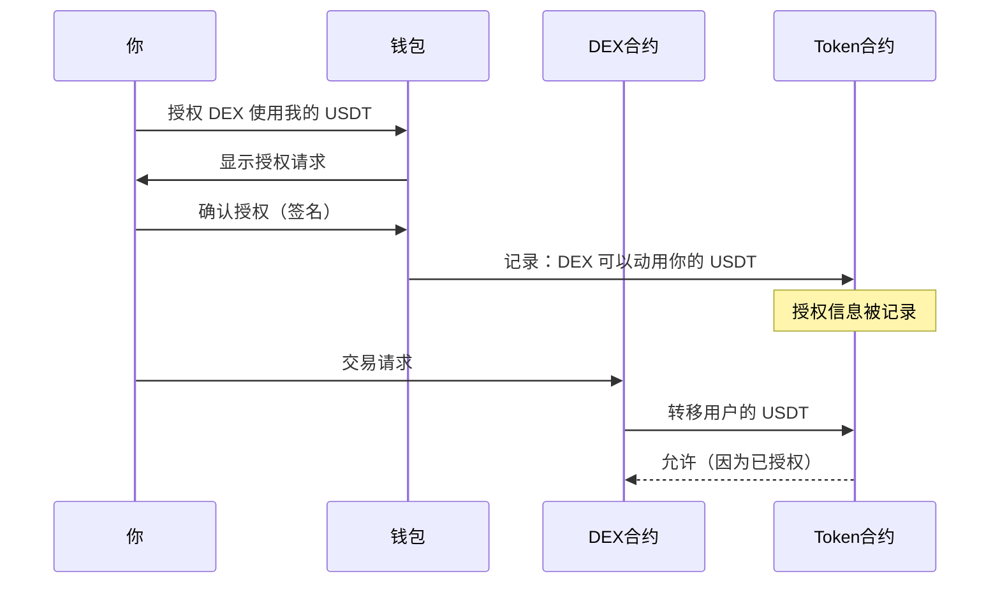
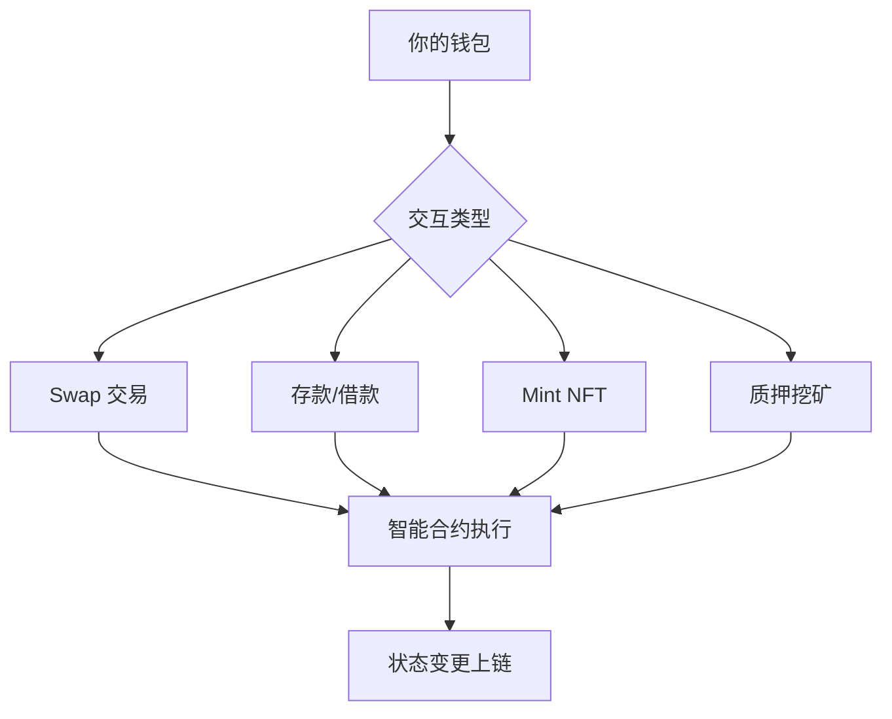

# 3.3 授权、签名与交互的基本逻辑

> **学习目标**：完成本节后，你将能够：
> - 理解区块链"签名"的含义和作用
> - 区分普通转账、Token 授权、合约调用三种交互类型
> - 识别危险的授权请求，保护自己的资产安全

---

## 核心内容

### 1. 什么是"签名"？

当你在钱包中点击"确认"按钮时，实际上是在用你的私钥对一条消息进行**数字签名**。



**签名的作用**：
- 证明这笔交易确实是由私钥持有者发起的
- 一旦签名，交易就具有法律效力（在区块链上）
- 签名不等于发送资产，但可能授权别人动用你的资产

> **类比**：签名就像在支票上签字。签了名的支票别人就可以去兑现。

### 2. 三种常见的链上交互

#### 2.1 普通转账（Transfer）

最简单的交互：把资产从你的地址发送到另一个地址。



**特点**：
- 直接转移资产
- 转出后无法撤回
- Gas 费由发送者支付

#### 2.2 Token 授权（Approve）

这是最容易被忽视但**最危险**的操作类型。

**什么是授权？**

当你想在 DEX（如 Uniswap）上交易代币时，需要先"授权"DEX 合约可以动用你的代币。



**授权的危险性**：

| 授权类型 | 含义 | 风险等级 |
|---------|------|---------|
| 精确授权 | 只授权本次交易需要的数量 | ⭐ 低 |
| 无限授权 | 授权合约可以动用你的全部余额 | ⭐⭐⭐ 高 |

> ⚠️ **警告**：很多 DApp 默认请求**无限授权**，一旦合约有漏洞或被攻击，你的全部资产都可能被盗。

#### 2.3 合约调用（Contract Interaction）

与智能合约进行各种交互，如：
- 在 DEX 上 Swap 代币
- 在借贷协议上存款/借款
- Mint NFT
- 参与 DeFi 挖矿



**注意事项**：
- 每次合约调用都需要 Gas 费
- 阅读交易详情，了解你在做什么
- 不熟悉的合约要格外小心

### 3. 如何识别危险的授权请求

#### 3.1 正常 vs 可疑的授权

| 特征 | 正常授权 | 可疑授权 |
|-----|---------|---------|
| 来源 | 知名 DApp 官网 | 不明链接、空投页面 |
| 金额 | 精确金额或合理上限 | 无限授权（Unlimited） |
| 合约 | 经过审计的知名协议 | 未知合约地址 |
| 时机 | 你主动发起操作 | 突然弹出的请求 |

#### 3.2 授权请求的危险信号

🚨 **立即拒绝**如果看到：

1. **无限授权请求**：显示 "Unlimited" 或超大数字
2. **不明合约**：合约地址你从未见过
3. **异常 Token**：授权的不是你打算交易的 Token
4. **钓鱼网站**：URL 拼写错误（如 uniswop.com）
5. **空投诱导**：声称需要授权才能领取空投

#### 3.3 钱包中的授权界面解读

以 MetaMask 为例，授权请求会显示：

```
授权请求 (Approval Request)
━━━━━━━━━━━━━━━━━━━━━━━━━━━
允许 [合约地址] 使用你的 [Token 名称]？

授权金额: [数量或 Unlimited]

⚠️ 这将允许第三方花费你的 Token
━━━━━━━━━━━━━━━━━━━━━━━━━━━
[拒绝]                [确认]
```

**你应该检查**：
- ✅ 合约地址是否是你要交互的 DApp
- ✅ Token 是否是你打算使用的
- ✅ 金额是否合理（最好不是无限）

### 4. 如何查看和撤销授权

#### 4.1 查看已有授权

推荐工具：

| 工具 | 链接 | 支持的链 |
|-----|------|---------|
| Revoke.cash | https://revoke.cash | 多链支持 |
| Etherscan Token Approvals | https://etherscan.io/tokenapprovalchecker | 以太坊 |
| DeBank | https://debank.com | 多链支持 |

#### 4.2 撤销危险授权

步骤（以 Revoke.cash 为例）：

1. 连接你的钱包
2. 查看所有授权列表
3. 找到可疑或不再需要的授权
4. 点击 "Revoke" 撤销
5. 确认交易（需要支付少量 Gas）

> **Tips**：定期检查和清理授权是良好的安全习惯，建议每月检查一次。

### 5. 签名类型：链上 vs 链下

| 类型 | 说明 | 是否消耗 Gas | 风险 |
|-----|------|-------------|------|
| 链上签名 | 写入区块链的交易 | 是 | 中 |
| 链下签名 | 不上链的消息签名 | 否 | 高⚠️ |

**链下签名的风险**：

链下签名（如 EIP-712 签名）不需要 Gas，但同样危险：
- 可能授权他人使用你的 NFT
- 可能创建卖单（你的 NFT 会被低价卖出）
- 看起来"免费"所以容易放松警惕

> ⚠️ **重要**：不要因为"不花 Gas"就随意签名！免费的签名可能让你损失全部资产。

---

## 案例/故事

### Permit2 钓鱼攻击：100 万美元损失

2023 年，一名用户访问了一个伪装成 Uniswap 的钓鱼网站。网站诱导他签署了一个看似无害的"连接钱包"签名。

**发生了什么**：
1. 用户以为只是连接钱包
2. 实际上签署了 Permit2 授权
3. 攻击者获得了转移用户所有代币的权限
4. 几分钟内，价值 **100 万美元** 的资产被转走

**为什么能成功**：
- Permit2 是链下签名，不需要 Gas
- 用户没有仔细阅读签名内容
- 钓鱼网站伪装得很像官方

**教训**：
1. 每次签名前都要仔细阅读内容
2. 检查网站 URL 是否正确
3. 不要相信任何"免费"签名是无害的

---

## 关键概念速查

| 概念 | 一句话解释 |
|-----|-----------|
| 签名（Sign） | 用私钥证明交易是你本人发起的 |
| 授权（Approve） | 允许某个合约动用你的特定 Token |
| 无限授权 | 授权合约可以动用你该 Token 的全部余额 |
| 撤销授权（Revoke） | 取消之前给予的授权 |
| Permit | 链下授权签名，不花 Gas 但同样危险 |
| EIP-712 | 结构化链下签名的标准 |
| Gas | 执行链上交易需要支付的费用 |

---

## 学习资料

### 必读
- [什么是 Token Approval？](https://academy.binance.com/zh/articles/what-are-token-approvals-and-how-to-stay-safe) - Binance Academy，理解授权机制和风险（预计阅读 10 分钟）
- [Revoke.cash 使用指南](https://revoke.cash/learn) - 官方教程，学习如何管理授权（预计阅读 8 分钟）

### 选读（进阶）
- [EIP-2612: Permit 签名标准](https://eips.ethereum.org/EIPS/eip-2612) - 技术标准文档
- [链下签名的安全风险](https://www.ledger.com/academy/security/what-are-blind-signatures) - Ledger Academy，深入理解签名风险

---

## 学习任务

完成以下任务以检验学习效果：

- [ ] **任务 1**：用自己的话解释"授权"和"转账"的区别
- [ ] **任务 2**：访问 https://revoke.cash，连接钱包，查看你是否有任何授权记录（如果有，列出授权给了哪些合约）
- [ ] **任务 3**：列出 3 个识别危险授权请求的方法

> **提交方式**：将任务输出记录在学习笔记中

---

## 常见问题 FAQ

**Q1: 授权了就一定会被盗吗？**

A: 不一定。只有当你授权的合约是恶意的或被攻击时，资产才会有风险。授权给经过审计的知名协议（如 Uniswap）相对安全，但仍建议用精确授权而非无限授权。

**Q2: 撤销授权需要花钱吗？**

A: 是的，撤销授权是链上操作，需要支付 Gas 费。费用通常不高，但在网络拥堵时可能会贵一些。

**Q3: 我怎么知道一个合约是否安全？**

A: 可以检查：
1. 是否是知名项目的官方合约
2. 是否经过安全审计（可在项目官网或 DefiLlama 查看）
3. 合约是否开源并经过社区验证

**Q4: 签名和授权一样吗？**

A: 不完全一样。签名是用私钥证明身份的行为，授权是签名的一种特定用途（允许合约动用你的 Token）。不是所有签名都是授权，但所有链上授权都需要签名。

**Q5: 为什么有些 DApp 需要两次确认？**

A: 这通常是：第一次是授权（Approve），允许 DApp 使用你的 Token；第二次是实际操作（如 Swap）。这是正常的设计，但要确保两次都仔细检查内容。

---


最后更新：2025-01-09
编写：Antony
审核：待审核
