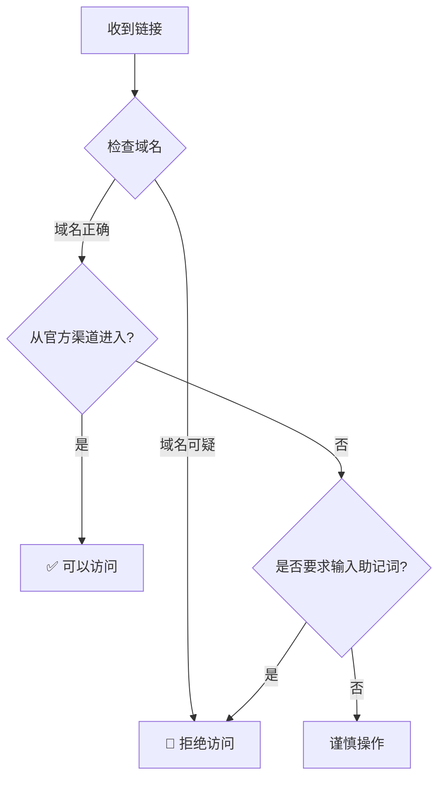
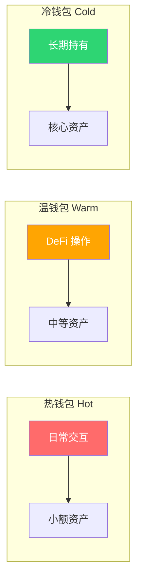

# 3.4 新手最容易踩的安全与资产管理坑

> **学习目标**：完成本节后，你将能够：
> - 识别至少 5 种常见的 Web3 骗局类型
> - 掌握助记词和私钥的安全存储方法
> - 建立日常操作的安全意识和习惯

---

## 核心内容

### 1. Web3 安全的残酷现实

在 Web3 世界，**没有银行帮你追回损失，没有客服帮你重置密码**。

2023 年数据：
- 因钓鱼和骗局损失：超过 **20 亿美元**
- 平均每起钓鱼攻击损失：约 **5 万美元**
- 新用户在前 3 个月最容易受骗

> **记住**：在 Web3，安全意识是你最重要的资产。

### 2. 六大常见骗局类型

#### 2.1 钓鱼网站（Phishing Sites）

**手法**：
- 伪造知名 DApp 网站（如假的 Uniswap、OpenSea）
- 通过搜索引擎广告推广钓鱼链接
- 域名与官方极其相似（如 uniswop.com、opensea.io）

**识别方法**：

| 检查项 | 正确 | 危险 |
|-------|------|------|
| 域名 | uniswap.org | uniswop.org, un1swap.com |
| 来源 | 从官方 Twitter 进入 | 从 DM 链接进入 |
| 证书 | 有 HTTPS 锁 | 无证书或证书警告 |
| 弹窗 | 正常连接钱包流程 | 要求输入助记词 |



> ⚠️ **绝对铁律**：任何要求你输入助记词的网站都是骗局。官方钱包绝对不会要求输入助记词。

#### 2.2 假空投骗局（Fake Airdrop）

**手法**：
- 钱包里突然出现不明 Token
- 声称需要去某网站"领取"
- 实际是诱导授权或签名

**常见形式**：

```
你的钱包收到：
🎁 1,000,000 FREE-TOKEN
📢 去 claim-freetoken.com 领取更多！
```

**正确处理**：
1. **不要交互**：不要转移、不要授权、不要访问链接
2. **隐藏代币**：在钱包中隐藏这些垃圾 Token
3. **不要恐慌**：这些 Token 本身不会盗取你的资产

#### 2.3 社工攻击（Social Engineering）

**手法**：
- 冒充项目方客服或团队成员
- 在 Discord/Telegram 私信你
- 以"帮你解决问题"为由骗取助记词

**常见话术**：

| 骗子说 | 真相 |
|-------|------|
| "我是 MetaMask 客服" | MetaMask 没有客服，更不会私信你 |
| "需要验证你的钱包" | 没有任何验证需要你提供助记词 |
| "同步钱包需要助记词" | 同步只需要导入，不需要给任何人 |
| "恭喜你中奖，请验证领取" | 真正的空投不需要你做任何验证 |

> **Tips**：任何主动联系你的"客服"、"官方"、"团队成员"都要高度警惕。

#### 2.4 恶意授权（Malicious Approval）

**手法**：
- 诱导你对恶意合约进行无限授权
- 一旦授权，立即转走你的资产
- 常配合钓鱼网站使用

**危险信号**：
- 授权金额显示 "Unlimited"
- 合约地址不是你认识的
- 授权的 Token 与操作无关

**防护措施**：
1. 使用精确授权而非无限授权
2. 定期用 Revoke.cash 检查授权
3. 不确定就拒绝

#### 2.5 假客服/假官方（Fake Support）

**活动场所**：
- Discord 私信
- Telegram 群组
- Twitter DM

**识别方法**：
- ✅ 官方不会主动私信你
- ✅ 官方不会索要助记词
- ✅ 官方不会让你转账"验证"

#### 2.6 Rug Pull（跑路项目）

**手法**：
- 新项目承诺高收益
- 吸引大量资金后
- 团队卷款跑路

**防范**：
- 只投入你能承受失去的金额
- 检查项目合约是否开源和审计
- 团队匿名的项目风险更高

### 3. 助记词安全存储最佳实践

#### 3.1 应该做的 ✅

| 方法 | 说明 | 安全等级 |
|-----|------|---------|
| 纸质备份 | 抄在纸上，防水防火保存 | ⭐⭐⭐ |
| 钢板刻录 | 刻在金属板上，防水防火 | ⭐⭐⭐⭐ |
| 多地备份 | 分存在 2-3 个安全地点 | ⭐⭐⭐⭐ |
| 硬件钱包 | 使用 Ledger/Trezor | ⭐⭐⭐⭐⭐ |

#### 3.2 绝对不要做 ❌

| 错误做法 | 风险 |
|---------|------|
| 截图保存 | 图片可能被同步、被盗 |
| 存在云盘 | 云盘被黑 = 助记词泄露 |
| 发给自己的微信/邮箱 | 聊天记录可能被窃取 |
| 存在备忘录 APP | 手机丢失或被入侵 |
| 告诉任何人 | 信任的人也可能泄露 |

```mermaid
flowchart TB
    subgraph 安全存储 ✅
        A[纸质备份] --> B[防水袋]
        B --> C[保险箱/安全地点]
    end

    subgraph 危险存储 ❌
        D[截图] --> E[云端同步]
        E --> F[被黑客获取]
    end

    style A fill:#2ed573,color:#fff
    style B fill:#2ed573,color:#fff
    style C fill:#2ed573,color:#fff
    style D fill:#ff6b6b,color:#fff
    style E fill:#ff6b6b,color:#fff
    style F fill:#ff6b6b,color:#fff
```

### 4. 日常安全操作清单

#### 4.1 每次操作前

- [ ] 确认网站 URL 正确
- [ ] 检查是否从官方渠道进入
- [ ] 阅读钱包弹窗的内容
- [ ] 确认交易金额和接收地址

#### 4.2 每次操作时

- [ ] 不签署看不懂的内容
- [ ] 使用精确授权而非无限授权
- [ ] 大额交易先小额测试

#### 4.3 定期维护

- [ ] 每月检查授权，撤销不需要的
- [ ] 定期更新钱包软件
- [ ] 检查助记词备份是否完好

### 5. 进阶安全措施

#### 5.1 多钱包策略



**分配建议**：
- **热钱包**：用于日常小额操作、空投交互（最多 5%）
- **温钱包**：用于 DeFi、NFT 交易（15-25%）
- **冷钱包**：长期持有的核心资产（70-80%）

#### 5.2 硬件钱包

**什么时候需要**：
- 资产超过 1000 美元
- 长期持有计划
- 追求最高安全等级

**推荐产品**：
- Ledger Nano S Plus / X
- Trezor Model T / Safe 3
- OneKey

#### 5.3 多签钱包（Multi-Sig）

适用于：
- 团队/DAO 资金管理
- 家庭资产共管
- 超大额资产保护

原理：需要多个私钥签名才能执行交易（如 3 人中需要 2 人签名）

---

## 案例/故事

### "帮我同步一下钱包"

2023 年，一名新用户在 Discord 上遇到了问题，钱包无法连接某 DApp。

**经过**：
1. 用户在官方 Discord 发帖求助
2. 几分钟后收到"官方客服"私信
3. "客服"表示可以帮他"同步钱包"
4. 用户被引导到一个"验证网站"
5. 网站要求输入助记词"完成验证"
6. 用户输入后，3 分钟内钱包被清空

**损失**：价值 **8,000 美元** 的 ETH 和 NFT

**教训**：
1. 官方永远不会私信你
2. 没有任何"同步"需要助记词
3. 永远不要在任何网站输入助记词

### 安全账户 vs 不安全账户对比

| 用户 A（被盗） | 用户 B（安全） |
|--------------|--------------|
| 助记词截图存手机 | 助记词刻在钢板上 |
| 只用一个钱包 | 冷热钱包分离 |
| 收到 DM 就回复 | 忽略所有私信 |
| 无限授权各种 DApp | 只做精确授权 |
| 从不检查授权 | 每月清理授权 |

---

## 关键概念速查

| 概念 | 一句话解释 |
|-----|-----------|
| 钓鱼网站 | 伪装成正规网站，骗取用户助记词或授权 |
| 社工攻击 | 通过人际沟通骗取信任和敏感信息 |
| Rug Pull | 项目方卷款跑路 |
| 恶意授权 | 诱导用户授权恶意合约 |
| 冷钱包 | 离线存储私钥的钱包设备 |
| 多签钱包 | 需要多人签名才能执行交易的钱包 |
| Revoke | 撤销之前给予合约的授权 |

---

## 学习资料

### 必读
- [加密货币诈骗类型及防范](https://academy.binance.com/zh/articles/5-common-cryptocurrency-scams-and-how-to-avoid-them) - Binance Academy，全面了解骗局类型（预计阅读 12 分钟）
- [如何安全存储助记词](https://www.ledger.com/zh-hans/academy/basic-basics/2-how-to-own-crypto/how-to-secure-your-recovery-phrase) - Ledger Academy，存储最佳实践（预计阅读 10 分钟）

### 选读（进阶）
- [SlowMist 安全手册](https://github.com/slowmist/Blockchain-dark-forest-selfguard-handbook/blob/main/README_CN.md) - 区块链黑暗森林自救手册
- [Web3 安全入门](https://web3securityguide.com/) - 系统性安全指南
- [Rekt News](https://rekt.news/) - 了解最新安全事件

---

## 学习任务

完成以下任务以检验学习效果：

- [ ] **任务 1**：列出 5 种常见的 Web3 骗局类型，并各写一句如何识别
- [ ] **任务 2**：检查你的助记词存储方式，是否符合安全标准？如果不符合，制定改进计划
- [ ] **任务 3**：如果你已有钱包，使用 Revoke.cash 检查你的授权情况，截图记录

> **提交方式**：将任务输出记录在学习笔记中

---

## 常见问题 FAQ

**Q1: 我已经点了钓鱼链接，但没输入助记词，会有事吗？**

A: 如果只是点击链接、没有签署任何交易或输入助记词，通常不会有事。但建议：
1. 检查是否有可疑授权（用 Revoke.cash）
2. 以后更加小心

**Q2: 我的助记词可能已经泄露了，怎么办？**

A: 立即行动：
1. 创建一个新钱包
2. 尽快将所有资产转移到新钱包
3. 旧钱包作废，不再使用

**Q3: 硬件钱包真的有必要吗？**

A: 看你的资产规模和安全需求。如果：
- 资产 < 500 美元：可以暂时不需要
- 资产 500-5000 美元：建议考虑
- 资产 > 5000 美元：强烈建议

**Q4: 我收到的空投 Token 会盗走我的资产吗？**

A: Token 本身不会。危险的是：
- 去领取空投的钓鱼网站
- 对恶意 Token 合约进行交互
- 正确做法是直接忽略不明 Token

**Q5: 用了 VPN 就安全了吗？**

A: VPN 只保护网络传输，不能防止：
- 钓鱼网站
- 恶意授权
- 助记词泄露

安全主要还是靠个人意识和操作习惯。

---

## 下一步

了解了安全知识后，下一节我们将进行实操 [3.5 在测试网完成你的第一笔交易](./3.5-实操测试网第一笔交易.md)，亲手体验创建钱包、链上转账的全过程。

---

最后更新：2025-01-09
编写：Antony
审核：待审核
