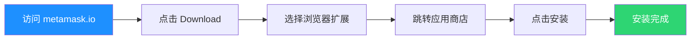
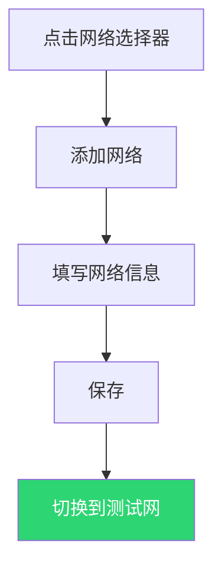
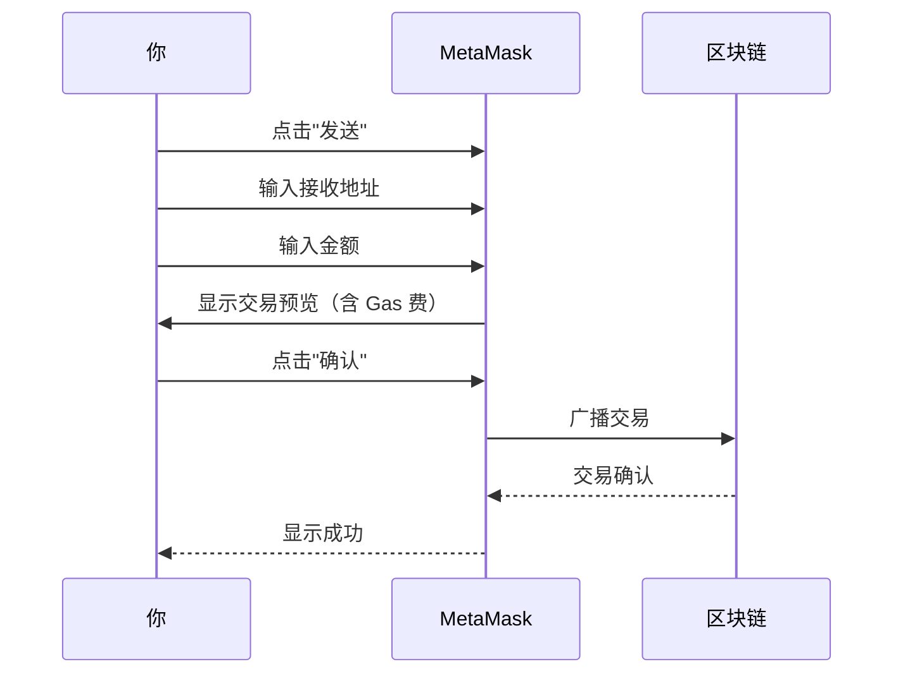

# 3.5 实操：在测试网完成你的第一笔交易

> **学习目标**：完成本节后，你将能够：
> - 独立完成钱包的安装和创建
> - 在测试网上领取测试币并完成转账
> - 使用区块浏览器查看交易记录

---

## 核心内容

### 0. 为什么要用测试网？

测试网（Testnet）是区块链的"练习场"：
- 测试币**没有真实价值**，可以免费领取
- 操作方式与主网**完全一致**
- 即使操作失误也**不会有任何损失**

> **Tips**：在正式使用真金白银之前，务必先在测试网上多练习！

### 1. 第一步：安装 MetaMask 钱包

MetaMask 是最流行的以太坊钱包，支持 Chrome、Firefox、Edge 浏览器。

#### 1.1 下载安装

**官方下载地址**：https://metamask.io/download/

> ⚠️ **警告**：只从官方网站下载！不要从搜索引擎广告或不明链接下载。

**安装步骤**：



1. 打开浏览器，访问 https://metamask.io
2. 点击 "Download" 按钮
3. 选择你的浏览器（推荐 Chrome）
4. 在 Chrome Web Store 点击"添加到 Chrome"
5. 确认安装

#### 1.2 创建新钱包

安装完成后，点击浏览器右上角的 MetaMask 图标：

**步骤详解**：

| 步骤 | 操作 | 说明 |
|-----|------|------|
| 1 | 点击"创建新钱包" | 不是"导入钱包" |
| 2 | 同意使用条款 | 阅读后勾选 |
| 3 | 设置密码 | 用于解锁钱包，至少 8 位 |
| 4 | **备份助记词** | ⚠️ 最重要的一步！ |
| 5 | 确认助记词 | 按顺序选择单词验证 |
| 6 | 完成创建 | 钱包创建成功 |

> ⚠️ **重要**：第 4 步备份助记词时：
> - 用纸笔抄下来，不要截图
> - 确认每个单词拼写正确
> - 确认单词顺序正确
> - 保存在安全的地方

#### 1.3 理解钱包界面

创建完成后，你会看到 MetaMask 主界面：

```
┌─────────────────────────────────────┐
│  Account 1                    ⚙️   │
│  0x71C7...976F    📋               │  ← 你的地址（点击可复制）
├─────────────────────────────────────┤
│                                     │
│         0 ETH                       │  ← 余额（目前为 0）
│         $0.00                       │
│                                     │
├─────────────────────────────────────┤
│  [接收]  [购买]  [发送]  [兑换]     │  ← 操作按钮
├─────────────────────────────────────┤
│  代币    NFT    活动                │  ← 底部标签
└─────────────────────────────────────┘
```

### 2. 第二步：添加测试网络

MetaMask 默认显示以太坊主网，我们需要添加测试网。

#### 2.1 选项 A：添加 Sepolia 测试网（推荐）

Sepolia 是以太坊官方的测试网。

**添加方法**：

1. 点击 MetaMask 左上角的网络选择器
2. 点击"显示测试网络"（如果看不到）
3. 在设置中启用"显示测试网络"
4. 选择 "Sepolia"

或者手动添加：

| 参数 | 值 |
|-----|-----|
| 网络名称 | Sepolia |
| RPC URL | https://sepolia.infura.io/v3/YOUR_KEY 或 https://rpc.sepolia.org |
| 链 ID | 11155111 |
| 货币符号 | SepoliaETH |
| 区块浏览器 | https://sepolia.etherscan.io |

#### 2.2 选项 B：添加 BNB Chain 测试网

**手动添加**：

1. 点击网络选择器 → "添加网络"
2. 填写以下信息：

| 参数 | 值 |
|-----|-----|
| 网络名称 | BNB Chain Testnet |
| RPC URL | https://data-seed-prebsc-1-s1.binance.org:8545 |
| 链 ID | 97 |
| 货币符号 | tBNB |
| 区块浏览器 | https://testnet.bscscan.com |

3. 点击"保存"



### 3. 第三步：领取测试币

测试币通过"水龙头"（Faucet）免费领取。

#### 3.1 Sepolia 测试币水龙头

| 水龙头 | 链接 | 说明 |
|-------|------|------|
| Alchemy Faucet | https://sepoliafaucet.com | 需要 Alchemy 账号 |
| Infura Faucet | https://www.infura.io/faucet/sepolia | 需要 Infura 账号 |
| Google Cloud Faucet | https://cloud.google.com/application/web3/faucet/ethereum/sepolia | 需要 Google 账号 |

**领取步骤**（以 Google Cloud Faucet 为例）：

1. 访问水龙头网站
2. 连接你的钱包或粘贴钱包地址
3. 完成验证（如人机验证）
4. 点击"领取"
5. 等待到账（通常 1-2 分钟）

#### 3.2 BNB Chain 测试币水龙头

| 水龙头 | 链接 |
|-------|------|
| 官方水龙头 | https://testnet.bnbchain.org/faucet-smart |

**领取步骤**：

1. 访问 https://testnet.bnbchain.org/faucet-smart
2. 粘贴你的钱包地址
3. 完成人机验证
4. 点击 "Give me BNB"
5. 等待到账

> **Tips**：如果一个水龙头不工作，尝试另一个。水龙头可能有 24 小时领取限制。

### 4. 第四步：完成一笔转账

现在你有了测试币，让我们完成第一笔链上转账！

#### 4.1 准备工作

你需要：
- ✅ 已领取到测试币（查看余额确认）
- ✅ 一个接收地址（可以是你自己创建的第二个账户）

**创建第二个账户**：
1. 点击 MetaMask 右上角头像
2. 点击"+ 添加账户或硬件钱包"
3. 选择"添加新账户"
4. 复制新账户的地址

#### 4.2 发送交易



**详细步骤**：

1. **点击"发送"按钮**

2. **输入接收地址**
   - 粘贴你第二个账户的地址
   - 或使用任意测试网地址

3. **输入金额**
   - 例如：0.01 SepoliaETH
   - 不要发送全部余额（需要留一些付 Gas）

4. **查看交易详情**
   ```
   ┌─────────────────────────────────┐
   │  发送 0.01 SepoliaETH          │
   │  到: 0x1234...5678             │
   ├─────────────────────────────────┤
   │  预估 Gas 费: 0.0001 ETH       │
   │  总计: 0.0101 ETH              │
   ├─────────────────────────────────┤
   │     [拒绝]      [确认]         │
   └─────────────────────────────────┘
   ```

5. **点击"确认"**

6. **等待交易完成**
   - 状态会从"待处理"变为"已确认"
   - 通常需要 15-30 秒

### 5. 第五步：在区块浏览器查看交易

#### 5.1 什么是区块浏览器？

区块浏览器是查看区块链数据的网站，就像区块链的"搜索引擎"。

| 网络 | 区块浏览器 |
|-----|-----------|
| 以太坊主网 | https://etherscan.io |
| Sepolia 测试网 | https://sepolia.etherscan.io |
| BNB Chain 测试网 | https://testnet.bscscan.com |

#### 5.2 查看你的交易

**方法一：从 MetaMask 进入**
1. 点击刚完成的交易
2. 点击"在区块浏览器中查看"

**方法二：直接搜索**
1. 打开区块浏览器
2. 在搜索框粘贴你的钱包地址或交易哈希
3. 查看详情

#### 5.3 理解交易详情

区块浏览器会显示：

```
交易详情
━━━━━━━━━━━━━━━━━━━━━━━━━━━━━━━━━━━━━
交易哈希: 0xabc...123
状态: ✅ 成功
区块: 4,567,890
时间戳: 2025-01-09 10:30:00

发送方: 0x71C7...976F (你的地址)
接收方: 0x1234...5678

金额: 0.01 ETH
Gas 费: 0.0001 ETH
━━━━━━━━━━━━━━━━━━━━━━━━━━━━━━━━━━━━━
```

**关键字段解释**：

| 字段 | 含义 |
|-----|------|
| 交易哈希（Tx Hash） | 这笔交易的唯一 ID，可用于查询和证明 |
| 状态 | 成功/失败/待处理 |
| 区块 | 交易被打包进的区块编号 |
| 发送方（From） | 发起交易的地址 |
| 接收方（To） | 接收资产的地址 |
| Gas 费 | 实际支付的手续费 |

### 6. 恭喜你！

如果你成功完成了以上步骤，你已经：

✅ 创建了自己的 Web3 钱包
✅ 安全备份了助记词
✅ 添加了测试网络
✅ 领取了测试币
✅ 完成了链上转账
✅ 学会使用区块浏览器

**这意味着**：你已经具备了在 Web3 世界独立操作的基础能力！

---

## 操作检查清单

在进入下一阶段之前，确保你已完成：

- [ ] MetaMask 已安装并创建钱包
- [ ] 助记词已安全备份（纸质，非截图）
- [ ] 已添加测试网（Sepolia 或 BNB Chain Testnet）
- [ ] 已领取测试币
- [ ] 已完成至少一笔测试转账
- [ ] 已在区块浏览器查看交易记录
- [ ] 已复制并保存交易哈希

---

## 关键概念速查

| 概念 | 一句话解释 |
|-----|-----------|
| 测试网 | 用于练习的区块链，测试币无价值 |
| 主网 | 真实的区块链，代币有真实价值 |
| 水龙头（Faucet） | 免费领取测试币的网站 |
| Gas 费 | 执行交易需要支付的手续费 |
| 交易哈希（Tx Hash） | 每笔交易的唯一标识符 |
| 区块浏览器 | 查看区块链数据的网站 |
| RPC | 钱包与区块链通信的接口 |

---

## 学习资料

### 必读
- [MetaMask 入门指南](https://support.metamask.io/zh-cn/getting-started/getting-started-with-metamask/) - 官方中文教程（预计阅读 15 分钟）
- [如何使用区块浏览器](https://academy.binance.com/zh/articles/how-to-use-a-blockchain-explorer) - Binance Academy（预计阅读 10 分钟）

### 选读（进阶）
- [什么是 Gas？](https://ethereum.org/zh/developers/docs/gas/) - 以太坊官方文档
- [OKX Wallet 使用教程](https://www.okx.com/cn/learn/okx-web3-wallet-guide) - 另一款流行钱包

---

## 学习任务

完成以下任务以检验学习效果：

- [ ] **任务 1**：完成测试网转账，截图交易哈希页面
- [ ] **任务 2**：用一句话总结"钱包 = ……"，并解释它和支付宝最大的不同
- [ ] **任务 3**：在区块浏览器上查看你的地址，截图显示余额和交易记录

> **提交方式**：将截图和文字输出记录在学习笔记中

---

## 常见问题 FAQ

**Q1: 水龙头领不到测试币怎么办？**

A: 可能的原因和解决方案：
- 24 小时领取限制：换一个水龙头或等待
- 网络拥堵：稍后再试
- 地址格式错误：确认复制的是正确地址
- 需要账号：注册对应平台账号

**Q2: 交易一直"待处理"怎么办？**

A: 测试网可能拥堵，通常等待几分钟就会确认。如果超过 10 分钟：
- 检查网络状态
- 可以尝试"加速"交易（提高 Gas）

**Q3: 测试币可以换成真钱吗？**

A: 不能。测试币只是用于练习，没有任何真实价值。

**Q4: 测试网操作和主网有什么区别？**

A: 操作方式完全一致，唯一区别是：
- 测试网：代币无价值，可随意练习
- 主网：代币有真实价值，需要谨慎操作

**Q5: 我可以用测试网钱包在主网上使用吗？**

A: 可以。同一个钱包（同一个助记词）可以在任何网络上使用。切换网络只是切换显示的资产，钱包本身不变。

---


最后更新：2025-01-09
编写：Antony
审核：待审核
