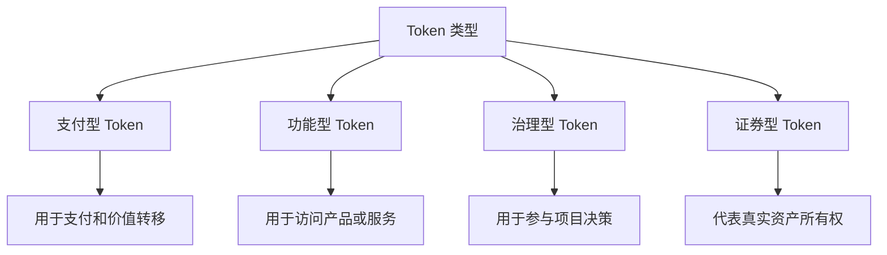

# 4.1 Token 的基本功能与作用

> **学习目标**：完成本节后，你将能够：
> - 用自己的话解释什么是 Token，以及它与「加密货币」的区别
> - 识别 Token 的 4 种主要类型及其典型代表
> - 理解 Token 的核心功能和应用场景

---

## 核心内容

### 1. Token 是什么

**Token（代币）** 是区块链上的数字资产凭证，代表某种价值、权利或用途。

用一个简单的类比：如果把区块链比作一个游乐园，那么：
- **原生币**（如 ETH）就像游乐园的「通用货币」，用来支付所有费用
- **Token** 就像游乐园里各种设施发行的「专属票券」，有的能玩过山车，有的能换礼品

**Token 的本质**：
- Token 是智能合约中的一条记录，记录着「谁拥有多少」
- Token 可以在链上自由转移和交易
- 任何人都可以通过部署智能合约来发行 Token

> **Tips**：你可能听过「Coin」和「Token」这两个词混用。严格来说：
> - **Coin**：区块链的原生资产（如 BTC、ETH、SOL）
> - **Token**：建立在现有区块链上的资产（如 USDT、UNI、SHIB）
>
> 但在日常交流中，这两个词经常互换使用，不必过于纠结。

### 2. Token 的主要类型

Token 可以根据用途分为 4 大类：

#### 2.1 支付型 Token（Payment Token）

**用途**：主要作为支付手段和价值存储

**典型代表**：
- **USDT / USDC**：稳定币，用于加密世界的「美元」
- **BTC**（虽然严格说是 Coin）：数字黄金，价值存储

**特点**：强调「可以用来买东西」或「可以保值」

#### 2.2 功能型 Token（Utility Token）

**用途**：用于访问某个平台的产品或服务

**典型代表**：
- **BNB**：用于支付币安交易所手续费，享受折扣
- **FIL**：用于购买 Filecoin 网络的存储空间
- **LINK**：用于支付 Chainlink 预言机服务费用

**特点**：「持有它才能使用某个服务」，类似于会员卡或服务券

#### 2.3 治理型 Token（Governance Token）

**用途**：用于参与项目的治理决策，如投票决定协议参数

**典型代表**：
- **UNI**：Uniswap 治理代币，持有者可以投票决定协议升级
- **AAVE**：Aave 治理代币，决定借贷参数
- **MKR**：MakerDAO 治理代币，决定 DAI 的稳定机制

**特点**：「持有它就有发言权」，类似于股东投票权

#### 2.4 证券型 Token（Security Token）

**用途**：代表真实资产（如股权、房产、债券）的所有权

**典型代表**：
- 部分 RWA（Real World Asset）项目发行的代币
- 代币化的公司股权

**特点**：受到证券法监管，合规要求高，普通人较少接触

> **Tips**：很多 Token 同时具备多种属性。例如 ETH 既是支付手段（Gas 费），也被用于质押治理。分类只是帮助理解，不必死板套用。

### 3. Token 的核心功能

无论是哪种类型，Token 通常具备以下核心功能：

| 功能 | 说明 | 例子 |
|-----|------|------|
| **价值存储** | 持有 Token 作为资产保值 | 持有 BTC 对抗通胀 |
| **支付媒介** | 用 Token 进行交易支付 | 用 USDT 购买其他加密资产 |
| **权益凭证** | Token 代表某种权利 | 持有 UNI 拥有投票权 |
| **激励工具** | 用 Token 奖励用户行为 | 提供流动性获得 Token 奖励 |

### 4. 为什么 Token 很重要

Token 的真正价值在于其**可编程性**：

1. **无需许可即可发行**：任何人都可以创建 Token，无需银行或政府批准
2. **全球即时流通**：Token 可以 24/7 在全球范围内转移
3. **透明可追溯**：所有 Token 的流转都记录在链上，公开透明
4. **可组合性**：不同 Token 可以像乐高一样组合，创造新的金融产品

这就是为什么 Web3 能构建出传统金融难以实现的创新应用。

### 5. Token 的技术实现（简述）

在以太坊上，大多数 Token 遵循 **ERC-20** 标准：

- ERC-20 定义了 Token 的基本功能：转账、查询余额、授权等
- 遵循同一标准的 Token 可以被所有钱包和交易所兼容
- 其他常见标准：ERC-721（NFT）、ERC-1155（多类型 Token）

> **Tips**：你不需要理解技术细节，只需知道：正是因为有了统一标准，Token 才能在整个生态系统中自由流通。

---

## 案例：UNI Token 的多重角色

Uniswap 是最大的去中心化交易所，其 Token **UNI** 是一个很好的例子：

**2020 年 9 月**，Uniswap 向所有曾经使用过该平台的用户空投了 400 枚 UNI。当时价值约 1200 美元，后来最高涨到约 16000 美元。

**UNI 的功能**：
1. **治理权**：持有 UNI 可以投票决定 Uniswap 的协议升级
2. **价值捕获**：虽然目前 UNI 不直接分红，但持有者期待未来能分享协议收入
3. **身份象征**：持有 UNI 表明你是 Uniswap 社区的一员

这个案例说明：一个 Token 可以同时承载多种功能和意义。

---

## 关键概念速查

| 概念 | 一句话解释 |
|-----|-----------|
| Token（代币） | 区块链上的数字资产凭证，代表价值、权利或用途 |
| Coin vs Token | Coin 是区块链原生资产，Token 是基于现有链发行的资产 |
| 功能型 Token | 用于访问平台服务的代币，如会员卡 |
| 治理型 Token | 用于参与项目决策投票的代币 |
| ERC-20 | 以太坊上最常用的 Token 标准 |
| 可编程性 | Token 可以通过智能合约定义复杂规则 |

---

## 学习资料

### 必读
- [What Are Crypto Tokens?](https://academy.binance.com/en/articles/what-are-tokens) - Binance Academy - Token 入门必读，覆盖定义和分类（预计阅读 10 分钟）

### 选读（进阶）
- [ERC-20 Token Standard](https://ethereum.org/en/developers/docs/standards/tokens/erc-20/) - Ethereum.org - 了解 Token 技术标准（预计阅读 15 分钟）
- [Token vs Coin: What's the Difference?](https://www.ledger.com/academy/crypto/what-is-the-difference-between-coins-and-tokens) - Ledger Academy - 深入理解两者区别（预计阅读 8 分钟）

---

## 学习任务

完成以下任务以检验学习效果：

- [ ] **任务 1**：用一句话向朋友解释「什么是 Token」
- [ ] **任务 2**：列出你知道的 3 个 Token，并判断它们分别属于哪种类型（支付型/功能型/治理型/证券型）

---

## 常见问题 FAQ

**Q1: Token 和积分有什么区别？**

A: 最大的区别是**所有权和流通性**。积分由商家控制，通常不能转让给他人；Token 存储在你自己的钱包里，可以自由转让和交易。这个区别我们会在 4.2 节详细讨论。

**Q2: 任何人都可以发行 Token 吗？**

A: 是的，技术上任何人都可以部署智能合约发行 Token。这既是 Web3 的创新之处，也是风险所在——因为发行 Token 几乎没有门槛，所以「空气币」泛滥。

**Q3: 持有 Token 就等于持有公司股份吗？**

A: 不是。大多数 Token 不代表公司股权，不受证券法保护，也没有分红权。治理型 Token 虽然有投票权，但与股票的权利完全不同。这个区别非常重要，我们会在 4.2 节详细对比。

**Q4: 为什么要了解 Token 类型？**

A: 不同类型的 Token 有不同的价值逻辑和风险特征。理解类型有助于你判断一个 Token 的价值来源，避免把功能型 Token 当成「股票」来投资。

---

*最后更新：2025-01-09*
*编写：Antony*
*审核：待审核*
