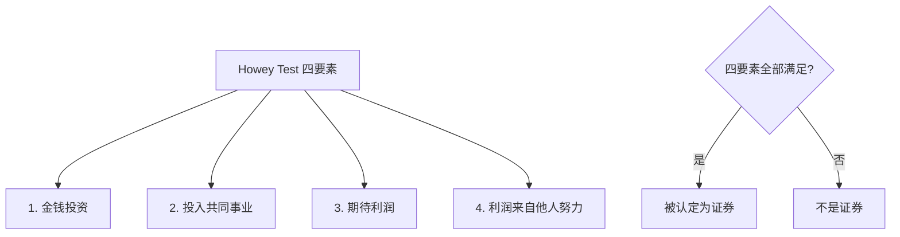

# 4.2 Token ≠ 股票 ≠ 积分：三者的本质区别

> **学习目标**：完成本节后，你将能够：
> - 清晰区分 Token、股票、积分的核心差异
> - 理解为什么 Token 的法律保护远不如股票
> - 认识到 Token 投资的真实风险

---

## 核心内容

### 1. 为什么要区分这三者

很多人第一次接触 Token 时，会下意识地用熟悉的概念来理解：

- 「Token 就像公司股票，持有就能分享收益」❌
- 「Token 就像会员积分，用来兑换服务」❌（部分正确）

这些类比虽然有助于入门理解，但如果不清楚**本质区别**，可能会导致严重误判：

- 把 Token 当股票投资，却发现项目方跑路后无处维权
- 以为持有 Token 就有分红权，实际上大多数 Token 没有

让我们逐一拆解。

### 2. 三者的直观对比

| 维度 | Token | 股票 | 积分 |
|-----|-------|------|------|
| **发行方** | 项目团队/协议 | 注册公司 | 商家 |
| **法律地位** | 多数无明确定位 | 受证券法保护 | 商家自定规则 |
| **所有权** | 不代表公司股权 | 代表公司部分所有权 | 无所有权含义 |
| **分红权** | 通常没有 | 有权分享利润 | 无 |
| **投票权** | 部分有（治理型） | 股东有投票权 | 无 |
| **可转让** | 可自由转让 | 可交易（有限制） | 通常不可转让 |
| **价值来源** | 市场供需/共识 | 公司盈利和资产 | 商家承诺 |
| **归零风险** | 高 | 中（有破产清算） | 商家倒闭失效 |
| **维权难度** | 极高 | 有法律途径 | 几乎无法维权 |

### 3. Token vs 股票：最容易混淆的误区

#### 3.1 法律地位天差地别

**股票**：
- 受到严格的证券法监管
- 公司必须定期披露财务信息
- 投资者权益受法律保护
- 公司破产时，股东有权参与资产清算

**Token**：
- 大多数国家尚无明确法律定位
- 项目方无披露义务（自愿披露）
- 投资者权益缺乏法律保护
- 项目失败后，通常血本无归

> **真实案例**：2022 年 FTX 交易所暴雷，用户资产被挪用。虽然 FTX 是中心化交易所，但这说明了加密领域缺乏传统金融那样的投资者保护机制。

#### 3.2 你买的不是「公司股份」

持有某个项目的 Token，**不代表**你拥有该项目的股权：

- 你没有权利要求分红
- 你没有权利审查公司账目
- 你没有权利参与公司重大决策（除非是治理型 Token）
- 项目方赚再多钱，也没有义务分给 Token 持有者

**类比**：这就像你买了一张游乐园的游戏币，游乐园生意再好，也不会给你分红。

#### 3.3 Howey Test：什么情况下 Token 会被认定为证券

美国 SEC 使用 **Howey Test** 来判断某资产是否属于「证券」：

如果一个 Token 被认定为证券，项目方可能面临法律风险。这就是为什么很多项目强调其 Token 是「功能型」而非「投资品」。

> **案例**：SEC 起诉 Ripple（XRP），指控其未经注册发行证券。这场官司持续多年，说明 Token 的法律定性仍存在巨大争议。

### 4. Token vs 积分：看似相似，实则不同

你可能觉得 Token 更像积分——毕竟都是「用来换东西的」。但两者有关键区别：

#### 4.1 所有权归属

**积分**：
- 存储在商家的服务器上
- 商家可以随时修改规则、清零积分
- 你对积分没有真正的「所有权」

**Token**：
- 存储在你自己的钱包里（链上）
- 项目方无法冻结或没收你的 Token（除非合约有特殊设计）
- 你对 Token 有完整的控制权

#### 4.2 可转让性

**积分**：
- 通常不能转让给他人
- 绑定你的账户

**Token**：
- 可以自由转让给任何地址
- 可以在交易所买卖

#### 4.3 价值来源

**积分**：
- 价值由商家承诺（1 积分 = 1 元抵扣）
- 商家可以单方面改变兑换规则

**Token**：
- 价值由市场供需决定
- 价格可能大幅波动

### 5. 为什么这个区分如此重要

理解这些区别，能帮你避免两类常见错误：

#### 错误 1：把 Token 当股票，高估其价值

「这个项目很有前景，买它的 Token 就等于投资这家公司」

**现实**：Token 价格可能与项目本身的成功完全脱钩。项目方可能：
- 不断增发 Token 稀释你的持有
- 团队大量套现离场
- 项目成功但 Token 设计有缺陷，导致价值无法捕获

#### 错误 2：低估归零风险

「Token 跌了就拿着，总会涨回来的」

**现实**：
- 股票背后有公司资产，即使股价归零，清算时可能还能拿回一点
- Token 背后通常没有任何「硬资产」，归零就是真的归零
- 历史上大多数 Token 最终归零（我们会在 4.5 节详细讨论）

---

## 案例：同一家公司的股票和 Token

假设有一家 Web3 公司同时发行了：
- **公司股票**（给传统投资人）
- **平台 Token**（给用户使用）

| 场景 | 股票持有者 | Token 持有者 |
|-----|-----------|-------------|
| 公司盈利 | 可能获得分红 | 无直接收益 |
| 公司上市 | 股票增值可套现 | Token 可能涨也可能不涨 |
| 公司倒闭 | 参与资产清算 | Token 归零，无任何赔偿 |
| 公司决策 | 股东投票权 | 可能有治理投票权 |

这个对比清楚地说明：**Token 持有者的权益远不如股东**。

---

## 关键概念速查

| 概念 | 一句话解释 |
|-----|-----------|
| 证券（Security） | 受法律严格监管的投资品，如股票、债券 |
| Howey Test | 美国判断某资产是否为证券的四要素测试 |
| 法律保护 | Token 持有者几乎没有法律保护，与股东权益天差地别 |
| 归零风险 | Token 归零后通常无法追回任何价值 |
| 可转让性 | Token 与积分的核心区别之一 |
| 价值捕获 | 项目成功不一定等于 Token 增值 |

---

## 学习资料

### 必读
- [Security Tokens vs Utility Tokens](https://academy.binance.com/en/articles/security-tokens-vs-utility-tokens-what-s-the-difference) - Binance Academy - 两类 Token 的区别（预计阅读 10 分钟）

### 选读（进阶）
- [SEC Framework for Digital Assets](https://www.sec.gov/corpfin/framework-investment-contract-analysis-digital-assets) - SEC - Howey Test 官方解读（预计阅读 20 分钟）
- [Are Cryptocurrencies Securities?](https://www.coinbase.com/learn/crypto-basics/what-is-a-security) - Coinbase Learn - 证券认定入门（预计阅读 8 分钟）

---

## 学习任务

完成以下任务以检验学习效果：

- [ ] **任务 1**：用一句话解释「为什么持有 Token 不等于持有公司股份」
- [ ] **任务 2**：列出 Token 与积分的 3 个核心区别

---

## 常见问题 FAQ

**Q1: 治理型 Token 有投票权，不就像股票了吗？**

A: 表面上类似，但本质不同。股东投票权是法律赋予的权利，公司必须遵守；Token 投票权只是协议设计，项目方可以选择不执行投票结果（虽然这会损害信誉）。而且，大多数治理投票只涉及协议参数，不涉及公司层面的决策。

**Q2: 如果 Token 被认定为证券会怎样？**

A: 项目方可能面临 SEC 的法律诉讼，被要求退还投资者资金、缴纳罚款。对于持有者来说，Token 可能被交易所下架，流动性大幅下降。这就是为什么很多项目对美国用户设限。

**Q3: 有没有 Token 是有分红的？**

A: 有少数 Token 设计了「收益分享」机制（如将协议收入分配给 Token 持有者），但这与股票分红有本质区别：
- 不是法定义务，项目方可以随时修改规则
- 可能涉及证券法问题
- 「真实收益」和「Token 排放」需要区分（4.4 节会详细讲）

**Q4: 既然 Token 风险这么高，为什么还有人买？**

A: 高风险伴随高潜在回报。早期投资者确实可能获得巨大收益。但你需要清楚：这是风险投资，而非稳健理财。理解风险后再做决定，不要被「暴富故事」迷惑。

---

*最后更新：2025-01-09*
*编写：Antony*
*审核：待审核*
