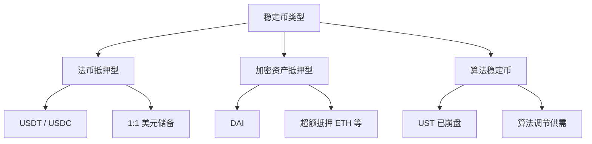
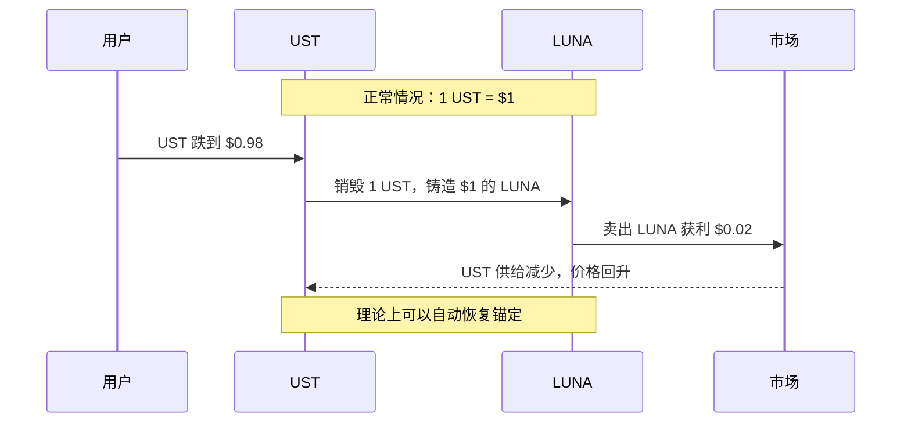
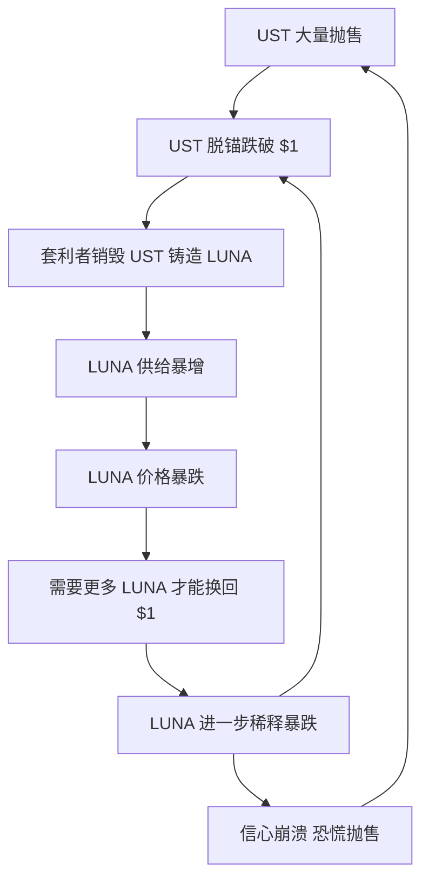

# 4.3 稳定币专题

> **学习目标**：完成本节后，你将能够：
> - 解释稳定币存在的意义和三种主要类型
> - 完成 USDT / USDC / DAI 的对比表，理解各自的机制和风险
> - 通过 UST/Luna 案例，理解算法稳定币的风险

---

## 核心内容

### 1. 什么是稳定币，为什么需要它

**稳定币（Stablecoin）** 是一种价格锚定法定货币（通常是美元）的加密货币，目标是保持 1:1 的汇率。

#### 为什么需要稳定币？

加密货币最大的问题是**波动性太大**：

- BTC 一天涨跌 10% 很常见
- 如果用 ETH 买咖啡，早上能买 2 杯，晚上可能只能买 1 杯

稳定币解决了这个问题，让你可以：

1. **避险**：行情不好时，把资产换成稳定币保值
2. **交易媒介**：用稳定币作为加密世界的「美元」
3. **跨境转账**：24/7 即时到账，手续费低
4. **DeFi 基础**：大多数 DeFi 协议以稳定币计价

> **Tips**：稳定币是普通人最常接触的加密资产。很多人的第一步就是用法币购买 USDT，然后用 USDT 交易其他加密货币。

### 2. 稳定币的三种类型

#### 2.1 法币抵押型（Fiat-Collateralized）

**机制**：发行方持有等额的美元或等价物作为储备，每发行 1 个稳定币，银行账户里就有 1 美元。

**代表**：USDT、USDC

**优点**：
- 机制简单易懂
- 价格相对稳定

**风险**：
- 中心化：依赖发行方的信誉
- 储备透明度：你怎么确定他们真的有那么多美元？
- 监管风险：可能被冻结或封禁

#### 2.2 加密资产抵押型（Crypto-Collateralized）

**机制**：用户存入加密资产（如 ETH）作为抵押品，借出稳定币。由于加密资产价格波动大，通常需要**超额抵押**（如存入 150 美元的 ETH，只能借出 100 DAI）。

**代表**：DAI（由 MakerDAO 发行）

**优点**：
- 去中心化：没有单一控制方
- 透明：所有抵押品都在链上可查

**风险**：
- 抵押品价格暴跌可能触发清算
- 机制复杂，新手难理解
- 资本效率低（需要超额抵押）

#### 2.3 算法稳定币（Algorithmic）

**机制**：不依赖任何抵押品，通过算法自动调节供需来维持价格稳定。

**代表**：UST（已崩盘）、FRAX（部分算法）

**优点**：
- 理论上资本效率最高
- 完全去中心化

**风险**：
- 在极端行情下容易脱锚
- 可能陷入「死亡螺旋」
- **目前没有成功的纯算法稳定币**

### 3. USDT / USDC / DAI 对比表

这是本节的**核心内容**，也是课程学习任务要求的产出：

| 维度 | USDT | USDC | DAI |
|-----|------|------|-----|
| **发行方** | Tether Limited（注册于英属维京群岛） | Circle（美国公司） | MakerDAO（去中心化协议） |
| **抵押机制** | 法币抵押（美元及等价物） | 法币抵押（美元及短期国债） | 加密资产超额抵押（ETH、USDC 等） |
| **储备透明度** | 季度证明（非完整审计） | 月度第三方审计 | 完全链上透明 |
| **市值（约）** | $95B（最大） | $25B | $5B |
| **去中心化程度** | 完全中心化 | 完全中心化 | 高度去中心化 |
| **可冻结** | 是（有黑名单功能） | 是（有黑名单功能） | 否（协议层面无法冻结） |
| **核心风险** | 储备构成不透明、监管风险 | 银行风险（2023 硅谷银行事件）、监管合规 | 抵押品波动、清算风险、智能合约风险 |
| **适用场景** | 交易所交易、OTC | 合规需求高的场景、DeFi | DeFi、追求去中心化的用户 |

> **Tips**：没有「最好」的稳定币，只有「最适合」的。如果你重视合规和审计，选 USDC；如果你重视去中心化，选 DAI；如果你需要最大的流动性，USDT 仍是首选。

### 4. 稳定币的风险

#### 4.1 脱锚风险

稳定币可能偏离 1 美元的锚定价格：

**USDT 历史脱锚**：
- 2018 年 10 月：跌至 $0.85（市场恐慌 Tether 储备不足）

**USDC 历史脱锚**：
- 2023 年 3 月：跌至 $0.87（硅谷银行倒闭，Circle 有 33 亿美元存款在该银行）

**DAI 历史脱锚**：
- 2020 年 3 月「黑色星期四」：ETH 暴跌导致大规模清算

#### 4.2 中心化风险

USDT 和 USDC 发行方可以：
- 冻结特定地址的资产
- 配合执法机构黑名单

这与「加密货币的去中心化精神」存在矛盾。

#### 4.3 监管风险

各国对稳定币的监管态度不同：
- 美国正在推进稳定币立法
- 欧盟 MiCA 法规对稳定币有严格要求
- 部分国家可能直接禁止

### 5. 案例：UST/Luna 崩盘 —— 算法稳定币的警示

2022 年 5 月，曾是第三大稳定币的 **UST** 在几天内归零，连带 **LUNA** 从 $80+ 跌到不足 $0.0001。这是加密史上最大的崩盘事件之一。

#### 5.1 UST 的机制

UST 是 Terra 区块链的算法稳定币，其锚定机制依赖与 LUNA 的互相转换：

#### 5.2 为什么会崩盘

**导火索**：2022 年 5 月 7 日，大量 UST 被抛售，价格开始脱锚。

**死亡螺旋**：

**关键问题**：
1. **Anchor Protocol** 提供约 20% 的 UST 存款年化收益，吸引了大量投机资金
2. 收益来源不可持续，依赖项目方补贴
3. 当恐慌来临，没有「硬底」支撑

#### 5.3 损失有多惨重

- UST 市值从 ~$18B 归零
- LUNA 市值从 ~$40B 归零
- 无数投资者血本无归
- 创始人 Do Kwon 被多国通缉

#### 5.4 我们能学到什么

1. **「稳定」不等于「无风险」**：算法稳定币在极端情况下可能完全失效
2. **高收益 = 高风险**：20% 的「稳定」收益本身就是巨大的红旗
3. **理解机制很重要**：如果你不理解收益从哪里来，你可能就是那个「收益来源」
4. **分散风险**：不要把所有资金放在单一稳定币

> **注意**：UST 的失败不代表所有算法稳定币都不行，但确实证明了纯算法机制的脆弱性。目前市场主流仍是法币抵押型和加密资产抵押型。

---

## 关键概念速查

| 概念 | 一句话解释 |
|-----|-----------|
| 稳定币 | 价格锚定法定货币（如美元）的加密货币 |
| 法币抵押型 | 用等额美元储备支撑的稳定币（如 USDT、USDC） |
| 加密资产抵押型 | 用超额加密资产抵押发行的稳定币（如 DAI） |
| 算法稳定币 | 通过算法调节供需维持锚定的稳定币 |
| 脱锚 | 稳定币价格偏离 1 美元的锚定价格 |
| 死亡螺旋 | 算法稳定币崩盘时的恶性循环 |
| 超额抵押 | 存入超过借出价值的抵押品（如存 $150 借 $100） |

---

## 学习资料

### 必读
- [What Are Stablecoins?](https://academy.binance.com/en/articles/what-are-stablecoins) - Binance Academy - 稳定币入门必读（预计阅读 15 分钟）
- [A Timeline of Terra's Collapse](https://www.theblock.co/post/147372/a-timeline-of-terras-collapse) - The Block - UST 崩盘完整时间线（预计阅读 10 分钟）

### 选读（进阶）
- [Circle Transparency](https://www.circle.com/en/transparency) - Circle 官网 - USDC 储备审计报告
- [MakerDAO Documentation](https://docs.makerdao.com/) - MakerDAO - DAI 机制详解
- [DefiLlama Stablecoins](https://defillama.com/stablecoins) - 稳定币实时市值和数据

---

## 学习任务

完成以下任务以检验学习效果：

- [ ] **任务 1**（核心任务）：完成 USDT / USDC / DAI 对比表，包含以下维度：发行方、抵押机制、核心风险（参考本节第 3 部分）
- [ ] **任务 2**：用一句话解释 UST 的「死亡螺旋」是如何发生的

---

## 常见问题 FAQ

**Q1: USDT 安全吗？会不会像 UST 一样崩盘？**

A: USDT 是法币抵押型，机制与 UST 完全不同。只要 Tether 公司确实持有足够的美元储备，USDT 就不会像 UST 那样「死亡螺旋」。但 USDT 有其他风险：储备透明度存疑、可能被监管打击。建议不要把所有资金放在单一稳定币。

**Q2: 哪个稳定币最安全？**

A: 没有绝对安全的稳定币。
- 如果你重视**合规和审计**：USDC
- 如果你重视**去中心化**：DAI
- 如果你需要**最大流动性**：USDT

最佳策略是**分散持有**。

**Q3: 为什么 DAI 需要「超额抵押」？**

A: 因为加密资产价格波动大。如果只存 $100 ETH 借 $100 DAI，一旦 ETH 跌 10%，就会资不抵债。超额抵押（如 150%）提供了安全垫，确保即使抵押品价格下跌，DAI 仍有足够支撑。

**Q4: 2023 年 USDC 脱锚是怎么回事？**

A: 2023 年 3 月，硅谷银行倒闭，Circle 有约 33 亿美元存款在该银行。市场担心 USDC 储备不足，导致恐慌抛售，USDC 一度跌至 $0.87。后来美国政府介入保障存款，USDC 恢复锚定。这说明：即使是法币抵押型稳定币，也有「银行风险」。

**Q5: 算法稳定币还有未来吗？**

A: 纯算法稳定币目前没有成功案例。但部分「混合型」方案（如 FRAX 部分抵押 + 部分算法）仍在探索。关键问题是：如何在极端行情下保持信心？目前没有完美答案。

---

*最后更新：2025-01-09*
*编写：AI Assistant*
*审核：待审核*
