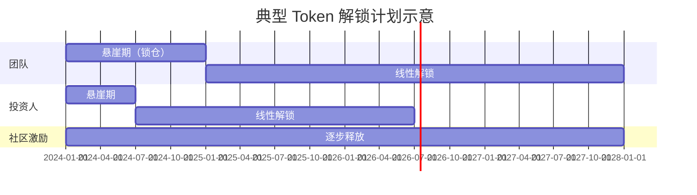
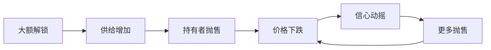
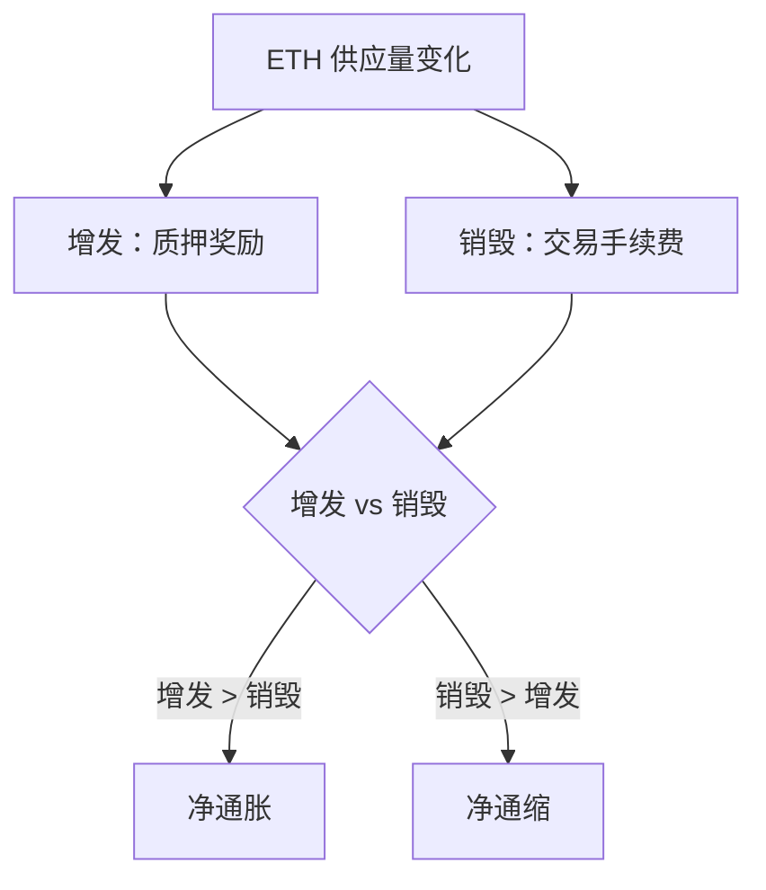

# 4.4 通胀、解锁与激励的基础理解

> **学习目标**：完成本节后，你将能够：
> - 区分「总供应量」和「流通量」，理解为什么这很重要
> - 解释什么是解锁计划（Vesting），以及大额解锁可能带来的影响
> - 区分「真实收益」和「Token 排放」，避免被高 APY 迷惑

---

## 核心内容

### 1. Token 供应量基础

在评估一个 Token 时，首先要理解它的**供应量**设计。

#### 1.1 关键概念

| 概念 | 定义 | 例子 |
|-----|------|------|
| **总供应量（Total Supply）** | Token 的最大发行量上限 | BTC: 2100 万枚，永不增发 |
| **流通量（Circulating Supply）** | 当前市场上可自由交易的数量 | BTC: 约 1950 万枚（部分仍在挖矿中） |
| **锁仓量** | 被锁定暂时不能交易的数量 | 团队锁仓、投资人锁仓、质押锁仓 |

**关系**：流通量 + 锁仓量 ≤ 总供应量

#### 1.2 为什么流通量很重要

**市值的两种计算方式**：

- **市值（Market Cap）** = 价格 × 流通量
- **完全稀释市值（FDV, Fully Diluted Valuation）** = 价格 × 总供应量

**案例**：假设某 Token：
- 价格：$10
- 流通量：1000 万枚
- 总供应量：1 亿枚

那么：
- 市值 = $10 × 1000 万 = **1 亿美元**
- FDV = $10 × 1 亿 = **10 亿美元**

> **警惕**：如果一个项目市值看起来「很低」，但 FDV 很高，说明还有大量 Token 未流通。未来解锁可能带来巨大抛压。

### 2. 解锁计划（Vesting）

#### 2.1 什么是解锁

**解锁（Vesting）** 是指 Token 分批释放给持有者的机制。项目方通常会对以下人群设置锁仓：

- **团队成员**：防止项目方拿钱就跑
- **早期投资人**：避免上线后立即砸盘
- **顾问**：绑定长期利益
- **生态激励**：按计划释放奖励

#### 2.2 典型的解锁结构

**常见术语**：

| 术语 | 含义 |
|-----|------|
| **悬崖期（Cliff）** | 完全锁仓阶段，这期间一枚 Token 都不能动 |
| **线性释放（Linear Vesting）** | 悬崖期后，每月/每周按比例释放 |
| **TGE（Token Generation Event）** | Token 正式发行的时刻 |
| **TGE 解锁比例** | 发行时立即释放的比例（如 10% TGE 解锁） |

#### 2.3 如何查看项目的解锁计划

推荐工具：
- **[Token Unlocks](https://token.unlocks.app/)**：最全面的解锁日历
- **[CoinGecko Token Unlocks](https://www.coingecko.com/en/token-unlocks)**：主流项目解锁数据
- **项目官方文档**：Tokenomics 页面通常会披露

### 3. 大额解锁的影响

#### 3.1 为什么解锁会影响价格

经济学 101：**供给增加 + 需求不变 = 价格下跌**

当大量 Token 解锁进入市场：
- 持有者可能选择卖出套现
- 市场预期抛压，提前抛售避险
- 买盘不足以承接，价格下跌

#### 3.2 案例：大额解锁导致价格崩盘

**案例：某项目（匿名化处理）**

| 时间点 | 事件 | 价格变化 |
|-------|------|---------|
| 解锁前 1 周 | 市场预期大额解锁 | 下跌 15% |
| 解锁当日 | 释放 5000 万枚（占流通量 30%） | 当日下跌 20% |
| 解锁后 1 周 | 持续抛压 | 累计下跌 40% |

#### 3.3 解锁不一定导致暴跌

需要注意：解锁 ≠ 一定卖出

**可能不跌的情况**：
- 解锁方是长期持有者，不急于出售
- 市场情绪好，买盘充足
- 解锁比例小，影响有限
- 项目有利好消息对冲

**判断技巧**：
1. 解锁占流通量的比例（>10% 需警惕）
2. 解锁方是谁（投资人 vs 团队 vs 生态）
3. 当前市场环境（牛市 vs 熊市）

### 4. 通胀与通缩机制

#### 4.1 通胀型 Token

**机制**：持续增发新 Token

**代表**：
- **ETH（合并前）**：每个区块产生新 ETH 作为矿工奖励
- **DOT**：年通胀率约 10%，用于质押奖励

**影响**：
- 稀释现有持有者的份额
- 如果增发速度 > 需求增长，价格可能下跌

#### 4.2 通缩型 Token

**机制**：通过销毁减少供给

**代表**：
- **BNB**：币安定期用利润回购销毁 BNB
- **BTC**：虽然不销毁，但总量固定且挖矿减半，本质是通缩

**销毁方式**：
- 定期回购销毁（如 BNB）
- 交易手续费销毁（如 ETH EIP-1559）
- 发送到黑洞地址

#### 4.3 双重机制：以 ETH 为例

2021 年 EIP-1559 升级后，ETH 采用「增发 + 销毁」双重机制：

**实际效果**：在网络活跃时（如 NFT 热潮），销毁量超过增发量，ETH 变成通缩资产。

### 5. 激励机制与「真实收益」

#### 5.1 Token 激励的用途

项目方用 Token 激励用户：
- 提供流动性（LP Mining）
- 使用协议（如交易返利）
- 质押（Staking Rewards）
- 推荐拉新

#### 5.2 「真实收益」vs「Token 排放」

这是理解 DeFi 收益的关键区分：

| 类型 | 来源 | 可持续性 | 例子 |
|-----|------|---------|------|
| **真实收益（Real Yield）** | 协议实际业务收入 | 可持续（只要业务持续） | 交易手续费分成 |
| **Token 排放** | 增发新 Token | 不可持续（总量有限） | 流动性挖矿奖励 |

**案例对比**：

| 协议 | 年化收益 | 来源 | 可持续性 |
|-----|---------|------|---------|
| 协议 A | 5% | 交易手续费分成 | ✅ 可持续 |
| 协议 B | 100% | 增发 Token 奖励 | ❌ 不可持续（Token 会贬值） |

#### 5.3 高 APY 的真相

当你看到「年化 100%+」的收益时，问自己：

1. **收益从哪里来？** 是业务收入还是 Token 增发？
2. **Token 会贬值吗？** 如果大量增发，Token 价格可能暴跌
3. **本金安全吗？** 高收益往往伴随高风险

> **经典类比**：如果你存 100 美元获得 100% 年化，但一年后收到的 Token 只值 20 美元，你实际亏了 80%。

---

## 案例：某项目大额解锁导致价格崩盘

**背景**：某热门 DeFi 项目在 2023 年经历了一次大额解锁事件。

**解锁详情**：
- 解锁量：1.5 亿枚（占总供应量 15%）
- 解锁前流通量：3 亿枚
- 解锁后流通量增加 50%

**市场反应**：

| 时间 | 价格 | 变化 |
|-----|------|------|
| 解锁前 1 月 | $2.50 | 基准 |
| 解锁前 1 周 | $2.00 | -20%（提前恐慌） |
| 解锁当日 | $1.50 | -40%（大量抛售） |
| 解锁后 1 月 | $1.20 | -52%（持续低迷） |

**教训**：
1. 关注即将到来的解锁事件
2. 评估解锁量占流通量的比例
3. 解锁前市场可能提前反应

---

## 关键概念速查

| 概念 | 一句话解释 |
|-----|-----------|
| 总供应量 | Token 的最大发行量上限 |
| 流通量 | 当前市场上可自由交易的 Token 数量 |
| FDV（完全稀释市值） | 假设所有 Token 都流通时的市值 |
| Vesting（解锁计划） | Token 分批释放给持有者的机制 |
| 悬崖期（Cliff） | 完全锁仓阶段，这期间无法解锁 |
| 通胀/通缩 | Token 供给量增加/减少的趋势 |
| 真实收益 | 来自协议实际业务收入的收益 |
| Token 排放 | 来自增发新 Token 的「收益」（本质是稀释） |

---

## 学习资料

### 必读
- [What Is Tokenomics?](https://academy.binance.com/en/articles/what-is-tokenomics) - Binance Academy - 代币经济学入门（预计阅读 12 分钟）

### 选读（进阶）
- [Token Unlocks](https://token.unlocks.app/) - 查看各项目解锁计划（工具网站）
- [Messari Token Research](https://messari.io/) - 深度 Token 分析（部分付费）

---

## 学习任务

完成以下任务以检验学习效果：

- [ ] **任务 1**：在 [Token Unlocks](https://token.unlocks.app/) 上查看任意一个项目的解锁计划，记录其悬崖期和线性释放周期
- [ ] **任务 2**：用一句话解释「真实收益」和「Token 排放」的区别

---

## 常见问题 FAQ

**Q1: 通缩型 Token 就一定会涨价吗？**

A: 不一定。价格取决于供需关系。如果需求下降的速度超过供给减少的速度，价格仍会下跌。通缩只是减少供给，不能创造需求。

**Q2: 如何判断一个项目的收益是「真实收益」还是「Token 排放」？**

A: 问自己：「如果项目停止增发 Token，这个收益还存在吗？」如果答案是否，那就是 Token 排放。真实收益来源于：交易手续费、借贷利息、服务费等实际业务收入。

**Q3: 团队 Token 锁仓就说明项目靠谱吗？**

A: 锁仓是必要条件，但不充分。锁仓只能说明团队不能立即跑路，但不能保证项目一定成功。还需要看：项目本身的价值、团队背景、社区活跃度等。

**Q4: 为什么投资人的 Token 也要锁仓？**

A: 防止「割韭菜」。如果投资人以极低成本拿到 Token，上线后立即卖出，散户就会成为接盘侠。锁仓迫使投资人与项目长期绑定。

**Q5: 解锁信息在哪里找？**

A:
1. **Token Unlocks**（token.unlocks.app）：最全面的解锁数据
2. **项目官方文档**：Tokenomics 或 Token Distribution 页面
3. **CoinGecko / CoinMarketCap**：部分主流项目有解锁日历

---

*最后更新：2025-01-09*
*编写：AI Assistant*
*审核：待审核*
