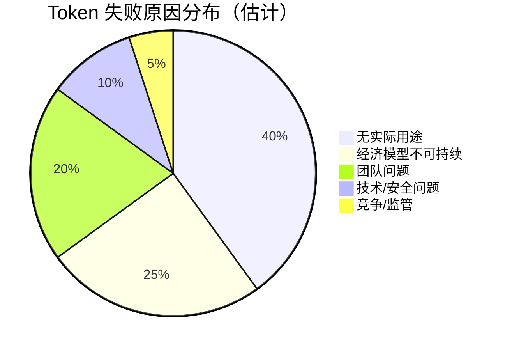
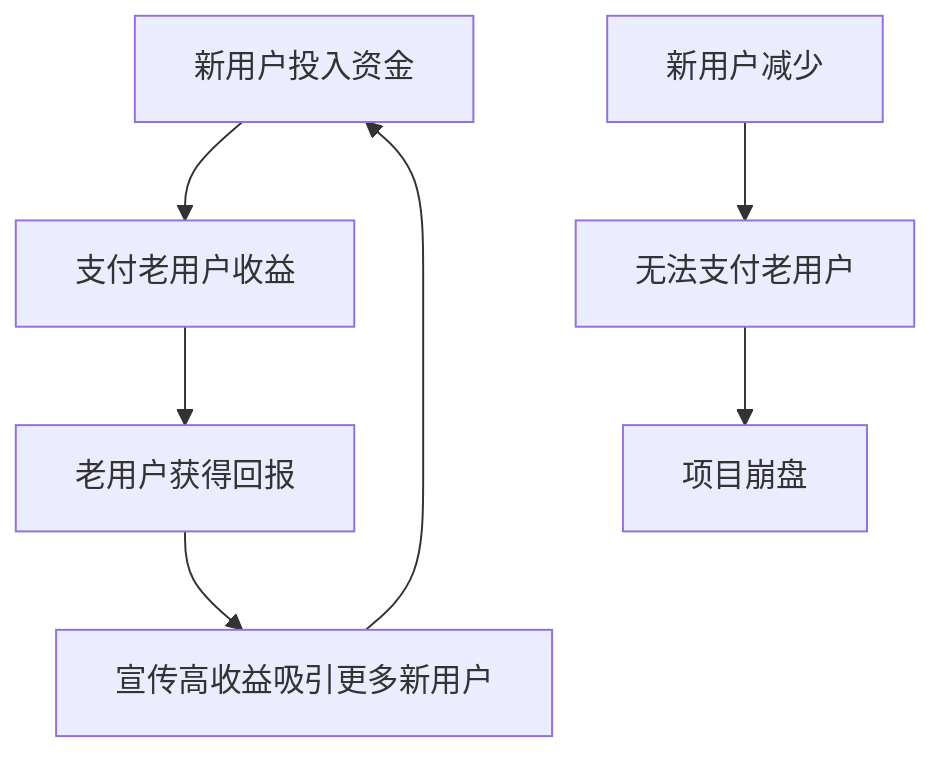

# 4.5 为什么大多数 Token 最终会失败

> **学习目标**：完成本节后，你将能够：
> - 了解大多数 Token 最终失败的事实，建立理性预期
> - 识别 Token 失败的常见原因，尤其是「庞氏结构」
> - 掌握一份实用的「Token 红旗检查清单」

---

## 核心内容

### 1. 一个残酷但必须面对的事实

根据多项研究和历史数据：

> **超过 90% 的 Token 最终会失败**

**什么叫「失败」？**
- 价格归零或接近归零
- 项目停止运营
- 流动性枯竭，无法卖出

**一些数据参考**：
- 2017-2018 年 ICO 热潮中诞生的项目，绝大部分已经归零
- 即使是曾经排名前 100 的 Token，也有很多被新项目替代
- 每年都有成千上万的新 Token 发行，绝大部分没有存活到第二年

**这意味着什么？**

如果你随机购买一个 Token，大概率会亏损。这不是「运气不好」，而是**基本概率**。

> **重要**：这不是说 Web3 全是骗局，而是说——和任何创业领域一样，大多数项目会失败。了解这一点，才能做出理性决策。

### 2. Token 失败的常见原因

#### 2.1 无实际用途（空气币）

**特征**：
- 没有解决任何真实问题
- 纯概念炒作，蹭热点
- 只有买卖行为，没有实际使用场景

**例子**：
- 蹭「元宇宙」概念的山寨币
- 蹭名人热度的 Meme 币（大部分）
- 白皮书写得很好看但从不落地

**判断方法**：问自己——「如果这个 Token 价格归零，还有人会用这个产品吗？」

#### 2.2 经济模型不可持续

**特征**：
- 高通胀无限增发
- 收益依赖新用户资金（庞氏结构）
- 激励设计有缺陷，无法持续

**例子**：
- 承诺「稳定」年化 100% 收益的项目（如 Anchor/UST）
- 需要不断拉新才能维持的项目
- Token 增发速度远超需求增长

**判断方法**：问自己——「这个收益从哪里来？如果没有新用户进入，收益还能持续吗？」

#### 2.3 团队问题

**类型**：

| 问题类型 | 表现 |
|---------|------|
| **跑路（Rug Pull）** | 卷款消失，项目突然停止 |
| **能力不足** | 技术做不出来，运营跟不上 |
| **内部分裂** | 核心成员离开，方向分歧 |
| **动机不纯** | 只为圈钱，无心做事 |

**例子**：
- 团队匿名，突然删除社交媒体跑路
- 融资后长期没有产品进展
- 创始人因争议被社区抛弃

#### 2.4 技术/安全问题

**类型**：
- 智能合约漏洞被黑客攻击
- 私钥管理不善被盗
- 代码有后门（恶意设计）

**例子**：
- 2022 年多起跨链桥被黑事件，损失数亿美元
- 合约有「无限增发」函数被恶意利用

#### 2.5 竞争失败 / 监管打击

**类型**：
- 被更好的项目替代
- 行业趋势变化，赛道不再热门
- 被监管机构认定违法

**例子**：
- 曾经热门的 DeFi 1.0 项目被新协议替代
- 部分隐私币被交易所下架

### 3. 如何识别「庞氏结构」

**庞氏骗局（Ponzi Scheme）** 是一种用后来投资者的钱支付前期投资者回报的骗局。在 Crypto 领域，很多项目本质上是庞氏结构。

#### 3.1 庞氏结构的特征

**核心特征**：
1. **收益来源是新用户资金**，而非真实业务
2. **必须不断拉新**才能维持
3. **承诺不合理的高回报**（如「无风险」年化 50%+）
4. **无法清晰解释收益从哪里来**

#### 3.2 快速判断三问

当遇到一个「高收益」项目时，问自己：

| 问题 | 健康项目 | 庞氏结构 |
|-----|---------|---------|
| 收益从哪里来？ | 交易手续费、借贷利息等业务收入 | 「很复杂」或说不清 |
| 如果没有新用户，收益还能持续吗？ | 能，只是可能降低 | 不能，会崩盘 |
| 为什么收益这么高？ | 早期阶段 + 承担了相应风险 | 「我们的模式很特别」 |

### 4. Token 红旗检查清单

在投资或参与任何 Token 项目前，用这份清单检查：

#### 4.1 团队红旗

- [ ] **团队完全匿名**：无法验证真实身份
- [ ] **团队有负面记录**：之前参与过失败或诈骗项目
- [ ] **团队 Token 无锁仓**：可以随时卖出
- [ ] **社交媒体异常**：粉丝可能是买的，互动很少

#### 4.2 产品红旗

- [ ] **没有实际产品**：只有白皮书和 PPT
- [ ] **解决的是伪问题**：没有真实需求
- [ ] **用区块链的理由牵强**：不上链也能做
- [ ] **路线图一直延期**：融资后无进展

#### 4.3 经济红旗

- [ ] **承诺不合理高收益**：年化 100%+ 且「稳定」
- [ ] **收益来源不清晰**：问不出钱从哪来
- [ ] **强调拉人返佣**：类似传销结构
- [ ] **Token 高度集中**：少数地址持有大量 Token

#### 4.4 技术红旗

- [ ] **合约未开源**：无法验证代码
- [ ] **没有安全审计**：或审计机构不知名
- [ ] **合约有可疑功能**：如管理员可无限增发、可暂停交易
- [ ] **代码复制粘贴**：没有原创性

#### 4.5 社区红旗

- [ ] **社区只讨论价格**：没有产品和技术讨论
- [ ] **批评声音被删除**：不允许质疑
- [ ] **官方频繁喊单**：制造 FOMO 情绪
- [ ] **突然大量水军出现**：评论区全是无意义吹捧

> **Tips**：不是说有一个红旗就一定是骗局，但红旗越多，风险越高。如果一个项目有 3 个以上红旗，建议远离。

### 5. 建立健康心态

#### 5.1 大多数失败是正常的

就像创业公司一样，大多数加密项目会失败——这是创新的代价。

**正确心态**：
- 失败是常态，成功是例外
- 不要 All-in 任何单一项目
- 用「亏得起」的钱参与

#### 5.2 幸存者偏差

你听到的都是成功故事：「我买了 XX，涨了 100 倍」。

你听不到的是：
- 更多人买了归零的币
- 成功者可能也在其他项目上亏损
- 幸存者不代表平均水平

#### 5.3 做好最坏打算

**投资前问自己**：
- 如果这个 Token 归零，我能接受吗？
- 这笔钱亏了会影响我的生活吗？
- 我理解这个项目的风险吗？

如果答案是「不能」「会」「不理解」，那就不要投。

---

## 案例：不同类型的失败项目

| 项目类型 | 失败原因 | 教训 |
|---------|---------|------|
| **ICO 时代空气币** | 只有概念，从未落地 | 白皮书不等于产品 |
| **高 APY DeFi 协议** | 经济模型不可持续 | 高收益 = 高风险 |
| **匿名团队 Meme 币** | 团队跑路 | 匿名团队风险极高 |
| **被黑 DeFi 协议** | 合约漏洞 | 安全审计很重要 |
| **曾经的明星项目** | 竞争失败 | 即使好项目也可能被替代 |

---

## 关键概念速查

| 概念 | 一句话解释 |
|-----|-----------|
| 空气币 | 没有实际用途，纯粹靠炒作的 Token |
| Rug Pull（跑路） | 项目方卷款消失 |
| 庞氏结构 | 用新用户资金支付老用户收益的结构 |
| 红旗（Red Flag） | 警示风险的信号 |
| 幸存者偏差 | 只看到成功案例，忽视大量失败案例 |
| DYOR | Do Your Own Research，自己做研究 |

---

## 学习资料

### 必读
- [What Is a Rug Pull?](https://academy.binance.com/en/articles/what-is-a-rug-pull) - Binance Academy - 了解最常见的跑路方式（预计阅读 8 分钟）

### 选读（进阶）
- [How to Avoid Crypto Scams](https://www.coinbase.com/learn/tips-and-tutorials/how-to-avoid-crypto-scams) - Coinbase - 防骗综合指南（预计阅读 10 分钟）
- [DeadCoins](https://deadcoins.com/) - 浏览失败项目案例（网站）

---

## 学习任务

完成以下任务以检验学习效果：

- [ ] **任务 1**：用本节的「红旗检查清单」评估一个你感兴趣的项目，记录发现了多少个红旗
- [ ] **任务 2**：用一句话解释「庞氏结构」的核心特征

---

## 常见问题 FAQ

**Q1: 这么高的失败率，还值得参与 Web3 吗？**

A: 取决于你的目标。如果是学习和探索，风险可控地参与完全可以；如果是「一夜暴富」，那大概率会失望。关键是：了解风险，管理预期，用亏得起的钱。

**Q2: 匿名团队一定是骗局吗？**

A: 不一定，比特币创始人中本聪也是匿名的。但对于新项目，匿名团队确实增加了跑路风险。匿名团队需要更多其他方面的信任（如代码开源、社区透明）来弥补。

**Q3: 有审计报告就安全吗？**

A: 不一定。审计只能发现当时已知的问题，不能保证绝对安全。而且要看：
- 审计机构是否知名可信
- 审计范围是否全面
- 审计后代码是否有修改

**Q4: 如何判断一个项目是否有「真实需求」？**

A: 问自己：
- 这个问题在没有区块链的情况下能解决吗？
- 谁会真正使用这个产品（不是为了赚钱，而是为了使用）？
- 如果 Token 价格归零，还有人用吗？

**Q5: 发现踩雷了怎么办？**

A:
1. 冷静评估，不要恐慌
2. 如果确认是骗局，及时止损
3. 记录教训，避免再犯
4. 不要试图「加仓摊平」

---

## Part 4 总结

恭喜你完成了 Part 4 的学习！让我们回顾一下核心收获：

| 章节 | 核心收获 |
|-----|---------|
| 4.1 Token 基础 | 理解 Token 的定义、类型和功能 |
| 4.2 Token vs 股票 vs 积分 | 清楚三者的本质区别，不再混淆 |
| 4.3 稳定币专题 | 掌握三类稳定币的机制和风险，了解 UST 崩盘教训 |
| 4.4 代币经济学 | 理解解锁、通胀、激励机制，区分真实收益和 Token 排放 |
| 4.5 Token 失败原因 | 建立风险意识，掌握红旗检查清单 |

---

*最后更新：2025-01-09*
*编写：Antony*
*审核：待审核*
