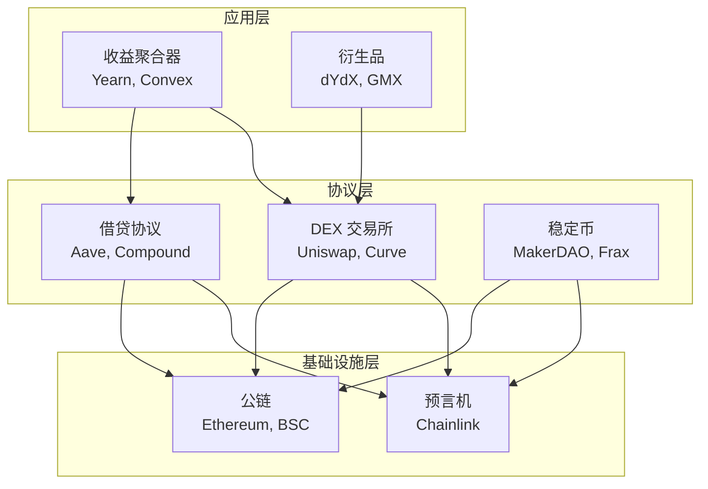

# 5.1 DeFi：去中心化金融在解决什么问题

> **学习目标**：完成本节后，你将能够：
> - 解释 DeFi 与传统金融（TradFi）的 3 个核心区别
> - 识别常见的 DeFi 协议类型（DEX、借贷、收益聚合）
> - 理解 AMM（自动做市商）的基本运作原理

---

## 核心内容

### 1. 什么是 DeFi

**DeFi**（Decentralized Finance，去中心化金融）是建立在区块链上的金融服务生态系统。它的核心理念是：**用代码（智能合约）取代传统金融中的中介机构**。

在传统金融中，你需要银行来存款、需要券商来交易、需要保险公司来投保。而在 DeFi 中，这些服务都由运行在区块链上的智能合约来提供，无需信任任何中心化机构。

> **Tips**：DeFi 的口号是 "Bank the Unbanked"（让无法使用银行服务的人获得金融服务）。全球约有 17 亿人没有银行账户，但只要有智能手机和网络，就可以使用 DeFi。

### 2. DeFi vs 传统金融：核心区别

| 维度 | 传统金融（TradFi） | 去中心化金融（DeFi） |
|------|-------------------|---------------------|
| **准入门槛** | 需要身份验证、开户审批 | 无需许可，有钱包即可参与 |
| **运营时间** | 工作日、特定时段 | 24/7 全天候运行 |
| **资产托管** | 机构托管你的资产 | 用户自己掌控私钥 |
| **透明度** | 内部账本，外部不可见 | 链上公开，任何人可审计 |
| **结算速度** | T+1 或更长 | 分钟级甚至秒级 |
| **中介成本** | 多层中介，成本高 | 智能合约执行，成本低 |

**一句话总结**：DeFi 把金融服务从「机构说了算」变成「代码说了算」。

### 3. DeFi 协议的主要类型

DeFi 生态系统包含多种类型的协议，它们像乐高积木一样可以相互组合：

#### 3.1 DEX（去中心化交易所）

**代表项目**：Uniswap、SushiSwap、Curve

DEX 让你无需注册账号、无需 KYC，就可以直接在链上交换代币。它使用 **AMM（自动做市商）** 机制取代传统的订单簿。

**AMM 核心原理**：
- 流动性池：用户将代币对（如 ETH/USDC）存入池中
- 恒定乘积公式：`x * y = k`（两种代币数量的乘积保持恒定）
- 价格由供需自动调整：买入越多，价格越高

#### 3.2 借贷协议

**代表项目**：Aave、Compound、MakerDAO

借贷协议让你可以：
- **存款赚利息**：将代币存入协议，获得存款利率
- **超额抵押借款**：抵押价值 150% 的资产，借出其他代币
- **闪电贷**：无需抵押，在同一笔交易内借还（常用于套利）

#### 3.3 收益聚合器

**代表项目**：Yearn Finance、Convex、Beefy

收益聚合器的作用是帮你自动寻找最优收益策略，省去手动操作的麻烦。它会自动：
- 寻找最高收益的流动性池
- 自动复投收益
- 在不同协议间切换

### 4. DeFi 的风险

DeFi 不是无风险的「印钞机」，它存在多种风险：

| 风险类型 | 说明 | 真实案例 |
|---------|------|---------|
| **智能合约风险** | 代码漏洞被黑客利用 | 2022 年 Ronin 桥被盗 6.25 亿美元 |
| **预言机风险** | 价格数据被操纵 | 多次闪电贷攻击利用预言机 |
| **无常损失** | LP 提供流动性时的潜在损失 | 市场剧烈波动时 LP 亏损 |
| **监管风险** | 政策变化导致协议受限 | Tornado Cash 被制裁 |
| **经济模型风险** | Token 激励失衡导致崩盘 | 各类「二池挖矿」崩盘 |

> **Tips**：DeFi 的高收益往往意味着高风险。看到 APY（年化收益率）超过 100% 时，一定要问自己：收益从哪里来？

---

## 案例/故事

### Uniswap：从边缘创新到 DeFi 基石

2018 年，一个叫 Hayden Adams 的年轻工程师被西门子裁员。失业期间，他读到了 Vitalik Buterin 关于自动做市商的文章，于是开始尝试实现这个想法。

第一版 Uniswap 只有 300 行代码，却彻底改变了加密货币的交易方式。它证明了：**不需要做市商、不需要订单簿、不需要 KYC，任何人都可以在链上自由交易**。

到 2024 年，Uniswap 累计交易量已超过 2 万亿美元，成为 DeFi 最重要的基础设施之一。而它的核心逻辑，仍然是那个简单的公式：`x * y = k`。

这个故事告诉我们：Web3 的创新往往来自简单而优雅的想法，而非复杂的技术堆砌。

---

## 关键概念速查

| 概念 | 一句话解释 |
|-----|-----------|
| DeFi | 用智能合约取代金融中介的去中心化金融系统 |
| AMM | 自动做市商，用算法替代传统订单簿的交易机制 |
| DEX | 去中心化交易所，无需注册即可交易代币 |
| 流动性池 | 用户存入代币对供他人交易，赚取手续费 |
| TVL | 总锁仓价值，衡量 DeFi 协议规模的指标 |
| 无常损失 | 流动性提供者因价格波动而产生的潜在损失 |
| 闪电贷 | 无需抵押、必须在同一交易内还款的借贷 |
| 可组合性 | DeFi 协议像乐高一样可以相互组合 |

---

## 学习资料

### 必读
- [什么是 DeFi](https://academy.binance.com/zh/articles/the-complete-beginners-guide-to-decentralized-finance-defi) - Binance Academy 官方教程，全面介绍 DeFi 基础概念（预计阅读 15 分钟）
- [Ethereum DeFi 介绍](https://ethereum.org/en/defi/) - 以太坊官方 DeFi 概览，权威且系统（预计阅读 10 分钟）

### 选读（进阶）
- [Uniswap 工作原理](https://docs.uniswap.org/concepts/uniswap-protocol) - 深入理解 AMM 机制
- [DefiLlama](https://defillama.com/) - 实时查看各链 DeFi TVL 数据
- [Finematics 视频](https://www.youtube.com/c/Finematics) - 可视化讲解 DeFi 概念（英文）

---

## 学习任务

完成以下任务以检验学习效果：

- [ ] **任务 1**：做一张 TradFi vs DeFi 对照表，列出 3 个 DeFi 独特优势 + 1 个潜在风险

| 维度 | TradFi | DeFi | DeFi 优势/风险 |
|------|--------|------|---------------|
| ? | ? | ? | 优势 |
| ? | ? | ? | 优势 |
| ? | ? | ? | 优势 |
| ? | ? | ? | **风险** |

- [ ] **任务 2**：访问 [DefiLlama](https://defillama.com/)，找出当前 TVL 排名前 3 的 DeFi 协议，并记录它们的类型

> **提交方式**：将任务输出保存为学习笔记

---

## 常见问题 FAQ

**Q1: DeFi 协议是完全安全的吗？**

A: 不是。DeFi 协议的安全性取决于智能合约代码的质量。即使经过审计的协议也可能存在漏洞。历史上发生过多次大额被盗事件。参与 DeFi 应该只使用你能承受损失的资金。

**Q2: DeFi 的高收益从哪里来？**

A: 主要来源包括：1）交易手续费分成；2）协议发行的代币激励；3）借贷利差。如果收益来源不清晰，很可能是庞氏结构——用后来者的钱支付先来者的收益。

**Q3: 普通人应该如何参与 DeFi？**

A: 建议从小额开始：1）先学会使用钱包；2）在主流协议（如 Uniswap、Aave）上进行小额尝试；3）理解每一步操作的含义再确认交易；4）警惕高收益陷阱。

**Q4: DeFi 会取代银行吗？**

A: 短期内不会。DeFi 目前还存在用户体验复杂、监管不确定、智能合约风险等问题。但 DeFi 正在推动传统金融的变革，未来可能会有更多融合。

---

## 下一步

下一节我们将学习 [5.2 NFT 的价值来源与泡沫](5.2-NFT的价值来源与泡沫.md)，了解另一个重要的 Web3 赛道。

---

最后更新：2025-01-09
编写：AI Assistant
审核：待审核
