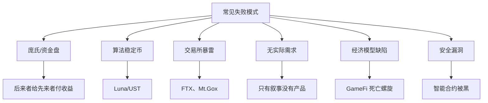

# 5.10 已被反复验证失败的常见模式

> **学习目标**：完成本节后，你将能够：
> - 识别 Web3 行业中反复出现的失败模式
> - 从 Luna/UST、FTX 等典型案例中提取教训
> - 掌握识别风险项目的基本方法

---

## 核心内容

### 1. 为什么要学习失败案例

在 Web3 世界，**不亏钱比赚钱更重要**。

这个行业充满了「一夜暴富」的故事，但更多的是亏损甚至归零的案例。问题是，失败的故事很少被传播——谁愿意承认自己亏了钱呢？

学习失败模式的价值：
- **避开已知的坑**：很多失败模式反复出现
- **建立风险意识**：理解高收益背后的高风险
- **独立思考**：不被营销叙事迷惑

### 2. 六大失败模式



### 3. 模式一：庞氏/资金盘结构

**特征**：收益来自后来者的本金，而非真实的价值创造。

**如何识别**：
- 承诺固定高收益（「保本年化 100%」）
- 强调拉人头奖励
- 收益来源不清晰或解释不通
- 提款设置障碍

**为什么必然失败**：
- 需要指数级增长的新用户来支付老用户收益
- 增长一旦停滞，系统立即崩溃
- 数学上不可持续

**经典案例**：BitConnect（2018 年崩盘，损失约 35 亿美元）

### 4. 模式二：算法稳定币崩溃

#### Luna/UST 案例深度分析

**背景**：
- UST：算法稳定币，目标维持 1 美元
- LUNA：UST 的「吸收波动」代币
- Anchor Protocol：提供 20% APY 的 UST 存款收益

**机制**：
```
UST > $1 → 用户用 $1 的 LUNA 铸造 UST → UST 供给增加 → 价格回落
UST < $1 → 用户用 UST 换取 $1 的 LUNA → UST 供给减少 → 价格回升
```

**崩溃过程**：

| 日期 | 事件 |
|------|------|
| 2022.5.7 | 大规模抛售，UST 开始脱锚 |
| 2022.5.9 | UST 跌至 $0.60，LUNA 开始暴跌 |
| 2022.5.11 | 死亡螺旋：LUNA 供给从 3.5 亿暴增至 6.5 万亿 |
| 2022.5.13 | LUNA 从 $80 跌至几乎归零，UST 跌至 $0.1 以下 |

**损失**：约 **600 亿美元** 市值蒸发

**核心教训**：
1. 算法稳定币的「稳定」依赖信心，信心崩塌则一切崩塌
2. 20% APY 收益不可持续，本质是营销补贴
3. 「不可能失败」的叙事往往最危险

### 5. 模式三：中心化交易所暴雷

#### FTX 案例深度分析

**背景**：
- FTX：曾是全球第二大加密交易所
- 估值最高达 320 亿美元
- 创始人 SBF 是「加密圈最有影响力的人」

**暴雷原因**：

| 问题 | 说明 |
|------|------|
| **挪用客户资金** | 将客户存款借给关联公司 Alameda Research |
| **高风险投资** | Alameda 用客户资金进行高杠杆交易，亏损巨大 |
| **财务混乱** | 甚至没有正规的财务部门和审计 |
| **欺诈行为** | 虚假宣传用户资产安全 |

**崩溃过程**：

| 日期 | 事件 |
|------|------|
| 2022.11.2 | CoinDesk 曝光 Alameda 资产问题 |
| 2022.11.6 | Binance 宣布抛售 FTT |
| 2022.11.8 | FTX 暂停提款 |
| 2022.11.11 | FTX 申请破产 |
| 2023.11 | SBF 被判欺诈罪，面临数十年监禁 |

**损失**：客户损失约 **80 亿美元**

**核心教训**：
1. 中心化平台存在巨大对手方风险
2. 「信任」不能代替透明和审计
3. 再大的品牌也可能一夜崩塌

### 6. 模式四：无实际需求的项目

**特征**：
- 只有白皮书和路线图，没有可用产品
- 技术上没有创新，只是「区块链 + X」概念
- 解决的问题不存在或区块链不是最优解

**为什么失败**：
- 没有真实用户和收入
- 靠不断融资和代币激励维持
- 一旦热度消退，项目死亡

**经典案例**：2017 年 ICO 热潮中 90% 的项目

### 7. 模式五：经济模型不可持续

**特征**：
- 代币产出大于消耗
- 依赖新用户入场支撑价格
- 一旦增长停滞即进入死亡螺旋

**典型案例**：
- Axie Infinity（SLP 无限产出）
- StepN（GST 产出过快）
- 各类「X-to-Earn」项目

**识别方法**：
- 问「代币的消耗场景是什么？」
- 问「没有新用户入场，系统能运转吗？」

### 8. 模式六：安全漏洞被攻击

**类型**：
- 智能合约漏洞
- 跨链桥攻击
- 私钥泄露
- 闪电贷攻击

**重大案例**：

| 事件 | 时间 | 损失 |
|------|------|------|
| Ronin Bridge | 2022.3 | 6.25 亿美元 |
| Wormhole | 2022.2 | 3.2 亿美元 |
| Nomad Bridge | 2022.8 | 1.9 亿美元 |

**教训**：即使是「经过审计」的协议也可能被黑

---

## 案例/故事

### 「不可能失败」的陷阱

2021 年底，Terra 生态如日中天。

UST 市值接近 200 亿美元，是第三大稳定币。LUNA 市值超过 400 亿美元，被称为「第三大公链」。Anchor Protocol 提供 20% 的稳定币收益，被称为「加密世界的储蓄账户」。

社区里，质疑者被嘲笑：「你不懂 Terra 的机制」「算法已经被证明有效」「Do Kwon（创始人）是天才」。

Do Kwon 本人在推特上公开嘲讽批评者，称他们是「穷人」。

然后，一切在一周内崩塌。

**这个故事的警示**：

1. **越是「不可能失败」的叙事，越要警惕**：当所有人都相信某件事不会发生时，一旦发生，损失就是毁灭性的。

2. **高收益必有高风险，没有例外**：20% 的「稳定」收益在传统金融是不可能的。在加密世界也不可能持续——除非背后有不可持续的补贴或风险。

3. **「社区共识」不等于正确**：成千上万人相信的事，也可能是错的。FOMO 会让人丧失判断力。

4. **永远问「钱从哪里来」**：如果答不上来，或者答案是「新用户入场」，那就是红旗。

---

## 关键概念速查

| 概念 | 一句话解释 |
|-----|-----------|
| 庞氏骗局 | 用后来者的钱支付先来者的收益，必然崩溃 |
| 算法稳定币 | 用算法而非储备金维持价格的稳定币 |
| 死亡螺旋 | 负面循环导致价格和信心同时崩塌 |
| 对手方风险 | 交易对手（如交易所）违约的风险 |
| Rug Pull | 项目方卷款跑路 |
| 审计 | 第三方检查代码安全性（但不能保证 100% 安全） |

---

## 学习资料

### 必读
- [Rekt News](https://www.rekt.news/) - 链上安全事件和项目崩盘记录（预计浏览 15 分钟）
- [DefiLlama Hacks](https://defillama.com/hacks) - DeFi 被黑历史记录（预计浏览 10 分钟）

### 选读（进阶）
- Luna/UST 崩盘复盘分析（多个媒体有深度报道）
- FTX 破产相关报道

---

## 学习任务

完成以下任务以检验学习效果：

- [ ] **任务 1**：选择一个失败案例（Luna/UST/FTX/其他），用 3 点总结「它为什么会崩」

| 案例名称 | |
|---------|---|
| 失败原因 1 | |
| 失败原因 2 | |
| 失败原因 3 | |

- [ ] **任务 2**：列举 3 个识别高风险项目的警示信号

1. _______________
2. _______________
3. _______________

> **提交方式**：将任务输出保存为学习笔记

---

## 识别风险的检查清单

评估一个项目时，问自己这些问题：

| 问题 | 警示信号 |
|------|---------|
| 收益从哪里来？ | 答不清楚或「新用户入场」 |
| 团队是谁？ | 匿名且无过往记录 |
| 有真实产品吗？ | 只有白皮书和路线图 |
| 代币分布如何？ | 高度集中在少数地址 |
| 能随时提款吗？ | 设置障碍或锁定期 |
| 代码审计过吗？ | 未审计或多次被黑 |
| 营销大于产品？ | 过度宣传但无实际用户 |

**原则**：如果有 2 个以上警示信号，请格外谨慎。

---

## 常见问题 FAQ

**Q1: 是不是所有高收益项目都是骗局？**

A: 不是所有，但需要非常谨慎。高收益通常意味着高风险。问自己：1）收益从哪里来？2）这个收益率在传统金融可能吗？3）如果可持续，为什么大机构不来？如果答不上来，就要警惕。

**Q2: 经过审计的项目就安全吗？**

A: 不一定。审计只能发现已知类型的漏洞，不能保证 100% 安全。历史上很多被黑的项目都经过了审计。审计是必要条件，但不是充分条件。

**Q3: 如何在创新和风险之间平衡？**

A: 1）只用能承受全部损失的资金参与高风险项目；2）分散投资，不要把所有资金押在一个项目上；3）不懂的东西不投；4）宁可错过机会，也不要踩大坑。

**Q4: 这么多失败案例，Web3 还值得参与吗？**

A: 失败案例多不代表整个行业没有价值。比特币、以太坊等项目经历了多次周期仍然存在。关键是：1）理解风险；2）选择经过验证的项目；3）不被暴富叙事迷惑；4）把学习和参与分开。

---

## Part 5 总结

恭喜你完成了 Part 5 的学习！

在这一部分，我们了解了 Web3 的主流赛道：
- DeFi：用代码取代金融中介
- NFT：数字资产的确权
- GameFi：边玩边赚的尝试与困境
- SocialFi/DID：去中心化身份和社交
- RWA：连接现实世界资产
- DAO：去中心化组织治理
- 预测市场：用价格发现信息
- Meme 币：文化现象与投机
- AI + Crypto：新兴融合趋势

最重要的是，我们学习了失败模式——**知道什么不该做，比知道该做什么更重要**。

下一步，我们将进入 [Part 6：收益、风险与结构性陷阱](../Part06-收益风险与陷阱/)，更深入地理解 Web3 的风险。

---

最后更新：2025-01-09
编写：AI Assistant
审核：待审核
