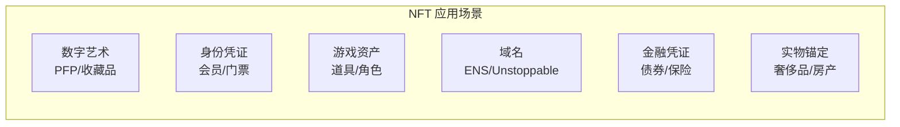

# 5.2 NFT 的价值来源与泡沫

> **学习目标**：完成本节后，你将能够：
> - 解释 NFT 与比特币的核心区别
> - 列举 NFT 除了「小图片」之外的 3 种应用场景
> - 识别 NFT 投资的主要风险

---

## 核心内容

### 1. 什么是 NFT

**NFT**（Non-Fungible Token，非同质化代币）是区块链上独一无二、不可分割的数字资产凭证。

要理解 NFT，先要理解「同质化」：
- **同质化代币**（如比特币、以太坊）：每个代币都一样，1 BTC = 1 BTC，可以互相替换
- **非同质化代币**（NFT）：每个代币都是独特的，不能互相替换

> **类比理解**：货币是同质化的（你的 100 元和我的 100 元没有区别），但房产证是非同质化的（每套房的产权证都是独一无二的）。NFT 就是区块链上的「数字产权证」。

### 2. NFT 的技术标准

NFT 主要基于以太坊的两个标准：

| 标准 | 特点 | 适用场景 |
|------|------|---------|
| **ERC-721** | 每个代币独一无二 | 艺术品、头像、域名 |
| **ERC-1155** | 支持批量创建，可同时包含同质化和非同质化代币 | 游戏道具、门票 |

### 3. NFT 不只是「小图片」

很多人对 NFT 的印象停留在「花大钱买 JPEG」，但 NFT 的价值远不止于此：

#### 3.1 数字所有权证明

NFT 最核心的价值是**证明你拥有某个数字资产**。在没有 NFT 之前，数字文件可以无限复制，无法证明「原版」属于谁。NFT 解决了数字资产的确权问题。

#### 3.2 社区身份与准入

持有特定 NFT 往往意味着：
- 进入专属社群（Discord、Telegram）
- 获得空投资格
- 参与治理投票
- 享受专属权益

**案例**：持有 BAYC（无聊猿）NFT 的人自动成为「猿猴俱乐部」成员，可以参加线下活动、获得衍生品空投。

#### 3.3 功能性应用

| 应用类型 | 说明 | 案例 |
|---------|------|------|
| **门票** | 活动入场凭证，可验证、可转让 | 音乐节 NFT 门票 |
| **域名** | 区块链上的域名系统 | ENS（.eth 域名）、Unstoppable Domains |
| **游戏道具** | 游戏内资产，可跨游戏使用 | Axie Infinity、Gods Unchained |
| **会员卡** | 长期权益凭证 | Starbucks Odyssey |

### 4. NFT 的价值来源

NFT 的价格由多种因素决定：

| 价值来源 | 说明 | 风险程度 |
|---------|------|---------|
| **稀缺性** | 限量发行，物以稀为贵 | 中 |
| **社区共识** | 社区认可度越高，价值越高 | 高 |
| **功能性** | 有实际用途的 NFT 更有价值 | 低 |
| **艺术/文化价值** | 艺术家声誉、文化意义 | 高 |
| **历史意义** | 早期项目的收藏价值 | 中 |

> **Tips**：功能性 NFT（如域名、门票）的价值相对稳定，纯收藏类 NFT 的价格波动极大。

### 5. NFT 的泡沫与风险

2021-2022 年，NFT 市场经历了疯狂的泡沫和崩溃：

**泡沫数据**：
- 2022 年 1 月 NFT 周交易量峰值约 170 亿美元
- 2023 年周交易量跌至约 1.5 亿美元，下跌超 99%
- 大量 NFT 项目归零，流动性枯竭

**主要风险**：

| 风险类型 | 说明 |
|---------|------|
| **流动性风险** | NFT 难以快速变现，可能有价无市 |
| **项目方风险** | 团队跑路、停止运营、Rug Pull |
| **存储风险** | 图片可能存储在中心化服务器，服务器关闭图片消失 |
| **版权问题** | 持有 NFT ≠ 拥有版权，很多人对此有误解 |
| **FOMO 情绪** | 恐惧错过导致高位接盘 |

---

## 案例/故事

### CryptoPunks：NFT 的「始祖」

2017 年，Larva Labs 发布了 10,000 个像素风格的头像——CryptoPunks。这些 24x24 像素的小图片，成为了 NFT 历史上最具标志性的项目。

最初，CryptoPunks 是免费领取的。到了 2021 年牛市，一个稀有的 CryptoPunk 可以卖到数百万美元。Visa 以 15 万美元买入一个 CryptoPunk，宣布「进入 NFT 领域」。

然而，2022 年市场崩盘后，CryptoPunks 价格也大幅回落。这个故事告诉我们：

1. **早期参与者获得了巨大回报**——但这需要极大的远见和运气
2. **高价买入可能面临巨大亏损**——泡沫终会破裂
3. **历史意义带来的价值是真实的**——CryptoPunks 作为 NFT 始祖的地位不会改变

NFT 的价值既有真实的一面（所有权证明、社区身份），也有泡沫的一面（炒作、FOMO）。关键是分清两者。

---

## 关键概念速查

| 概念 | 一句话解释 |
|-----|-----------|
| NFT | 非同质化代币，区块链上独一无二的数字资产凭证 |
| ERC-721 | 以太坊 NFT 标准，每个代币都是独特的 |
| ERC-1155 | 多代币标准，可批量创建 NFT |
| PFP | Profile Picture，头像类 NFT |
| Mint | 铸造，在区块链上创建新 NFT 的过程 |
| Floor Price | 地板价，某系列 NFT 的最低挂单价格 |
| Rug Pull | 项目方卷款跑路 |
| 元数据 | NFT 的描述信息（名称、属性、图片链接等） |

---

## 学习资料

### 必读
- [什么是 NFT](https://academy.binance.com/zh/articles/a-guide-to-crypto-collectibles-and-non-fungible-tokens-nfts) - Binance Academy 官方教程，全面介绍 NFT 基础（预计阅读 15 分钟）
- [Ethereum NFT 介绍](https://ethereum.org/en/nft/) - 以太坊官方 NFT 概览（预计阅读 10 分钟）

### 选读（进阶）
- [OpenSea 帮助中心](https://support.opensea.io/) - 了解 NFT 交易平台操作
- [ENS 官网](https://ens.domains/) - 体验功能性 NFT（域名）
- [NFT 市场数据 - Dune](https://dune.com/browse/dashboards?q=nft) - 查看 NFT 市场实时数据

---

## 学习任务

完成以下任务以检验学习效果：

- [ ] **任务 1**：用一句话解释 NFT 和比特币最大的不同

> 提示：从「同质化」vs「非同质化」的角度思考

- [ ] **任务 2**：列举 3 个 NFT 除了「小图片」之外的应用场景，并各举一个真实案例

| 应用场景 | 真实案例 |
|---------|---------|
| 1. ? | ? |
| 2. ? | ? |
| 3. ? | ? |

> **提交方式**：将任务输出保存为学习笔记

---

## 常见问题 FAQ

**Q1: 买了 NFT 就拥有图片的版权吗？**

A: 不一定。购买 NFT 获得的是链上所有权凭证，而版权通常仍归原创作者所有。具体权益取决于项目方的授权条款。例如，BAYC 授予持有者商业使用权，但大多数 NFT 项目并不授予版权。

**Q2: NFT 的图片存储在哪里？**

A: NFT 本身（代币）存储在区块链上，但图片/媒体文件通常存储在链下。存储方式包括：1）中心化服务器（风险高，服务器关闭图片消失）；2）IPFS 去中心化存储（相对安全）；3）完全上链（成本高，较少见）。购买 NFT 前建议检查存储方式。

**Q3: 现在还能投资 NFT 吗？**

A: 这取决于你的目的。如果是为了使用（如 ENS 域名），可以正常购买。如果是为了投资升值，请注意：1）NFT 市场已大幅降温；2）流动性风险极高；3）大多数 NFT 最终可能归零。建议只用能承受全部损失的资金。

**Q4: 如何判断一个 NFT 项目是否靠谱？**

A: 几个参考维度：1）团队是否公开、有无过往成功项目；2）是否有真实的功能性/应用场景；3）社区活跃度和持有者分布；4）是否有清晰的路线图和持续交付。如果只强调「稀缺性」和「升值空间」而无实际用途，需格外谨慎。

---

## 下一步

下一节我们将学习 [5.3 GameFi：链游的经济模型与常见问题](5.3-GameFi链游经济模型.md)，了解「边玩边赚」的真相与陷阱。

---

最后更新：2025-01-09
编写：AI Assistant
审核：待审核
