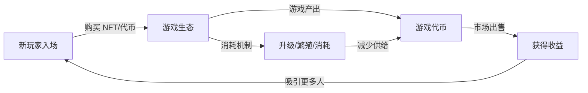
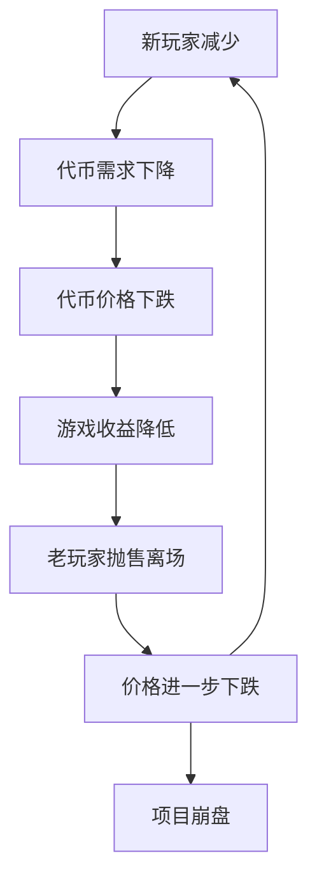

# 5.3 GameFi：链游的经济模型与常见问题

> **学习目标**：完成本节后，你将能够：
> - 解释 Play-to-Earn（边玩边赚）模型的运作原理
> - 识别链游经济模型的主要风险，理解「死亡螺旋」
> - 批判性思考 GameFi 的可持续性问题

---

## 核心内容

### 1. 什么是 GameFi

**GameFi** = Game + Finance，指融合了金融元素的区块链游戏。它的核心理念是 **Play-to-Earn（P2E，边玩边赚）**：玩家通过游戏行为获得可交易的加密资产，从而实现经济收益。

在传统游戏中，玩家花钱买游戏、买道具，但这些投入最终归游戏公司所有。而在 GameFi 中：
- 游戏内资产（角色、道具）以 **NFT** 形式存在，玩家真正拥有
- 游戏内货币是可在交易所买卖的 **加密货币**
- 玩家可以将游戏收益 **兑换成真实收入**

> **类比理解**：如果说传统网游是「花钱玩」，那 GameFi 的愿景是「玩游戏挣钱」，类似把打游戏变成一份「工作」。

### 2. GameFi 的经济模型

#### 2.1 双代币模型

大多数 GameFi 采用「双代币」设计：

| 代币类型 | 特点 | 作用 | 案例 |
|---------|------|------|------|
| **治理代币** | 总量有限 | 治理投票、质押、投资属性 | AXS（Axie）、GMT（StepN） |
| **游戏代币** | 总量无限 | 游戏内产出和消耗 | SLP（Axie）、GST（StepN） |

**设计目的**：将投资/投机属性（治理代币）与游戏经济（游戏代币）分离。

#### 2.2 经济循环

**核心问题**：这个循环能否持续运转？

### 3. 死亡螺旋：GameFi 的致命危机

几乎所有爆火的 GameFi 项目都经历了「死亡螺旋」：

**死亡螺旋的本质**：当收益主要来自新玩家入场的资金时，一旦新玩家增速放缓，整个系统就会崩溃。这与庞氏骗局的结构高度相似。

### 4. 案例分析：Axie Infinity 的兴衰

**Axie Infinity** 是 2021 年最成功的 GameFi 项目，也是死亡螺旋最典型的案例：

| 阶段 | 时间 | 情况 |
|------|------|------|
| **爆发期** | 2021 年中 | 菲律宾等国玩家涌入，日活超 200 万，月收入超过很多大型游戏 |
| **巅峰期** | 2021 年底 | SLP 价格高点约 0.4 美元，玩家月收入可达数百美元 |
| **崩盘期** | 2022 年 | 新玩家减少，SLP 价格跌至 0.003 美元，跌幅超 99% |
| **安全事件** | 2022 年 3 月 | Ronin 桥被黑，损失 6.25 亿美元，雪上加霜 |

**崩盘原因分析**：

1. **经济模型不可持续**：SLP 无限产出，消耗机制不足
2. **玩家是「打工人」而非「玩家」**：游戏本身不好玩，玩家只为赚钱
3. **过度依赖新玩家入场**：类似庞氏结构
4. **市场周期**：加密市场整体下行加速崩盘

### 5. GameFi 的核心问题

#### 问题 1：收益从哪里来？

| 收益来源 | 可持续性 |
|---------|---------|
| 新玩家入场资金 | ❌ 不可持续（庞氏结构） |
| 游戏内消耗（升级、道具） | ⚠️ 需要足够多活跃玩家 |
| 广告收入 | ✅ 可持续但规模有限 |
| 真实娱乐价值 | ✅ 可持续，但大多数链游做不到 |

#### 问题 2：Play vs Earn 的矛盾

- 如果游戏太「好玩」→ 玩家不在乎收益，收益就会很低
- 如果游戏太「好赚」→ 玩家只为赚钱，没人真正玩游戏

大多数 GameFi 选择了「好赚」，结果是游戏体验差，玩家只是「打金工作室」。

#### 问题 3：入场成本 vs 回本周期

很多 GameFi 需要先购买 NFT 才能开始玩（如 Axie 需要买 3 只小精灵）。玩家面临的问题：
- 入场成本高（数百到数千美元）
- 回本周期不确定
- 代币价格下跌可能永远无法回本

---

## 案例/故事

### StepN：Move-to-Earn 的昙花一现

2022 年初，一款名叫 StepN 的「跑步赚钱」应用火遍全球。

它的模式很简单：买一双 NFT 跑鞋，每天跑步就能赚取 GST 代币。巅峰时期，一双虚拟跑鞋可以卖到几千美元，跑一次步能赚几十甚至上百美元。

很多人开始「跑步上班」：不是为了健康，而是为了赚钱。有人甚至雇人代跑，或者用电动车「作弊」。

然而，好景不长。随着新用户增长放缓，GST 价格从高点 9 美元跌至不足 0.01 美元。那些高价买入跑鞋的人，可能永远无法回本。

StepN 的故事再次证明：**当「赚钱」成为唯一目的时，游戏就失去了游戏的本质**。跑步本应是健康的、快乐的，而不是焦虑地盯着收益曲线。

---

## 关键概念速查

| 概念 | 一句话解释 |
|-----|-----------|
| GameFi | Game + Finance，融合金融元素的区块链游戏 |
| Play-to-Earn (P2E) | 边玩边赚，通过游戏行为获得经济收益的模式 |
| 双代币模型 | 治理代币（限量）+ 游戏代币（无限）的设计 |
| 死亡螺旋 | 新玩家减少 → 代币下跌 → 收益降低 → 更多人离场的恶性循环 |
| 打金 | 以赚钱为目的的游戏行为，常见于 GameFi |
| 入场成本 | 开始玩 GameFi 需要购买的 NFT 或代币的价值 |
| 回本周期 | 收回入场成本所需的时间 |

---

## 学习资料

### 必读
- [什么是 GameFi](https://academy.binance.com/zh/articles/what-is-gamefi-and-how-does-it-work) - Binance Academy 官方教程，介绍 GameFi 基础概念（预计阅读 10 分钟）

### 选读（进阶）
- [DappRadar 链游排行](https://dappradar.com/rankings/category/games) - 查看当前活跃的链游项目
- [Axie Infinity 经济分析](https://messari.io/report/axie-infinity) - Messari 深度研报（英文）
- [GameFi 2.0 探讨](https://www.theblock.co/learn/ethereum-101/gamefi) - 行业对未来方向的思考（英文）

---

## 学习任务

完成以下任务以检验学习效果：

- [ ] **任务 1**：用自己的话解释「死亡螺旋」是如何发生的

> 提示：从新玩家、代币价格、收益、老玩家行为四个角度思考

- [ ] **任务 2**：分析一个你听说过的 GameFi 项目（如 Axie、StepN），回答以下问题：

| 问题 | 你的答案 |
|------|---------|
| 玩家的收益主要从哪里来？ | |
| 这个收益来源可持续吗？ | |
| 游戏本身好玩吗？（不考虑赚钱） | |

> **提交方式**：将任务输出保存为学习笔记

---

## 常见问题 FAQ

**Q1: 还有能赚钱的 GameFi 吗？**

A: 理论上有，但风险极高。早期参与新项目可能有收益，但你面临的问题是：1）如何判断项目是否靠谱；2）如何判断自己是不是「接盘侠」；3）项目随时可能崩盘。普通人很难在这个市场持续获利。

**Q2: GameFi 还有未来吗？**

A: 行业仍在探索。未来的方向可能是：1）真正好玩的游戏 + 资产上链（而非「打金」模式）；2）更可持续的经济模型；3）更低的入场门槛。但目前还没有成熟的解决方案。

**Q3: 如果想体验 GameFi，应该注意什么？**

A: 1）只用能承受全部损失的资金；2）研究清楚经济模型再入场；3）不要 FOMO 高位买入 NFT；4）把它当作娱乐而非「投资」或「工作」；5）如果游戏本身不好玩，大概率不值得参与。

**Q4: 为什么这么多 GameFi 都失败了？**

A: 核心原因是经济模型不可持续。大多数 GameFi 的收益来自后来者的入场资金，而非游戏本身创造的价值。当增长停滞，系统必然崩溃。这是结构性问题，不是某个项目的问题。

---

最后更新：2025-01-09
编写：Antony
审核：待审核
