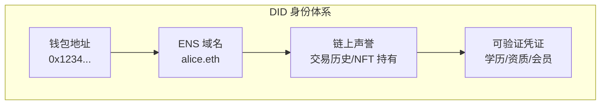

# 5.4 SocialFi 与 DID（去中心化身份）

> **学习目标**：完成本节后，你将能够：
> - 解释 DID 与传统社交账号（如微信）的核心区别
> - 理解用户身份如何在 Web3 中跨平台使用
> - 了解 SocialFi 的基本概念和代表项目

---

## 核心内容

### 1. 什么是 DID

**DID**（Decentralized Identifier，去中心化身份标识符）是一种不依赖中心化机构的身份识别方式。

在传统互联网中，你的身份由平台定义和控制：
- 微信号由腾讯控制
- 微博账号由新浪控制
- 抖音账号由字节控制

而在 Web3 中，DID 让你真正**拥有和控制自己的身份**：
- 你的身份基于密码学（私钥），而非平台账号
- 你的身份数据存储在区块链上，而非平台服务器
- 你可以选择性地向不同应用披露信息

> **类比理解**：传统账号就像租来的房子，房东（平台）可以随时收回。DID 就像你自己的房产，只有你有钥匙（私钥），没人能把你赶走。

### 2. DID vs 传统社交账号

| 维度 | 传统账号（微信/微博） | DID（Web3 身份） |
|------|---------------------|-----------------|
| **控制权** | 平台控制 | 用户自己控制 |
| **可移植性** | 无法迁移，换平台需重新积累 | 可跨平台使用，带走所有数据 |
| **数据所有权** | 平台拥有你的数据 | 你拥有自己的数据 |
| **封号风险** | 平台可随时封禁 | 无法被任何人封禁 |
| **隐私保护** | 平台掌握所有信息 | 可选择性披露信息 |
| **变现能力** | 收益归平台 | 创作者直接获得收益 |

**一句话总结**：DID 让你从「平台的用户」变成「自己数据的主人」。

### 3. DID 的核心组件

#### 3.1 钱包地址

最基础的链上身份就是你的钱包地址。但 `0x7a16...` 这样的地址很难记忆和传播。

#### 3.2 ENS 域名

**ENS**（Ethereum Name Service）让你可以将复杂地址映射为可读的域名：
- `vitalik.eth` → `0xd8dA6BF26964aF9D7eEd9e03E53415D37aA96045`

ENS 域名的作用：
- 方便收款（发送代币到 `alice.eth`）
- 作为链上身份标识
- 绑定社交资料、头像等

#### 3.3 链上声誉

你的链上行为会形成可追溯的「声誉」：
- 交易历史
- 持有的 NFT
- 参与的 DAO
- 协议交互记录

这些数据是公开的，任何人都可以验证。

#### 3.4 可验证凭证（VC）

可验证凭证让你可以证明某些属性，而无需透露全部信息：
- 证明「我已成年」而不透露具体年龄
- 证明「我有大学学历」而不透露学校名称
- 证明「我是某 DAO 成员」

### 4. SocialFi：去中心化社交

**SocialFi** = Social + Finance，指融合了金融元素的去中心化社交网络。

#### 4.1 为什么需要去中心化社交

传统社交平台的问题：
1. **数据被平台垄断**：你的内容、关注关系都归平台所有
2. **收益分配不公**：创作者产出内容，平台拿走大部分收益
3. **审查风险**：平台可以随意删帖、封号
4. **无法迁移**：换平台需要重新积累粉丝

#### 4.2 代表项目

| 项目 | 特点 | 类比 |
|------|------|------|
| **Lens Protocol** | 社交图谱协议，用户拥有自己的关注关系 | 去中心化的社交关系层 |
| **Farcaster** | 去中心化社交网络，类似 Twitter | 去中心化的推特 |
| **Friend.tech** | 社交代币化，可买卖与 KOL 的联系 | 社交 + 金融化 |

#### 4.3 Lens Protocol 示例

在 Lens Protocol 中：
- 你的 Profile 是一个 NFT，你完全拥有它
- 你的关注关系（Following）存储在链上
- 你发布的内容（Publication）也可以是 NFT
- 任何应用都可以读取你的社交图谱

这意味着：如果你不喜欢某个基于 Lens 的应用，可以换到另一个应用，**但你的粉丝、内容、关系都跟着你走**。

### 5. 现状与挑战

#### 优势
- 用户真正拥有自己的数据
- 创作者可以直接变现
- 抗审查，无法被封禁

#### 挑战
- **用户体验复杂**：需要钱包、Gas 费等门槛
- **用户规模有限**：相比传统平台，用户数量还很少
- **商业模式不成熟**：如何持续运营仍是问题
- **内容审核困难**：去中心化带来的双刃剑

---

## 案例/故事

### ENS：从域名到数字身份

2017 年，ENS（Ethereum Name Service）诞生了。最初，它只是为了解决一个简单的问题：以太坊地址太长太复杂，能不能像域名一样简化？

于是，`0xd8dA6BF26964aF9D7eEd9e03E53415D37aA96045` 变成了 `vitalik.eth`。

但 ENS 的意义远不止于此。随着时间推移，ENS 域名逐渐成为一种**数字身份符号**：
- Twitter 用户开始把 `.eth` 加到用户名后面
- 项目方用 ENS 作为官方身份标识
- 人们把 ENS 当作社交名片

到 2024 年，ENS 已有超过 200 万个注册域名。一些稀有域名（如 3 位数字域名）的交易价格高达数万美元。

ENS 的成功告诉我们：**Web3 身份不仅仅是技术概念，它正在成为一种文化符号和社会资本**。拥有一个好的 ENS 域名，就像拥有一个好的微信号或短域名一样，是一种身份象征。

---

## 关键概念速查

| 概念 | 一句话解释 |
|-----|-----------|
| DID | 去中心化身份标识符，用户自己控制的数字身份 |
| ENS | 以太坊域名服务，将地址映射为可读域名（如 vitalik.eth） |
| SocialFi | 去中心化社交 + 金融，用户拥有数据和收益 |
| Lens Protocol | 去中心化社交图谱协议，关注关系可跨应用使用 |
| Farcaster | 去中心化社交网络，类似去中心化的 Twitter |
| 可验证凭证 (VC) | 可以证明某些属性而不泄露全部信息的数字证明 |
| SBT | 灵魂绑定代币，不可转让的 NFT，用于表示身份/成就 |

---

## 学习资料

### 必读
- [什么是去中心化身份](https://academy.binance.com/zh/articles/what-is-a-decentralized-identity-in-blockchain) - Binance Academy 官方教程（预计阅读 10 分钟）
- [去中心化社交网络](https://ethereum.org/zh/social-networks/) - 以太坊官方介绍（预计阅读 10 分钟）

### 选读（进阶）
- [ENS 官网](https://ens.domains/) - 体验链上域名系统
- [Lens Protocol](https://www.lens.xyz/) - 体验去中心化社交
- [Farcaster](https://www.farcaster.xyz/) - 另一个去中心化社交平台

---

## 学习任务

完成以下任务以检验学习效果：

- [ ] **任务 1**：用一句话解释 DID 和微信账号最大的不同

> 提示：从「控制权」和「可移植性」的角度思考

- [ ] **任务 2**：填写下表，对比传统社交账号和 DID 的区别

| 维度 | 微信账号 | DID |
|------|---------|-----|
| 谁控制你的账号？ | | |
| 如果想换平台，粉丝能带走吗？ | | |
| 平台能删除你的内容吗？ | | |

> **提交方式**：将任务输出保存为学习笔记

---

## 常见问题 FAQ

**Q1: 我需要注册 ENS 域名吗？**

A: 不是必须的，但如果你计划长期参与 Web3，拥有一个 ENS 域名是有价值的：1）方便收款和社交展示；2）作为链上身份标识；3）可能有长期价值（如同短域名）。注册费用约 5-10 美元/年（加 Gas 费）。

**Q2: 去中心化社交真的无法被审查吗？**

A: 技术上，链上数据无法被删除。但：1）前端应用可以选择不展示某些内容；2）违法内容可能导致法律风险；3）完全无审查也带来问题（如色情、诈骗）。去中心化不等于无法无天，而是审查权从平台转移到社区。

**Q3: SocialFi 会取代微信/微博吗？**

A: 短期内不会。目前 SocialFi 的用户体验、用户规模都远不及传统平台。但它提供了一种新的可能性：**用户拥有自己的数据**。未来可能是两者并存，或传统平台逐渐吸收去中心化的理念。

**Q4: DID 和实名认证有什么关系？**

A: DID 本身是匿名/假名的（只有钱包地址）。但 DID 可以关联可验证凭证（VC），证明某些属性（如已通过 KYC、已成年）而不暴露全部身份信息。这种「选择性披露」是 DID 的核心优势之一。

---

最后更新：2025-01-09
编写：Antony
审核：待审核
