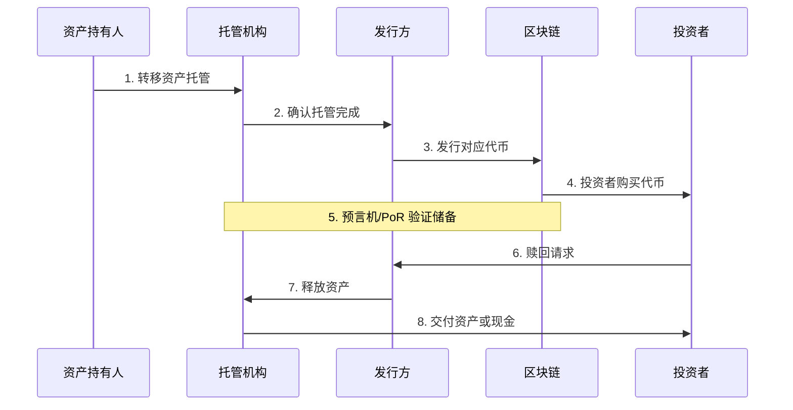

# 5.5 RWA：现实世界资产上链

> **学习目标**：完成本节后，你将能够：
> - 解释什么是 RWA（现实世界资产）代币化
> - 理解托管、预言机、储备证明（PoR）的作用
> - 识别 RWA 的典型应用场景和合规要点

---

## 核心内容

### 1. 什么是 RWA

**RWA**（Real World Assets，现实世界资产）指将现实世界中的资产代币化后上链的资产。

简单来说，RWA 就是把「看得见摸得着」的资产（房子、债券、黄金）变成区块链上的代币。

> **类比理解**：如果把一栋价值 1000 万的房产拆分成 100 万个代币，每个代币代表房产的万分之一产权。持有代币就相当于持有房产的一部分，可以获得租金分红，也可以在链上自由交易。

**RWA 的意义**：
- **提高流动性**：原本难以分割和交易的资产（如房产）可以 24/7 交易
- **降低门槛**：普通人可以小额投资原本无法触及的资产
- **透明度**：链上记录公开可查，减少信息不对称
- **全球化**：打破地域限制，全球投资者可以参与

### 2. RWA 的代币化流程

### 3. 四个核心概念

#### 3.1 代币化（Tokenization）

代币化是将资产的所有权或收益权映射为链上代币的过程。

| 原始资产 | 代币化后 |
|---------|---------|
| 1 美元现金 | 1 USDT/USDC |
| 1 盎司黄金 | 1 PAXG |
| 10 万美元国债 | 100,000 个国债代币 |

#### 3.2 托管（Custody）

实物资产需要有人保管。托管机构负责：
- 安全存储实物资产
- 定期审计和报告
- 处理赎回请求

**托管是 RWA 的核心风险点**：如果托管机构作恶或破产，代币可能变成「空气币」。

#### 3.3 预言机（Oracle）

区块链无法直接获取链下数据。预言机充当「桥梁」，将现实世界的数据传递到链上。

**预言机的作用**：
- 传递资产价格（如黄金价格、汇率）
- 传递托管状态
- 触发智能合约执行

**代表项目**：Chainlink、Pyth

#### 3.4 储备证明（Proof of Reserve, PoR）

储备证明是一种验证机制，证明链下资产储备的真实性。

**为什么需要 PoR**：
- 防止发行方超发代币（没有足够储备却发行大量代币）
- 提高投资者信任
- 在 FTX 暴雷后，PoR 变得更加重要

**工作原理**：
1. 第三方审计机构定期检查链下资产
2. 通过预言机将验证结果传到链上
3. 任何人可以查看验证记录

### 4. RWA 的主要类型

| 类型 | 说明 | 代表项目 |
|------|------|---------|
| **稳定币** | 与美元 1:1 锚定的代币 | USDT、USDC、DAI |
| **代币化国债** | 美国国债等主权债务的代币化 | Ondo Finance、OpenEden |
| **代币化股权** | 公司股权的代币化 | Securitize、Polymath |
| **代币化房产** | 房地产的分割所有权 | RealT、Lofty |
| **代币化商品** | 黄金、白银等商品 | PAXG（黄金）、XAUT |

> **Tips**：稳定币（USDT/USDC）其实是最成功的 RWA——它们用真实的美元储备（现金或短期国债）支撑代币价值。

### 5. 合规要点

RWA 涉及真实资产，必须考虑法律合规：

| 合规要点 | 说明 |
|---------|------|
| **证券法规** | 很多 RWA 代币可能被认定为证券，需要合规发行 |
| **KYC/AML** | 通常需要身份验证，不像纯 DeFi 那样无许可 |
| **托管资质** | 托管机构需要相应牌照 |
| **地域限制** | 不同国家法规不同，可能限制某些地区用户 |
| **税务处理** | 代币收益可能需要纳税 |

### 6. 风险与挑战

| 风险类型 | 说明 |
|---------|------|
| **托管风险** | 托管机构可能作恶、破产或被监管 |
| **预言机风险** | 数据传递可能出错或被操纵 |
| **合规风险** | 法律法规不确定，政策可能变化 |
| **流动性风险** | 部分 RWA 代币流动性有限 |
| **赎回风险** | 赎回机制可能不顺畅 |

---

## 案例/故事

### MakerDAO 的 RWA 实验

MakerDAO 是最早将 RWA 引入 DeFi 的项目之一。

2022 年，MakerDAO 开始将部分 DAI 的抵押资产从加密货币扩展到现实世界资产。他们与传统金融机构合作，将美国国债、企业贷款等资产纳入抵押品。

到 2024 年，MakerDAO 的 RWA 敞口已超过 30 亿美元，其中大部分是美国国债。这些国债每年产生约 5% 的收益，成为 MakerDAO 的重要收入来源。

这个案例展示了 RWA 的潜力：**DeFi 协议不再只是「加密货币的乐高」，而是可以与现实世界的金融系统连接**。

但这也带来了争议：
- MakerDAO 是否还是「去中心化」的？
- 如果美国政府制裁这些国债，会发生什么？
- 依赖传统金融机构是否违背了 DeFi 的初衷？

这些问题至今没有答案，但 MakerDAO 的实验无疑打开了新的可能性。

---

## 关键概念速查

| 概念 | 一句话解释 |
|-----|-----------|
| RWA | 现实世界资产代币化后上链的资产 |
| 代币化 | 将资产的所有权/收益权映射为链上代币 |
| 托管 | 由可信机构保管实物资产 |
| 预言机 | 将链下数据传递到链上的「桥梁」 |
| PoR | 储备证明，验证链下资产储备的真实性 |
| KYC | 了解你的客户，身份验证流程 |
| AML | 反洗钱合规要求 |

---

## 学习资料

### 必读
- [什么是 RWA](https://academy.binance.com/zh/articles/what-are-real-world-assets-rwa-in-defi) - Binance Academy 官方教程，介绍 RWA 基础概念（预计阅读 10 分钟）

### 选读（进阶）
- [RWA.xyz](https://www.rwa.xyz/) - RWA 数据追踪平台，查看各类 RWA 规模
- [Chainlink 储备证明](https://chain.link/proof-of-reserve) - 了解 PoR 技术原理
- [Ondo Finance](https://ondo.finance/) - 体验代币化国债产品

---

## 学习任务

完成以下任务以检验学习效果：

- [ ] **任务 1**：用自己的话解释 RWA 代币化的流程，包括以下步骤：

1. 资产托管：_______________
2. 代币发行：_______________
3. 价值验证（PoR）：_______________
4. 赎回机制：_______________

- [ ] **任务 2**：列举 3 种 RWA 类型及其代表项目

| RWA 类型 | 代表项目 |
|---------|---------|
| 1. | |
| 2. | |
| 3. | |

> **提交方式**：将任务输出保存为学习笔记

---

## 常见问题 FAQ

**Q1: USDT/USDC 也是 RWA 吗？**

A: 是的。稳定币是最成功的 RWA——它们由真实的美元储备（现金、短期国债等）支撑。只是我们通常不这么称呼，因为它们出现得更早，RWA 这个术语是后来才流行的。

**Q2: RWA 和传统证券有什么区别？**

A: 主要区别在于：1）RWA 在区块链上交易，可 24/7 运作；2）可以实现更小额度的分割；3）智能合约可以自动执行分红等功能；4）全球范围内更容易流通。但在法律上，很多 RWA 代币仍被视为证券。

**Q3: 普通人可以投资 RWA 吗？**

A: 取决于具体产品和你所在地区的法规。一些 RWA 产品（如稳定币）对所有人开放；另一些（如代币化国债）可能要求 KYC 或仅限合格投资者。建议先了解产品的合规要求。

**Q4: RWA 的最大风险是什么？**

A: 托管风险。链上代币的价值完全依赖于链下资产的真实存在。如果托管机构作恶（私吞资产）或破产，代币持有者可能血本无归。这也是为什么 PoR（储备证明）如此重要。

---

## 下一步

下一节我们将学习 [5.6 DAO：去中心化自治组织](5.6-DAO去中心化自治组织.md)，了解区块链上的新型组织形式。

---

最后更新：2025-01-09
编写：Antony
审核：待审核
