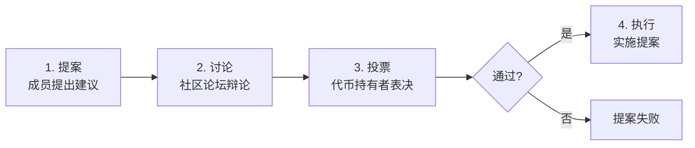

# 5.6 DAO：去中心化自治组织

> **学习目标**：完成本节后，你将能够：
> - 解释 DAO 的治理机制与投票逻辑
> - 识别 DAO 的主要类型和代表项目
> - 理解 DAO 的局限性与现实挑战

---

## 核心内容

### 1. 什么是 DAO

**DAO**（Decentralized Autonomous Organization，去中心化自治组织）是通过智能合约运行、由成员共同治理的新型组织形式。

在传统公司中，决策由董事会和管理层做出，普通员工或股东很少有直接参与权。而在 DAO 中：
- **规则公开透明**：写在智能合约里，所有人可查看
- **成员共同决策**：通过代币投票参与重大决策
- **资金共同管理**：金库由智能合约控制，而非个人
- **没有层级结构**：理论上没有「老板」，成员平等

> **类比理解**：如果说传统公司是「自上而下的金字塔」，DAO 更像是「成员共同管理的合作社」——每个人都有发言权，重大决策需要集体投票。

### 2. DAO 的治理机制

#### 2.1 治理流程

#### 2.2 投票方式

| 投票方式 | 原理 | 优缺点 |
|---------|------|--------|
| **1 Token = 1 Vote** | 持有越多代币，投票权越大 | 简单直接，但大户主导 |
| **平方投票** | 投票权 = 代币数量的平方根 | 减少大户优势，但实现复杂 |
| **代理投票** | 可以将投票权委托给他人 | 提高参与度，但可能中心化 |
| **信念投票** | 投票权随时间累积 | 奖励长期参与者 |

#### 2.3 治理工具

| 工具 | 作用 | 代表项目 |
|------|------|---------|
| **Snapshot** | 链下投票平台，无 Gas 费 | 大多数 DAO 使用 |
| **Tally** | 链上投票执行 | Compound、Uniswap |
| **治理论坛** | 提案讨论和辩论 | Discourse 搭建 |
| **多签钱包** | 金库管理，多人签名执行 | Gnosis Safe |

### 3. DAO 的主要类型

| 类型 | 说明 | 代表项目 |
|------|------|---------|
| **协议 DAO** | 治理 DeFi 协议的参数和升级 | MakerDAO、Uniswap、Aave |
| **投资 DAO** | 集体投资项目或资产 | The LAO、BitDAO |
| **收藏 DAO** | 集体收藏 NFT 或艺术品 | PleasrDAO、FlamingoDAO |
| **社交 DAO** | 社区组织和会员制 | Friends With Benefits (FWB) |
| **服务 DAO** | 提供专业服务（开发、设计） | RaidGuild、MetaFactory |
| **媒体 DAO** | 去中心化媒体和内容 | Bankless DAO |

### 4. DAO 的局限性与挑战

DAO 并不是完美的组织形式，它面临很多现实挑战：

#### 4.1 治理参与度低

**问题**：大多数代币持有者不参与投票。

**数据**：
- 大型 DAO 的投票参与率通常不到 10%
- 很多提案只有几百人投票，却决定数亿美元的去向

**原因**：
- 投票需要时间研究提案
- 单票影响有限，「搭便车」心理
- Gas 费阻碍小额持有者参与

#### 4.2 巨鲸主导

**问题**：少数大户可能控制投票结果。

**案例**：
- 某些 DAO 前 10 个地址持有超过 50% 的投票权
- 大户可以轻易否决或通过任何提案

#### 4.3 效率问题

**问题**：去中心化决策速度慢，难以应对紧急情况。

| 场景 | 传统公司 | DAO |
|------|---------|-----|
| 紧急安全漏洞 | CEO 立即决策 | 需要发起投票、等待结果 |
| 日常运营决策 | 管理层直接执行 | 可能需要提案流程 |

#### 4.4 法律地位不明

**问题**：大多数国家不承认 DAO 的法律实体地位。

**影响**：
- 无法签署传统合同
- 成员可能承担无限连带责任
- 税务处理不清晰

**进展**：美国怀俄明州已通过 DAO 法案，允许注册为法律实体。

#### 4.5 协调困难

**问题**：没有明确负责人时，谁来推动执行？

**表现**：
- 提案通过后无人执行
- 缺乏长期战略规划
- 日常运营难以协调

---

## 案例/故事

### ConstitutionDAO：一场众筹买宪法的社会实验

2021 年 11 月，一群网友决定做一件疯狂的事：**众筹买下美国宪法原件**。

苏富比拍卖行即将拍卖一份稀有的美国宪法原件，起拍价约 1500 万美元。一群加密爱好者在一周内成立了 ConstitutionDAO，目标是集体竞拍这份宪法。

结果令人震惊：
- 7 天内筹集约 **4700 万美元**
- 超过 **17,000 人** 参与捐款
- 成为历史上最大规模的众筹之一

然而，最终 ConstitutionDAO 在拍卖中以微弱差距输给了一位匿名买家。

**这个故事的意义**：

1. **DAO 可以快速聚集资源**：从零到 4700 万美元只用了一周
2. **DAO 降低了参与门槛**：普通人可以用几十美元参与竞拍宪法
3. **DAO 也面临现实困境**：Gas 费高昂、退款复杂、法律实体缺失

ConstitutionDAO 虽然失败了，但它证明了 DAO 的可能性：**互联网上的陌生人可以为共同目标快速组织起来，完成传统方式难以想象的事情**。

---

## 关键概念速查

| 概念 | 一句话解释 |
|-----|-----------|
| DAO | 通过智能合约运行、成员共同治理的去中心化组织 |
| 治理代币 | 持有者可参与 DAO 投票的代币 |
| 提案 | DAO 成员提出的改进建议或决策请求 |
| 多签钱包 | 需要多人签名才能执行交易的钱包，用于管理 DAO 金库 |
| Snapshot | 链下投票平台，无需支付 Gas 费 |
| 法定人数 | 投票有效所需的最低参与人数或代币数量 |
| 代理投票 | 将投票权委托给他人代为投票 |

---

## 学习资料

### 必读
- [什么是 DAO](https://academy.binance.com/zh/articles/decentralized-autonomous-organizations-daos-explained) - Binance Academy 官方教程（预计阅读 10 分钟）
- [以太坊 DAO 介绍](https://ethereum.org/zh/dao/) - 以太坊官方 DAO 概览（预计阅读 10 分钟）

### 选读（进阶）
- [DeepDAO](https://deepdao.io/) - DAO 数据分析平台，查看各 DAO 数据
- [Snapshot](https://snapshot.org/) - 体验 DAO 投票（可以观看不同 DAO 的提案和投票）
- [Uniswap 治理论坛](https://gov.uniswap.org/) - 了解协议 DAO 如何讨论和决策

---

## 学习任务

完成以下任务以检验学习效果：

- [ ] **任务 1**：描述 DAO 的治理流程四个阶段

| 阶段 | 说明 |
|------|------|
| 1. 提案 | |
| 2. 讨论 | |
| 3. 投票 | |
| 4. 执行 | |

- [ ] **任务 2**：列举 DAO 的 3 个主要局限性

1. _______________
2. _______________
3. _______________

> **提交方式**：将任务输出保存为学习笔记

---

## 常见问题 FAQ

**Q1: 我需要持有很多代币才能参与 DAO 吗？**

A: 不一定。你可以：1）在 Snapshot 上投票，无需 Gas 费；2）参与论坛讨论，不需要代币；3）通过代理投票委托给活跃成员；4）参与 DAO 的工作组，贡献技能换取报酬。

**Q2: DAO 真的是去中心化的吗？**

A: 「去中心化」是一个程度问题。很多 DAO 存在：1）代币集中在少数人手中；2）核心团队拥有较大影响力；3）多签钱包由固定成员控制。完全去中心化的 DAO 很少，大多数是「渐进式去中心化」。

**Q3: 如果 DAO 做了坏事，谁负责？**

A: 这是法律灰色地带。在大多数司法管辖区，DAO 没有法律实体地位，成员可能面临连带责任。一些 DAO 选择在怀俄明州注册为法律实体，或成立传统公司来处理法律事务。

**Q4: DAO 适合做什么，不适合做什么？**

A: **适合**：需要透明决策的公共项目、开源协议治理、资产集体管理、社区组织。**不适合**：需要快速决策的业务、涉及商业机密的运营、需要明确法律责任的场景。

---

## 下一步

下一节我们将学习 [5.7 预测市场：Polymarket 与信息定价](5.7-预测市场Polymarket.md)，了解区块链如何用于预测未来事件。

---

最后更新：2025-01-09
编写：Antony
审核：待审核
