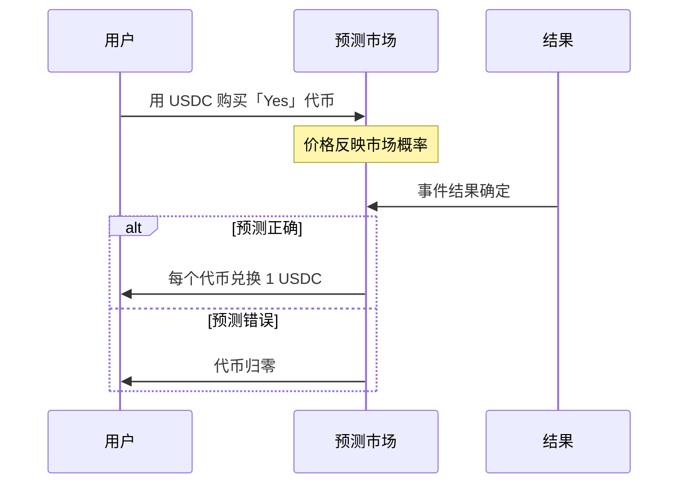

# 5.7 预测市场：Polymarket 与信息定价

> **学习目标**：完成本节后，你将能够：
> - 解释预测市场的运作原理和信息定价机制
> - 理解链上预测市场相比传统博彩的透明性优势
> - 了解 Polymarket 在 2024 美国大选中的出圈案例

---

## 核心内容

### 1. 什么是预测市场

**预测市场**是一种允许人们对未来事件结果进行交易的市场。它的核心功能是**用价格来表示概率**。

举个例子：
- 如果「特朗普赢得 2024 大选」的代币价格是 **$0.60**
- 意味着市场认为特朗普获胜的概率约为 **60%**

预测市场的神奇之处在于：**市场价格往往比专家预测更准确**。因为：
1. 参与者用真金白银下注，会认真研究
2. 汇集了成千上万人的分散信息
3. 错误的预测会被市场纠正（低估的上涨，高估的下跌）

> **类比理解**：预测市场就像是「用钱投票的民调」。民调可能有样本偏差，但预测市场让人们「把钱放在嘴边」，结果往往更可信。

### 2. 预测市场的运作原理

#### 2.1 基本机制

#### 2.2 价格 = 概率

| 代币价格 | 意味着 |
|---------|--------|
| $0.30 | 市场认为该结果发生概率约 30% |
| $0.50 | 市场认为概率约 50%（五五开） |
| $0.80 | 市场认为概率约 80%（很可能发生） |
| $0.95 | 市场认为几乎确定会发生 |

#### 2.3 盈利逻辑

假设你认为「事件 A 会发生」：
- 当前「Yes」代币价格：$0.40
- 你花 $40 买入 100 个代币
- **如果事件发生**：100 代币 × $1 = $100，盈利 $60
- **如果事件不发生**：代币归零，亏损 $40

关键洞察：**如果你认为真实概率高于市场价格，买入就是正期望的**。

### 3. Polymarket：链上预测市场

**Polymarket** 是目前最大的链上预测市场，运行在 Polygon 区块链上。

#### 3.1 为什么要上链

| 维度 | 传统博彩 | Polymarket（链上） |
|------|---------|-------------------|
| **资金托管** | 平台托管，可能跑路 | 智能合约托管，代码执行 |
| **赔率定价** | 庄家设定 | 市场供需决定 |
| **透明度** | 不透明 | 所有交易链上可查 |
| **结算** | 依赖平台信誉 | 自动结算，无需信任 |
| **准入** | 可能被拒绝服务 | 无需许可（有钱包即可） |

#### 3.2 Polymarket 的运作

1. **创建市场**：针对特定事件创建预测市场
2. **交易代币**：用户用 USDC 买卖结果代币
3. **价格发现**：买卖供需决定价格（概率）
4. **结果确认**：通过预言机（UMA）确认事件结果
5. **自动结算**：正确预测者获得 $1/代币

### 4. 案例：2024 美国大选

2024 年美国大选是 Polymarket 的**出圈时刻**。

#### 4.1 市场规模

- 大选相关交易量超过 **30 亿美元**
- 「总统选举」单一市场交易量超过 **10 亿美元**
- 数十万用户参与预测

#### 4.2 预测准确性

| 时间节点 | Polymarket 预测 | 民调预测 |
|---------|-----------------|---------|
| 选举前 1 个月 | 特朗普领先 | 势均力敌 |
| 选举前 1 周 | 特朗普 ~60% | 哈里斯微弱领先 |
| 选举当天 | 特朗普 ~65% | 误差范围内 |

**结果**：Polymarket 的预测比传统民调更准确，被《华尔街日报》、彭博社等主流媒体引用。

#### 4.3 为什么预测市场更准

1. **真金白银的激励**：民调受访者随口一说，预测市场参与者用钱投票
2. **信息聚合**：汇集了选民、分析师、内部人士等各方信息
3. **实时调整**：新信息出现后价格立即反应，民调需要时间更新
4. **反对者也参与**：即使不喜欢某候选人，认为他会赢的人也会押注

### 5. 预测市场的局限性

| 局限 | 说明 |
|------|------|
| **流动性问题** | 小众话题的市场可能流动性不足，价格不准确 |
| **操纵风险** | 大资金可能短期操纵价格影响舆论 |
| **法律灰区** | 在很多国家/地区，预测市场的法律地位不明 |
| **结果争议** | 某些事件的结果可能有争议，影响结算 |
| **非美国用户限制** | Polymarket 限制美国用户使用 |

---

## 案例/故事

### 从「赌博」到「信息工具」

长期以来，预测市场被视为一种「高级赌博」。但 2024 年大选改变了这一认知。

当传统民调显示哈里斯和特朗普势均力敌时，Polymarket 的价格却显示特朗普有明显优势。很多人质疑：「这只是赌徒的偏见吧？」

但选举结果证明了预测市场的价值。Polymarket 不仅预测对了结果，还准确预测了关键摇摆州的走向。

这引发了一个更深层的思考：**在一个信息爆炸的时代，如何找到可信的信息？**

传统方式依赖专家、民调、媒体。但专家可能有偏见，民调可能有样本误差，媒体可能有立场。

预测市场提供了另一种答案：**让人们用真金白银来表达判断，然后汇总这些判断形成价格**。这不是完美的，但它提供了一个去中心化的、有经济激励的信息聚合机制。

未来，预测市场可能不仅仅用于选举，还可能用于：
- 预测公司业绩（比华尔街分析师更准？）
- 预测科学发现（某项研究能否复制？）
- 预测政策效果（某项法案通过后会怎样？）

---

## 关键概念速查

| 概念 | 一句话解释 |
|-----|-----------|
| 预测市场 | 用价格表示概率的市场，参与者对未来事件下注 |
| 结果代币 | 代表某个预测结果的代币，正确时价值 $1，错误时归零 |
| 信息定价 | 通过市场机制将分散信息汇总为价格（概率） |
| Polymarket | 运行在 Polygon 上的最大链上预测市场 |
| UMA | 为 Polymarket 提供结果验证的预言机协议 |
| 流动性 | 市场中可供交易的资金量，影响价格准确性 |

---

## 学习资料

### 必读
- [什么是预测市场](https://academy.binance.com/zh/articles/what-is-a-prediction-market) - Binance Academy 入门教程（预计阅读 10 分钟）
- [Polymarket 官网](https://polymarket.com/) - 浏览真实的预测市场

### 选读（进阶）
- [Polymarket 学习中心](https://polymarket.com/learn) - 官方详细教程
- [预测市场的学术研究](https://www.sciencedirect.com/topics/economics-econometrics-and-finance/prediction-market) - 学术视角

---

## 学习任务

完成以下任务以检验学习效果：

- [ ] **任务 1**：解释预测市场的价格为什么能代表概率

> 提示：从「真金白银」「信息聚合」「错误会被纠正」三个角度思考

- [ ] **任务 2**：访问 [Polymarket](https://polymarket.com/)，找到一个你感兴趣的市场，记录：

| 项目 | 你的记录 |
|------|---------|
| 市场名称 | |
| 当前领先选项 | |
| 领先选项价格 | |
| 价格代表的概率 | |

> **提交方式**：将任务输出保存为学习笔记

---

## 常见问题 FAQ

**Q1: 预测市场和赌博有什么区别？**

A: 机制上类似，但目的和价值不同。赌博主要是娱乐，庄家设定赔率并从中获利。预测市场的核心价值是**信息发现**——通过经济激励汇集分散信息，形成对未来的集体判断。预测市场的价格是有信息量的信号。

**Q2: 有人能操纵预测市场吗？**

A: 短期可以，长期很难。如果某人大量买入推高价格，但预测是错的，他最终会亏钱，而其他人会从中获利。这种套利机制会纠正操纵行为。但流动性小的市场确实更容易被操纵。

**Q3: 我可以用 Polymarket 赚钱吗？**

A: 理论上可以，但请注意：1）这本质上是对未来事件的预测，有风险；2）你需要比市场更聪明才能持续盈利；3）非美国用户可以使用，但请了解当地法规；4）只用能承受损失的资金。

**Q4: 为什么 Polymarket 比民调更准？**

A: 几个原因：1）参与者有经济激励认真研究；2）汇集了更多元的信息来源；3）价格实时反映新信息；4）「反对某候选人但认为他会赢」的人也会参与（民调可能不会表达）。但预测市场也不是万能的，流动性、操纵风险等问题仍存在。

---

## 下一步

下一节我们将学习 [5.8 Meme 币现象解读](5.8-Meme币现象解读.md)，了解这个争议最大的加密货币现象。

---

最后更新：2025-01-09
编写：AI Assistant
审核：待审核
