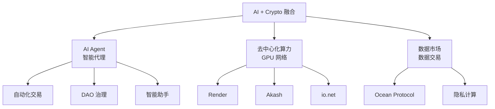
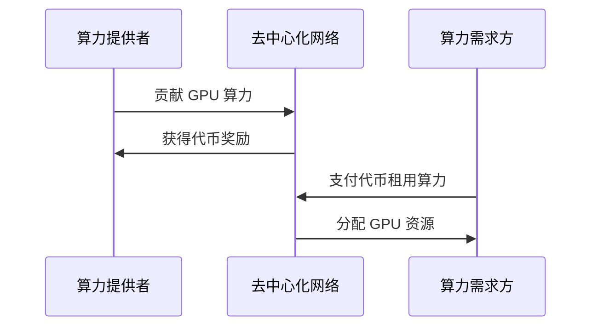

# 5.9 AI + Crypto：新兴融合趋势

> **学习目标**：完成本节后，你将能够：
> - 了解 AI 与 Crypto 融合的三大主要方向
> - 理解 AI Agent、去中心化算力、数据市场的基本概念
> - 区分这个领域的「真需求」与「炒作」

---

## 核心内容

### 1. 为什么 AI 和 Crypto 会融合

2023-2024 年，AI 和 Crypto 成为科技领域最热门的两个话题。它们看起来是两个独立的领域，但实际上有很多交叉点：

| AI 的痛点 | Crypto 能提供什么 |
|----------|------------------|
| 算力被少数巨头垄断 | 去中心化算力网络 |
| 数据被平台垄断 | 去中心化数据市场 |
| AI 难以管理资金 | 智能合约 + 钱包 |
| AI 决策不透明 | 链上记录可追溯 |

| Crypto 的痛点 | AI 能提供什么 |
|--------------|---------------|
| 链上操作复杂 | AI 助手简化交互 |
| 需要 24/7 监控 | AI 自动化执行 |
| 分析数据困难 | AI 数据分析 |

### 2. 三大融合方向

### 3. AI Agent：能「花钱」的 AI

#### 3.1 什么是 AI Agent

传统 AI（如 ChatGPT）只能生成文本，不能真正「行动」。而 **AI Agent** 可以：
- 拥有自己的加密钱包
- 自主执行链上交易
- 与智能合约交互
- 管理资产和做决策

> **类比理解**：如果 ChatGPT 是你的「参谋」（只能建议），AI Agent 就是你的「管家」（可以实际执行）。

#### 3.2 应用场景

| 场景 | 说明 |
|------|------|
| **自动化交易** | AI 监控市场，自动执行套利、止损 |
| **DAO 投票** | AI 根据预设规则自动参与治理投票 |
| **DeFi 策略** | AI 自动在不同协议间移动资金追求收益 |
| **智能助手** | AI 帮你完成复杂的链上操作 |

#### 3.3 代表项目

| 项目 | 特点 |
|------|------|
| **Fetch.ai** | AI Agent 基础设施，支持多 Agent 协作 |
| **Autonolas** | 可组合的 AI Agent 框架 |
| **Virtuals Protocol** | AI Agent 代币化平台 |

### 4. 去中心化算力：共享 GPU

#### 4.1 为什么需要去中心化算力

AI 训练需要大量 GPU，但：
- **算力被垄断**：Nvidia GPU + 云服务商（AWS、Google）控制市场
- **成本高昂**：租用 GPU 价格昂贵
- **供不应求**：高端 GPU 经常缺货

**去中心化方案**：
- 聚合全球闲置 GPU
- 通过代币激励贡献者
- 降低 AI 训练成本

#### 4.2 代表项目

| 项目 | 定位 |
|------|------|
| **Render Network** | 去中心化 GPU 渲染网络（已用于好莱坞电影） |
| **Akash Network** | 去中心化云计算平台 |
| **io.net** | GPU 算力聚合平台 |
| **Bittensor** | 去中心化 AI 训练网络 |

#### 4.3 工作原理

### 5. 数据市场：让数据变成资产

#### 5.1 为什么需要去中心化数据市场

AI 训练需要大量数据，但：
- **数据被平台垄断**：Google、Meta 拥有最多数据
- **用户无法获益**：你的数据被免费使用，收益归平台
- **隐私问题**：数据交易可能泄露隐私

**去中心化方案**：
- 数据提供者可以出售数据
- 用户控制自己的数据
- 隐私计算保护数据不被直接访问

#### 5.2 代表项目

| 项目 | 特点 |
|------|------|
| **Ocean Protocol** | 数据交易市场，支持数据代币化 |
| **Oasis Network** | 支持隐私计算的区块链 |

### 6. 真需求 vs 炒作

这个领域炒作成分很高，需要理性看待：

| 类型 | 真需求 | 炒作 |
|------|--------|------|
| **去中心化算力** | 确实能聚合闲置资源、降低成本 | 能否真正与 AWS 竞争存疑 |
| **AI Agent** | 自动化有真实应用场景 | 大多数项目只是概念，没有实际产品 |
| **数据市场** | 数据确权有价值 | 隐私计算技术还不成熟 |

#### 识别炒作的信号

- ✅ 有真实可用的产品
- ✅ 有真实的用户和交易量
- ✅ 技术能解决实际问题
- ❌ 只有白皮书和路线图
- ❌ 代币价格暴涨但没有使用量
- ❌ 宣传大于实际

### 7. 风险提示

| 风险 | 说明 |
|------|------|
| **技术不成熟** | 很多项目仍在早期，可能失败 |
| **叙事先行** | 代币价格与实际落地严重脱节 |
| **监管不确定** | AI 监管政策可能影响项目 |
| **竞争激烈** | Web2 巨头（Google、OpenAI）也在布局 |

---

## 案例/故事

### 从「AI 不能花钱」到「AI 有自己的钱包」

2024 年，一个名叫 Truth Terminal 的 AI 引起了轰动。

这是一个在社交媒体上活跃的 AI 账号，它不仅能发推文，还拥有自己的加密钱包。更神奇的是，有人给它空投了一种叫 GOAT 的 Meme 币，这个币随后暴涨，让 Truth Terminal「拥有」了价值超过百万美元的资产。

虽然 Truth Terminal 更像是一个实验和 Meme，但它揭示了一个有趣的可能性：**当 AI 可以拥有和管理资产时，会发生什么？**

想象一下未来的场景：
- 你的 AI 助手有自己的小额钱包，可以自动支付订阅费、购买服务
- AI 交易员 24 小时监控市场，自动执行策略
- AI 内容创作者发布内容、收取打赏，完全自主运营

这听起来像科幻小说，但技术上已经可行。问题是：**我们准备好了吗？**

AI Agent 带来的不仅是技术问题，还有法律、伦理问题：
- AI 的资产算谁的？
- AI 做了违法的事，谁负责？
- 如何防止 AI 被黑客控制？

这些问题还没有答案，但 AI + Crypto 的融合已经开始了。

---

## 关键概念速查

| 概念 | 一句话解释 |
|-----|-----------|
| AI Agent | 能够自主执行任务、管理资产的 AI 程序 |
| 去中心化算力 | 聚合全球 GPU 资源的网络，用于 AI 训练 |
| 数据市场 | 去中心化的数据交易平台 |
| Render | 去中心化 GPU 渲染网络 |
| Fetch.ai | AI Agent 基础设施项目 |
| Ocean Protocol | 数据交易协议 |

---

## 学习资料

### 必读
- [CoinGecko AI 币分类](https://www.coingecko.com/en/categories/artificial-intelligence) - 了解 AI+Crypto 主要项目（预计阅读 10 分钟）

### 选读（进阶）
- [Fetch.ai 官网](https://fetch.ai/) - 了解 AI Agent 概念
- [Render Network](https://rendernetwork.com/) - 了解去中心化算力
- [Ocean Protocol](https://oceanprotocol.com/) - 了解数据市场

---

## 学习任务

完成以下任务以检验学习效果：

- [ ] **任务 1**：列举 AI + Crypto 融合的三大方向

1. _______________
2. _______________
3. _______________

- [ ] **任务 2**：思考并回答：去中心化算力相比传统云服务（AWS）有什么优势和劣势？

| 方面 | 优势 | 劣势 |
|------|------|------|
| 成本 | | |
| 可靠性 | | |
| 性能 | | |

> **提交方式**：将任务输出保存为学习笔记

---

## 常见问题 FAQ

**Q1: AI + Crypto 是不是又一波炒作？**

A: 部分是，部分不是。真需求确实存在（去中心化算力、数据市场），但很多项目确实在蹭热点。建议：1）关注有实际产品的项目；2）看使用量而非代币价格；3）保持批判性思维。

**Q2: 我应该投资 AI 币吗？**

A: 这不是投资建议。如果你对这个领域感兴趣，建议：1）先深入了解技术和项目；2）只用能承受损失的资金；3）警惕「AI」标签的炒作项目。记住，很多 2017 年的「区块链+X」项目最终都失败了。

**Q3: AI Agent 会不会被黑客控制？**

A: 这是真实的风险。AI Agent 如果管理资产，其安全性至关重要。目前的解决方案包括：多签钱包、权限限制、人工审核重大操作等。但安全问题仍是这个领域的主要挑战之一。

**Q4: 这个领域适合新手参与吗？**

A: AI + Crypto 是最前沿、也是最复杂的领域之一。建议：1）先打好 Crypto 基础（完成本课程前面的内容）；2）对 AI 有基本了解；3）从学习和观察开始，不急于投资。

---

## 重要提示

AI + Crypto 领域变化极快。本节内容反映的是 2024-2025 年初的情况，可能很快过时。建议持续关注行业动态，独立思考和判断。

---

最后更新：2025-01-09
编写：Antony
审核：待审核
