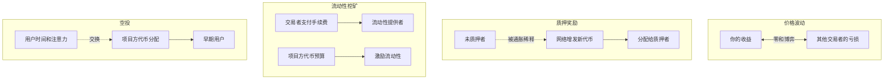

# 6.1 Web3 收益从哪里来

> **学习目标**：完成本节后，你将能够……
> - 识别 Web3 世界中四种主要的收益来源
> - 区分零和博弈与正和博弈的收益模式
> - 建立「收益来源不明 = 你可能就是收益来源」的风险意识

---

## 核心内容

### 1. 收益的四大来源

在 Web3 世界里，你听到的「赚钱机会」基本都可以归类到以下四种来源：

#### 价格波动收益（Trading）

最直接的赚钱方式：低买高卖。

你买了一个代币，等它涨了再卖掉，中间的差价就是你的收益。这听起来简单，但有一个残酷的事实：**你赚的钱，就是别人亏的钱**。

这是一个典型的**零和博弈**——如果算上交易手续费和滑点，其实是**负和博弈**。

#### 质押奖励（Staking）

将你的代币锁定到区块链网络中，帮助维护网络安全，获得网络发行的新代币作为奖励。

以以太坊为例：质押 ETH 参与验证，年化收益率约 3-5%。这个收益来自哪里？来自**网络增发的新代币**。

> **Tips**：质押收益本质上是网络对验证者的「工资」，这个工资来自通胀。如果你不质押，你的持仓会被通胀稀释。

#### 流动性挖矿（Yield Farming）

在去中心化交易所（DEX）中提供流动性，赚取交易手续费分成和平台代币奖励。

收益来源：
1. **手续费分成**：用户在 DEX 交易时支付的手续费（通常 0.3%）
2. **平台代币奖励**：项目方为吸引流动性发放的激励代币

#### 空投激励（Airdrop）

项目方为了获取用户、建立社区，免费发放代币给早期参与者。

收益来源：项目方自己的代币分配预算。本质上是**用户「注意力」和「时间」的变现**。

---

### 2. 收益的本质：钱从哪里来？

让我们用一张图来理解不同收益来源的资金流向：

> **核心问题**：在任何收益机会面前，先问自己——这个收益是从谁的口袋里来的？

---

### 3. 零和博弈 vs 正和博弈

| 类型 | 定义 | Web3 示例 | 风险提示 |
|-----|------|----------|---------|
| **零和博弈** | 一方获利 = 另一方亏损 | 价格投机、合约交易 | 你赚的就是别人亏的 |
| **负和博弈** | 加入摩擦成本后，整体为负 | 高频交易（含手续费） | 交易所/MEV 永远赚 |
| **正和博弈** | 通过价值创造，整体增值 | 长期持有优质资产 | 需要识别真实价值 |

**关键洞察**：

- 大部分交易行为都是**零和或负和**博弈
- 只有当你提供了真实价值（如流动性对应真实交易需求），才可能参与正和博弈
- 当所有人都在「挖矿」赚代币时，问问自己：这些代币的买家在哪里？

---

### 4. 核心警示：收益来源不明 = 你可能就是收益来源

这是 Web3 世界最重要的一条生存法则。

当你看到一个项目宣传「年化 100%」「稳定收益」「零风险」时，请立即问自己：

1. **这个收益从哪里来？** —— 是交易手续费？网络通胀？项目方补贴？还是新用户的钱？
2. **这个模式可持续吗？** —— 如果依赖新用户入场，那就是庞氏模型
3. **我在食物链的哪个位置？** —— 我是早期参与者还是接盘侠？

> **Tips**：如果你找不到收益的来源，大概率你就是那个来源。

---

## 案例/故事

### Anchor Protocol：20% 稳定收益的幻灭

2021-2022 年，Terra 生态的 Anchor Protocol 承诺 UST 稳定币存款可获得约 20% 的年化收益。

**看起来的收益来源**：借贷利息 + 质押收益

**实际情况**：借款人支付的利息远低于 20%，缺口由 Terra 基金会补贴。这意味着：
- 收益并非来自可持续的商业模式
- 而是来自项目方的「撒钱」和后来者的资金

**结果**：2022 年 5 月，UST 脱锚，Luna 崩盘，400 亿美元市值蒸发。那些追求「稳定 20% 收益」的用户，最终损失了本金的 99%。

**教训**：20% 的「稳定收益」本身就是一个巨大的红旗。真正稳定的收益，在传统金融中只有 3-5%。

---

## 关键概念速查

| 概念 | 一句话解释 |
|-----|-----------|
| 零和博弈 | 你赚的钱就是别人亏的钱，整体财富不变 |
| 正和博弈 | 通过价值创造，参与者可以共同获益 |
| 质押（Staking） | 锁定代币参与网络共识，获得网络增发的代币奖励 |
| 流动性挖矿 | 为 DEX 提供资金流动性，赚取手续费和代币激励 |
| 空投（Airdrop） | 项目方免费发放代币以获取用户和建立社区 |
| 网络通胀 | 区块链网络增发新代币，稀释现有持币人的份额 |

---

## 学习资料

### 必读
- [What Is Yield Farming in DeFi](https://academy.binance.com/en/articles/what-is-yield-farming-in-decentralized-finance-defi) - Binance Academy - 流动性挖矿基础概念（预计 10 分钟）
- [What Is Staking](https://academy.binance.com/en/articles/what-is-staking) - Binance Academy - 质押机制入门（预计 8 分钟）

### 选读（进阶）
- [Ethereum Staking](https://ethereum.org/en/staking/) - 以太坊官方质押说明
- [DefiLlama Yields](https://defillama.com/yields) - 实时查看各协议收益率
- [Where Does Yield Come From?](https://newsletter.banklesshq.com/p/where-does-yield-come-from) - Bankless - 深度分析收益来源

---

## 学习任务

完成以下任务以检验学习效果：

- [ ] **任务 1**：选择一个你听说过的「高收益」项目，用一句话回答：这个收益从哪里来？
- [ ] **任务 2**：打开 [DefiLlama Yields](https://defillama.com/yields)，找到 3 个年化收益超过 50% 的项目，分析它们的收益来源是否可持续

> **提交方式**：将分析结果整理成笔记

---

## 常见问题 FAQ

**Q1: 质押收益是不是「真实收益」？**

A: 质押收益来自网络增发的新代币。如果你质押了，你获得了新代币；如果你没质押，你的持仓被通胀稀释。从这个角度看，质押收益更像是「抵抗通胀」，而非凭空产生的收益。

**Q2: 所有高收益都是骗局吗？**

A: 不是。早期项目可能通过高激励吸引用户，这是合理的获客成本。关键是区分：
- **有明确来源的高收益**：项目方补贴、交易手续费分成
- **无法解释的高收益**：可能是庞氏模型

**Q3: 空投算「免费的钱」吗？**

A: 表面上是免费的，但你付出了时间和注意力。更重要的是，空投代币能否变现取决于：
1. 项目是否有真实价值
2. 你能否在价格下跌前卖出
3. 是否有足够的买家接盘

---

最后更新：2025-01-09
编写：AI 辅助
审核：待审核
