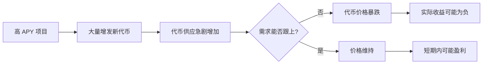
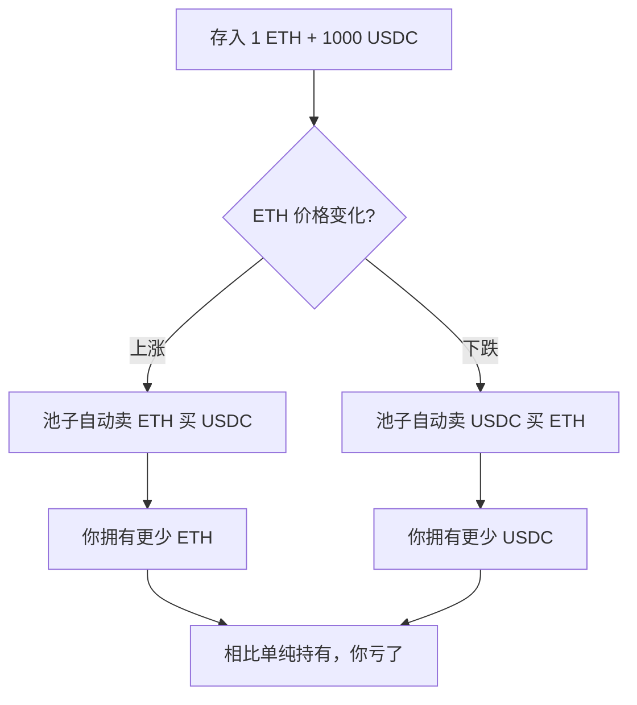

# 6.2 高 APY 的真实含义

> **学习目标**：完成本节后，你将能够……
> - 区分 APY 和 APR，理解复利的影响
> - 识别高 APY 背后的代币通胀稀释机制
> - 理解无常损失的基本概念和发生条件

---

## 核心内容

### 1. APY vs APR：同样的收益，不同的数字

当你看到一个项目宣传「1000% APY」时，这个数字到底意味着什么？

**APR（Annual Percentage Rate）**：年利率，简单计算，不考虑复利
- 如果 APR 是 100%，投入 $1000，一年后利息是 $1000

**APY（Annual Percentage Yield）**：年化收益率，考虑复利效应
- 如果日复利，同样 100% APR 对应的 APY ≈ 171.5%

| 复利频率 | 100% APR 对应的 APY |
|---------|-------------------|
| 年复利 | 100% |
| 月复利 | 161.3% |
| 日复利 | 171.5% |
| 秒复利 | 171.8% |

> **Tips**：DeFi 项目几乎都展示 APY 而非 APR，因为数字更大、更吸引人。当你看到「超高 APY」时，先在心里打个折扣。

---

### 2. 高 APY 的真相：你赚的是代币，不是钱

这是理解高收益项目最重要的一点：

**APY 衡量的是你获得的代币数量增长，而不是你的美元价值增长。**

让我们做一个简单的计算：

#### 案例：10000% APY 的真实收益

假设你投入 $1000 到一个标榜 10000% APY 的项目：

| 场景 | 一年后代币数量 | 代币价格变化 | 实际美元价值 | 收益率 |
|-----|--------------|-------------|-------------|-------|
| 理想情况 | 100x | 不变 | $100,000 | +9900% |
| 现实情况1 | 100x | 跌 99% | $1,000 | 0% |
| 现实情况2 | 100x | 跌 99.5% | $500 | -50% |
| 常见情况 | 100x | 跌 99.9% | $100 | -90% |

**关键洞察**：10000% APY 意味着代币供应量要增长 100 倍。如果市场需求没有同步增长 100 倍，代币价格必然暴跌。

---

### 3. APY 风险等级对照表

根据历史数据和行业经验，我们可以建立一个风险评估框架：

| APY 范围 | 风险等级 | 典型来源 | 注意事项 |
|---------|---------|---------|---------|
| 0-10% | 低 | ETH 质押、主流借贷协议 | 相对可持续，仍需关注协议风险 |
| 10-50% | 中 | 流动性挖矿、新兴协议 | 需评估代币价格下跌风险 |
| 50-100% | 高 | 高激励期、小币种 | 代币可能大幅贬值 |
| 100-500% | 很高 | 新项目冷启动、高风险池 | 极大概率亏损本金 |
| 500%+ | 极高 | 庞氏/土狗项目、短期激励 | 几乎必然是陷阱或即将崩盘 |

> **Tips**：传统金融中，无风险利率（如美国国债）约 4-5%。任何显著高于这个数字的收益，都需要承担相应的风险。

---

### 4. 无常损失：流动性提供者的隐藏成本

如果你打算在 DEX（如 Uniswap）中提供流动性来赚取手续费，你需要了解**无常损失（Impermanent Loss）**。

#### 什么是无常损失？

当你向流动性池中存入两种代币后，如果这两种代币的价格比发生变化，你取出资产时的价值会**低于**单纯持有这两种代币的价值。

#### 简化示例

假设你存入 1 ETH + 1000 USDC（当时 ETH = $1000）

| 场景 | ETH 价格变化 | 持有价值 | LP 价值 | 无常损失 |
|-----|-------------|---------|--------|---------|
| ETH 涨 25% | $1250 | $2250 | $2236 | 0.6% |
| ETH 涨 50% | $1500 | $2500 | $2449 | 2.0% |
| ETH 涨 100% | $2000 | $3000 | $2828 | 5.7% |
| ETH 跌 50% | $500 | $1500 | $1414 | 5.7% |
| ETH 涨 200% | $3000 | $4000 | $3464 | 13.4% |

#### 无常损失的关键点

1. **价格变化越大，损失越大**：价格变化 100%，损失约 5.7%
2. **双向都有损失**：无论涨跌，只要价格变化就有损失
3. **「无常」的含义**：如果价格恢复原位，损失消失
4. **实际损失取决于**：无常损失 vs 交易手续费收入

> **Tips**：只有当交易手续费收入 > 无常损失时，提供流动性才是划算的。对于波动大的交易对，这通常很难做到。

---

## 案例/故事

### OlympusDAO：(3,3) 的神话与崩塌

2021 年下半年，OlympusDAO 以其「(3,3)」叙事和超高 APY（一度超过 8000%）吸引了大量资金。

**项目宣传**：
- 质押 OHM 代币，获得超高 APY
- 「(3,3)」博弈论：所有人质押，所有人获益

**实际发生的事**：
1. OHM 代币从最高 $1400+ 跌至 $20 以下
2. 尽管代币数量确实增长了数十倍
3. 以美元计价，大部分投资者亏损超过 90%

**教训**：
- 8000% APY 意味着代币供应量一年增长 80 倍
- 没有 80 倍的需求增长，价格崩盘是必然的
- 「大家都赢」的博弈论在现实中不存在

---

## 关键概念速查

| 概念 | 一句话解释 |
|-----|-----------|
| APR | 年利率，不考虑复利的简单利率 |
| APY | 年化收益率，考虑复利效应，通常数字更大 |
| 代币通胀 | 项目增发新代币，导致现有代币价值被稀释 |
| 无常损失 | 提供流动性后，因价格变化导致的资产价值损失 |
| 流动性池 | DEX 中存放交易对代币的资金池 |
| 复利 | 利息再投入产生利息，利滚利 |

---

## 学习资料

### 必读
- [What Is APY and How Is It Calculated](https://academy.binance.com/en/articles/what-is-apy-and-how-is-it-calculated) - Binance Academy - APY 计算入门（预计 8 分钟）
- [Impermanent Loss Explained](https://academy.binance.com/en/articles/impermanent-loss-explained) - Binance Academy - 无常损失详解（预计 10 分钟）

### 选读（进阶）
- [Yield Farming Risks](https://finematics.com/) - Finematics - 流动性挖矿风险分析
- [DefiLlama Yields](https://defillama.com/yields) - 实时查看各协议收益率
- [Impermanent Loss Calculator](https://dailydefi.org/tools/impermanent-loss-calculator/) - 无常损失计算器

---

## 学习任务

完成以下任务以检验学习效果：

- [ ] **任务 1**：使用无常损失计算器，计算当 ETH 价格上涨 50% 时，ETH/USDC 流动性池的无常损失是多少
- [ ] **任务 2**：在 DefiLlama Yields 上找到一个 APY 超过 100% 的项目，分析其代币过去一个月的价格走势，计算「代币数量收益」和「美元价值收益」的差异

> **提交方式**：将计算结果和分析截图整理成笔记

---

## 常见问题 FAQ

**Q1: 是不是 APY 越高越好？**

A: 绝对不是。APY 只衡量代币数量的增长，不反映代币价格变化。一个 1000% APY 但代币跌 99% 的项目，不如一个 10% APY 但代币价格稳定的项目。

**Q2: 无常损失可以避免吗？**

A: 可以减少，但难以完全避免：
- 选择波动较小的交易对（如稳定币对）
- 使用提供无常损失保护的协议
- 只在预期手续费收入 > 无常损失时提供流动性

**Q3: 为什么 DeFi 项目要给这么高的 APY？**

A: 因为他们需要吸引流动性来启动项目。高 APY 是一种「获客成本」，本质上是项目方在用代币换取用户和资金。问题是，当激励结束或代币价格下跌，流动性就会离开。

---

## 下一步

理解了高 APY 的真相后，下一节我们将揭示 Web3 中最危险的结构——庞氏模型和常见的「割人」套路。

→ 继续学习 [6.3 常见割人结构与庞氏模型](6.3-常见割人结构与庞氏模型.md)

---

最后更新：2025-01-09
编写：AI 辅助
审核：待审核
