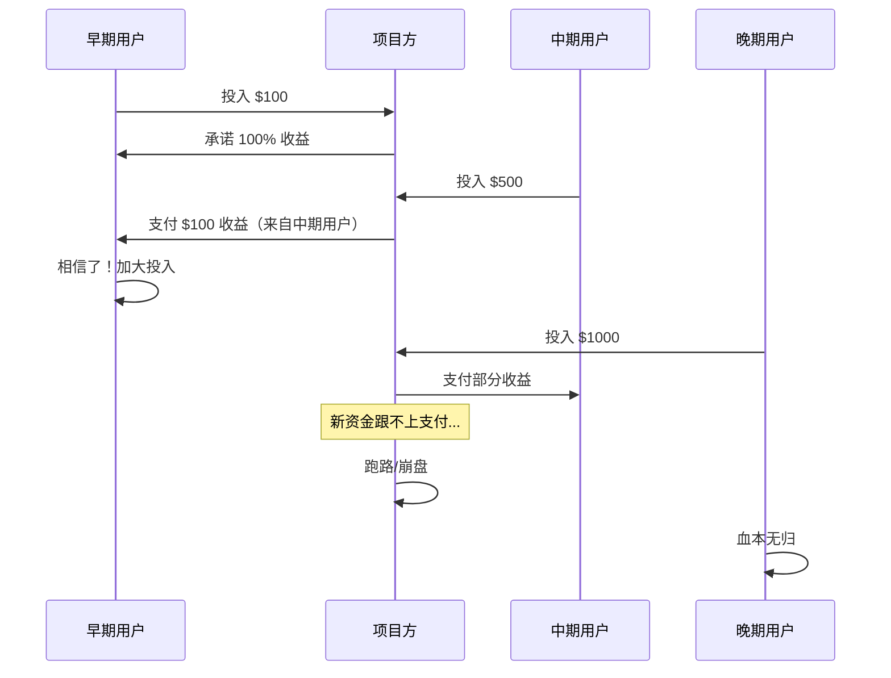
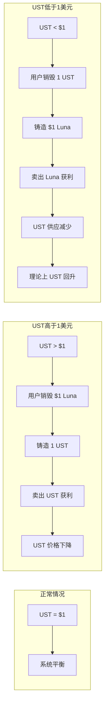
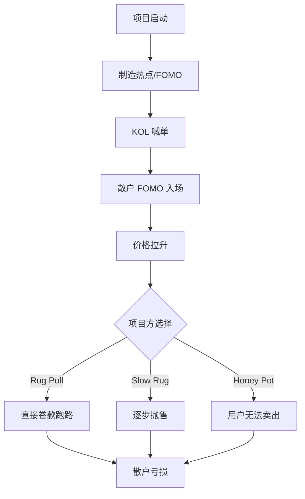

# 6.3 常见割人结构与庞氏模型

> **学习目标**：完成本节后，你将能够……
> - 识别庞氏模型的核心特征
> - 理解 Luna/UST 崩盘和 FTX 暴雷的关键教训
> - 识别常见的「土狗」项目特征

---

## 核心内容

### 1. 什么是庞氏模型？

庞氏模型（Ponzi Scheme）是一种用后来者资金支付早期参与者收益的骗局，以 1920 年代的骗子 Charles Ponzi 命名。

**核心特征**：
- 承诺高额、稳定的回报
- 收益不来自真实的商业活动
- 依赖持续的新资金流入
- 当新资金跟不上时，必然崩盘

### 2. 庞氏模型识别清单

在投资任何项目前，对照以下清单检查：

| 警示信号 | 具体表现 | 风险等级 |
|---------|---------|---------|
| 收益来源不明 | 无法清晰解释收益从哪来 | 极高 |
| 承诺固定高收益 | 「稳定 20%」「保本保息」 | 极高 |
| 依赖拉新 | 推荐奖励、层级分佣 | 高 |
| 锁仓机制 | 强制锁仓、提款困难 | 高 |
| 团队匿名 | 无法验证真实身份 | 高 |
| 代码不透明 | 未开源、未审计 | 中高 |
| FOMO 营销 | 「限时」「即将关闭」 | 中 |

> **Tips**：满足 3 个以上警示信号的项目，建议直接远离。

---

### 3. 案例复盘：Luna/UST 崩盘

#### 背景

Terra 是一个专注于算法稳定币的区块链项目，其核心产品包括：
- **UST**：算法稳定币，目标锚定 $1
- **Luna**：Terra 的原生代币，用于治理和套利机制
- **Anchor Protocol**：提供 UST 约 20% 年化收益的借贷协议

#### 机制原理

UST 的锚定机制依赖与 Luna 的套利：

**致命缺陷**：当市场恐慌时，大量 UST 被赎回，系统铸造天量 Luna，Luna 价格暴跌，进一步动摇信心，形成**死亡螺旋**。

#### 崩盘时间线

| 日期 | 事件 | UST 价格 | Luna 价格 |
|-----|------|---------|----------|
| 5月7日 | 大额 UST 抛售开始 | $0.98 | $80 |
| 5月9日 | UST 首次严重脱锚 | $0.60 | $30 |
| 5月10日 | Luna Foundation Guard 动用储备 | $0.90（短暂） | $25 |
| 5月11日 | 死亡螺旋形成 | $0.30 | $1 |
| 5月12日 | Luna 超发，价格归零 | $0.10 | $0.0001 |
| 5月13日 | 区块链暂停 | 接近 $0 | 接近 $0 |

**损失规模**：约 **400 亿美元**市值蒸发

#### 核心教训

1. **算法稳定币有内在缺陷**：当信心崩塌，没有硬资产支撑的锚定无法维持
2. **20% 收益不可持续**：Anchor 的高收益靠补贴维持，是典型的庞氏特征
3. **「不可能三角」**：去中心化 + 稳定性 + 资本效率，三者难以兼得

---

### 4. 案例复盘：FTX 暴雷

#### 背景

FTX 是当时全球第二大加密货币交易所，创始人 Sam Bankman-Fried（SBF）被誉为「加密货币界的摩根大通」，获得红杉、软银等顶级机构投资。

#### 崩盘时间线

| 日期 | 事件 |
|-----|------|
| 11月2日 | CoinDesk 报道 Alameda 资产负债表问题 |
| 11月6日 | Binance 宣布抛售持有的 FTT 代币 |
| 11月7日 | FTX 遭遇挤兑，暂停提款 |
| 11月8日 | Binance 宣布收购 FTX（后反悔） |
| 11月10日 | Binance 放弃收购，FTX 资金缺口曝光（约 80 亿美元） |
| 11月11日 | FTX 申请破产 |
| 11月12日 | SBF 辞职，约 3.7 亿美元被「黑客」盗取 |

#### 问题根源

1. **挪用客户资金**：用户存款被转移给 Alameda Research 用于高风险交易
2. **财务造假**：资产负债表严重失实
3. **关联交易**：FTX 和 Alameda 之间存在不当利益输送
4. **缺乏监管**：公司内控形同虚设

#### 核心教训

1. **Not your keys, not your coins**：资产放在交易所 = 信任交易所
2. **顶级机构背书不等于安全**：红杉、软银都被骗了
3. **监管套利有代价**：FTX 选择在监管宽松的地方注册是有原因的

---

### 5. 土狗项目识别指南

「土狗」是对质量低劣、很可能跑路的小项目的俗称。以下是常见特征：

#### 典型土狗项目检查清单

| 特征类别 | 危险信号 | 如何验证 |
|---------|---------|---------|
| **团队** | 匿名、无法验证身份 | LinkedIn、Twitter 历史 |
| **代码** | 未开源、未审计或假审计 | GitHub、审计报告真伪 |
| **代币分布** | 团队持币超过 20% | 查看链上持仓分布 |
| **合约权限** | 管理员可无限增发、暂停交易 | 阅读合约或审计报告 |
| **流动性** | 流动性未锁定或锁定期很短 | 查看 LP 锁定情况 |
| **社区** | 禁言、删帖、只允许正面评论 | 观察 Discord/Telegram |
| **宣传** | 复制粘贴的白皮书、蹭热点 | 对比其他项目文档 |

#### 常见「割人」套路

**常见套路解释**：

1. **Rug Pull（抽地毯）**：项目方突然撤走流动性，代币价格归零
2. **Slow Rug（慢跑路）**：项目方逐步抛售持仓，价格缓慢下跌
3. **Honey Pot（蜜罐）**：合约设置使用户只能买入无法卖出

---

## 关键概念速查

| 概念 | 一句话解释 |
|-----|-----------|
| 庞氏模型 | 用新投资者的钱支付旧投资者收益，必然崩盘 |
| 算法稳定币 | 通过算法和套利机制而非储备资产维持锚定的稳定币 |
| 死亡螺旋 | 价格下跌→恐慌抛售→价格进一步下跌的恶性循环 |
| Rug Pull | 项目方撤走流动性跑路，代币价格归零 |
| Honey Pot | 只能买入无法卖出的骗局合约 |
| FOMO | Fear Of Missing Out，错失恐惧，害怕错过机会 |

---

## 学习资料

### 必读
- [How to Spot Scams in DeFi](https://academy.binance.com/en/articles/how-to-spot-scams-in-decentralized-finance-defi) - Binance Academy - 识别 DeFi 骗局（预计 12 分钟）
- [The Crypto Collapse Explained](https://www.nytimes.com/2022/05/18/technology/terra-luna-cryptocurrency-do-kwon.html) - NYT - Terra 崩盘分析（预计 10 分钟）

### 选读（进阶）
- [FTX Collapse Timeline](https://www.coindesk.com/business/2022/11/10/from-sams-empire-to-bankruptcy-the-ftx-timeline/) - CoinDesk - FTX 暴雷始末
- [Rug Pull 数据分析](https://www.chainalysis.com/blog/2022-biggest-year-ever-for-crypto-hacking/) - Chainalysis
- [Token Sniffer](https://tokensniffer.com/) - 代币安全检查工具

---

## 学习任务

完成以下任务以检验学习效果：

- [ ] **任务 1**：选择一个失败案例（Luna/UST、FTX、或你知道的某个土狗项目），用 3 点总结「它为什么会崩」
- [ ] **任务 2**：使用 Token Sniffer 或类似工具，检查一个你感兴趣的代币，记录其安全评分和主要风险点

> **提交方式**：将分析结果整理成 200 字以内的笔记

---

## 常见问题 FAQ

**Q1: Luna/UST 是故意骗人还是设计失败？**

A: 这存在争议。从机制设计看，算法稳定币确实有内在缺陷；但 Anchor 的 20% 收益明显不可持续，项目方应该清楚这一点。最终，数十万用户损失惨重，而创始人 Do Kwon 面临多国司法追诉。

**Q2: 如何确认一个项目是不是土狗？**

A: 没有 100% 确定的方法，但可以降低风险：
1. 检查团队身份（实名 > 匿名）
2. 查看代码审计（知名审计公司 > 无审计）
3. 分析代币分布（分散 > 集中）
4. 观察社区氛围（允许讨论 > 删帖禁言）

**Q3: 「顶级机构投资」能说明什么？**

A: FTX 告诉我们：不能说明太多。顶级 VC 也会犯错，也会被精心包装的骗局欺骗。机构背书是参考因素，但不是安全保证。

---

## 下一步

了解了明面上的骗局后，下一节我们将揭示一种你可能从未意识到的损失来源——MEV 与隐性交易成本。

→ 继续学习 [6.4 MEV 与隐性交易成本](6.4-MEV与隐性交易成本.md)

---

最后更新：2025-01-09
编写：AI 辅助
审核：待审核
