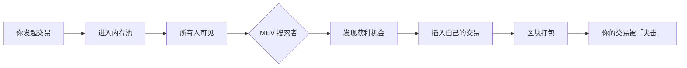
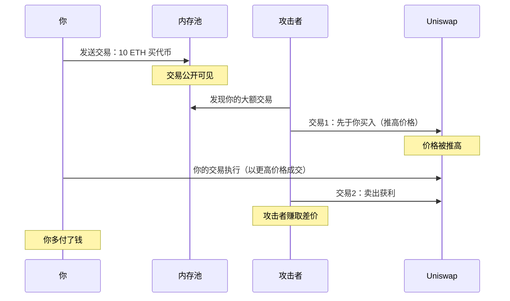

# 6.4 MEV 与隐性交易成本

> **学习目标**：完成本节后，你将能够……
> - 理解 MEV（最大可提取价值）的基本概念
> - 识别三明治攻击和抢跑交易对普通用户的影响
> - 掌握减少 MEV 损失的基本方法

---

## 核心内容

### 1. 什么是 MEV？

MEV（Maximal Extractable Value，最大可提取价值）是指区块生产者（验证者/矿工）通过控制交易顺序可以获取的额外价值。

简单理解：**你在链上的每一笔交易，都可能被人「偷看」并从中牟利**。

#### 为什么会存在 MEV？

当你发起一笔交易时，它首先进入「内存池」（Mempool），等待被打包进区块。在这个等待期间：

1. 所有人都能看到你的交易
2. 区块生产者决定交易的排列顺序
3. 有人可能会利用这个信息来获利

---

### 2. 三明治攻击：最常见的 MEV

三明治攻击是普通用户最容易遭遇的 MEV 类型。

#### 攻击原理

假设你想在 Uniswap 上用 10 ETH 买入某代币：

#### 具体数字示例

| 步骤 | 操作 | 代币价格 | 结果 |
|-----|------|---------|------|
| 初始 | - | $100 | - |
| 攻击者买入 | 买 100 个 | $100→$102 | 攻击者持有 100 个 |
| 你的交易 | 买 1000 个 | $102→$110 | 你以更高均价买入 |
| 攻击者卖出 | 卖 100 个 | $110→$109 | 攻击者获利约 $800 |

**你的损失**：本来可以 $100 买入，现在 $102 买入，每个代币多付了 $2。

---

### 3. 抢跑交易：谁快谁赢

抢跑（Front-running）是指有人看到你的交易后，用更高的 Gas 费抢先执行类似交易。

#### 常见场景

| 场景 | 你的交易 | 抢跑者的行动 |
|-----|---------|-------------|
| 套利 | 发现两个 DEX 价差 | 抢先执行套利，利润被抢 |
| NFT 铸造 | 铸造热门 NFT | 抢先铸造，你可能铸造失败 |
| 清算 | 发现可清算仓位 | 抢先清算，赚取清算奖励 |

#### 为什么抢跑能成功？

在区块链上，Gas 费更高的交易优先被打包。攻击者只需要支付比你更高的 Gas 费，就能排在你前面。

---

### 4. MEV 的规模有多大？

根据 Flashbots 数据，自 2020 年以来：

- 以太坊上被提取的 MEV 总量超过 **6 亿美元**
- 每天约有 **数百万美元** 的 MEV 被提取
- 普通用户每笔大额交易可能损失 **0.5-2%**

> **Tips**：MEV 就像是链上交易的「隐形税」。你可能从未意识到，但每次交易都可能在不知不觉中损失一部分价值。

---

### 5. 如何减少 MEV 损失？

作为普通用户，以下方法可以帮助减少 MEV 损失：

#### 方法 1：使用私有交易池

**Flashbots Protect**：将交易发送到私有通道，不经过公开内存池

| 对比 | 普通交易 | Flashbots Protect |
|-----|---------|------------------|
| 内存池 | 公开可见 | 私有，仅验证者可见 |
| 三明治攻击风险 | 高 | 低 |
| 失败成本 | 仍需付 Gas | 失败不付 Gas |

**使用方法**：在 MetaMask 中添加自定义 RPC → https://rpc.flashbots.net

#### 方法 2：降低滑点容忍度

滑点设置越高，三明治攻击空间越大。

| 滑点设置 | 三明治攻击空间 | 建议场景 |
|---------|--------------|---------|
| 0.5% | 小 | 主流交易对 |
| 1% | 中 | 一般交易 |
| 5%+ | 大，容易被攻击 | 尽量避免 |

#### 方法 3：拆分大额交易

一次性交易 100 ETH → 容易被发现和攻击
分 10 次交易，每次 10 ETH → 攻击成本上升，收益下降

#### 方法 4：使用 DEX 聚合器

如 1inch、CoW Swap 等聚合器提供一定的 MEV 保护：
- 1inch Fusion：使用私有订单流
- CoW Swap：批量撮合，减少 MEV

#### 方法 5：选择合适的交易时间

网络拥堵时，MEV 活动更频繁。如果不急，可以等待链上活动较少的时候交易。

---

## 案例/故事

### 一次真实的三明治攻击

2023 年某用户在 Uniswap 上用 50 ETH 购买某代币：

**预期**：以约 $1.00 的价格买入 150,000 个代币

**实际发生的事**：
1. 攻击者在 Mempool 发现这笔交易
2. 攻击者先用 5 ETH 买入，价格从 $1.00 升至 $1.02
3. 用户交易执行，以 $1.02-$1.10 的价格买入
4. 攻击者卖出，价格回落

**结果**：
- 用户比预期少获得约 5,000 个代币（价值约 $5,000）
- 攻击者获利约 $3,000（扣除 Gas 费后）

**教训**：大额交易前，考虑使用 Flashbots Protect 或拆分交易。

---

## 关键概念速查

| 概念 | 一句话解释 |
|-----|-----------|
| MEV | 区块生产者通过控制交易顺序可获取的额外价值 |
| 内存池（Mempool） | 待打包交易的等候区，所有人可见 |
| 三明治攻击 | 在用户交易前后各插入一笔交易，操纵价格获利 |
| 抢跑（Front-running） | 用更高 Gas 费抢先执行有利可图的交易 |
| 滑点 | 预期成交价与实际成交价的差异 |
| 私有交易池 | 不经过公开内存池的交易通道 |

---

## 学习资料

### 必读
- [What Is MEV](https://academy.binance.com/en/articles/what-is-maximal-extractable-value-mev) - Binance Academy - MEV 入门解释（预计 10 分钟）
- [Ethereum MEV](https://ethereum.org/en/developers/docs/mev/) - 以太坊官方 - MEV 技术解读（预计 15 分钟）

### 选读（进阶）
- [Flashbots Protect](https://protect.flashbots.net/) - MEV 保护工具使用指南
- [MEV Explore](https://explore.flashbots.net/) - 实时 MEV 数据
- [EigenPhi](https://eigenphi.io/) - MEV 交易分析平台

---

## 学习任务

完成以下任务以检验学习效果：

- [ ] **任务 1**：在 MetaMask 中添加 Flashbots RPC（https://rpc.flashbots.net），了解私有交易的使用流程
- [ ] **任务 2**：访问 [MEV Explore](https://explore.flashbots.net/)，查看过去 24 小时以太坊上被提取的 MEV 总量

> **提交方式**：截图记录操作过程

---

## 常见问题 FAQ

**Q1: 使用中心化交易所（CEX）会有 MEV 问题吗？**

A: 不会。MEV 只存在于链上交易。在 CEX 中，交易在交易所内部撮合，不经过区块链，因此没有 MEV 问题。

**Q2: 小额交易也会被三明治攻击吗？**

A: 理论上可以，但攻击者需要支付 Gas 费。如果你的交易金额太小，攻击者的利润可能无法覆盖成本，因此小额交易被攻击的风险较低。

**Q3: MEV 完全是坏事吗？**

A: 不完全是。某些 MEV 行为（如跨 DEX 套利）实际上有助于市场价格同步，提高市场效率。问题在于三明治攻击等直接损害用户利益的行为。

---

最后更新：2025-01-09
编写：AI 辅助
审核：待审核
