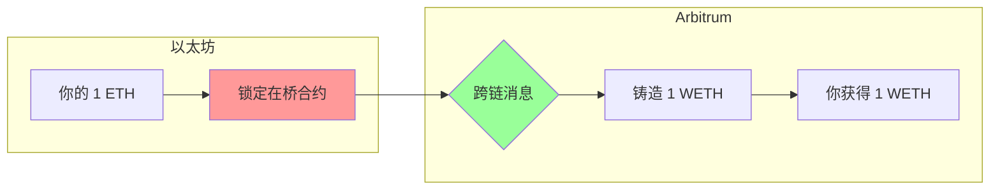
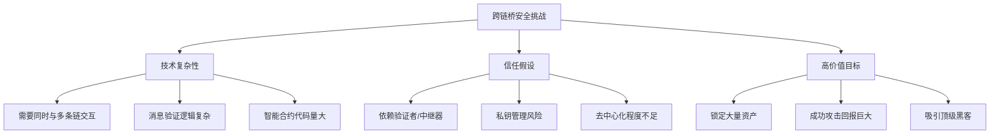

# 6.5 跨链桥使用与风险

> **学习目标**：完成本节后，你将能够……
> - 理解跨链桥的基本工作原理
> - 了解历史上重大的跨链桥安全事件
> - 掌握使用跨链桥时的风险防范方法

---

## 核心内容

### 1. 什么是跨链桥？

跨链桥（Cross-chain Bridge）是连接不同区块链网络的协议，让你可以将资产从一条链「转移」到另一条链。

**为什么需要跨链桥？**

不同的区块链就像不同的国家，有自己的货币和规则。跨链桥就像是「换汇窗口」，让你可以：
- 把 ETH 从以太坊转到 Arbitrum
- 把 USDC 从以太坊转到 Polygon
- 把 BTC 的价值「映射」到以太坊上使用

### 2. 跨链桥的工作原理

最常见的模式是「锁定-铸造」（Lock-Mint）：

**关键点**：
1. 你的原始资产被锁定在源链的合约中
2. 目标链上铸造等值的「包装」代币
3. 想转回来时，销毁包装代币，解锁原始资产

> **Tips**：跨链桥本质上是一个「信任游戏」。你相信桥合约会正确锁定你的资产，相信目标链的代币真的有对应的锁定资产支撑。

---

### 3. 跨链桥的风险：为什么它是「黑客最爱」？

以太坊创始人 Vitalik 曾说：「跨链桥有其根本性的安全限制」。历史数据证明了这一点：

#### 重大跨链桥安全事件

| 事件 | 时间 | 损失金额 | 攻击原因 |
|-----|------|---------|---------|
| Ronin Bridge | 2022.3 | **$6.25 亿** | 验证者私钥被盗 |
| BNB Bridge | 2022.10 | $5.7 亿 | 消息验证逻辑漏洞 |
| Wormhole | 2022.2 | $3.2 亿 | 智能合约漏洞 |
| Nomad | 2022.8 | $1.9 亿 | 配置错误，任何人可提款 |
| Harmony Horizon | 2022.6 | $1 亿 | 多签私钥被盗 |

**累计损失**：仅 2022 年，跨链桥攻击损失超过 **20 亿美元**。

#### 为什么跨链桥容易出问题？

---

### 4. 案例深度分析：Ronin Bridge 攻击

#### 背景

Ronin 是 Axie Infinity 游戏的专属侧链，Ronin Bridge 是其与以太坊之间的桥。

#### 攻击经过

| 时间 | 事件 |
|-----|------|
| 2021 | Ronin 使用 9 个验证者，需要 5/9 签名确认交易 |
| 2022.3.23 | 攻击者获取了 5 个验证者的私钥 |
| 2022.3.23 | 用这 5 个私钥签名，提走 173,600 ETH + 2550 万 USDC |
| 2022.3.29 | 六天后团队才发现攻击（用户提款失败时） |

#### 问题根源

1. **过度中心化**：9 个验证者中，4 个由 Sky Mavis（开发团队）控制
2. **临时权限未撤销**：因促销活动临时授权了 Axie DAO 节点权限，活动后未撤销
3. **安全监控缺失**：6 亿美元被盗，6 天后才发现

#### 教训

- 「去中心化」的承诺不一定是现实
- 验证者数量少 = 安全性低
- 监控和应急响应至关重要

---

### 5. 如何降低跨链桥使用风险？

#### 选择跨链桥的检查清单

| 检查项 | 低风险特征 | 高风险特征 |
|-------|-----------|-----------|
| TVL（锁仓量） | > $1 亿 | < $1000 万 |
| 安全审计 | 多家知名审计 | 无审计或单一审计 |
| 运营时间 | > 1 年无重大事故 | 新上线 |
| 验证者/签名机制 | 去中心化多签 | 少数节点控制 |
| 开源程度 | 完全开源 | 闭源或部分开源 |
| 保险/储备金 | 有安全基金 | 无保障措施 |

#### 使用建议

1. **分批转移**
   - 不要一次性转移所有资产
   - 先小额测试，确认到账后再增加金额

2. **选择成熟的桥**
   - 优先考虑官方桥（如 Arbitrum Bridge、Optimism Gateway）
   - 查看 [DefiLlama Bridges](https://defillama.com/bridges) 排名

3. **考虑替代方案**
   - 中心化交易所：CEX 本身就支持多链充提
   - 虽然有中心化风险，但对大额转账可能更安全

4. **控制风险敞口**
   - 不在桥上留存过多资产
   - 完成转移后尽快使用或提走

---

## 案例/故事

### Nomad Bridge：一个人人都能参与的「黑客行动」

2022 年 8 月，Nomad Bridge 发生了一次「奇特」的攻击——这不是一个人的攻击，而是一场「群众狂欢」。

**发生了什么？**

Nomad 团队在升级合约时犯了一个配置错误，导致几乎任何交易都能通过验证。简单说：**任何人都可以从桥里提取任意金额**。

**事件经过**：
1. 第一个攻击者发现漏洞，提走了一笔钱
2. 其他人发现只需要复制这笔交易（改一下自己的地址）就能提款
3. 消息在社交媒体传播
4. 「人人都是黑客」——数百个地址参与提款
5. 1.9 亿美元在几小时内被提空

**后续**：
- Nomad 发布声明请求返还资金
- 约 3600 万美元被「白帽」返还
- 其余资金永久丢失

**教训**：即使是看起来复杂的跨链桥，也可能因为一个简单的配置错误而崩溃。

---

## 关键概念速查

| 概念 | 一句话解释 |
|-----|-----------|
| 跨链桥 | 连接不同区块链，允许资产跨链转移的协议 |
| Lock-Mint | 源链锁定资产，目标链铸造等值代币的跨链模式 |
| 包装代币 | 在非原生链上代表原始资产的代币（如以太坊上的 WBTC） |
| 验证者 | 负责验证和确认跨链消息的节点 |
| 多签（Multisig） | 需要多个私钥共同签名才能执行操作的安全机制 |
| TVL | Total Value Locked，协议中锁定的资产总值 |

---

## 学习资料

### 必读
- [What Is a Blockchain Bridge](https://academy.binance.com/en/articles/what-is-a-blockchain-bridge) - Binance Academy - 跨链桥基础（预计 10 分钟）
- [Ethereum Bridges](https://ethereum.org/en/bridges/) - 以太坊官方桥接指南（预计 12 分钟）

### 选读（进阶）
- [DefiLlama Bridges](https://defillama.com/bridges) - 跨链桥 TVL 和数据
- [Rekt News](https://rekt.news/) - DeFi 安全事件报道
- [Cross-Chain Security](https://chain.link/education-hub/cross-chain-bridge) - Chainlink 跨链安全分析

---

## 学习任务

完成以下任务以检验学习效果：

- [ ] **任务 1**：访问 [DefiLlama Bridges](https://defillama.com/bridges)，找出当前 TVL 最高的 3 个跨链桥，记录其名称和锁仓量
- [ ] **任务 2**：选择一个你可能会使用的跨链桥，按照本节的检查清单评估其安全性

> **提交方式**：将评估结果整理成表格

---

## 常见问题 FAQ

**Q1: 使用跨链桥和通过交易所充提有什么区别？**

A:
- **跨链桥**：直接链上操作，无需 KYC，但依赖桥合约安全
- **交易所**：需要信任交易所，但交易所通常有保险和储备金
- 对于大额资金，交易所可能反而更安全

**Q2: 官方桥一定比第三方桥安全吗？**

A: 不一定。官方桥由项目方维护，通常更稳定，但也不是绝对安全（Ronin Bridge 就是官方桥）。关键看验证机制和安全记录。

**Q3: 跨链转账要多久？**

A: 取决于源链和目标链的确认时间，以及桥的机制。通常：
- 快的：几分钟（如 Arbitrum ↔ Ethereum）
- 慢的：几小时甚至 7 天（如 Optimism 提款到以太坊需要 7 天挑战期）

---

## 下一步

理解了技术层面的风险后，下一节我们将探讨另一个重要维度——来自监管和合规层面的风险。

→ 继续学习 [6.6 监管与合规风险](6.6-监管与合规风险.md)

---

最后更新：2025-01-09
编写：AI 辅助
审核：待审核
