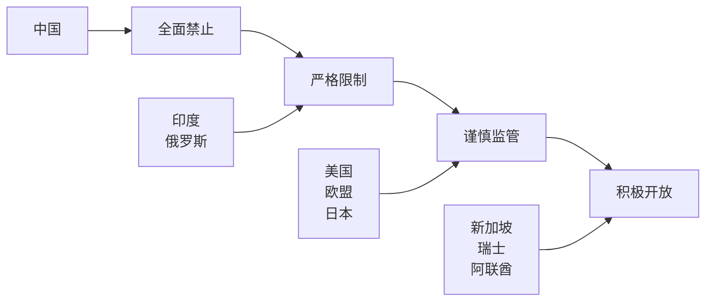
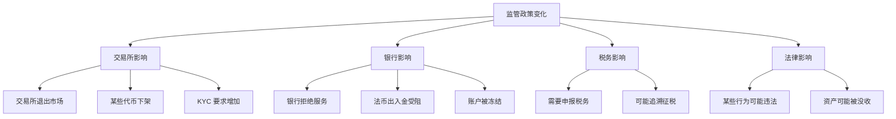

# 6.6 监管与合规风险

> **学习目标**：完成本节后，你将能够……
> - 了解主要国家和地区对加密货币的监管态度
> - 理解加密货币税务的基本概念
> - 评估监管政策变化对个人的潜在影响

---

## 核心内容

### 1. 为什么需要关注监管？

很多人认为「Web3 是去中心化的，不受监管」。这是一个危险的误解。

**现实情况**：
- 交易所必须遵守所在地法规
- 银行和支付机构可能拒绝服务加密相关账户
- 个人可能面临税务申报义务
- 极端情况下，某些行为可能违法

> **Tips**：去中心化的是技术和协议，但使用这些技术的人仍然生活在有法律管辖的国家。

---

### 2. 主要国家/地区监管态度

#### 监管态度光谱

#### 主要地区监管对比表

| 地区 | 监管态度 | 交易合法性 | 主要监管机构 | 核心政策 |
|-----|---------|-----------|-------------|---------|
| **美国** | 严格但分散 | 合法（需合规） | SEC、CFTC、FinCEN | 证券认定、反洗钱 |
| **中国** | 全面禁止 | 禁止 | 人民银行等十部委 | 924 通知 |
| **新加坡** | 谨慎开放 | 合法（需牌照） | MAS | PSA 牌照制度 |
| **欧盟** | 统一框架 | 合法（需合规） | 各国监管 + ESMA | MiCA 法规 |
| **日本** | 牌照制度 | 合法（需牌照） | FSA | 加密资产交易法 |
| **韩国** | 严格监管 | 合法（需实名） | FSC | 实名账户制度 |

---

### 3. 重点地区详解

#### 美国：复杂的多头监管

美国的加密监管是一个「九龙治水」的局面：

| 监管机构 | 管辖范围 | 关注重点 |
|---------|---------|---------|
| SEC（证券交易委员会） | 证券类代币 | 未注册证券发行 |
| CFTC（商品期货委员会） | 商品类代币 | 期货、衍生品 |
| FinCEN（金融犯罪网络） | 资金流转 | 反洗钱、KYC |
| IRS（国税局） | 税务 | 资本利得税 |
| 各州 | 货币传输 | 牌照要求 |

**近期重要事件**：
- 2023 年：SEC 起诉 Coinbase、Binance
- 持续讨论：BTC 是商品还是证券？ETH 呢？
- 趋势：监管趋严，合规成本上升

#### 中国：全面禁止

**2021 年 924 通知核心内容**：
1. 虚拟货币不具有法定货币地位
2. 虚拟货币相关业务活动属于非法金融活动
3. 境外交易所向中国居民提供服务属于非法

**实际影响**：
- 所有境内交易所清退
- 挖矿活动被禁止
- OTC 交易存在法律风险
- 银行账户可能因涉及加密货币被冻结

> **Tips**：对于中国用户，参与加密货币存在法律灰色地带。本课程仅提供知识介绍，不构成任何投资建议。

#### 新加坡：谨慎开放

新加坡采取「拥抱创新、审慎监管」的态度：
- 要求交易所持有 PSA（支付服务法案）牌照
- 严格的反洗钱和消费者保护要求
- 对零售投资者有额外保护措施

#### 欧盟：MiCA 统一框架

MiCA（Markets in Crypto-Assets）是全球首个综合性加密资产监管框架：
- 2024 年开始分阶段实施
- 统一 27 个成员国的监管标准
- 要求稳定币发行方持有足额储备
- 对交易所和钱包提供商设定准入门槛

---

### 4. 加密货币税务基础

#### 美国税务规则

在美国，加密货币被视为**财产（Property）**，而非货币：

| 行为 | 税务影响 | 税率 |
|-----|---------|------|
| 买入并持有 | 无税 | - |
| 卖出获利 | 资本利得税 | 0-37%（取决于持有时间和收入） |
| 卖出亏损 | 可抵扣 | 最多抵扣 $3,000/年 |
| 质押/挖矿收入 | 收入税 | 按普通收入税率 |
| 空投 | 收入税 | 按收到时的公允价值 |
| 币币交易 | 可能触发税务事件 | 需计算每次交易盈亏 |

**关键点**：
- 持有超过 1 年：长期资本利得，税率较低
- 持有不足 1 年：短期资本利得，按普通收入征税
- 每笔交易都需要记录成本基础

#### 中国税务情况

目前中国不承认加密货币的合法地位，因此：
- 没有明确的加密货币税收规定
- 如果通过 OTC 变现为法币，收入来源难以解释
- 未来如果监管松动，可能追溯征税

---

### 5. 监管风险对普通用户的影响

#### 可能面临的情况

#### 风险降低建议

1. **了解当地法规**：不要假设「不知道就没事」
2. **保留交易记录**：方便未来税务申报
3. **使用合规交易所**：至少有基本保障
4. **分散地域风险**：不要把所有资产放在单一司法管辖区
5. **关注政策动态**：监管环境在快速变化

---

## 案例/故事

### Binance 的全球监管困境

Binance 是全球最大的加密货币交易所，但其监管处境说明了合规的重要性：

**2021-2023 年发生的事**：
- 英国：FCA 禁止 Binance 在英国开展受监管活动
- 日本：FSA 警告 Binance 未经注册运营
- 美国：CFTC 和 SEC 同时起诉 Binance
- 多国：要求 Binance 加强 KYC 和反洗钱措施

**对用户的影响**：
- 部分地区用户被强制关闭账户
- 提款限制和 KYC 要求提高
- 服务条款频繁变更

**教训**：即使是最大的交易所，也无法完全规避监管风险。用户应该了解自己所在地区的法规，并做好资产自托管的准备。

---

## 关键概念速查

| 概念 | 一句话解释 |
|-----|-----------|
| SEC | 美国证券交易委员会，负责监管证券市场 |
| CFTC | 美国商品期货交易委员会，监管商品和衍生品 |
| MiCA | 欧盟加密资产市场法规，统一监管框架 |
| KYC | Know Your Customer，身份验证要求 |
| AML | Anti-Money Laundering，反洗钱 |
| 资本利得税 | 对资产增值部分征收的税 |

---

## 学习资料

### 必读
- [Crypto Taxes Basics](https://www.coinbase.com/learn/tips-and-tutorials/crypto-and-bitcoin-taxes-US) - Coinbase - 加密税务入门（预计 8 分钟）
- [Global Crypto Regulations](https://academy.binance.com/) - Binance Academy - 全球监管概览（预计 10 分钟）

### 选读（进阶）
- [CoinDesk Policy](https://www.coindesk.com/policy/) - 监管政策新闻
- [European MiCA Explained](https://eur-lex.europa.eu/) - 欧盟 MiCA 法规
- [IRS Virtual Currency Guidance](https://www.irs.gov/businesses/small-businesses-self-employed/virtual-currencies) - 美国税务指南

---

## 学习任务

完成以下任务以检验学习效果：

- [ ] **任务 1**：查询你所在国家/地区的加密货币监管态度，用 3 点概括主要政策
- [ ] **任务 2**：回顾你过去一年的加密货币交易记录，思考如果需要申报税务，你是否有足够的记录？

> **提交方式**：将调研结果整理成笔记

---

## 常见问题 FAQ

**Q1: 我在中国，参与加密货币交易违法吗？**

A: 这是一个复杂的法律问题。924 通知明确禁止了加密货币交易业务，但对于个人持有和点对点交易的法律定性仍有模糊地带。建议咨询专业法律人士，本课程不构成法律建议。

**Q2: 我需要为加密货币交易缴税吗？**

A: 取决于你所在的国家。在美国，答案是肯定的。在其他很多国家，加密货币交易也可能产生税务义务。建议咨询当地的税务专业人士。

**Q3: 如果交易所因监管被关闭，我的资产怎么办？**

A: 这正是「Not your keys, not your coins」的意义。如果可能，将长期持有的资产转移到自托管钱包。交易所被关闭时，通常会给用户提款窗口期，但不能保证。

---

## 免责声明

本节内容仅供教育目的，不构成法律或税务建议。加密货币监管环境变化迅速，读者应自行查证最新政策，并在必要时咨询专业人士。

---

## 下一步

了解了外部监管风险后，最后一节我们将回归个人视角，总结普通人在 Web3 中最容易处于的风险位置，并提供建立个人风险边界的方法。

→ 继续学习 [6.7 普通人最容易处于的风险位置](6.7-普通人最容易处于的风险位置.md)

---

最后更新：2025-01-09
编写：AI 辅助
审核：待审核
