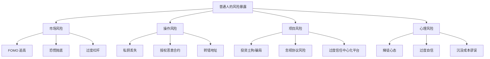
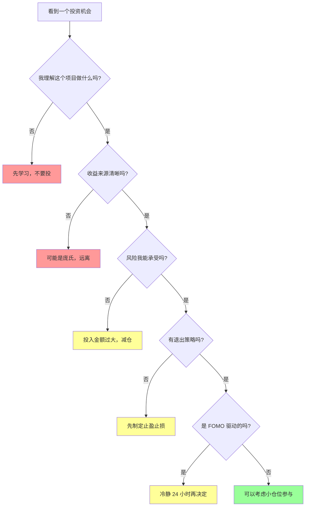

# 6.7 普通人最容易处于的风险位置

> **学习目标**：完成本节后，你将能够……
> - 识别自己可能处于的风险暴露位置
> - 判断自己是否具有「最后接盘者」的特征
> - 建立个人风险边界和投资纪律

---

## 核心内容

### 1. 典型风险场景汇总

在前面几节中，我们学习了各种风险类型。现在，让我们从个人视角出发，看看普通人最容易踩的坑：



#### 场景 1：FOMO 追高

**典型情况**：
- 看到别人在社交媒体晒收益
- 某个代币连涨数天
- 「再不买就来不及了」

**结果**：买在高点，成为接盘侠

#### 场景 2：孤注一掷

**典型情况**：
- 把所有积蓄都投入加密货币
- 「这次一定能翻身」
- 借钱/加杠杆入场

**结果**：一次下跌就倾家荡产

#### 场景 3：忽视操作安全

**典型情况**：
- 私钥截图保存在手机相册
- 随意授权 DApp 无限额度
- 不验证地址就转账

**结果**：资产被盗或永久丢失

#### 场景 4：轻信「内幕消息」

**典型情况**：
- 有人「推荐」必涨的币
- KOL 带单
- 「庄家」喊单群

**结果**：成为别人出货的接盘者

---

### 2. 「最后接盘者」的典型特征

在每一个资产泡沫中，总有人成为最后的接盘者。对照以下特征，检查自己：

| 特征 | 具体表现 | 风险等级 |
|-----|---------|---------|
| **因为别人赚钱而入场** | 「连我同事都赚了 10 倍」 | 极高 |
| **不理解自己买的是什么** | 说不清项目做什么、价值在哪 | 极高 |
| **投入超出承受能力的资金** | 用急需用钱或借来的钱投资 | 极高 |
| **只看涨不考虑跌** | 「这个不可能跌的」 | 高 |
| **追涨杀跌** | 涨了追买，跌了恐慌卖 | 高 |
| **过度关注价格** | 每小时查一次价格 | 中 |
| **没有退出策略** | 不知道什么时候卖、跌多少止损 | 中 |

> **Tips**：如果你符合 3 个以上特征，请暂停一切操作，重新审视自己的投资决策。

---

### 3. 风险自查决策树

遇到任何「机会」时，用这个决策树检查：



---

### 4. 建立个人风险边界

#### 投资上限原则

**核心理念**：只投入「亏完也不会影响生活」的钱

| 你的情况 | 建议上限 | 理由 |
|---------|---------|------|
| 有稳定收入，无负债 | 可投资资产的 10-20% | 留有余地 |
| 有房贷或其他负债 | 可投资资产的 5-10% | 优先还债 |
| 收入不稳定 | 3 个月应急金之外的资金 | 保证生活 |
| 刚工作，没存款 | 每月可存金额的 10% | 逐步积累 |

#### 仓位管理原则

| 资产类型 | 建议占比 | 说明 |
|---------|---------|------|
| BTC + ETH | 60-80% | 相对低风险 |
| 主流代币 | 15-30% | 中等风险 |
| 高风险代币 | 5-10% | 可接受归零 |
| 单一代币 | <20% | 分散风险 |

#### 止损原则

- **持仓止损**：单一资产亏损 20-30% 考虑止损
- **总资产止损**：总资产亏损 30-50% 暂停操作，反思策略
- **时间止损**：持有超过预期时间未达目标，重新评估

#### 心理边界

- **每日查看频率**：限制自己每天最多看 2-3 次
- **决策冷静期**：重大决策前至少等待 24 小时
- **信息来源**：减少加入喊单群、跟单群

---

### 5. Part 6 核心要点回顾

| 章节 | 核心要点 | 行动建议 |
|-----|---------|---------|
| 6.1 收益来源 | 所有收益都有来源 | 每次投资前问：钱从哪来？ |
| 6.2 高 APY | APY 衡量代币数量，不是美元价值 | 关注代币价格变化 |
| 6.3 庞氏模型 | 依赖拉新的模式必然崩盘 | 对照识别清单检查 |
| 6.4 MEV | 链上交易有隐性成本 | 使用 Flashbots，分拆大额交易 |
| 6.5 跨链桥 | 桥是高价值攻击目标 | 选择成熟的桥，分批转移 |
| 6.6 监管风险 | 法规环境在变化 | 了解当地政策，保留记录 |
| 6.7 风险位置 | 建立个人风险边界 | 制定并遵守投资纪律 |

---

## 案例/故事

### 三个真实的「接盘」故事

**故事一：小王的 Luna 经历**

2022 年初，小王看到 Anchor 提供 20% 稳定收益，觉得「太稳了」。他把 10 万元积蓄全部换成 UST 存入 Anchor。5 月崩盘后，他的资产只剩下不到 1000 元。

**错在哪**：
1. 不理解算法稳定币的风险
2. 投入全部积蓄
3. 被「稳定 20%」的宣传迷惑

---

**故事二：小李的土狗经历**

小李在某电报群看到有人「推荐」一个新币，说是「下一个百倍币」。他没做任何研究，投了 5000 元。两周后，项目方跑路，代币归零。

**错在哪**：
1. 轻信陌生人推荐
2. 没有研究项目
3. 没有任何止损计划

---

**故事三：老张的交易所经历**

老张把 20 个 BTC 存在 FTX，觉得「大交易所不会出问题」。2022 年 11 月，FTX 暴雷，老张无法提款。

**错在哪**：
1. 过度信任中心化平台
2. 资产过于集中
3. 没有自托管

---

## 关键概念速查

| 概念 | 一句话解释 |
|-----|-----------|
| FOMO | 害怕错过机会的恐惧心理 |
| 接盘者 | 在资产价格高点买入的人 |
| 止损 | 预设亏损上限，到达时果断卖出 |
| 仓位管理 | 合理分配资金在不同资产上的比例 |
| 沉没成本谬误 | 因为已经亏了所以不愿止损的错误心理 |
| 自托管 | 自己保管私钥，而非依赖第三方 |

---

## 学习资料

### 必读
- [How to Avoid Crypto Scams](https://consumer.ftc.gov/articles/what-know-about-cryptocurrency-and-scams) - FTC 消费者警示（预计 8 分钟）
- [Common Crypto Investment Mistakes](https://academy.binance.com/) - Binance Academy（预计 10 分钟）

### 选读（进阶）
- [Trading Psychology](https://www.investopedia.com/articles/trading/02/110502.asp) - Investopedia 交易心理学
- [Risk Management Strategies](https://academy.binance.com/) - Binance Academy 风险管理

---

## 学习任务

完成以下任务以检验学习效果：

- [ ] **任务 1（核心任务）**：选择一个失败案例（Luna/UST、FTX、或你知道的某个土狗项目），用 **3 点** 总结「它为什么会崩」，格式如下：
  ```
  案例：[名称]
  崩盘原因：
  1. [第一点]
  2. [第二点]
  3. [第三点]
  教训：[你从中学到什么]
  ```

- [ ] **任务 2**：制定你自己的风险边界规则，包括：
  - 投资上限（占你可投资资产的比例）
  - 单一资产仓位上限
  - 止损规则

- [ ] **任务 3**：用本节的风险自查决策树，评估一个你正在关注的项目

> **提交方式**：将任务完成情况整理成笔记，作为 Part 6 的学习总结

---

## 常见问题 FAQ

**Q1: 我已经亏了很多，应该怎么办？**

A: 首先，停下来。不要试图通过加仓或高风险操作「回本」。评估剩余资产的风险，如果仍在高风险项目中，考虑及时止损。最重要的是复盘：为什么会亏？下次如何避免？

**Q2: 如何克服 FOMO？**

A: 记住两点：
1. 市场永远有机会，错过这一个还有下一个
2. 当所有人都在喊「上车」时，往往已经晚了

实操建议：给自己设定 24 小时冷静期，任何冲动决策都等一天再做。

**Q3: 投资加密货币到底能不能赚钱？**

A: 可以，但大多数人亏钱。根据统计，参与加密货币交易的散户中，亏损的比例超过 80%。赚钱的人通常具备：
- 长期视角（持有周期以年计）
- 严格的风险管理
- 对项目的深入理解
- 控制情绪的能力

---

## 课程总结

恭喜你完成了 Part 6 的学习！

在这一部分，你学到了：

1. **收益的真相**：所有收益都有来源，没有凭空的财富
2. **高 APY 的陷阱**：代币数量增长 ≠ 财富增长
3. **庞氏的识别**：不可持续的模式终将崩盘
4. **隐性成本**：MEV 是链上交易的「隐形税」
5. **技术风险**：跨链桥是黑客的重点目标
6. **监管现实**：去中心化的技术，中心化的监管
7. **自我保护**：建立风险边界，避免成为接盘者

**记住**：在 Web3 世界，保护好自己的本金比追求高收益更重要。

---


最后更新：2025-01-09
编写：AI 辅助
审核：待审核
