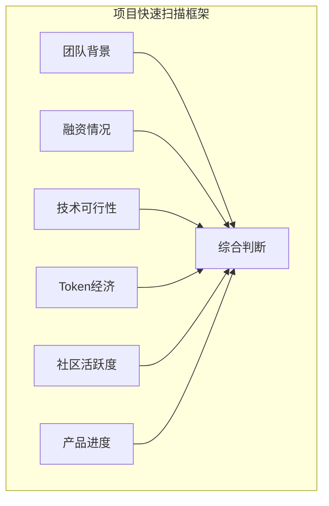

# 7.2 项目快速扫描的核心维度

> **学习目标**：完成本节后，你将能够：
> - 使用 6 个核心维度对任意 Web3 项目进行快速评估
> - 知道在哪里查询每个维度的相关信息
> - 在 15-30 分钟内完成一个项目的基本扫描

---

## 核心内容

### 1. 为什么需要"快速扫描"框架

上一节我们讨论了普通人不该追求"找好项目"。但这不意味着你应该完全不看项目就参与。

**快速扫描的目的不是找到好项目，而是**：
- 排除明显的烂项目和骗局
- 对参与的项目有基本认知
- 降低踩雷的概率

**时间投入建议**：每个项目 15-30 分钟的快速扫描，而不是几十小时的深度研究。

### 2. 六维评估框架



接下来我们逐一解析每个维度。

---

### 3. 维度一：团队背景

**核心问题**：这个团队可信吗？有能力交付吗？

**检查清单**：

| 检查项 | 加分信号 | 减分信号 |
|-------|---------|---------|
| 身份公开 | 创始人实名，可验证履历 | 完全匿名，无法核实 |
| 过往经历 | 有成功项目经验，知名公司背景 | 无相关经验，履历造假 |
| 专业能力 | 技术+商业能力互补 | 团队能力单一 |
| 行业声誉 | 有知名人士背书 | 有负面新闻或黑历史 |

**在哪里查**：
- **RootData**：https://www.rootdata.com/ —— 查看团队成员和过往项目
- **LinkedIn**：验证工作履历
- **Twitter/X**：查看创始人的社交媒体表现
- **Google 搜索**：`"创始人名字" + scam/fraud` 检查负面新闻

> **Tips**：匿名团队不一定是骗子（比特币创始人中本聪也是匿名的），但匿名大大增加了你的判断难度。对于普通人来说，倾向于选择公开身份的团队更安全。

---

### 4. 维度二：融资情况

**核心问题**：有没有专业机构为这个项目背书？

**检查清单**：

| 检查项 | 加分信号 | 减分信号 |
|-------|---------|---------|
| 投资机构 | a16z、Paradigm 等顶级 VC | 不知名机构或无机构投资 |
| 融资金额 | 千万美元级别 | 金额不明或过小 |
| 融资轮次 | 多轮融资，逐步发展 | 只有一轮或信息不透明 |
| 融资时间 | 熊市期间仍能融资 | 只在牛市高点融资 |

**在哪里查**：
- **RootData**：https://www.rootdata.com/ —— 最全面的 Web3 融资数据库
- **Crunchbase**：https://www.crunchbase.com/ —— 传统创投数据库
- **Messari**：https://messari.io/ —— 研报中包含融资信息

**投资机构分级参考**：

```
Tier 1（顶级）：a16z, Paradigm, Sequoia, Coinbase Ventures, Binance Labs
Tier 2（知名）：Multicoin, Polychain, Dragonfly, Galaxy Digital
Tier 3（一般）：其他有过成功案例的机构
Tier 4（警惕）：完全不知名或查不到信息的机构
```

> **Tips**：顶级 VC 投资不等于项目一定成功（FTX 也有顶级 VC 投资），但至少说明项目通过了专业机构的初步筛选。

---

### 5. 维度三：技术可行性

**核心问题**：这个项目技术上能实现吗？代码靠谱吗？

**检查清单**：

| 检查项 | 加分信号 | 减分信号 |
|-------|---------|---------|
| 白皮书 | 有技术细节，逻辑自洽 | 空洞营销，无技术内容 |
| 代码仓库 | GitHub 活跃，持续更新 | 无开源代码或长期不更新 |
| 审计报告 | 知名审计机构出具报告 | 无审计或只有不知名审计 |
| 产品状态 | 主网上线，可实际使用 | 只有白皮书和 PPT |

**在哪里查**：
- **GitHub**：搜索项目名，查看代码提交频率、贡献者数量
- **审计报告**：项目官网通常会展示审计报告链接
- **知名审计机构**：Certik、Trail of Bits、OpenZeppelin、Quantstamp

**GitHub 快速判断技巧**：

```
优质信号：
- 持续提交（每周都有新代码）
- 多个贡献者（不是一个人单干）
- 有 Issues 和 PR（社区参与开发）
- Star 数合理（不是刷出来的）

警示信号：
- 最近提交是几个月前
- 只有 1-2 个贡献者
- 代码明显是 fork 其他项目且无改动
- Star 数异常（要么为0，要么几万但无实际内容）
```

---

### 6. 维度四：Token 经济模型

**核心问题**：Token 分配合理吗？会不会被大量抛售？

**检查清单**：

| 检查项 | 加分信号 | 减分信号 |
|-------|---------|---------|
| 团队份额 | 15-20%，锁仓期长 | 超过 30%，或无锁仓 |
| 投资者份额 | 比例适中，解锁期 1-3 年 | 占比过高，即将大额解锁 |
| 社区份额 | 50% 以上分配给社区 | 社区份额过低 |
| 解锁计划 | 线性解锁，周期长 | 集中解锁，近期有大额释放 |

**在哪里查**：
- **Token Unlocks**：https://token.unlocks.app/ —— 专门追踪解锁时间表
- **CoinGecko / CoinMarketCap**：Token 基本信息
- **项目白皮书/文档**：Token 经济模型详细说明

**解锁日历示例**：

```
⚠️ 警示案例：
某项目 Token 分配：
- 团队：25%（6个月后开始解锁）
- 早期投资者：30%（3个月后全部解锁）
- 社区：45%

问题：3个月后投资者 30% 解锁，大概率会有抛压
```

> **Tips**：在参与任何项目前，务必查看近 3-6 个月是否有大额解锁。大额解锁往往伴随价格下跌。

---

### 7. 维度五：社区活跃度

**核心问题**：社区是真实用户还是机器人？

**检查清单**：

| 检查项 | 加分信号 | 减分信号 |
|-------|---------|---------|
| 粉丝数量 | 增长平稳，与项目阶段匹配 | 短期暴涨，明显刷量 |
| 互动质量 | 有技术讨论，提问多样 | 全是"to the moon"水贴 |
| 社区氛围 | 允许质疑，理性讨论 | 质疑即被踢，狂热崇拜 |
| 账号质量 | 粉丝账号有历史动态 | 大量新注册、无头像账号 |

**识别机器人的技巧**：

1. **查看评论内容**：如果评论高度雷同（"Amazing project!" "LFG!"），大概率是机器人
2. **点开粉丝账号**：查看几个粉丝的账号，如果都是近期创建、无头像、无其他动态，说明是假粉
3. **使用工具检测**：Twitter Audit、Sparktoro 等工具可以检测假粉比例

**真实社区 vs 假社区对比**：

| 特征 | 真实社区 | 假社区/刷量 |
|-----|---------|------------|
| 粉丝增长 | 平稳上升 | 阶梯式暴涨 |
| 评论内容 | 多样，有深度 | 雷同，空洞 |
| 质疑声音 | 存在且被理性回应 | 被删除或攻击 |
| 讨论主题 | 技术、产品、使用体验 | 只聊价格和暴富 |

---

### 8. 维度六：产品进度

**核心问题**：项目是在做事还是只在画饼？

**检查清单**：

| 检查项 | 加分信号 | 减分信号 |
|-------|---------|---------|
| 路线图 | 清晰具体，时间节点明确 | 模糊笼统，没有时间表 |
| 历史交付 | 过去的里程碑都按时完成 | 反复延期，跳票严重 |
| 产品状态 | 可使用的产品，有真实用户 | 只有 Demo 或 PPT |
| 数据表现 | TVL、用户数、交易量可验证 | 数据无法验证或明显造假 |

**在哪里查**：
- **DefiLlama**：https://defillama.com/ —— DeFi 协议的 TVL 和用户数据
- **DappRadar**：https://dappradar.com/ —— DApp 使用数据
- **Dune Analytics**：https://dune.com/ —— 链上数据查询

---

### 9. 快速扫描实战模板

用以下模板，你可以在 15-30 分钟内完成一个项目的基本扫描：

```markdown
## 项目快速扫描报告

**项目名称**：
**扫描日期**：
**扫描用时**：

### 1. 团队背景
- 团队公开度：公开 / 部分公开 / 匿名
- 过往经历：
- 初步评分：⭐⭐⭐⭐⭐ (1-5)

### 2. 融资情况
- 投资机构：
- 融资金额：
- 融资轮次：
- 初步评分：⭐⭐⭐⭐⭐ (1-5)

### 3. 技术可行性
- GitHub 活跃度：活跃 / 一般 / 不活跃
- 审计情况：
- 产品状态：主网 / 测试网 / 仅白皮书
- 初步评分：⭐⭐⭐⭐⭐ (1-5)

### 4. Token 经济
- 团队份额：
- 近期解锁：
- 初步评分：⭐⭐⭐⭐⭐ (1-5)

### 5. 社区活跃度
- Twitter 粉丝：
- 互动质量：真实 / 可疑 / 明显刷量
- 初步评分：⭐⭐⭐⭐⭐ (1-5)

### 6. 产品进度
- 当前状态：
- 路线图执行：
- 初步评分：⭐⭐⭐⭐⭐ (1-5)

### 综合判断
- 总分：/30
- 结论：值得关注 / 需要更多信息 / 建议跳过
- 主要风险点：
```

---

## 案例/故事

**实战演练：扫描某 DeFi 项目**

假设你听说了一个新的 DeFi 借贷协议 "XYZ Protocol"，朋友推荐你参与。你花 20 分钟做了快速扫描：

**团队背景**：
- 创始人在 LinkedIn 可查，曾在 Compound 工作 2 年 ✅
- CTO 的 GitHub 有多年开发历史 ✅
- 评分：4/5

**融资情况**：
- Seed 轮 500 万美元，Dragonfly 领投 ✅
- 评分：4/5

**技术可行性**：
- GitHub 每周都有提交 ✅
- 已通过 Certik 审计 ✅
- 测试网上线 3 个月 ✅
- 评分：4/5

**Token 经济**：
- 团队 18%，4 年线性解锁 ✅
- 但发现 2 周后有 15% 的投资者解锁 ⚠️
- 评分：3/5

**社区活跃度**：
- Twitter 5 万粉丝，但评论区很多雷同内容 ⚠️
- Discord 讨论质量一般
- 评分：2/5

**产品进度**：
- 测试网可用，TVL 已有 500 万美元 ✅
- 评分：4/5

**综合判断**：总分 21/30
- 项目基本面不错，但需注意两点风险：
  1. 2 周后的大额解锁可能带来抛压
  2. 社区可能有刷量嫌疑，真实用户基础存疑

这个 20 分钟的扫描不能告诉你"这是不是好项目"，但能帮你发现需要注意的风险点。

---

## 关键概念速查

| 概念 | 一句话解释 |
|-----|-----------|
| Doxxed | 团队公开了真实身份，可被验证 |
| TVL | Total Value Locked，锁定总价值，衡量 DeFi 协议规模 |
| Token Unlock | Token 解锁，锁定的 Token 到期释放到流通市场 |
| Audit | 审计，第三方对智能合约代码的安全检查 |
| Roadmap | 路线图，项目的发展计划和里程碑 |
| FDV | Fully Diluted Valuation，完全稀释估值 |

---

## 学习资料

### 必读
- [RootData](https://www.rootdata.com/) - Web3 项目和融资数据库（工具，随时查询）
- [DefiLlama](https://defillama.com/) - DeFi 数据平台，查看 TVL 和协议数据（工具，随时查询）

### 选读（进阶）
- [Token Unlocks](https://token.unlocks.app/) - Token 解锁追踪平台
- [How to DYOR in Crypto](https://academy.binance.com/en/articles/how-to-dyor-in-crypto) - Binance Academy - DYOR 方法论（预计阅读 10 分钟）
- [Crypto Due Diligence](https://www.coingecko.com/learn/crypto-due-diligence) - CoinGecko - 尽职调查指南（预计阅读 15 分钟）

---

## 学习任务

完成以下任务以检验学习效果：

- [ ] **任务 1**：选择一个你听说过的 Web3 项目，使用本节的六维框架完成快速扫描，输出扫描报告
- [ ] **任务 2**：访问 RootData，查询任意一个项目的融资信息，记录投资机构和融资金额
- [ ] **任务 3**：访问 Token Unlocks，查看任意一个 Token 未来 3 个月的解锁计划

> **提交方式**：将扫描报告记录在个人学习笔记中

---

## 常见问题 FAQ

**Q1: 六个维度都要查吗？有没有优先级？**

A: 如果时间有限，优先查：1）团队背景（是否公开、是否有黑历史）；2）Token 解锁（近期是否有大额解锁）；3）产品状态（是否有可用产品）。这三个维度能帮你快速排除大部分风险项目。

**Q2: 这些信息可能造假吗？**

A: 可能。融资信息可能夸大，GitHub 活跃度可以刷，社区粉丝可以买。所以快速扫描只能帮你排除明显的问题，不能保证项目一定没问题。这也是为什么我们强调不要追求"找好项目"。

**Q3: 新项目没有这些数据怎么办？**

A: 非常早期的项目确实缺乏数据，这本身就是一个风险信号。对于普通人来说，建议等项目发展一段时间、有更多数据后再考虑参与。早期参与是高风险高收益的事，留给专业投资者去做。

**Q4: 有没有一站式工具可以查所有信息？**

A: 目前没有一个工具能覆盖所有维度。RootData 在团队和融资信息上比较全面，DefiLlama 在 DeFi 数据上最权威，Token Unlocks 专门追踪解锁。需要多个工具配合使用。

---


最后更新：2025-01-09
编写：Antony
审核：待审核
