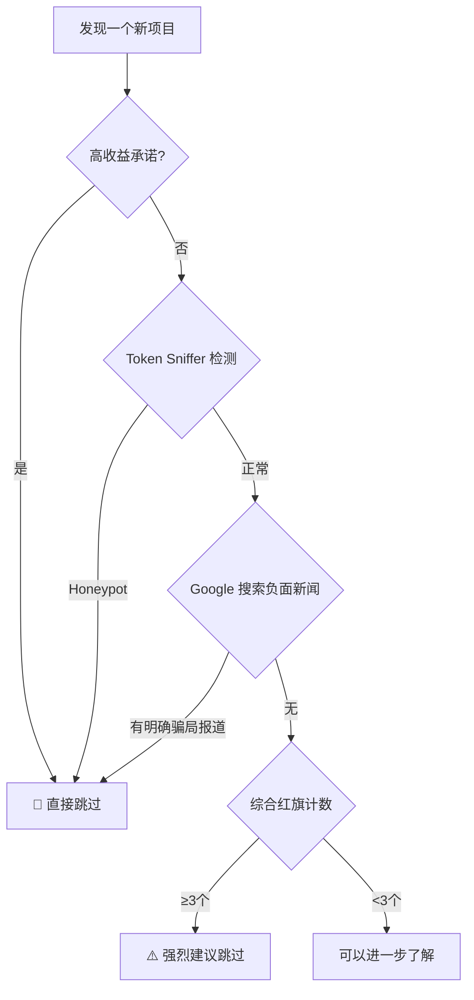

# 7.3 什么时候可以直接不看一个项目

> **学习目标**：完成本节后，你将能够：
> - 识别 Web3 项目中的"一票否决"型红旗信号
> - 区分哪些红旗信号需要综合判断，哪些可以直接跳过
> - 使用简单工具在 5 分钟内排除明显的骗局项目

---

## 核心内容

### 1. 红旗思维：学会说"不"

上一节我们学习了六维评估框架，但现实是：大多数项目根本不值得你花 20 分钟去评估。

**更高效的策略是**：先用 2-5 分钟快速扫描红旗信号。如果发现一票否决型红旗，直接跳过；如果发现多个警示型红旗，大概率也应该跳过。

这能帮你节省大量时间，避免被明显的骗局吸引。

### 2. 一票否决型红旗

以下信号只要出现一个，就可以直接跳过，无需进一步调查：

```
🚩 一票否决清单：

□ 匿名团队 + 高收益承诺（如"日化 3%"、"月化 50%"）
□ 提现需要额外付费或"解锁"
□ 合约被检测工具标记为 Honeypot（蜜罐）
□ 项目方持有可无限增发的权限
□ 多个独立来源报道该项目是骗局
□ 流动性未锁定且团队可随时撤走
□ 合约有"暂停交易"功能且由项目方控制
```

**为什么是"一票否决"？**

这些信号直接指向骗局的核心特征：
- **高收益承诺**：可持续的高收益在 Web3 也是不存在的，日化 3% 意味着年化 1095%，这在数学上不可持续
- **提现付费**：正常项目不会在提现时额外收费，这是典型的"杀猪盘"手法
- **Honeypot**：这类合约专门设计成只能买不能卖，纯粹的骗局
- **无限增发**：项目方可以随时印出大量 Token 砸盘

> **Tips**：记住这个原则——如果你需要思考"这会不会是骗局"，那它大概率就是。正常项目不会让你有这种疑虑。

---

### 3. 综合判断型红旗

以下信号单独出现不一定是问题，但**同时出现 3 个以上**就需要高度警惕：

| 红旗信号 | 单独出现的解释 | 多个同时出现的含义 |
|---------|--------------|------------------|
| 团队完全匿名 | 可能是隐私保护 | 无法追责的风险 |
| 代码未开源 | 可能是商业保密 | 无法验证安全性 |
| 无第三方审计 | 早期项目可能没来得及 | 代码质量存疑 |
| 白皮书空洞 | 可能还在完善 | 缺乏实质内容 |
| 社区明显刷量 | - | 真实用户基础存疑 |
| 只在牛市营销 | - | 可能是趁热捞钱 |
| 大量 KOL 同时推广 | 正常市场推广 | 付费推广概率高 |

**综合判断规则**：
- 1-2 个红旗：保持警惕，需要更多信息
- 3-4 个红旗：强烈建议跳过
- 5 个以上：几乎可以确定是高风险项目

**示例场景**：

```
某项目同时具备：
✗ 团队匿名
✗ 代码未开源
✗ 无审计
✗ 10 个 KOL 同一天发推广贴

结论：4 个红旗同时出现，建议直接跳过
```

---

### 4. 经典骗局模式

了解历史上反复出现的骗局模式，能帮你快速识别变种：

#### 4.1 Rug Pull（跑路）

**定义**：项目方在吸引足够资金后，撤走流动性或抛售所有 Token，然后消失。

**识别特征**：
- 流动性池未锁定
- 团队持有大量 Token 且无锁仓
- 突然停止更新社交媒体
- 官方群突然禁言或解散

**经典案例**：Squid Game Token（2021）
- 利用《鱿鱼游戏》热度发行 Token
- 一周内从 $0.01 涨到 $2,800
- 随后项目方撤走流动性，价格归零
- 投资者无法卖出（Honeypot 机制）

#### 4.2 Honeypot（蜜罐）

**定义**：智能合约被设计成只能买不能卖，或者卖出需要支付极高费用。

**识别特征**：
- 用 Token Sniffer 检测会显示警告
- 查看合约代码中的 transfer 函数有限制
- 有人在社区反映无法卖出

**如何检测**：
1. 访问 [Token Sniffer](https://tokensniffer.com/)
2. 输入 Token 合约地址
3. 查看是否标记为 "Honeypot" 或 "Sell disabled"

#### 4.3 Pump and Dump（拉高出货）

**定义**：内部人员先低价买入，然后通过虚假宣传拉高价格，再高价卖给散户。

**识别特征**：
- 突然大量 KOL 同时推广
- 价格短期内暴涨（几小时内翻几倍）
- 社区充斥"不要错过"的 FOMO 情绪
- 无实际产品或进展，只有价格炒作

#### 4.4 庞氏骗局

**定义**：用后来者的资金支付先来者的"收益"，没有真实的价值创造。

**识别特征**：
- 承诺固定高收益（日化/周化）
- 鼓励拉人头，有推荐奖励
- 收益来源不清楚或解释不通
- 需要持续有新人加入才能维持

**经典案例**：BitConnect（2016-2018）
- 承诺日化 1% 的稳定收益
- 要求锁仓 + 推荐奖励机制
- 最终崩盘，投资者损失约 20 亿美元
- 创始人被 FBI 通缉

#### 4.5 假空投钓鱼

**定义**：以空投或 NFT 赠送为名，诱导用户连接钱包并授权恶意合约。

**识别特征**：
- 陌生人发送私信说"你获得了空投"
- 需要连接钱包到陌生网站
- 需要授权"全部 Token"的权限
- 网站域名与官方略有差异

**防范方法**：
- 不点击私信中的任何链接
- 只通过官方渠道获取空投信息
- 授权前仔细检查权限范围
- 使用 Revoke.cash 定期撤销无用授权

---

### 5. 快速检测工具

在决定是否深入了解一个项目之前，先用这些工具做 5 分钟快速检测：

#### 工具 1：Token Sniffer

**网址**：https://tokensniffer.com/

**用途**：检测 Token 合约是否有安全问题

**使用方法**：
1. 复制 Token 合约地址
2. 粘贴到搜索框
3. 查看评分和警告信息

**关注点**：
- 是否标记为 Honeypot
- 是否有"Owner can mint"警告
- 是否有"Trading can be paused"警告
- 总体评分（低于 60 分需要警惕）

#### 工具 2：Google 搜索

**搜索公式**：`"项目名" + scam OR rug OR fraud`

**用途**：快速发现已报道的负面新闻

**示例**：
- `"ProjectX" scam`
- `"ProjectX" rug pull`
- `"创始人名字" fraud`

#### 工具 3：Rekt News

**网址**：https://rekt.news/

**用途**：查看历史黑客攻击和 Rug Pull 案例

**使用方法**：
1. 在站内搜索项目名
2. 查看是否有相关报道
3. 了解类似项目的失败模式

#### 工具 4：DexScreener

**网址**：https://dexscreener.com/

**用途**：查看 Token 的链上数据

**关注点**：
- 流动性是否锁定（Liquidity Lock）
- 持仓分布是否过于集中
- 交易历史是否正常

---

### 6. 5 分钟快速排除流程



**操作清单**（按顺序执行）：

```markdown
□ Step 1（30秒）：查看是否有高收益承诺
  → 有则直接跳过

□ Step 2（2分钟）：Token Sniffer 检测合约
  → Honeypot 或严重警告则跳过

□ Step 3（1分钟）：Google 搜索 "项目名 + scam"
  → 有明确骗局报道则跳过

□ Step 4（1分钟）：快速数红旗
  → 3个以上则建议跳过

□ Step 5：如果以上都通过，可以进入 7.2 的详细评估
```

---

## 案例/故事

**2021 年：Squid Game Token 的 48 小时**

2021 年 10 月，Netflix 剧集《鱿鱼游戏》全球爆火。一个匿名团队迅速发行了 "Squid Game Token"（SQUID）。

**红旗信号**（当时就存在）：
- ✗ 团队完全匿名
- ✗ 与 Netflix 无任何官方关系
- ✗ 白皮书充满语法错误
- ✗ 买入后需要持有 3 年才能卖出（Honeypot 变种）
- ✗ 流动性未锁定

**发生了什么**：
- 10 月 26 日：上线，价格 $0.01
- 10 月 31 日：价格涨到 $38
- 11 月 1 日：价格涨到 $2,861（5 天涨了 28 万倍）
- 11 月 1 日：项目方撤走流动性，价格瞬间归零

**投资者损失**：超过 300 万美元

**教训**：
所有红旗信号从一开始就明显存在。如果投资者在买入前花 5 分钟检查，就能避免损失：
- 匿名团队 ✗
- 与热点事件蹭热度 ✗
- 卖出有限制（变相 Honeypot）✗
- 流动性未锁定 ✗

**这些信号任何一个都足以让理性的人跳过这个项目。**

---

## 关键概念速查

| 概念 | 一句话解释 |
|-----|-----------|
| Red Flag（红旗） | 警示项目可能有问题的危险信号 |
| Rug Pull | 项目方撤走资金跑路 |
| Honeypot | 只能买不能卖的骗局合约 |
| Pump and Dump | 拉高价格后抛售给散户 |
| 庞氏骗局 | 用新投资者的钱支付老投资者收益 |
| Token Sniffer | Token 合约安全检测工具 |
| 流动性锁定 | 项目方无法撤走交易池中的资金 |

---

## 学习资料

### 必读
- [Token Sniffer](https://tokensniffer.com/) - Token 安全检测工具（工具，随时使用）
- [How to Identify Crypto Scams](https://academy.binance.com/en/articles/how-to-identify-and-avoid-common-crypto-scams) - Binance Academy - 识别加密骗局（预计阅读 10 分钟）

### 选读（进阶）
- [Rekt News](https://rekt.news/) - 历史黑客攻击和 Rug Pull 案例库
- [Chainalysis Crypto Crime Report](https://www.chainalysis.com/crypto-crime-report/) - 年度加密犯罪报告
- [DeFi Safety](https://www.defisafety.com/) - DeFi 项目安全评级

---

## 学习任务

完成以下任务以检验学习效果：

- [ ] **任务 1**：访问 Token Sniffer，随机检测 3 个 Token 合约，记录它们的评分和主要警告
- [ ] **任务 2**：阅读 Rekt News 上的任意一个 Rug Pull 案例，总结该项目有哪些红旗信号
- [ ] **任务 3**：用"5 分钟快速排除流程"检测一个你听说过的小项目，记录检测结果

> **提交方式**：将任务输出记录在个人学习笔记中

---

## 常见问题 FAQ

**Q1: 有些大项目早期也是匿名团队，比如比特币，这怎么解释？**

A: 确实存在匿名团队的成功案例，但这是极少数例外。对于普通人来说，你无法判断一个匿名团队是"下一个中本聪"还是"下一个 Rug Pull"。在无法判断的情况下，规避风险是更明智的选择。

**Q2: Token Sniffer 显示正常就一定安全吗？**

A: 不一定。Token Sniffer 只能检测已知的合约风险模式，无法检测所有骗局。通过检测只能说明"没有明显的技术层面问题"，但项目仍可能有其他风险（如团队跑路、经济模型不可持续等）。

**Q3: 为什么有人明知是骗局还参与？**

A: 有些人抱着"赌一把"或"我跑得比别人快"的心态。这是非常危险的——Squid Game Token 的投资者也以为自己能在崩盘前卖出，但 Honeypot 机制让他们根本无法卖出。不要高估自己的"逃顶能力"。

**Q4: 如果一个项目所有红旗检测都通过了，是不是就安全了？**

A: 通过红旗检测只能说明"不是明显的骗局"，但不能保证项目会成功或你能赚钱。项目可能因为技术失败、市场竞争、监管打击等原因失败。红旗检测是必要条件，不是充分条件。

---


最后更新：2025-01-09
编写：Antony
审核：待审核
