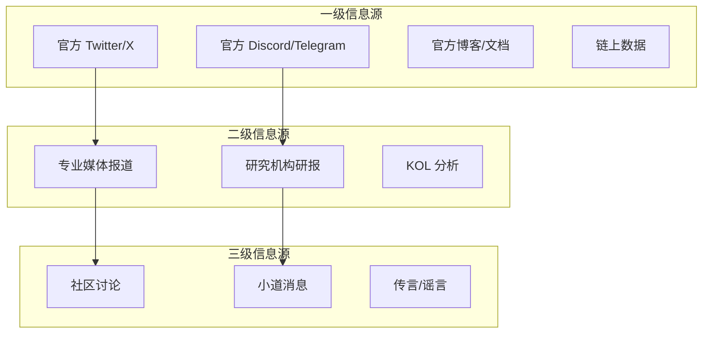

# 7.4 信息源与噪音的区分方法

> **学习目标**：完成本节后，你将能够：
> - 区分一级、二级、三级信息源，并知道优先查看哪类信息
> - 识别付费软文和虚假信息的常见特征
> - 建立个人的 Web3 信息筛选系统

---

## 核心内容

### 1. Web3 的信息过载问题

进入 Web3 后，你会发现信息无处不在：
- Twitter/X 上每天有数千条项目相关推文
- 各种媒体发布大量"深度分析"
- Discord/Telegram 群里消息刷屏
- KOL 们不断推荐"下一个百倍币"

**问题是**：这些信息中，90% 是噪音，甚至是有害信息。

如果你没有筛选能力：
- 你会被噪音淹没，无法找到真正有价值的信息
- 你会被付费软文误导，做出错误决策
- 你会产生 FOMO（错失恐惧），盲目追涨

**本节的目标**：帮你建立一套信息筛选系统，让你能高效获取有价值的信息。

---

### 2. 信息源的三个层级



#### 一级信息源（Primary Source）

**定义**：项目方直接发布的官方信息，以及可验证的链上数据。

**包括**：
- 项目官方 Twitter/X 账号
- 项目官方 Discord/Telegram 公告频道
- 项目官网、官方博客、官方文档
- 链上数据（交易记录、TVL、用户数等）

**特点**：
- ✅ 最及时、最准确
- ✅ 可直接验证
- ⚠️ 可能有"报喜不报忧"的倾向

**使用建议**：这是你应该**第一时间查看**的信息来源。

#### 二级信息源（Secondary Source）

**定义**：专业机构或个人对一级信息的整理、分析和解读。

**包括**：
- 专业媒体的报道（The Block、Decrypt、Foresight News 等）
- 研究机构的研报（Messari、Delphi Digital、Galaxy Research）
- KOL 的分析文章/推文

**特点**：
- ✅ 有分析和解读，帮助理解
- ✅ 可能提供不同视角
- ⚠️ 可能有主观偏见
- ⚠️ KOL 可能有利益关系

**使用建议**：作为**理解和深入研究**的参考，但要保持批判性。

#### 三级信息源（Tertiary Source）

**定义**：社区讨论、传言、未经验证的消息。

**包括**：
- Discord/Telegram 群聊讨论
- Twitter 上的传言和猜测
- "听说"、"据说"、"内部消息"

**特点**：
- ✅ 有时能捕捉到早期信号
- ⚠️ 大量虚假信息
- ⚠️ 容易被操纵
- ⚠️ 难以验证

**使用建议**：**娱乐为主，不可作为决策依据**。如果看到有价值的信息，一定要去一级/二级来源验证。

---

### 3. 核心信息源推荐

#### 3.1 数据平台（获取客观数据）

| 平台 | 用途 | 链接 |
|-----|------|------|
| **DefiLlama** | DeFi 协议 TVL、收入数据 | https://defillama.com/ |
| **Dune Analytics** | 自定义链上数据查询 | https://dune.com/ |
| **Token Terminal** | 协议收入和估值数据 | https://tokenterminal.com/ |
| **Nansen** | 聪明钱追踪、钱包分析 | https://www.nansen.ai/ |
| **Arkham** | 钱包地址标签、资金流向 | https://www.arkhamintelligence.com/ |
| **RootData** | 项目融资、团队信息 | https://www.rootdata.com/ |

> **Tips**：数据平台是最客观的信息来源。当媒体/KOL 告诉你"某协议在快速增长"时，你可以去 DefiLlama 验证 TVL 数据。

#### 3.2 专业媒体（获取行业动态）

**英文媒体**（通常更及时、更专业）：

| 媒体 | 特点 | 链接 |
|-----|------|------|
| **The Block** | 深度研究、数据分析 | https://www.theblock.co/ |
| **Decrypt** | 新闻快速、易读 | https://decrypt.co/ |
| **CoinDesk** | 综合性老牌媒体 | https://www.coindesk.com/ |
| **Blockworks** | 机构视角 | https://blockworks.co/ |

**中文媒体**：

| 媒体 | 特点 | 链接 |
|-----|------|------|
| **Foresight News** | 深度分析、研报翻译 | https://foresightnews.pro/ |
| **律动 BlockBeats** | 快讯、深度文章 | https://www.theblockbeats.info/ |
| **深潮 TechFlow** | 技术向、研报 | https://www.techflowpost.com/ |
| **PANews** | 综合性新闻 | https://www.panewslab.com/ |

#### 3.3 研究机构（获取深度分析）

| 机构 | 特点 | 链接 |
|-----|------|------|
| **Messari** | 综合性研报，部分免费 | https://messari.io/ |
| **Delphi Digital** | 深度研究，偏技术 | https://delphidigital.io/ |
| **Galaxy Research** | 机构视角 | https://www.galaxy.com/research/ |
| **a16z Crypto** | VC 视角，行业趋势 | https://a16zcrypto.com/ |

---

### 4. 识别付费软文

Web3 行业存在大量付费推广内容，它们伪装成"客观分析"，实际上是项目方的广告。

#### 4.1 付费软文的常见特征

| 特征 | 说明 |
|-----|------|
| **只说优点不说风险** | 正常分析会提及风险，软文只吹捧 |
| **大量 KOL 同时发布** | 项目方批量购买 KOL，集中发布 |
| **结构相似、话术雷同** | 使用相同的模板和素材 |
| **不披露利益关系** | 不说明是否持有 Token 或收了推广费 |
| **强调"不要错过"** | 制造 FOMO 情绪 |
| **只谈价格潜力** | 不讨论产品、技术，只说"能涨多少倍" |

#### 4.2 实际案例对比

**付费软文的典型写法**：

```
🚀 重磅项目 $XXX 即将起飞！

✅ 顶级 VC 投资
✅ 团队超强
✅ 技术领先
✅ 社区活跃

现在上车还来得及！不要错过下一个百倍币！

#crypto #gem #100x
```

**正常分析的写法**：

```
关于 XXX 协议的分析

优势：
- 获得了 A、B 机构的投资
- 技术架构有创新点（具体说明）

风险：
- Token 解锁压力较大
- 赛道竞争激烈
- 团队部分成员匿名

结论：项目有一定潜力，但也存在风险，需要根据自身风险承受能力决定。

利益披露：本人不持有该项目 Token，未收取推广费用。
```

#### 4.3 批判性阅读技巧

在阅读任何"分析文章"时，问自己这几个问题：

1. **作者是谁？有什么背景？**
   - 是专业分析师还是不知名账号？

2. **作者有没有利益关系？**
   - 是否持有该项目 Token？是否收了推广费？

3. **文章有没有提及风险？**
   - 只说好不说坏，大概率是软文

4. **是否有大量 KOL 同时发布类似内容？**
   - 集中发布通常是协调推广

5. **核心观点是否可验证？**
   - 去数据平台验证文中提到的数据

---

### 5. 建立个人信息系统

信息过载时代，与其被动接收所有信息，不如主动建立一个精简的信息系统。

#### 5.1 信息系统的核心原则

1. **精简而非全面**：关注 10 个高质量来源 > 关注 100 个低质量来源
2. **分层管理**：区分"必看"和"选看"
3. **定期清理**：取关低质量信息源，保持信息流清洁
4. **验证习惯**：重要信息一定去一级来源验证

#### 5.2 推荐的信息系统架构

```markdown
## 我的 Web3 信息系统

### 第一层：每日必看（5-10分钟）
- [ ] 我关注的 3-5 个项目的官方 Twitter
- [ ] 1 个主要媒体的头条

### 第二层：定期浏览（每周 1-2 次）
- [ ] DefiLlama 查看 TVL 变化
- [ ] 1-2 篇优质研报

### 第三层：需要时查询
- [ ] RootData 查融资信息
- [ ] Token Unlocks 查解锁计划
- [ ] Dune 查链上数据

### 我信任的 KOL（3-5 个）
- @xxx - 原因：专业、客观、有深度
- @xxx - 原因：...

### 定期清理
- 每月检查一次关注列表
- 取关发软文的 KOL
- 取关信噪比低的账号
```

#### 5.3 Twitter/X 信息管理技巧

Twitter/X 是 Web3 最重要的信息平台，但也是噪音最多的地方。

**有效使用技巧**：

1. **使用列表（Lists）**
   - 创建 "Web3 核心关注" 列表，只放最重要的账号
   - 看这个列表而不是主时间线

2. **Mute 噪音词**
   - Mute: "giveaway"、"airdrop"、"🚀"、"gem"、"100x"
   - 过滤大量垃圾信息

3. **关注质量而非数量**
   - 宁可关注 50 个高质量账号，也不要关注 500 个混杂账号

4. **警惕"刷屏式"推广**
   - 如果一个项目突然在时间线刷屏，大概率是付费推广

---

### 6. 高质量信息源推荐清单

以下是经过筛选的高质量信息源，供学员参考（按类型分类）：

#### 行业观察类 KOL（英文）

| 账号 | 特点 | 适合人群 |
|-----|------|---------|
| @VitalikButerin | 以太坊创始人，技术视角 | 对技术感兴趣的学员 |
| @balaboratory | 深度研究，宏观视角 | 想理解行业大趋势的学员 |
| @coaboratory | 行业分析，理性客观 | 想获取平衡视角的学员 |

#### 行业观察类 KOL（中文）

| 账号 | 特点 | 适合人群 |
|-----|------|---------|
| @0xNing0x | 深度分析，关注 DeFi | DeFi 方向学员 |
| @mindaoyang | 行业观察，创始人视角 | 想了解行业动态的学员 |

> **Tips**：以上只是示例，具体账号需要你自己判断是否适合。KOL 也可能变质，需要持续观察。

---

## 案例/故事

**信息战：2024 年某项目的"协调式营销"**

2024 年初，一个新项目 ABC Protocol 突然在 Twitter 上"爆火"：

**你看到的现象**：
- 一天之内，10+ 个 KOL 发布了关于 ABC 的"深度分析"
- 每篇文章都在说"被低估"、"即将起飞"
- 社区情绪高涨，都在讨论要不要上车

**你没看到的真相**：
- 这些 KOL 收到了项目方的 Token 和现金
- 他们使用了项目方提供的统一素材
- 他们的"分析"是在同一时间发布的（协调推广）

**结果**：
- Token 在推广期间涨了 50%
- 一周后开始持续下跌
- 跟风买入的散户大多亏损
- 那些 KOL 早已卖出获利

**教训**：
- 当一个项目突然"到处都是"时，反而要警惕
- 同时出现的大量"分析"通常是协调推广
- KOL 的推荐大多有利益关系
- 永远要问：这些人为什么要告诉我这个信息？

---

## 关键概念速查

| 概念 | 一句话解释 |
|-----|-----------|
| 一级信息源 | 官方直接发布的信息，最可靠 |
| 二级信息源 | 媒体/KOL 的解读和分析 |
| 三级信息源 | 社区讨论和传言，需要验证 |
| 付费软文 | 伪装成客观分析的付费广告 |
| FOMO | Fear of Missing Out，错失恐惧 |
| 信噪比 | 有价值信息占总信息的比例 |

---

## 学习资料

### 必读
- [DefiLlama](https://defillama.com/) - 客观数据来源，养成查数据的习惯（工具，随时使用）
- 选择 1 个主要媒体开始关注（Foresight News / The Block / Decrypt）

### 选读（进阶）
- [Messari](https://messari.io/) - 专业研报平台
- [Dune Analytics](https://dune.com/) - 链上数据查询
- [Nansen](https://www.nansen.ai/) - 聪明钱追踪（部分功能付费）

---

## 学习任务

完成以下任务以检验学习效果：

- [ ] **任务 1（必做）**：在 Twitter/X 上关注 5-10 个高质量信息源，并建立一个 "Web3 核心关注" 列表
- [ ] **任务 2**：找到一篇你认为是付费软文的文章，列出 3 个判断依据
- [ ] **任务 3**：访问 DefiLlama，查看任意 3 个 DeFi 协议的 TVL 数据，记录你的发现

> **提交方式**：将你的关注清单和理由记录在个人学习笔记中

---

## 常见问题 FAQ

**Q1: 我应该关注中文信息源还是英文信息源？**

A: 建议两者结合。英文信息源通常更及时、更专业，是行业一手信息的主要来源。中文信息源方便理解，有时也有独特视角。如果英文阅读没问题，建议以英文为主。

**Q2: 有没有一个 "万能信息源"，关注它就够了？**

A: 没有。不同来源各有侧重，需要组合使用。但如果只能选一个平台，Twitter/X 是 Web3 信息流通的核心阵地。

**Q3: KOL 的推荐完全不能信吗？**

A: 不是完全不能信，而是要批判性看待。假设每个 KOL 都有利益关系，他们的观点可以作为参考，但不能作为决策依据。永远要自己验证核心信息。

**Q4: 信息源太多看不过来怎么办？**

A: 这正是需要建立信息系统的原因。精简关注列表，只保留最高质量的来源。宁可少而精，不要多而杂。记住：获取信息的能力，核心在于筛选而非获取。

**Q5: 怎么判断一个 KOL 是否可信？**

A: 观察几个维度：1）他是否会说项目的缺点和风险？2）他的历史推荐表现如何？3）他是否披露利益关系？4）他的分析是否有逻辑和数据支撑？如果一个 KOL 只吹不黑、从不提风险，大概率不值得信任。

---

## Part 7 总结

恭喜你完成了 Part 7 的学习！让我们回顾一下核心要点：

| 章节 | 核心信息 |
|-----|---------|
| 7.1 | 普通人在项目筛选上有天然劣势，不要追求"找好项目" |
| 7.2 | 用六维框架快速扫描，而非深度研究 |
| 7.3 | 识别红旗信号，学会快速说"不" |
| 7.4 | 建立信息系统，过滤噪音，保持批判性 |

**Part 7 的核心态度**：

> 承认自己的局限性，不是放弃，而是更明智的参与方式。
>
> 与其追求找到"下一个百倍币"，不如建立正确的风险认知和信息筛选能力。

---


最后更新：2025-01-09
编写：Antony
审核：待审核
