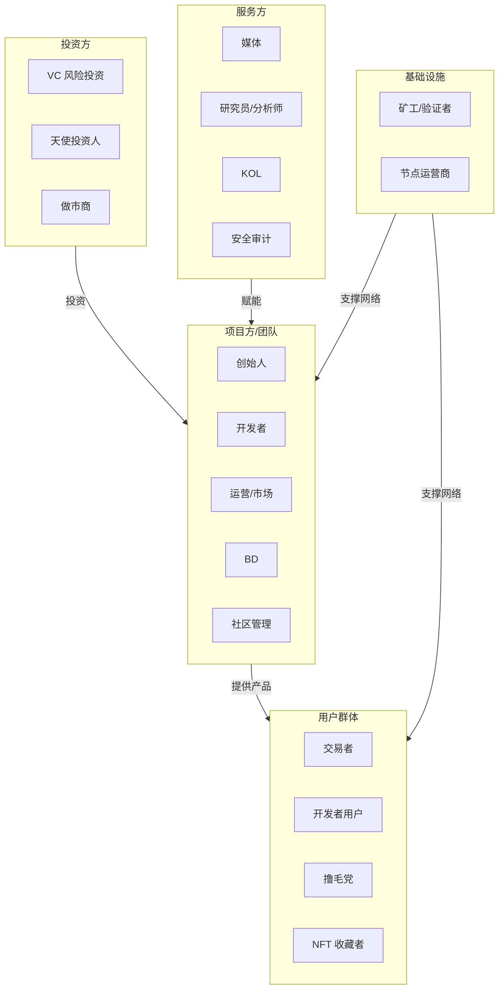

# 8.1 Web3 世界里都有哪些角色

> **学习目标**：完成本节后，你将能够……
> - 描述 Web3 生态系统中的主要角色分类及其功能定位
> - 理解不同角色之间的协作关系与利益链条
> - 识别自己可能适合或感兴趣的角色方向

---

## 核心内容

### 1. Web3 生态角色全景图

Web3 世界就像一个完整的经济体系，里面有各种角色在协作、竞争、博弈。理解这些角色，是你进入 Web3 的第一步。

我们可以把 Web3 生态中的角色分为五大类：

| 角色类别 | 核心功能 | 典型特征 |
|---------|---------|---------|
| 项目方/团队 | 构建产品和协议 | 创造价值、承担最大风险 |
| 投资方 | 提供资金和资源 | 追求回报、影响项目方向 |
| 服务方 | 提供专业服务 | 赋能生态、建立影响力 |
| 用户群体 | 使用产品和协议 | 最广泛、需求多样 |
| 基础设施 | 维护网络运行 | 技术门槛高、收益稳定 |

### 2. 项目方/团队角色详解

项目方是 Web3 生态的「建设者」，他们创造协议、开发应用、推动行业发展。

#### 2.1 创始人（Founder）

创始人是项目的灵魂人物，决定项目的愿景、方向和文化。

**典型职责**：
- 确定项目愿景和战略方向
- 融资和投资人关系管理
- 团队搭建和核心决策
- 对外代表项目形象

**Web3 创始人的特殊之处**：
- 需要理解技术、金融、社区运营等多个领域
- 经常需要「匿名」或「半匿名」运营
- 承受更大的监管不确定性风险

> **Tips**：Web3 的知名创始人如 Vitalik Buterin（以太坊）、CZ（币安）、SBF（FTX，已入狱）展现了这个行业创始人的不同命运。创始人的道德标准和决策能力，直接影响项目和用户的命运。

#### 2.2 开发者（Developer）

开发者是 Web3 的核心生产力，负责将想法变成可运行的代码。

**主要类型**：

| 岗位 | 职责 | 技术栈示例 |
|-----|------|-----------|
| 智能合约开发 | 编写链上逻辑 | Solidity, Rust, Move |
| 前端开发 | 构建用户界面 | React, Web3.js, ethers.js |
| 后端开发 | 服务端逻辑、索引 | Node.js, Go, The Graph |
| 全栈开发 | 端到端开发 | 上述技术的组合 |
| 协议/底层开发 | 开发区块链底层 | Rust, Go, C++ |

#### 2.3 运营与市场（Operations & Marketing）

负责项目的用户增长、品牌建设和日常运营。

**Web3 运营的独特之处**：
- 社区运营比传统市场更重要
- 需要 7x24 小时关注市场动态
- 空投、激励设计是核心技能
- 需要应对 FUD（恐惧、不确定、怀疑）危机

#### 2.4 BD（Business Development，商务拓展）

负责建立合作关系，拓展项目的生态和影响力。

**典型工作**：
- 与其他项目谈合作和集成
- 与交易所谈上币
- 与投资机构建立关系
- 与媒体和 KOL 建立联系

#### 2.5 社区管理（Community Manager）

社区是 Web3 项目的命脉，社区管理者是连接项目与用户的桥梁。

**日常工作**：
- 管理 Discord/Telegram 群组
- 回答用户问题、处理投诉
- 组织 AMA（Ask Me Anything）活动
- 识别和培养核心社区成员
- 监控社区情绪，反馈给团队

### 3. 投资方角色详解

投资方为 Web3 项目提供启动和发展所需的资金。

#### 3.1 VC（Venture Capital，风险投资）

Web3 领域的 VC 是项目融资的主要来源。

**知名 Web3 VC**：
- a16z（Andreessen Horowitz）
- Paradigm
- Polychain Capital
- 红杉资本 Crypto 部门
- Binance Labs

**VC 的作用**：
- 提供大额资金（通常百万至数千万美元）
- 带来行业资源和人脉
- 提供战略指导
- 背书效应，增加项目可信度

**VC 的利益诉求**：
- 获得较低估值的代币份额
- 代币上市后获得数倍甚至数十倍回报
- 通常有锁仓期（Vesting Period）

> **Tips**：当你看到一个项目宣布获得知名 VC 投资时，这通常是正面信号。但要注意，VC 的代币成本远低于散户，他们解锁时可能会卖出。

#### 3.2 天使投资人（Angel Investor）

天使投资人通常在项目最早期介入，投资金额较小但风险最高。

**特点**：
- 投资金额：通常几千到几十万美元
- 投资时机：种子轮或更早
- 背景：往往是行业老手或成功创业者
- 作用：除了资金，更重要的是早期指导和人脉

#### 3.3 做市商（Market Maker）

做市商是一个常被忽略但极其重要的角色，他们为代币提供流动性。

**做市商的作用**：
- 在交易所提供买卖盘，确保交易顺畅
- 减少价格波动，提高市场效率
- 帮助新代币建立健康的交易市场

**知名做市商**：
- Wintermute
- GSR
- Alameda Research（已破产）
- Jump Crypto

**普通人需要知道的**：
- 做市商可能与项目方有利益绑定
- 某些「拉盘」「砸盘」可能与做市商行为相关
- 做市商不等于「庄家」，但边界有时模糊

### 4. 服务方角色详解

服务方为 Web3 生态提供各种专业服务，帮助行业更好地运转。

#### 4.1 媒体（Media）

Web3 媒体是行业信息的主要传播渠道。

**主要类型**：

| 类型 | 代表 | 特点 |
|-----|------|-----|
| 英文主流媒体 | The Block, CoinDesk, Decrypt | 深度报道，相对客观 |
| 中文媒体 | 金色财经, 律动BlockBeats, 深潮TechFlow | 更贴近华语用户 |
| 数据媒体 | Messari, Delphi Digital | 数据驱动，研究向 |

**阅读 Web3 媒体的建议**：
- 区分新闻报道和「软文」
- 关注信息来源是否可靠
- 多渠道交叉验证重要信息

#### 4.2 研究员/分析师（Researcher/Analyst）

研究员深入分析项目、赛道和市场趋势，产出研报和分析文章。

**工作产出**：
- 项目分析报告
- 赛道研究报告
- 链上数据分析
- 投资建议

**典型雇主**：
- VC 内部研究团队
- 交易所研究院
- 独立研究机构（如 Messari）
- 自媒体研究员

#### 4.3 KOL（Key Opinion Leader，关键意见领袖）

KOL 在 Web3 行业有巨大影响力，可以左右市场情绪和用户决策。

**KOL 的类型**：

| 类型 | 特点 | 风险提示 |
|-----|------|---------|
| 技术型 KOL | 分享技术知识、代码教程 | 相对客观，商业化程度低 |
| 分析型 KOL | 项目分析、市场解读 | 需辨别是否收费推广 |
| 喊单型 KOL | 推荐买卖时机 | 高风险，可能有利益冲突 |
| 娱乐型 KOL | Meme、段子、社区氛围 | 娱乐为主，投资价值低 |

> **Tips**：Web3 KOL 推荐的项目，很可能是收费推广。2024年就发生过多起 KOL 推广归零项目的事件。永远保持怀疑，自己做研究（DYOR: Do Your Own Research）。

#### 4.4 安全审计（Security Audit）

安全审计公司审查智能合约代码，发现潜在漏洞。

**知名审计公司**：
- CertiK
- Trail of Bits
- OpenZeppelin
- SlowMist（慢雾）
- PeckShield

**审计的局限性**：
- 审计过不代表 100% 安全
- 审计只覆盖特定版本的代码
- 审计公司水平参差不齐
- 有些项目会「购买」虚假审计报告

### 5. 用户角色详解

用户是 Web3 生态最广泛的群体，他们使用协议、交易资产、参与生态。

#### 5.1 交易者（Trader）

交易者是 Web3 最活跃的用户群体，通过买卖加密资产获利。

**交易者类型**：
- **长期持有者（Holder/HODLer）**：相信长期价值，很少交易
- **波段交易者**：根据市场周期买卖
- **日内交易者**：频繁短线交易
- **量化交易者**：使用算法和程序交易
- **套利者**：利用不同市场的价差获利

#### 5.2 开发者用户

开发者用户使用 Web3 基础设施来构建自己的应用。

**典型场景**：
- 在以太坊上部署智能合约
- 使用 The Graph 索引链上数据
- 集成 Chainlink 预言机
- 使用 IPFS 存储文件

#### 5.3 撸毛党（Airdrop Hunter）

撸毛党专门寻找和参与可能获得空投（Airdrop）的项目。

**撸毛的基本逻辑**：
1. 新项目需要用户和数据
2. 项目方用空投奖励早期用户
3. 撸毛党提前交互，期待获得空投

**撸毛的现状**：
- 竞争日益激烈，收益下降
- 项目方反撸毛手段升级（女巫检测）
- 需要大量时间和 Gas 费投入
- 成功案例：Uniswap、Arbitrum 空投让早期用户获得数千美元

> **Tips**：撸毛是一个「付出不一定有回报」的活动。很多人花费大量时间和金钱，最终颗粒无收。建议新手不要把撸毛作为主要目标。

#### 5.4 NFT 收藏者

NFT 收藏者购买、持有和交易非同质化代币（NFT）。

**收藏者类型**：
- **艺术收藏者**：看重艺术价值
- **投机者**：追求短期价差
- **社区成员**：为了进入特定社区（如 BAYC）
- **实用型**：NFT 作为门票、会员资格等

### 6. 基础设施角色详解

基础设施角色维护区块链网络的正常运行，是整个生态的底层支撑。

#### 6.1 矿工/验证者（Miner/Validator）

矿工和验证者是区块链网络的「守护者」，负责打包交易、产出新区块。

| 共识机制 | 角色名称 | 代表网络 | 参与门槛 |
|---------|---------|---------|---------|
| PoW（工作量证明） | 矿工 | 比特币 | 硬件成本高，需要矿机 |
| PoS（权益证明） | 验证者 | 以太坊 | 需质押资产（ETH 需 32 个） |
| DPoS（委托权益证明） | 验证者/代理 | EOS, Solana | 需获得社区投票支持 |

**收益来源**：
- 区块奖励（新增代币）
- 交易手续费（Gas）

#### 6.2 节点运营商（Node Operator）

节点运营商运行区块链节点，为网络提供数据服务和去中心化保障。

**节点类型**：
- **全节点**：存储完整区块链数据
- **轻节点**：只存储区块头信息
- **归档节点**：存储所有历史状态数据

**节点服务提供商**：
- Infura
- Alchemy
- QuickNode

这些服务商让普通开发者不需要自己运行节点，就能访问区块链数据。

---

## 案例/故事

### Uniswap 的角色生态：一个去中心化交易所背后的众生相

Uniswap 是以太坊上最大的去中心化交易所（DEX），它的故事展现了 Web3 生态中各种角色如何协作。

**项目方**：Hayden Adams 在 2018 年创建 Uniswap，最初只是一个简单的代币交换协议。团队规模一直很小，但产品影响力巨大。

**投资方**：Uniswap 获得了 a16z、Paradigm 等顶级 VC 的投资，估值一度超过百亿美元。这些 VC 不仅提供资金，还帮助 Uniswap 在监管、人才方面获得支持。

**流动性提供者（LP）**：普通用户可以将代币存入 Uniswap 的流动性池，赚取交易手续费。这是 DeFi 让普通人参与「做市」的创新。

**交易者**：每天有数十亿美元的交易在 Uniswap 上发生，交易者用它来交换各种代币。

**撸毛党**：2020 年，Uniswap 向所有历史用户空投 UNI 代币。只要曾经使用过 Uniswap，就能获得至少 400 个 UNI（当时价值数千美元）。这次空投成为 Web3 历史上最著名的「撸毛」案例。

**安全审计**：Uniswap 的智能合约经过多家审计公司审查，但仍然出现过被攻击的情况，这也提醒我们审计不是万能的。

这个案例告诉我们：Web3 项目的成功需要各种角色的协作，每个角色都在其中扮演不可或缺的作用。理解这些角色，你才能更好地判断自己在 Web3 中的位置。

---

## 关键概念速查

| 概念 | 一句话解释 |
|-----|-----------|
| **项目方（Team）** | 构建和运营 Web3 项目的核心团队 |
| **VC（风险投资）** | 为早期项目提供资金的投资机构 |
| **做市商（Market Maker）** | 在交易市场提供流动性，促进交易顺畅进行的机构 |
| **KOL** | 在社交媒体有影响力、能影响用户决策的意见领袖 |
| **撸毛党（Airdrop Hunter）** | 专门参与项目交互以获取空投奖励的用户群体 |
| **验证者（Validator）** | 在 PoS 网络中负责验证交易、产出区块的节点 |
| **安全审计（Security Audit）** | 对智能合约代码进行安全检查的专业服务 |

---

## 学习资料

### 必读
- [Crypto Jobs & Salaries: Web3 Career Guide](https://web3.career/web3-salaries) - Web3.Career - 全面的 Web3 职业和薪资指南（预计阅读 15 分钟）
- [What is Web3 and Why Should You Care](https://www.coinbase.com/learn/crypto-basics/what-is-web3) - Coinbase Learn - Web3 基础概念和生态介绍（预计阅读 10 分钟）

### 选读（进阶）
- [The Web3 Landscape](https://messari.io/report/web3-report) - Messari 研报 - 深入的 Web3 生态分析
- [Crypto Ecosystem Overview](https://www.theblockresearch.com/) - The Block Research - 专业的加密生态研究
- [a]·[Web3 工作入门指南](https://mirror.xyz/) - Mirror 上的中文 Web3 求职指南（搜索相关文章）

---

## 学习任务

- [ ] **任务 1**：绘制一张你理解的 Web3 生态角色图，标注出你最感兴趣的 3 个角色，并写下原因
  - 提示：可以手绘或使用在线工具
  - 要求：至少包含 5 个不同类别的角色

- [ ] **任务 2**：在 X/Twitter 上找到并关注至少 3 个不同类型的 Web3 KOL（技术型、分析型、娱乐型各一个），观察他们的内容风格差异
  - 提示：可以从项目官方账号的互动中发现 KOL
  - 要求：记录你对这些 KOL 的初步判断

- [ ] **任务 3**：思考并写下：如果你要进入 Web3 行业，你最可能以什么角色切入？为什么？
  - 提示：结合你现有的技能和资源
  - 要求：写下 100-200 字的思考

---

## 常见问题 FAQ

**Q1: Web3 行业的角色和 Web2 有什么本质区别？**

A: 最大的区别在于「去中心化」带来的变化。首先，社区角色在 Web3 中更加重要，用户不只是消费者，还可能是治理参与者和利益相关方。其次，由于监管不确定性，很多角色需要在灰色地带运营。最后，Web3 的金融属性让「投资者」和「用户」的边界变得模糊——你的用户可能同时也是你的投资者。

**Q2: 我不懂技术，在 Web3 能做什么？**

A: Web3 有大量非技术岗位需求。社区管理、内容运营、商务拓展（BD）、市场营销、研究分析、投资等都是非技术岗位。实际上，由于行业增长快，非技术人才的缺口可能比技术人才更大。关键是找到你的优势和 Web3 需求的交集。详细内容会在 8.2 和 8.3 章节展开。

**Q3: 撸毛是不是最容易进入 Web3 的方式？**

A: 撸毛确实门槛低，但「容易进入」不等于「容易获利」。2023-2024 年的撸毛环境已经非常内卷，项目方也在加强反女巫（反刷号）检测。如果你只是想了解 Web3，撸毛是个不错的实践方式；但如果你想靠撸毛「赚钱」，需要投入大量时间、资金，且成功率不高。建议把撸毛作为学习手段，而非主要目标。

**Q4: 做市商和「庄家」是一回事吗？**

A: 严格来说不是。做市商（Market Maker）是提供流动性的合法业务，他们通过买卖价差赚取利润，同时让市场更有效率。而「庄家」通常指的是操纵市场价格的行为，在大多数国家是违法的。但在加密市场，由于监管不完善，两者的边界有时很模糊。某些做市商可能同时也在进行市场操纵。作为普通用户，你需要知道的是：市场背后有专业玩家，他们的信息和资源优势远超散户。

**Q5: KOL 推荐的项目能信吗？**

A: 需要高度警惕。Web3 KOL 推荐项目很可能收取了推广费用，但他们往往不会主动披露。2024 年已经发生多起 KOL 推广「归零币」导致粉丝巨额亏损的案例。建议做法：1）永远自己做研究（DYOR），KOL 观点只作参考；2）关注 KOL 的历史推荐记录，看看准确率如何；3）警惕「只说好话」的 KOL；4）技术型和分析型 KOL 通常比喊单型 KOL 更可信。

---

最后更新：2025-01-09
编写：Antony
审核：待审核
