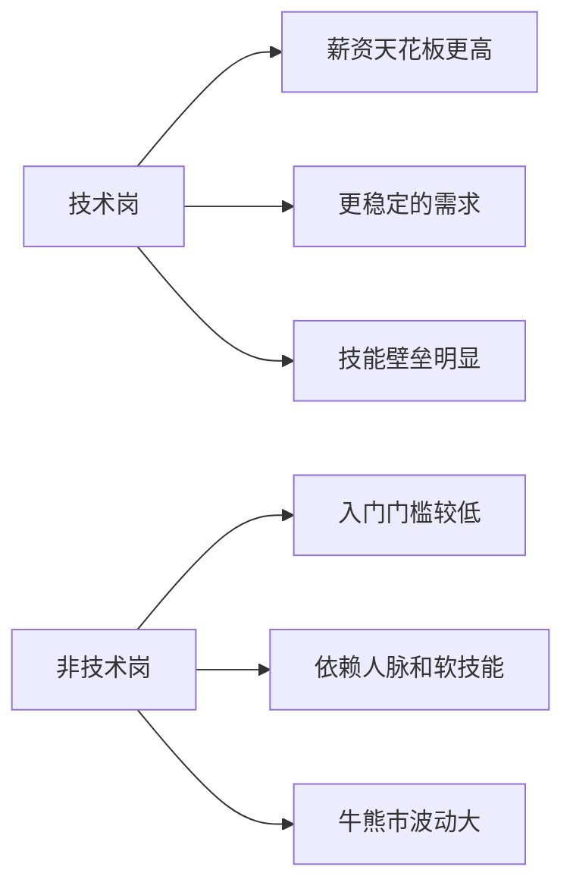
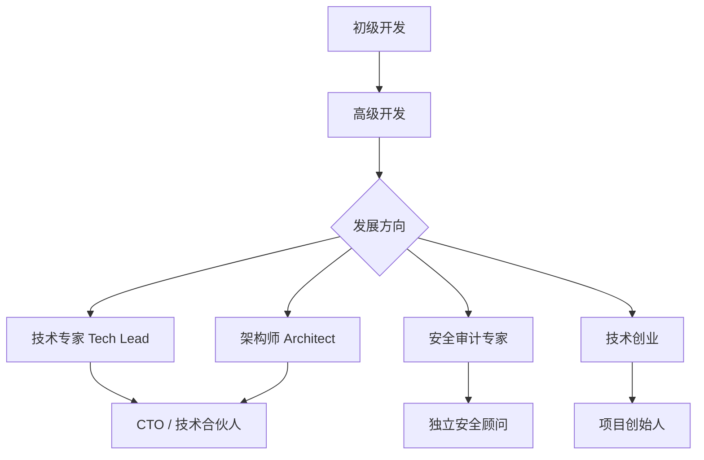
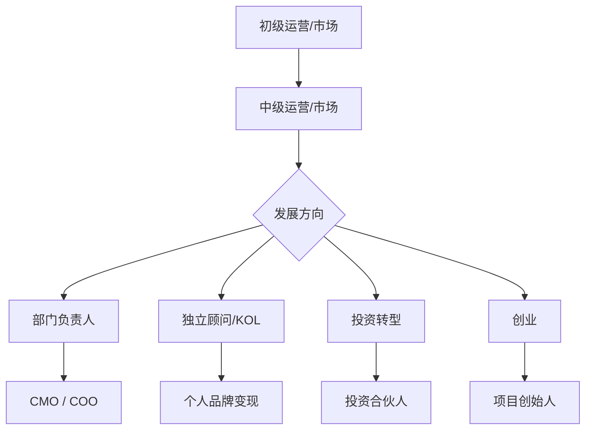

# 8.2 技术岗与非技术岗的真实差异

> **学习目标**：完成本节后，你将能够：
> - 清晰区分 Web3 行业中技术岗和非技术岗的主要类型及其职责
> - 了解不同岗位的薪资水平、技能要求和职业发展路径
> - 理解 Web3 原生的远程工作模式与传统工作方式的差异

---

## 核心内容

### 1. 技术岗位分类

Web3 技术岗位可以分为四大类，每类都有其独特的技术栈和职责范围。

#### 1.1 智能合约开发（Smart Contract Developer）

智能合约开发者是 Web3 最核心的技术岗位之一，负责编写部署在区块链上的合约代码。

**主要职责**：
- 设计和开发智能合约（如 DeFi 协议、NFT 合约、DAO 治理合约）
- 合约安全审计与漏洞修复
- Gas 优化与合约升级维护
- 与前端团队协作完成合约集成

**技术栈要求**：
| 技能 | 重要程度 | 说明 |
|-----|---------|------|
| Solidity | 必需 | 以太坊及 EVM 兼容链的主流合约语言 |
| Rust | 高需求 | Solana、Near 等非 EVM 链使用 |
| Move | 新兴 | Aptos、Sui 等新公链使用 |
| Hardhat/Foundry | 必需 | 开发测试框架 |
| OpenZeppelin | 推荐 | 安全合约库 |

> **Tips**：Solidity 是入门首选，但 Rust 的需求正在快速增长。2024 年 Solana 生态的火热带动了 Rust 开发者的需求激增。

#### 1.2 前端开发（Frontend Developer）

Web3 前端开发者负责构建用户与区块链交互的界面，也称为 DApp 前端开发。

**主要职责**：
- 开发 DApp 用户界面
- 集成钱包连接功能（如 MetaMask、WalletConnect）
- 处理链上数据展示与交易签名
- 优化用户体验，降低 Web3 使用门槛

**技术栈要求**：
| 技能 | 重要程度 | 说明 |
|-----|---------|------|
| React/Vue/Next.js | 必需 | 主流前端框架 |
| ethers.js/viem | 必需 | Web3 交互库 |
| wagmi | 推荐 | React Hooks 封装的 Web3 库 |
| TypeScript | 推荐 | 类型安全 |
| GraphQL | 推荐 | 链上数据查询（The Graph） |

#### 1.3 后端开发（Backend Developer）

Web3 后端开发者负责链下服务的开发，包括索引服务、API 接口和数据处理。

**主要职责**：
- 开发链下服务与 API
- 构建区块链数据索引系统
- 设计链上链下数据同步方案
- 开发监控告警系统

**技术栈要求**：
| 技能 | 重要程度 | 说明 |
|-----|---------|------|
| Node.js/Go/Rust | 必需 | 主流后端语言 |
| PostgreSQL/MongoDB | 必需 | 数据存储 |
| Redis | 推荐 | 缓存 |
| The Graph | 推荐 | 去中心化索引协议 |
| Docker/Kubernetes | 推荐 | 容器化部署 |

#### 1.4 安全工程师（Security Engineer / Auditor）

安全岗位是 Web3 行业薪资天花板最高的技术岗之一，负责保障协议和用户资产安全。

**主要职责**：
- 智能合约安全审计
- 漏洞挖掘与渗透测试
- 安全架构设计与咨询
- 应急响应与事故处理

**技术栈要求**：
| 技能 | 重要程度 | 说明 |
|-----|---------|------|
| Solidity 深度理解 | 必需 | 理解 EVM 底层机制 |
| 常见漏洞模式 | 必需 | 重入攻击、闪电贷攻击等 |
| Slither/Mythril | 推荐 | 自动化审计工具 |
| 逆向工程 | 推荐 | 分析闭源合约 |

> **Tips**：安全岗位的门槛高，但回报也高。顶级审计员的单次审计费用可达数万美元，年薪通常在 $200K-$500K 之间。

---

### 2. 非技术岗位分类

非技术岗位在 Web3 行业同样重要，且对行业理解和软技能有更高要求。

#### 2.1 运营（Operations）

**岗位类型**：
- **产品运营**：负责产品功能迭代、用户反馈收集、数据分析
- **活动运营**：策划线上线下活动、空投活动、激励计划
- **用户增长**：制定增长策略、用户留存方案

**核心技能**：数据分析能力、项目管理、用户洞察、跨部门协调

#### 2.2 市场营销（Marketing）

**岗位类型**：
- **内容营销**：撰写博客、白皮书、社交媒体内容
- **品牌营销**：品牌定位、VI 设计、公关传播
- **增长营销**：付费投放、KOL 合作、联合营销

**核心技能**：内容创作、数据驱动思维、社交媒体运营、英文写作能力

#### 2.3 商务拓展（Business Development, BD）

BD 是 Web3 行业最活跃的非技术岗位之一，负责建立合作关系和拓展业务。

**主要职责**：
- 寻找并建立项目合作（如跨链合作、生态集成）
- 交易所上币沟通
- 投资机构关系维护
- 行业会议参与与人脉拓展

**核心技能**：沟通谈判、行业人脉、商业敏感度、英文能力

> **Tips**：Web3 BD 的核心竞争力是「人脉」和「信任」。很多合作是通过私人关系促成的，这也是为什么有行业经验的 BD 更受欢迎。

#### 2.4 社区管理（Community Manager）

社区是 Web3 项目的核心资产，社区管理岗位负责建设和维护用户社区。

**主要职责**：
- 管理 Discord/Telegram 社群
- 回答用户问题、收集反馈
- 组织社区活动（AMA、空投、治理投票）
- 培养核心用户和 MOD 团队

**核心技能**：沟通能力、情绪管理、多语言能力（英文必备）、7x24 响应意识

#### 2.5 研究员（Researcher / Analyst）

研究岗位负责行业研究、项目分析和投资决策支持。

**岗位类型**：
- **行业研究员**：追踪赛道趋势、撰写研报
- **投资研究员**：分析项目基本面、估值模型
- **链上分析师**：通过链上数据发现交易机会或风险

**核心技能**：深度研究能力、数据分析、报告撰写、链上工具使用（Dune、Nansen）

#### 2.6 投资（Investor / VC）

Web3 投资岗位包括 VC 机构的投资经理和独立投资人。

**主要职责**：
- 项目发掘与尽职调查
- 投资决策与条款谈判
- 投后管理与资源对接
- 行业趋势判断

**核心技能**：财务分析、行业判断、人脉网络、风险控制

---

### 3. 薪资水平对比

以下数据基于多个招聘平台和行业报告的综合整理，反映 2024 年全球 Web3 行业的薪资水平（以美元计，年薪）。

#### 3.1 技术岗薪资范围

| 岗位 | 初级 (0-2年) | 中级 (2-5年) | 高级 (5年+) | 数据来源 |
|-----|-------------|-------------|------------|---------|
| 智能合约开发 | $80K-$120K | $120K-$200K | $200K-$350K | web3.career, 2024 |
| 前端开发 | $60K-$100K | $100K-$160K | $160K-$250K | CryptoJobsList, 2024 |
| 后端开发 | $70K-$110K | $110K-$180K | $180K-$280K | web3.career, 2024 |
| 安全工程师 | $100K-$150K | $150K-$250K | $250K-$500K+ | Immunefi, 2024 |

#### 3.2 非技术岗薪资范围

| 岗位 | 初级 (0-2年) | 中级 (2-5年) | 高级 (5年+) | 数据来源 |
|-----|-------------|-------------|------------|---------|
| 社区管理 | $40K-$70K | $70K-$100K | $100K-$150K | CryptoJobsList, 2024 |
| 运营 | $50K-$80K | $80K-$120K | $120K-$180K | web3.career, 2024 |
| 市场营销 | $50K-$90K | $90K-$140K | $140K-$220K | LinkedIn, 2024 |
| BD | $60K-$100K | $100K-$160K | $160K-$250K+ | web3.career, 2024 |
| 研究员 | $60K-$100K | $100K-$150K | $150K-$250K | Messari, 2024 |
| 投资 | $80K-$130K | $130K-$220K | $220K-$400K+ | 行业调研, 2024 |

> **数据说明**：
> - 以上为全球范围内的薪资参考，欧美项目薪资通常高于亚洲项目
> - 薪资通常包含 Token 激励，实际收入波动较大
> - 头部项目（如 Coinbase、OpenSea、Uniswap）薪资可能更高
> - 熊市期间薪资普遍下调 20%-40%

#### 3.3 关键发现

**技术岗 vs 非技术岗薪资特点**：

| 维度 | 技术岗 | 非技术岗 |
|-----|-------|---------|
| **薪资下限** | 较高 | 相对较低 |
| **薪资上限** | 极高（安全岗可达 $500K+） | 中高（BD/投资可达 $300K+） |
| **Token 占比** | 30%-50% | 20%-40% |
| **熊市影响** | 较小 | 较大 |

---

### 4. 技能要求对比表

| 维度 | 技术岗 | 非技术岗 |
|-----|-------|---------|
| **硬技能** | 编程语言、区块链原理、密码学基础 | 数据分析、内容创作、项目管理 |
| **软技能** | 代码审查、技术文档、团队协作 | 沟通谈判、跨文化交流、社群运营 |
| **英文要求** | 能阅读技术文档即可 | 通常要求流利读写，部分岗位需口语 |
| **行业知识** | 需深入理解区块链技术原理 | 需广泛了解行业生态和热点 |
| **学历要求** | 计算机相关背景优先，但非必须 | 学历要求较低，经验更重要 |
| **作品集** | GitHub、审计报告、开源贡献 | 运营案例、社区数据、个人影响力 |

---

### 5. 职业发展路径差异

#### 5.1 技术岗发展路径

**典型发展周期**：
- **1-2 年**：初级开发，学习技术栈，参与项目
- **3-5 年**：高级开发，独立负责模块，带小团队
- **5-8 年**：技术专家/架构师，技术决策者
- **8 年+**：CTO、技术合伙人或独立创业

#### 5.2 非技术岗发展路径

**典型发展周期**：
- **1-2 年**：执行岗，学习行业，积累人脉
- **2-4 年**：独立负责项目，建立个人品牌
- **4-6 年**：管理岗或独立顾问
- **6 年+**：高管或创业

#### 5.3 发展路径差异总结

| 维度 | 技术岗 | 非技术岗 |
|-----|-------|---------|
| **晋升确定性** | 较高，技能可量化 | 较低，依赖机会和人脉 |
| **跨项目流动** | 容易，技术可迁移 | 需要重建关系和信任 |
| **创业可能性** | 技术创始人 | 运营/市场创始人 |
| **独立执业** | 自由开发者、审计顾问 | KOL、投资人、顾问 |
| **天花板** | 取决于技术深度 | 取决于人脉和资源 |

---

### 6. 远程工作与 Web3 原生工作模式

Web3 行业是远程工作的先行者，其工作模式有以下特点：

#### 6.1 远程优先（Remote First）

**现状**（数据来源：CryptoJobsList 2024 报告）：
- **70%+** 的 Web3 岗位支持全远程
- **20%** 为混合模式（Hybrid）
- **10%** 要求全职到岗

**远程工作的优势**：
- 全球化人才池，不受地域限制
- 灵活的工作时间安排
- 节省通勤成本

**远程工作的挑战**：
- 时区协调困难（团队可能跨越 10+ 小时时差）
- 沟通效率降低
- 自律要求高

#### 6.2 匿名与化名文化

Web3 行业独特的现象是许多从业者使用化名（Pseudonym）工作。

**常见形式**：
- 使用 ENS 域名作为身份标识（如 vitalik.eth）
- NFT 头像作为职业形象
- 完全匿名贡献（尤其在 DAO 中）

**利与弊**：
| 优势 | 劣势 |
|-----|-----|
| 保护隐私安全 | 建立信任需更长时间 |
| 以作品说话，减少偏见 | 背景核实困难 |
| 全球化参与无障碍 | 法律责任模糊 |

#### 6.3 贡献者经济（Contributor Economy）

越来越多的 Web3 从业者不是「员工」，而是「贡献者」。

**典型模式**：
- **DAO 贡献者**：通过提案和贡献获得 Token 奖励
- **赏金猎人（Bounty Hunter）**：完成项目发布的悬赏任务
- **多项目兼职**：同时为多个项目提供服务

**代表平台**：
- Gitcoin：开源项目赏金平台
- Layer3：任务奖励平台
- Dework：DAO 任务管理工具

> **Tips**：贡献者模式非常适合刚入行的新人——你可以在不离职的情况下，通过完成赏金任务积累经验和作品集。

#### 6.4 薪资支付方式

| 支付方式 | 占比 | 特点 |
|---------|-----|------|
| 稳定币（USDC/USDT） | 50%+ | 最常见，避免币价波动 |
| 法币 + Token | 30% | 混合支付，Token 作为激励 |
| 纯 Token | 10% | 早期项目常见，风险大 |
| 纯法币 | 10% | 大型机构或合规要求 |

---

## 案例/故事

### 从大厂程序员到 Web3 安全审计员的转型之路

小王（化名）曾是某互联网大厂的后端开发工程师，2022 年开始接触 Web3。

**背景**：
- 5 年 Java 后端开发经验
- 年薪约 60 万人民币
- 对区块链技术感兴趣，但没有直接经验

**转型过程**：

1. **学习阶段（3 个月）**：利用业余时间学习 Solidity，完成 CryptoZombies 教程和 Ethernaut 挑战赛。

2. **实践阶段（6 个月）**：参加 ETHGlobal 黑客松，开发了一个简单的 DeFi 项目；在 Code4rena 参与合约审计比赛，获得了一些小奖励。

3. **转型阶段**：凭借审计比赛的成绩和 GitHub 上的开源贡献，获得了一家安全审计公司的 offer，薪资为 $150K/年（约 110 万人民币）+ Token 激励。

**关键心得**：
- 技术功底可以迁移，但需要补充区块链特有的知识
- 作品集比简历更重要——审计报告、GitHub 贡献是最好的证明
- 从兼职参与到全职转型，风险可控

**启示**：技术岗的转型相对清晰，核心是「用作品说话」。通过黑客松、审计比赛、开源贡献等方式积累可验证的成果，是最有效的入行路径。

---

## 关键概念速查

| 概念 | 一句话解释 |
|-----|-----------|
| **智能合约开发** | 编写部署在区块链上自动执行的程序代码 |
| **安全审计** | 检查智能合约代码漏洞，保障协议安全 |
| **BD（Business Development）** | 商务拓展，负责建立合作关系和业务拓展 |
| **社区管理** | 运营 Discord/Telegram 社群，维护用户关系 |
| **远程优先（Remote First）** | 以远程工作为默认模式的工作方式 |
| **贡献者经济** | 通过任务贡献获得报酬，而非传统雇佣关系 |
| **化名文化** | 使用网名而非真名进行职业活动的行业惯例 |
| **Token 激励** | 以项目代币作为薪酬的一部分 |

---

## 学习资料

### 必读
- [Web3 Career Guide](https://web3.career/learn) - web3.career - 全面的 Web3 职业指南，涵盖各类岗位介绍（预计阅读 30 分钟）
- [How to Get a Job in Crypto](https://www.coinbase.com/learn/tips-and-tutorials/how-to-get-a-job-in-crypto) - Coinbase Learn - 加密行业求职指南（预计阅读 15 分钟）

### 选读（进阶）
- [2024 Web3 Developer Report](https://www.alchemy.com/blog/web3-developer-report-2024) - Alchemy - 2024 年 Web3 开发者行业报告
- [State of Crypto Salaries](https://www.web3.career/web3-salaries) - web3.career - 实时更新的 Web3 薪资数据
- [The DAO Contributor Guide](https://daocentral.com/guides/contributor) - DAO Central - DAO 贡献者入门指南
- [Immunefi Bug Bounty Guide](https://immunefi.com/learn/) - Immunefi - 安全漏洞赏金指南

---

## 学习任务

完成以下任务以检验学习效果：

- [ ] **任务 1**：根据自己的背景（技术/非技术），选择一个最适合自己的 Web3 入门岗位，并列出需要学习的 3 个核心技能
  - 提示：参考技能要求对比表
  - 要求：说明选择理由

- [ ] **任务 2**：在 [web3.career](https://web3.career) 或 [CryptoJobsList](https://cryptojobslist.com) 上浏览 10 个感兴趣的岗位，记录以下信息：
  - 岗位名称
  - 薪资范围
  - 是否支持远程
  - 核心技能要求

- [ ] **任务 3**：阅读一份 Web3 安全审计报告（如 OpenZeppelin 或 Trail of Bits 发布的公开报告），了解安全审计的工作内容

> **提交方式**：将任务输出记录在个人学习笔记中

---

## 常见问题 FAQ

**Q1: 没有技术背景能进入 Web3 行业吗？**

A: 当然可以。Web3 行业有大量非技术岗位，如社区管理、运营、市场、BD、研究等。关键是深入理解行业，建立人脉，并展示你能为项目带来的价值。许多成功的 Web3 从业者是从社区贡献者起步的。

**Q2: Web3 薪资真的比 Web2 高吗？**

A: 取决于岗位和经验。头部项目的技术岗位确实比传统互联网高 30%-50%，但也要考虑：(1) Token 部分的波动风险；(2) 熊市期间的裁员风险；(3) 小项目可能存在的支付风险。整体来看，技术岗溢价明显，非技术岗差异不大。

**Q3: 远程工作听起来很自由，有什么需要注意的？**

A: 远程工作需要较强的自律能力和时间管理能力。常见挑战包括：(1) 时区差异导致的会议时间不友好；(2) 缺乏面对面交流影响协作效率；(3) 工作和生活边界模糊容易导致过劳。建议保持规律作息，主动沟通，善用异步协作工具。

**Q4: Token 作为薪资的一部分风险大吗？**

A: 风险确实存在。Token 价格可能大幅波动，甚至归零。建议：(1) 了解 Token 的解锁周期（Vesting Schedule）；(2) 评估项目的基本面和团队背景；(3) 如果可能，协商更高比例的稳定币支付。

**Q5: Web3 行业适合长期发展吗？**

A: Web3 是一个快速发展但也充满不确定性的行业。优势是早期红利和成长空间大，劣势是周期性波动明显，项目失败率高。建议把 Web3 能力作为技能组合的一部分，而非唯一依赖。保持学习能力和适应性是最重要的。

---

最后更新：2025-01-09
编写：AI Assistant
审核：待审核
