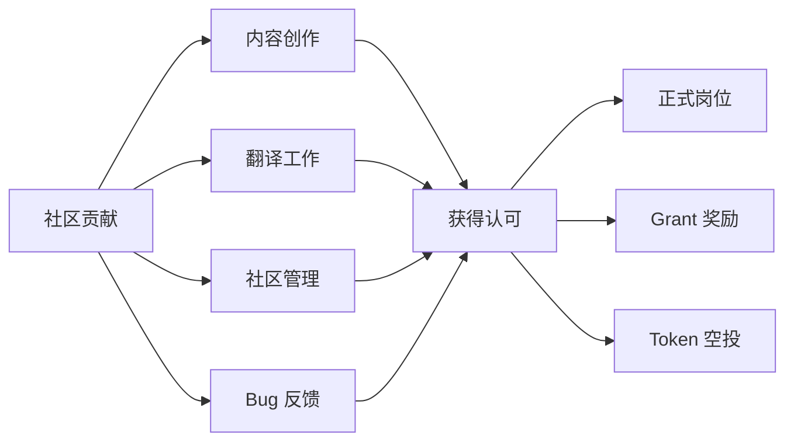

# 8.3 学生 / Web2 上班族的常见切入点

> **学习目标**：完成本节后，你将能够……
> - 识别学生和 Web2 上班族进入 Web3 行业的独特优势
> - 了解 3-5 种具体可行的切入路径，并选择适合自己的方式
> - 通过真实案例理解转型成功与失败的关键因素

---

## 核心内容

### 1. 学生的优势与切入策略

学生群体进入 Web3 有着独特的优势，但也面临特定的挑战。

#### 1.1 学生的三大优势

| 优势类型 | 具体表现 | 如何利用 |
|---------|---------|---------|
| **时间优势** | 课余时间充足，可以深度学习和实践 | 利用寒暑假参加黑客松、实习 |
| **学习优势** | 学习能力强，接受新事物快，无思维包袱 | 快速掌握新技术、新概念 |
| **试错成本低** | 没有家庭负担，失败代价相对较小 | 可以大胆尝试不同方向 |

#### 1.2 学生的推荐切入路径

**路径 1：实习**

Web3 项目方和交易所经常招收实习生，这是最直接的入行方式。

- **技术方向**：智能合约开发、前端开发、后端开发
- **非技术方向**：社区运营、内容创作、市场研究
- **获取渠道**：
  - Web3 招聘平台：Remote3、Web3Career、Cryptocurrency Jobs
  - Twitter/X 上的 #web3jobs 标签
  - 项目方的 Discord 招聘频道
  - 国内：Boss直聘搜索「区块链」「Web3」

> **Tips**：实习薪资在 Web3 领域通常比传统行业更高（海外远程实习可达 $2,000-4,000/月），但竞争也更激烈。建议先从国内中小项目入手积累经验。

**路径 2：黑客松（Hackathon）**

黑客松是 Web3 行业最重要的人才发现渠道之一。

| 平台/活动 | 特点 | 适合人群 |
|----------|------|---------|
| **ETHGlobal** | 全球最大的以太坊黑客松系列 | 有一定技术基础的开发者 |
| **Devpost** | 综合性黑客松平台，Web3 项目众多 | 各水平开发者 |
| **DoraHacks** | 华人主导，中文友好 | 国内学生首选 |
| **Gitcoin** | 与 Bounty 结合，可获得奖金 | 想边学边赚的开发者 |

黑客松的价值不只是奖金：
- 结识行业内的开发者和投资人
- 作品可作为求职作品集
- 优秀项目可能获得投资孵化

**路径 3：社区贡献**

即使没有技术背景，也可以通过社区贡献进入 Web3。

具体方式：
- **内容创作**：撰写教程、翻译文档、制作视频
- **社区管理**：担任 Discord/Telegram Moderator
- **测试反馈**：参与项目测试网，提供反馈
- **提案贡献**：参与 DAO 治理，提出改进建议

> **Tips**：很多项目会给活跃贡献者发放「贡献者空投」，这不仅是经济回报，更是行业认可的证明。

### 2. Web2 上班族的转型路径

Web2 从业者转型 Web3 有天然的专业优势，但也需要克服更多现实阻力。

#### 2.1 技术岗转型路径

| Web2 背景 | 转型方向 | 需要补充的技能 | 转型难度 |
|----------|---------|--------------|---------|
| **后端开发** | 智能合约开发、链上基础设施 | Solidity/Rust、区块链原理 | ⭐⭐ |
| **前端开发** | DApp 前端、钱包集成 | Web3.js/Ethers.js、钱包交互 | ⭐ |
| **安全工程师** | 智能合约审计、安全研究 | 合约漏洞、攻击模式 | ⭐⭐ |
| **数据工程师** | 链上数据分析、索引服务 | 链上数据结构、The Graph | ⭐⭐ |
| **DevOps** | 节点运维、基础设施 | 链节点部署、监控 | ⭐⭐ |

技术转型的核心建议：
1. **不要从零学起**：利用现有技术栈的优势，选择相关性高的方向
2. **从开源项目开始**：为知名项目贡献代码是最好的学习和背书方式
3. **建立可验证的作品集**：GitHub 上的 Web3 项目、黑客松作品

#### 2.2 非技术岗转型路径

| Web2 背景 | 转型方向 | 可迁移的技能 | 需要补充的知识 |
|----------|---------|------------|--------------|
| **产品经理** | Web3 产品经理、DAO 运营 | 需求分析、用户体验 | Token 经济学、链上交互 |
| **运营** | 社区运营、增长负责人 | 活动策划、用户运营 | Discord/Twitter 运营、空投机制 |
| **市场/PR** | Web3 市场、KOL 合作 | 品牌建设、媒体关系 | Crypto 媒体生态、KOL 圈层 |
| **财务/投资** | 投研分析师、Token 经济设计 | 财务分析、估值建模 | Token 估值、链上数据分析 |
| **法务** | 合规顾问、法律研究 | 法律法规、合同审查 | 加密货币监管、跨境合规 |
| **内容/编辑** | 研究员、内容负责人 | 写作能力、信息整合 | 行业术语、信息源 |

非技术转型的核心建议：
1. **找到可迁移技能的交叉点**：你的 Web2 经验在 Web3 有独特价值
2. **建立行业认知**：至少花 3-6 个月深度学习行业知识
3. **先兼职后全职**：利用业余时间参与项目，验证方向

#### 2.3 兼职试水 vs 全职 All in

这是 Web2 上班族转型最关键的决策点。

| 对比维度 | 兼职试水 | 全职 All in |
|---------|---------|------------|
| **风险** | 低，保留稳定收入 | 高，收入不稳定 |
| **投入** | 有限，每周 10-20 小时 | 全身心投入 |
| **成长速度** | 较慢，半年到一年见效 | 较快，3-6 个月可入门 |
| **机会获取** | 有限，难以获得核心岗位 | 更多，可接触核心业务 |
| **适合阶段** | 探索期、验证期 | 确定期、深耕期 |

**兼职试水的方式**：
- 利用业余时间为项目贡献内容
- 周末参加线下活动和 Meetup
- 远程兼职做社区运营或内容创作
- 参加黑客松积累作品和人脉

**全职 All in 的前置条件**（建议满足至少 3 条）：
- [ ] 有 6-12 个月的生活储备金
- [ ] 已经通过兼职方式验证了方向
- [ ] 获得了至少一个明确的工作机会或项目邀请
- [ ] 家人理解并支持你的决定
- [ ] 有明确的 Plan B（如果 6 个月没进展怎么办）

> **Tips**：Web3 行业周期性强，熊市时工作机会大幅减少。建议在牛市积累资源和人脉，熊市深耕学习和沉淀，而非在熊市贸然 All in。

### 3. 切入点推荐表格

根据不同背景和条件，以下是具体的切入点推荐：

| 你的情况 | 推荐切入点 | 时间投入 | 预期产出 |
|---------|-----------|---------|---------|
| **计算机专业学生** | 黑客松 + 开源贡献 | 每周 15-20 小时 | 3-6 个月后可获得实习 |
| **非技术专业学生** | 社区运营 + 内容创作 | 每周 10-15 小时 | 2-3 个月后可参与项目 |
| **Web2 技术从业者** | 开源贡献 + 兼职项目 | 每周 10-15 小时 | 6-12 个月后可全职转型 |
| **Web2 运营/市场** | 社区贡献 + 个人品牌 | 每周 10 小时 | 3-6 个月后可获得机会 |
| **金融/投资背景** | 投研输出 + DAO 参与 | 每周 8-10 小时 | 6 个月后可获得分析师机会 |
| **纯小白** | 系统学习 + 社区参与 | 每周 5-10 小时 | 先建立认知，6 个月后再定方向 |

---

## 案例/故事

### 案例 1：从大厂前端到 Web3 核心开发者（成功）

**背景**：小李，28 岁，曾在某互联网大厂担任前端开发 4 年。

**转型过程**：
- 2021 年，利用业余时间学习 Solidity，每天 2 小时
- 3 个月后参加 ETHGlobal 黑客松，项目获得赞助商奖
- 通过黑客松结识的朋友推荐，加入一个 DeFi 项目做兼职
- 6 个月后，项目融资成功，获得全职 Offer，薪资涨幅 50%

**关键成功因素**：
1. 利用前端技术优势，专注 DApp 前端方向
2. 通过黑客松获得作品和人脉
3. 先兼职验证，确认靠谱后再全职

### 案例 2：从市场经理到 Web3 社区负责人（成功）

**背景**：小王，26 岁，传统互联网公司市场经理，非技术背景。

**转型过程**：
- 2022 年开始在 Twitter 上分享 Web3 学习笔记
- 3 个月后积累了 5000 粉丝，被某 NFT 项目注意到
- 受邀担任中文社区 Moderator（兼职）
- 项目发展后，转为全职社区负责人

**关键成功因素**：
1. 坚持公开输出，建立个人品牌
2. 从兼职开始，降低双方风险
3. 找到市场技能与社区运营的交叉点

### 案例 3：研究生休学创业（失败转成功）

**背景**：小张，24 岁，计算机硕士在读。

**经历**：
- 2021 年牛市期间休学，与朋友创办 GameFi 项目
- 项目初期融资顺利，但 2022 年熊市到来，用户流失
- 2023 年项目解散，团队成员各自找工作
- 小张凭借项目经验，加入头部交易所担任产品经理

**教训与收获**：
1. 不要在市场最热时做重大决策
2. 即使项目失败，经验依然有价值
3. Web3 看重实战经验，失败不是终点

### 案例 4：35 岁程序员转型失败

**背景**：老赵，35 岁，传统软件公司后端开发 10 年。

**经历**：
- 2022 年裸辞，计划全职学习 Web3
- 学习 3 个月后发现难度超出预期，智能合约与传统后端差异大
- 生活压力下不得不接外包维持收入，学习中断
- 6 个月后储蓄耗尽，回到 Web2 找工作

**失败原因分析**：
1. 高估了技能迁移的容易程度
2. 没有预留足够的储备金
3. 家庭压力导致无法专注学习

> **启示**：转型 Web3 不是「辞职就能成功」。充分的准备、正确的预期、足够的资源缺一不可。对于有家庭责任的人，兼职试水是更稳妥的选择。

---

## 关键概念速查

| 概念 | 一句话解释 |
|-----|-----------|
| **黑客松（Hackathon）** | 限时编程竞赛活动，是 Web3 发现人才和项目的重要渠道 |
| **社区贡献** | 通过内容创作、翻译、运营等方式为项目做贡献，是非技术背景入行的主要方式 |
| **Grant** | 项目方或基金会提供的资金支持，用于激励开发者和贡献者 |
| **Bounty** | 项目悬赏任务，完成特定任务可获得奖励 |
| **兼职试水** | 保留主业的同时，利用业余时间探索 Web3 机会 |
| **All in** | 全职投入 Web3 行业，放弃其他收入来源 |
| **可迁移技能** | 从原有职业中积累的、可应用于新领域的通用技能 |

---

## 学习资料

### 必读
- [How to Get a Job in Crypto](https://www.coinbase.com/learn/crypto-basics/how-to-get-a-job-in-crypto) - Coinbase Learn - 系统介绍加密行业求职方法（预计阅读 15 分钟）
- [Web3 求职指南](https://mirror.xyz/0x8B5B8e9a24F80eF3A739F1b8e0E9f3E9E0c3c9E0/web3-job-guide) - Mirror - 中文求职经验分享（预计阅读 20 分钟）

### 选读（进阶）
- [Web3 Career Handbook](https://web3.career/handbook) - Web3.career - 全面的 Web3 职业指导
- [Crypto Twitter: How to Build Your Brand](https://www.bankless.com/crypto-twitter-brand) - Bankless - 如何在 Twitter 建立影响力
- [开发者进入 Web3 的学习路线](https://github.com/Web3-Club/Web3-Developer-Roadmap) - GitHub - 技术路线图

---

## 学习任务

完成以下任务以检验学习效果：

- [ ] **任务 1**：根据自己的背景，参考「切入点推荐表格」，选择 1-2 个最适合自己的切入方式，并制定 3 个月的学习/实践计划
  - 包含：具体行动项、时间投入、预期产出

- [ ] **任务 2**：调研 3 个 Web3 招聘平台或社区，记录：
  - 平台名称和链接
  - 适合的岗位类型
  - 你感兴趣的 3 个职位要求

- [ ] **任务 3**：找到 1 个你感兴趣的 Web3 项目，加入他们的 Discord/Telegram 社区，观察 1 周后记录：
  - 社区活跃度如何
  - 有哪些贡献机会
  - 你可以提供什么价值

> **提交方式**：将任务输出记录在个人学习笔记中，推荐发布到 Twitter/X 作为公开学习记录

---

## 常见问题 FAQ

**Q1: 没有技术背景，真的能进入 Web3 行业吗？**

A: 完全可以。Web3 行业对非技术人才的需求很大，包括社区运营、市场、内容、研究等岗位。关键是找到你的可迁移技能与 Web3 需求的交叉点。很多知名项目的社区负责人、市场负责人都是非技术背景出身。

**Q2: Web2 大厂背景在 Web3 有优势吗？**

A: 有，但不是决定性的。大厂背景证明了你的基本能力和专业素养，但 Web3 更看重的是：1）对行业的理解深度；2）实际的 Web3 项目经验；3）在社区中的声誉和人脉。光有大厂背景但没有 Web3 经验，可能还不如一个有实际项目经验的新人。

**Q3: 转型 Web3 需要多长时间？**

A: 因人而异，通常需要 6-12 个月。如果你有相关技术背景，可能 3-6 个月就能获得机会；如果是完全转行，可能需要 1 年以上。关键不是时间长短，而是学习的质量和实践的深度。

**Q4: 熊市还适合转型 Web3 吗？**

A: 熊市其实是学习和积累的好时机。虽然工作机会减少，但竞争也相对缓和，项目方更看重真正热爱行业的人。熊市入场的人，往往能在下一轮牛市获得更好的机会。但要注意控制风险，不建议在熊市裸辞 All in。

**Q5: 英语不好会影响转型吗？**

A: 会有一定影响，但不是绝对障碍。Web3 的核心信息源确实以英文为主，但中文社区也在快速发展。建议：1）专注中文社区和项目起步；2）同时提升英语阅读能力；3）很多岗位并不要求口语流利。

---

最后更新：2025-01-09
编写：Antony
审核：待审核
