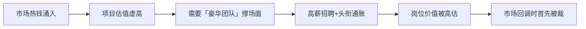

# 8.4 哪些岗位被严重高估

> **学习目标**：完成本节后，你将能够……
> - 识别 Web3 行业中被严重高估的岗位类型及其共同特征
> - 理解岗位被高估背后的市场机制和信息不对称问题
> - 掌握评估岗位真实价值的方法论，建立实用的求职避坑清单

---

## 核心内容

### 1. 被高估岗位的共同特征

在 Web3 行业快速发展的过程中，一些岗位的价值被市场严重高估。识别这些岗位的共同特征，是避免入坑的第一步。

**特征一：产出难以量化**

这类岗位的工作成果往往模糊不清，缺乏明确的 KPI 或可衡量的价值指标。当你问「这个岗位具体产出什么」时，得到的回答通常是「资源对接」「战略建议」「社区氛围」等抽象概念。

**特征二：头衔通胀严重**

「首席」「总监」「负责人」等头衔被滥用。一个三人团队可能有两个「VP」，一个五人项目可能有三个「顾问」。头衔的膨胀往往与实际职责不匹配。

**特征三：依赖市场周期而非核心能力**

这些岗位在牛市时需求暴涨，熊市时迅速萎缩。其价值更多来自市场热度而非岗位本身创造的不可替代价值。

**特征四：进入门槛与薪酬倒挂**

部分岗位要求的实际技能门槛很低，但薪酬却远高于传统行业同类岗位。这种倒挂往往不可持续。

> **Tips**：不是说这些岗位完全没有价值，而是市场给予的估值远超其实际贡献。在行业调整期，这些岗位往往首先被裁撤。

### 2. 具体被高估岗位分析

#### 2.1 某些「顾问」角色

**典型画像**：
- 名片上印着 3-5 个项目的「Advisor」头衔
- 主要工作是「站台」和「背书」
- 实际参与项目决策的时间每月不超过 2 小时
- 收取代币分配但不承担任何实际责任

**为什么被高估**：

早期 Web3 项目确实需要有经验的人提供指导，但市场逐渐异化。很多「顾问」的价值仅在于：
- 提供社交媒体上的「名人效应」
- 帮助项目获得交易所或投资人的注意
- 在白皮书上增加一个「看起来专业」的名字

**真实价值评估**：

| 类型 | 真正有价值的顾问 | 泡沫型顾问 |
|-----|-----------------|-----------|
| 时间投入 | 每周 5+ 小时深度参与 | 每月偶尔露面 |
| 产出形式 | 具体建议、资源对接、问题解决 | 发几条推文、参加一次 AMA |
| 责任绑定 | 对项目成败有利益关联 | 只拿代币不担责任 |
| 专业领域 | 在特定领域有可验证的专业能力 | 「什么都懂」= 什么都不精 |

#### 2.2 部分「社区运营」

**典型画像**：
- 主要工作是在 Discord/Telegram 里「活跃气氛」
- 用表情包和 meme 维持群内热度
- 组织简单的 AMA 和抽奖活动
- 无法提供用户增长、留存或转化的数据

**为什么被高估**：

Web3 项目普遍重视「社区」，但很多团队误将「群聊活跃度」等同于「社区价值」。实际上：
- Discord 在线人数可以轻易造假
- 抽奖活动带来的用户忠诚度几乎为零
- 真正的社区建设需要产品价值支撑

**真实价值评估**：

有价值的社区运营应该能够：
- 将社区反馈转化为产品改进建议
- 建立用户分层和精细化运营体系
- 培养真正的社区贡献者和布道者
- 提供可量化的社区健康度指标

#### 2.3 过度包装的「研究员」

**典型画像**：
- 产出主要是「行业周报」「项目速览」
- 内容大量复制粘贴自其他来源
- 缺乏原创性分析和独立观点
- 研报结论模棱两可，缺乏可验证的预测

**为什么被高估**：

Web3 信息爆炸，项目方和投资者都需要「研究」来支撑决策。但大量「研究员」的产出实际上是：
- 信息搬运和翻译
- 格式化的项目介绍
- 缺乏深度的表面分析

**真假研究员对比**：

| 维度 | 真正的研究员 | 泡沫型研究员 |
|-----|-------------|-------------|
| 信息来源 | 一手数据、链上分析、访谈 | 二手资料汇编 |
| 分析深度 | 建立独特框架、可验证结论 | 表面描述、模糊判断 |
| 观点立场 | 敢于提出非共识观点 | 追随市场热点 |
| 复盘机制 | 定期回顾预测准确性 | 写完即忘 |

### 3. 为什么会被高估

#### 3.1 信息不对称

**行业术语的障碍**：

Web3 充满专业术语，外行很难评估一个岗位的真实价值。「代币经济设计」「治理机制优化」「流动性策略」这些词汇，让非专业人士难以判断其背后的实际工作量和难度。

**成果归因的困难**：

一个项目成功了，是因为顾问的建议？社区运营的努力？还是产品本身的优势？在 Web3 这样高度复杂的系统中，很难准确归因，这给了很多岗位「蹭功劳」的空间。

#### 3.2 行业泡沫

**资金充裕期的人才争夺**：

2021 年牛市期间，大量资金涌入 Web3。项目方为了快速组建团队，不惜高薪招人。这种「不差钱」的心态推高了整体薪酬水平，尤其是那些看起来「高大上」的岗位。

**叙事驱动的估值**：

Web3 项目的估值很大程度上靠「故事」支撑。为了讲好故事，项目需要「豪华团队」「知名顾问」「活跃社区」——这些需求本身就是泡沫的一部分。

#### 3.3 监管套利

**传统行业的约束缺失**：

在传统金融或互联网行业，很多角色有明确的资质要求和行业标准。而 Web3 的监管空白，让一些本应有门槛的岗位变得「人人可做」。

### 4. 如何识别真正有价值的机会

#### 4.1 三个核心问题

在评估任何 Web3 岗位时，问自己这三个问题：

**问题一：这个岗位创造什么不可替代的价值？**

如果答案是模糊的「资源对接」「战略支持」，要保持警惕。真正有价值的岗位，应该能清晰说明其产出和影响。

**问题二：如果市场转熊，这个岗位还会存在吗？**

牛市时很多岗位看起来「必不可少」，但市场一转向就立即被裁撤。关注那些在任何市场周期都需要的核心能力岗位。

**问题三：这个岗位的薪酬在传统行业是什么水平？**

如果一个岗位在传统行业月薪 1 万，在 Web3 却要 5 万，除非有明确的稀缺性理由，否则这种溢价可能不可持续。

#### 4.2 验证方法

**背景调查**：
- 检验对方过往项目的实际发展情况
- 核实其声称的「成功案例」是否属实
- 了解其在之前岗位的真实贡献

**试用期观察**：
- 关注实际产出而非口头汇报
- 验证其专业能力是否匹配岗位要求
- 评估其对团队的实质贡献

### 5. 避坑指南

#### 5.1 求职者视角

**警惕信号**：

| 红旗信号 | 说明 |
|---------|------|
| JD 模糊 | 大量使用「赋能」「生态」「战略」等词汇，但缺乏具体职责 |
| 只聊愿景 | 面试只谈宏大目标，不谈具体工作内容和考核标准 |
| 代币占比过高 | 薪酬中代币占比超过 50%，且锁仓期很长 |
| 头衔虚高 | 团队规模很小但给出的头衔很大 |
| 急于入职 | 不做背景调查就催促入职 |

**健康信号**：

| 正向信号 | 说明 |
|---------|------|
| 明确的 OKR | 有清晰的目标和关键结果定义 |
| 汇报关系清晰 | 能明确说明向谁汇报、与谁协作 |
| 团队可验证 | 核心成员背景可查证 |
| 产品有数据 | 有真实的用户数据和产品进展 |

#### 5.2 招聘方视角

**避免的做法**：
- 用高头衔代替高薪酬（制造虚假预期）
- 盲目追求「大厂背景」或「圈内名人」
- 让顾问变成「付费背书」
- 用社区人数代替社区质量

**推荐的做法**：
- 建立清晰的岗位价值评估体系
- 设置合理的试用期和考核机制
- 关注候选人的实际能力而非履历光环
- 定期复盘各岗位的 ROI

---

## 案例/故事

### 「百万顾问」的真实故事

2021 年，一位在社交媒体上拥有 10 万粉丝的 KOL 同时担任 8 个项目的「战略顾问」。根据当时的市场价格计算，这些顾问代币的总价值超过 200 万美元。

然而，当有人深入调查后发现：
- 他每周花在这 8 个项目上的总时间不超过 5 小时
- 他提供的「战略建议」主要是在群里发几条消息
- 他对大多数项目的技术方案和商业模式一无所知
- 他的主要「贡献」是在推特上发布带有项目链接的推文

2022 年市场下行后，这 8 个项目中有 6 个已经停止运营。那些代币要么归零，要么因为锁仓无法出售。这位 KOL 的「顾问」生涯也随之结束。

这个案例揭示了一个残酷的事实：**在泡沫期，市场愿意为「影响力」支付高额溢价。但当潮水退去，真正能存活的只有那些创造了实际价值的角色。**

---

## 关键概念速查

| 概念 | 一句话解释 |
|-----|-----------|
| **头衔通胀** | 岗位名称级别远高于实际职责范围的现象 |
| **产出量化** | 用可衡量的指标评估工作成果的方法 |
| **周期依赖** | 岗位需求随市场牛熊周期剧烈波动的特征 |
| **信息不对称** | 招聘双方对岗位真实价值认知存在差距 |
| **叙事溢价** | 因行业热度和故事性而非实际价值产生的薪酬溢价 |
| **顾问经济** | Web3 中以代币换取名人背书的合作模式 |
| **社区泡沫** | 将表面活跃度误认为真实社区价值的现象 |

---

## 学习资料

### 必读
- [The Problem with Crypto Advisors](https://www.coindesk.com/consensus-magazine/2023/01/18/the-problem-with-crypto-advisors/) - CoinDesk - 深入分析加密行业顾问角色的问题（预计阅读 15 分钟）
- [Web3 求职避坑指南](https://mirror.xyz/0x....) - 中文社区分享，新人必读（预计阅读 10 分钟）

### 选读（进阶）
- [Crypto Jobs Market Analysis](https://web3.career/web3-salary-report-2024) - Web3 Career - Web3 薪酬市场数据，帮助建立合理预期
- [Building Real Communities](https://www.notboring.co/p/the-community-playbook) - Not Boring - 了解真正有价值的社区建设

---

## 学习任务

- [ ] **任务 1**：找到 3 个 Web3 项目的「顾问」列表，调查这些顾问在其他项目的履历，评估其「顾问」角色的实质贡献
- [ ] **任务 2**：加入 2-3 个 Web3 项目的 Discord，观察其社区运营的实际工作内容，尝试区分「表面活跃」和「真正有价值」的社区活动
- [ ] **任务 3**：使用本章提供的「三个核心问题」框架，评估一个你感兴趣的 Web3 岗位的真实价值

---

## 常见问题 FAQ

**Q1: 是不是所有顾问岗位都是泡沫？**

A: 不是。真正有价值的顾问确实存在，尤其是那些在特定领域（如合规、安全、经济模型设计）有深厚专业背景、并且愿意投入实质时间参与项目的专家。关键是区分「专业顾问」和「付费背书」。评估标准包括：是否有明确的咨询范围、是否定期参与项目会议、是否对具体问题提供可执行建议。

**Q2: 社区运营真的没有价值吗？**

A: 社区运营非常重要，但市场上确实存在大量低价值的「社区运营」岗位。有价值的社区运营应该能够：1）帮助产品团队获取用户反馈；2）培养核心用户成为布道者；3）建立可持续的社区文化。如果社区运营的工作仅限于「发表情包」和「组织抽奖」，那确实价值有限。

**Q3: 如何判断一个研报是否有价值？**

A: 几个判断标准：1）是否有独家信息或独特分析视角；2）结论是否清晰且可追踪验证；3）分析框架是否可复用；4）作者是否对其观点承担声誉责任。如果一份研报的内容在网上到处都能找到，结论模棱两可，那大概率价值有限。

**Q4: 作为新人，如何避免进入被高估的岗位？**

A: 几个建议：1）优先选择有明确产出物的岗位（如开发、设计）而非模糊定义的岗位；2）在面试时主动询问「这个岗位的成功标准是什么」「如何衡量我的工作成果」；3）关注团队的真实运营情况，而非宏大愿景；4）警惕代币占比过高的薪酬结构；5）多和行业内的资深从业者交流，获取真实信息。

**Q5: 这些被高估的岗位是否会随着行业成熟而消失？**

A: 大概率会经历调整。随着行业逐渐成熟、监管日趋完善、市场参与者更加理性，那些缺乏实质价值的岗位会逐渐被淘汰或重新定价。这个过程已经在发生——2022-2023 年的熊市中，大量「顾问」「社区运营」「研究员」岗位被裁撤。长期来看，只有真正创造价值的岗位才能持续存在。

---

最后更新：2025-01-09
编写：AI Assistant
审核：待审核
