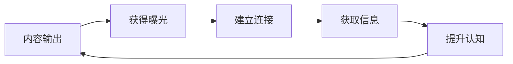
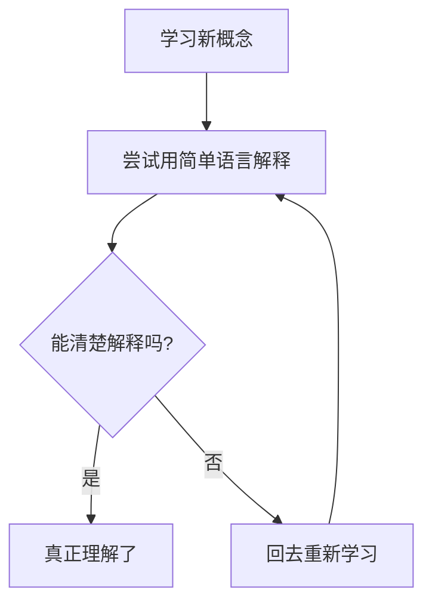

# 8.5 建立 Web3 个人品牌与影响力

> **学习目标**：完成本节后，你将能够......
> - 理解为什么在 Web3 行业个人影响力尤为重要
> - 掌握 X/Twitter、小红书等平台的基础运营方法
> - 建立持续的内容输出习惯，用输出倒逼输入

---

## 核心内容

### 1. 为什么在 Web3 个人影响力很重要

#### 1.1 Web3 行业的独特性

与传统行业相比，Web3 有几个特点让个人品牌变得格外重要：

**去中心化的信任机制**

在传统行业，你的背书来自公司、学历、职称。在 Web3，很多时候：
- 你的雇主可能是一个匿名团队
- 你的合作伙伴可能只有一个推特头像
- 你的用户/投资者需要其他方式来判断你的可信度

这时候，**公开可追溯的内容输出**就成为了一种「链上简历」——你说过什么、做过什么、判断对过几次，都是可验证的。

**信息差是核心竞争力**

Web3 是一个信息高度不对称的领域：
- 新项目、新叙事层出不穷
- 优质信息往往在小圈子里流传
- 能获取和解读信息的人，就有机会

而**建立影响力的过程，本身就是获取优质信息的过程**：
- 你输出内容 → 被更多人看到
- 被更多人看到 → 更多人愿意与你交流
- 更多交流 → 获得更多信息
- 更多信息 → 输出更好的内容

这是一个**正向飞轮**。



**机会往往从社交媒体开始**

在 Web3，很多机会的获取路径是：
- 工作机会：团队在推特上看到你的内容 → 主动联系你
- 投资机会：你在社群中的声誉 → 获得早期项目信息
- 合作机会：你的专业内容 → 被项目方邀请合作
- 学习机会：你的输出质量 → 加入高质量社群

**没有个人品牌，你就是「隐形人」**——即使能力很强，也很难被发现。

#### 1.2 个人品牌 = 社会资本

在 Web3，你的**社会资本**（Social Capital）可能比金融资本更重要：

| 类型 | 传统定义 | Web3 体现 |
|-----|---------|----------|
| **关注者数量** | 粉丝量 | 信息传播能力 |
| **内容质量** | 专业度 | 被引用和转发的频率 |
| **社区声誉** | 口碑 | 在核心圈子中的信任度 |
| **连接质量** | 人脉 | 能触达的项目方、投资人、开发者 |

这些社会资本可以转化为：
- 更好的工作机会和薪资谈判筹码
- 早期项目的投资/空投机会
- 与优秀人才合作的可能性
- 更快的信息获取速度

> **重要提醒**：建立影响力是一个长期过程，不要指望一夜之间「涨粉百万」。真正有价值的是**持续、专业、真诚的内容输出**，而不是追热点、蹭流量的短期行为。

---

### 2. X / Twitter 运营建议

X（原 Twitter）是 Web3 领域最重要的社交平台，几乎所有项目方、投资人、开发者都活跃在上面。

#### 2.1 账号定位

**首先想清楚：你想成为什么样的账号？**

| 定位类型 | 内容特点 | 适合人群 | 案例参考 |
|---------|---------|---------|---------|
| **学习者** | 学习笔记、心得分享 | 新手、转型者 | 「今天学到了......」 |
| **分析师** | 项目分析、数据解读 | 有研究能力的人 | 链上数据分析、项目 Deep Dive |
| **开发者** | 技术分享、代码教程 | 技术背景人员 | 智能合约教程、技术解析 |
| **观点输出** | 行业洞察、趋势判断 | 有独立思考能力的人 | 对市场、项目的独特见解 |
| **资讯搬运** | 新闻整理、信息聚合 | 信息敏感度高的人 | 每日快讯、项目动态 |

**新手建议**：从「学习者」定位开始。

原因：
- 没有专业压力，学什么写什么
- 真诚分享比「装专家」更有吸引力
- 可以在学习过程中逐渐找到自己的定位

#### 2.2 内容策略

**内容类型金字塔**：

```
           [原创深度]
          /          \
       [观点评论]
      /            \
   [学习笔记/总结]
  /                  \
[转发+简评] [互动回复]
```

**从底部开始，逐步向上**：

**第一阶段：转发 + 简评（Day 1-30）**
- 关注 50-100 个高质量账号
- 每天转发 2-3 条有价值的内容
- 加上你的理解或评论（不是无脑转）
- 目的：开始参与，建立在场感

**第二阶段：学习笔记（Day 30-90）**
- 把学到的知识整理成推文
- 可以是 1 条推文，也可以是 Thread（推文串）
- 配图、表格让内容更易读
- 目的：证明你在学习，吸引同阶段的人

**第三阶段：观点输出（Day 90+）**
- 对热点事件发表看法
- 对项目/趋势做出判断
- 敢于表达，也要接受不同意见
- 目的：展示思考能力，吸引同频的人

**内容原则**：
- **真实**：不懂就说不懂，不要强装专家
- **有用**：让读者看完有收获
- **持续**：频率比完美更重要
- **独特**：找到你的视角，不要人云亦云

#### 2.3 互动技巧

**主动互动是涨粉最快的方式**：

1. **高质量回复**
   - 找到你想关注的大 V 或垂直账号
   - 在他们的推文下留下有价值的评论
   - 不是「说得好」，而是补充观点、提出问题、分享案例
   - 大 V 的粉丝会看到你的回复

2. **参与讨论**
   - 加入 Twitter Space（语音讨论房间）
   - 在热点话题下发表观点
   - 与同阶段的账号互相支持

3. **建立连接**
   - 主动 DM（私信）你欣赏的人
   - 表达真诚的赞赏，不要上来就求帮忙
   - 质量 > 数量，不要群发

**避免的行为**：
- 无意义的「冲浪」评论
- 过度营销、刷存在感
- 复制粘贴的模板回复
- 争吵、人身攻击

#### 2.4 实用工具

| 工具 | 用途 | 推荐程度 |
|-----|------|---------|
| **TweetDeck / X Pro** | 多栏管理，监控关键词 | 必备 |
| **Typefully** | 排期发布，Thread 编辑 | 推荐 |
| **Tweetcaster** | 数据分析，最佳发布时间 | 可选 |
| **Notion / Obsidian** | 内容素材库 | 推荐 |

---

### 3. 小红书运营建议

小红书是中文 Web3 内容的重要阵地，与 X/Twitter 有明显的差异。

#### 3.1 平台差异

| 维度 | X / Twitter | 小红书 |
|-----|-------------|--------|
| **用户画像** | 全球化、英语为主、行业深度用户 | 中国大陆、中文、泛人群 |
| **内容形式** | 文字为主、Thread | 图文并重、笔记形式 |
| **算法逻辑** | 关注+时间线+热点 | 兴趣推荐、搜索流量 |
| **互动风格** | 直接、debate、meme 文化 | 友好、种草、生活化 |
| **Web3 氛围** | 核心阵地、实时性强 | 科普为主、新手友好 |

#### 3.2 内容策略

**小红书的 Web3 内容更适合**：
- 入门科普：「什么是 NFT」「区块链入门」
- 教程类：「手把手教你创建钱包」「如何参与空投」
- 避坑指南：「Web3 新手常见错误」「我被骗了......」
- 行业观察：「Web3 从业者的一天」「转行 Web3 的真实体验」

**内容形式建议**：
- **图文笔记**：1-9 张图 + 文字，适合教程、科普
- **封面很重要**：决定了是否被点击
- **标题要口语化**：「救命！原来这就是......」「后悔没早知道的......」
- **干货 + 故事**：纯干货容易枯燥，加入个人体验更有共鸣

**注意事项**：
- 小红书对「投资建议」类内容敏感，避免直接推荐项目
- 避免使用「暴富」「躺赚」等敏感词
- 内容需要更「接地气」，不要太专业术语化
- 合规意识：不要出现「翻墙」「科学上网」等词汇

#### 3.3 差异化定位

在小红书做 Web3 内容，可以找差异化角度：
- **小白视角**：「我是如何从零开始学 Web3 的」
- **职场转型**：「从互联网转行 Web3 的 100 天」
- **女性视角**：Web3 领域女性创作者相对稀缺
- **设计/美学**：NFT 艺术、Web3 产品设计分析
- **生活方式**：Web3 从业者的日常，行业见闻

---

### 4. Paragraph / Mirror 长文平台

如果你想输出更深度的内容，可以使用 Web3 原生的长文平台。

#### 4.1 平台对比

| 平台 | 特点 | 适合内容 | 是否上链 |
|-----|------|---------|---------|
| **Mirror** | Web3 原生、可铸造 NFT | 深度研究、项目分析 | 是（Arweave） |
| **Paragraph** | 更现代的体验、订阅功能 | Newsletter、定期专栏 | 是 |
| **微信公众号** | 中文生态、传播广 | 科普、行业观察 | 否 |
| **Medium** | 国际化、SEO 友好 | 英文深度内容 | 否 |

#### 4.2 Mirror 使用建议

**Mirror 的优势**：
- 内容上链，永久存储
- 可以将文章铸造成 NFT
- 可以发起众筹（Crowdfund）
- Web3 圈子的「官方感」

**适合发布**：
- 项目深度分析（3000 字以上）
- 行业研究报告
- 个人年度总结
- 重要的观点输出

**注意事项**：
- Mirror 的发现机制较弱，需要配合推特传播
- 内容一旦上链不可修改，发布前仔细检查
- 建议先在其他平台测试反馈，好内容再上链

#### 4.3 Paragraph 使用建议

**Paragraph 的优势**：
- 订阅功能更完善（类似 Substack）
- 支持付费订阅
- 用户体验更好
- 邮件推送功能

**适合建立**：
- 定期 Newsletter（周报、月报）
- 系列内容（如「Web3 入门 30 讲」）
- 付费内容（进阶分析、独家信息）

**新手建议**：先从免费内容开始，积累订阅者后再考虑付费。

---

### 5. 从学习笔记开始建立内容输出习惯

对于大多数人来说，最大的障碍不是「不会写」，而是「不敢写」。解决方案：**从学习笔记开始**。

#### 5.1 费曼学习法

费曼学习法的核心：**如果你不能简单地解释一件事，说明你还没有真正理解它**。



**应用到内容输出**：
- 学完一个概念 → 尝试写出来
- 写不清楚 → 说明没学透，回去重学
- 写清楚了 → 既巩固了知识，又产出了内容

#### 5.2 输出倒逼输入

**没有输出压力时**：
- 学习容易流于表面
- 「看过了」不等于「学会了」
- 很快就忘记

**有输出压力时**：
- 学习会更认真（因为要写出来）
- 会主动寻找更好的学习材料
- 记忆更深刻（因为经过了重新组织）
- 形成知识资产（内容可以被复用）

#### 5.3 最小化启动

**第一条推文怎么写？**

模板 1：学习收获
```
今天学习了 [主题]，有几个收获：

1. [收获 1]
2. [收获 2]
3. [收获 3]

还有一个疑问：[问题]

#Web3学习 #区块链
```

模板 2：概念解释
```
[概念] 是什么？

用大白话说：[简单解释]

举个例子：[生活化比喻]

和 [相似概念] 的区别：[对比]
```

模板 3：读后感
```
读完 [文章/白皮书] 的 3 个收获：

1. [观点 1] - [你的理解]
2. [观点 2] - [你的理解]
3. [观点 3] - [你的理解]

原文链接：[URL]
```

#### 5.4 坚持的方法

**设定最小目标**：
- 不是「每天写一篇深度文章」
- 而是「每天发一条推文」或「每周写一篇笔记」
- 最小目标更容易坚持

**建立仪式感**：
- 固定时间写作（如每天晚上 9 点）
- 固定的写作环境
- 完成后给自己小奖励

**寻找同行者**：
- 加入学习社群，互相督促
- 找一个「输出搭子」，互相点评
- 公开承诺，增加坚持的动力

**记录进步**：
- 定期回顾自己的内容
- 你会发现明显的进步
- 这种正反馈会让你更愿意继续

---

## 案例/故事

### 从零开始的 Web3 内容创作者

小林是一名 Web2 产品经理，2022 年开始对 Web3 产生兴趣。他没有技术背景，也没有金融背景，但他做了一件事：**记录自己的学习过程**。

**第一阶段（0-3 个月）：纯学习者**

他注册了 Twitter 账号，简介写的是「Web3 小白，记录学习过程」。每学完一个概念，就发一条推文：

> 「今天终于搞懂了什么是 Gas Fee。简单说就是使用以太坊网络的"手续费"，需要用 ETH 支付。网络拥堵时 Gas 会变贵，就像高峰期打车一样。」

这种内容没有任何「专业门槛」，但真诚、有用。三个月后，他有了 500 个关注者——大多是和他一样的学习者。

**第二阶段（3-6 个月）：学习笔记**

随着学习深入，他开始写 Thread：

> 「我花了 2 周时间研究 DeFi 借贷协议，写了这篇 10 条的总结...... 」

这些内容被一些大 V 转发，关注者增长到 3000 人。更重要的是，有项目方开始私信他，询问是否有兴趣做内容合作。

**第三阶段（6 个月后）：找到定位**

他发现自己最擅长的是「把复杂的东西讲简单」——这正是产品经理的核心能力。于是他定位为「Web3 概念翻译官」，专门写小白向的科普内容。

一年后，他：
- Twitter 关注者 2 万+
- 获得了 3 个项目的 Advisor 机会
- 被一家 Web3 媒体邀请成为专栏作者
- 最终跳槽到一家 Web3 公司做产品

他说：「我没有任何内幕信息，没有技术能力，我唯一做对的事情就是——**把学习过程公开记录下来**。」

---

## 关键概念速查

| 概念 | 一句话解释 |
|-----|-----------|
| **社会资本** | 在 Web3 中，你的声誉、影响力、人脉网络，可以转化为实际机会 |
| **费曼学习法** | 通过「教别人」来验证和深化自己的学习，不能简单解释就说明没学透 |
| **输出倒逼输入** | 有输出目标会让学习更主动、更深入、更有效 |
| **Thread** | Twitter 上的推文串，适合发布结构化的长内容 |
| **Newsletter** | 订阅制的邮件通讯，适合定期发布深度内容 |
| **Mirror** | Web3 原生的内容发布平台，内容存储在区块链上 |
| **Paragraph** | 类似 Substack 的 Web3 Newsletter 平台 |

---

## 学习资料

### 必读
- [如何打造你的 Twitter 个人品牌](https://twitter.com/dickiebush/status/1411357489782870024) - Dickie Bush Thread（英文）- 推特运营的经典教程（预计阅读 10 分钟）
- [写作是最好的自我投资](https://book.douban.com/subject/30292992/) - Spenser - 中文书籍，关于内容输出的底层思维（可选读前 3 章，约 1 小时）

### 选读（进阶）
- [Mirror 官方文档](https://mirror.xyz/dashboard) - 了解如何在 Mirror 发布内容
- [Paragraph 入门指南](https://paragraph.xyz/) - 了解如何创建 Web3 Newsletter
- [The Ultimate Guide to Twitter Growth](https://www.ship30for30.com/post/the-ultimate-guide-to-twitter-growth) - Ship30for30 - 系统的 Twitter 增长方法论（英文）
- [Building a Second Brain](https://www.buildingasecondbrain.com/) - Tiago Forte - 个人知识管理方法论

---

## 学习任务

- [ ] **任务 1**：注册 X/Twitter 账号（如已有，可跳过），完善个人简介，写清楚你的身份和兴趣方向

- [ ] **任务 2**：注册小红书账号（如已有，可跳过），发布第一条 Web3 学习笔记，可以是：
  - 学习本课程的一个收获
  - 对一个 Web3 概念的理解
  - 你为什么想学习 Web3

- [ ] **任务 3**：在 X/Twitter 上关注至少 10 个 Web3 相关账号，并转发一条你认为有价值的内容，附上你的简短评论

> **提交方式**：截图你发布的第一条笔记，记录在个人学习笔记中

---

## 常见问题 FAQ

**Q1: 我没什么可写的，感觉自己懂得太少了，怎么办？**

A: 这是最常见的心理障碍。事实上，「学习者视角」本身就是有价值的内容。你不需要是专家才能输出——你的学习过程、踩过的坑、理解的困难，对其他初学者都是有帮助的。从「今天学到了什么」开始，不要追求完美，先开始。

**Q2: 担心写错了被人笑话，怎么克服？**

A: 两个思路：1）Web3 的信息更新很快，所谓的「专家」也经常判断错误，你写错了很正常；2）标注清楚「这是我的理解，可能有误，欢迎指正」，把内容当作讨论而非定论。真正会嘲笑新人的是少数，大多数人会友善地帮你纠正。

**Q3: 英文不好，只做中文平台可以吗？**

A: 可以，但会有局限。Web3 的核心信息流通在英文世界，只关注中文会有信息延迟。建议：1）中文平台可以作为主阵地；2）慢慢培养阅读英文的习惯，不需要写，能读就行；3）X/Twitter 上有翻译功能，可以辅助理解。

**Q4: 需要露脸/暴露真实身份吗？**

A: 不需要。Web3 文化对匿名相对友好，很多知名 KOL 都是匿名账号。你可以使用头像、化名。但注意：匿名不等于可以胡说，你的内容质量仍然是最重要的。长期来看，一致的身份（即使是匿名身份）会积累信任。

**Q5: 要花多少时间来运营？**

A: 入门阶段，每天 30 分钟足够：10 分钟浏览信息，10 分钟写点东西，10 分钟互动。不需要全职投入。关键是**持续**，而不是偶尔花很多时间然后断更。每周发 3-5 条推文，坚持 3 个月，就会看到效果。

---

## 下一步

完成本节学习后，你已经了解了如何在 Web3 建立个人品牌。核心要点回顾：

- 在 Web3，个人影响力 = 社会资本 = 机会
- 从「学习者」定位开始，真诚比专业更重要
- 不同平台有不同的内容策略和用户群体
- 用输出倒逼输入，从学习笔记开始
- 持续比完美更重要，先开始，再迭代

**立即行动**：

不要等到「准备好了」才开始。现在就打开 X 或小红书，发布你的第一条 Web3 学习笔记。内容可以很简单：

> 「我正在学习 Web3 通识课，今天的收获是......」

**记住**：你现在发的每一条内容，都是未来的「历史记录」。那些「从第一天就开始记录」的人，往往有最好的故事可以讲。

→ 继续学习：[Part 9：参与 Web3 的四种方式](../Part09-参与Web3的四种方式/9.1-只学习不入局的参与方式.md)

---

最后更新：2025-01-09
编写：Antony
审核：待审核
