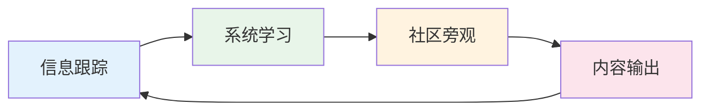

# 9.1 只学习、不入局的参与方式

> **学习目标**：完成本节后，你将能够：
> - 理解「只学习」为什么是一种有效的 Web3 参与方式
> - 掌握系统性学习 Web3 的方法和资源
> - 制定适合自己的学习路径规划

---

## 核心内容

### 1. 为什么「只学习」是有效的参与

很多人认为，不投入资金就不算真正参与 Web3。这是一个误解。

**学习型参与的核心价值**：

| 维度 | 说明 |
|-----|------|
| 认知积累 | Web3 知识具有复利效应，今天的学习是明天决策的基础 |
| 风险规避 | 避免因无知而「交学费」，学习成本远低于投资亏损 |
| 机会储备 | 当真正的机会出现时，你有能力识别和把握 |
| 职业准备 | 为可能的职业转型积累必要的行业认知 |

> **Tips**：在 Web3 领域，「不懂就投」是亏损的主要原因之一。花 3 个月系统学习，可能帮你避免数万元的「学费」。

### 2. 学习型参与的四种方式

#### 2.1 信息跟踪

持续关注行业动态，保持信息敏感度：

- **Twitter/X**：关注项目官方账号、知名 KOL、研究机构
- **Newsletter**：订阅 Bankless、The Block 等高质量周报
- **播客**：利用碎片时间收听行业讨论

**推荐关注清单**：
- 中文：吴说区块链、Foresight News、深潮 TechFlow
- 英文：@VitalikButerin、@balaboris、Bankless

#### 2.2 系统学习

通过结构化内容建立完整知识体系：

- **在线课程**：Binance Academy、Coinbase Learn、本课程
- **白皮书**：比特币白皮书、以太坊白皮书等经典文献
- **书籍**：《精通比特币》《精通以太坊》等技术书籍

#### 2.3 社区参与（旁观者模式）

加入社区但不急于参与投资：

- **Discord**：加入感兴趣项目的 Discord，观察社区氛围
- **Telegram**：关注行业讨论群组
- **论坛**：浏览 Reddit r/cryptocurrency、r/ethereum

> **Tips**：以旁观者身份参与社区，可以学习行业「黑话」、了解真实的社区文化，为未来可能的深度参与做准备。

#### 2.4 内容输出

通过输出倒逼输入，加深理解：

- **学习笔记**：整理每次学习的要点
- **公开分享**：在 X、小红书发布学习心得
- **深度文章**：尝试写分析文章，锻炼研究能力

### 3. 学习路径规划

#### 第一阶段：建立全局观（1-2 周）

- 完成本课程 Part1-2 内容
- 理解 Web3 的基本概念和生态全貌
- 目标：能用自己的话解释「什么是 Web3」

#### 第二阶段：掌握基础操作（1-2 周）

- 完成本课程 Part3 内容
- 在测试网完成钱包创建和交易
- 目标：能独立完成基本的链上操作

#### 第三阶段：了解赛道生态（2-4 周）

- 完成本课程 Part4-5 内容
- 选择 1-2 个感兴趣的赛道深入了解
- 目标：能解释主流赛道的商业逻辑

#### 第四阶段：识别风险陷阱（1-2 周）

- 完成本课程 Part6-7 内容
- 研究历史案例（Luna、FTX 等）
- 目标：能识别常见的风险模式

#### 第五阶段：持续跟进（长期）

- 建立日常信息跟踪习惯
- 定期复盘和更新认知
- 目标：保持对行业的持续关注

### 4. 何时考虑进入下一阶段

当你满足以下条件时，可以考虑从「只学习」转向其他参与方式：

| 维度 | 自评标准 |
|-----|---------|
| 知识储备 | 能独立分析一个项目的基本面 |
| 风险意识 | 清楚知道自己可能面临的风险 |
| 资金准备 | 有可以承受完全损失的闲置资金 |
| 心理准备 | 能接受高波动，不会影响生活 |
| 时间精力 | 有足够时间持续跟进和学习 |

> **Tips**：如果上述任何一项不满足，继续保持「只学习」状态是完全合理的选择。

---

## 案例/故事

**小王的学习型参与之路**

小王是一名互联网产品经理，2021 年开始关注 Web3，但没有急于投资。他的做法是：

1. **第一年**：每天花 30 分钟刷 Twitter，订阅了 3 个 Newsletter，完成了 Binance Academy 的基础课程
2. **第二年**：在测试网练习了钱包操作，开始写学习笔记并发布到 X
3. **第三年**：凭借积累的知识和影响力，成功转型为 Web3 产品经理

小王说：「我庆幸自己没有在 2021 年冲进去，那时候很多人亏了很多钱。但这两年的学习让我在转型时比其他人有明显优势。」

---

## 关键概念速查

| 概念 | 一句话解释 |
|-----|-----------|
| 认知复利 | 知识积累产生的长期价值，今天的学习是明天决策的基础 |
| 信息跟踪 | 通过 Twitter、Newsletter 等渠道持续关注行业动态 |
| 系统学习 | 通过课程、书籍等结构化内容建立完整知识体系 |
| 内容输出 | 通过写作、分享倒逼深度学习，加深理解 |
| 测试网 | 用于练习操作的区块链网络，不涉及真实资金 |

---

## 学习资料

### 必读
- [Ethereum.org 学习中心](https://ethereum.org/learn/) - 以太坊官方出品的系统学习资源（预计阅读 2 小时）
- [Binance Academy](https://academy.binance.com/zh) - 币安学院中文版，覆盖区块链基础到进阶（预计阅读 3 小时）

### 选读（进阶）
- [a16z Crypto Canon](https://a16zcrypto.com/posts/article/crypto-readings-resources/) - 顶级 VC 整理的加密阅读清单（英文）
- [Bankless](https://www.bankless.com/) - Web3 教育媒体，提供持续学习内容（英文）
- [白话区块链](https://www.hellobtc.com/) - 中文区块链科普平台

---

## 学习任务

完成以下任务以检验学习效果：

- [ ] **任务 1**：制定你的个人学习计划，包括：每周投入时间、关注的信息源（至少 3 个）、学习目标
- [ ] **任务 2**：关注至少 5 个 Web3 相关的 Twitter/X 账号，并说明选择理由
- [ ] **任务 3**：写一篇 300 字以内的学习笔记，总结你对「只学习不入局」这种参与方式的理解

> **提交方式**：将任务输出整理成文档，可发布到个人社交媒体或提交给课程

---

## 常见问题 FAQ

**Q1: 只学习不投资，会不会错过好机会？**

A: 可能会错过一些短期机会，但更可能避免很多陷阱。在 Web3 领域，因为无知而亏损的人远多于因为等待而错过的人。当你准备好了再入场，反而更可能抓住真正的机会。

**Q2: 学多久才算「准备好了」？**

A: 没有固定标准。关键是你能否独立分析项目、识别风险、并且有可以承受损失的资金。对大多数人来说，3-6 个月的持续学习是一个合理的起点。

**Q3: 不投资怎么获得真实体感？**

A: 可以通过测试网操作获得真实的链上体验，而不需要投入真金白银。测试网的操作流程和主网完全一致，是零成本练习的好方法。

**Q4: 学习型参与能持续多久？**

A: 可以永远保持这种状态。「只学习」不是一个过渡阶段，而是一种完全有效的长期参与方式。不是每个人都需要投资或从业。

---

最后更新：2025-01-09
编写：Antony
审核：待审核
