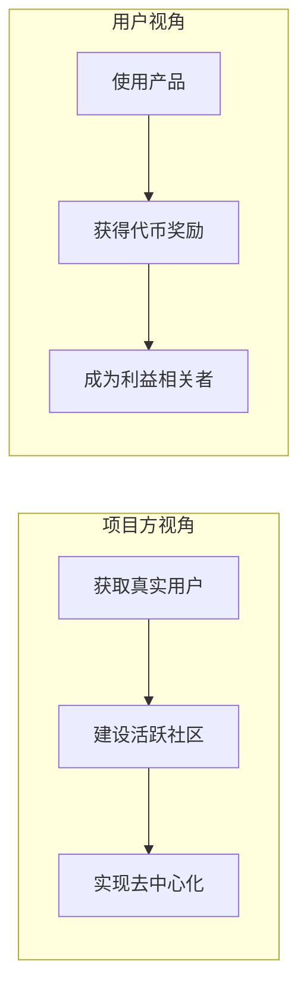
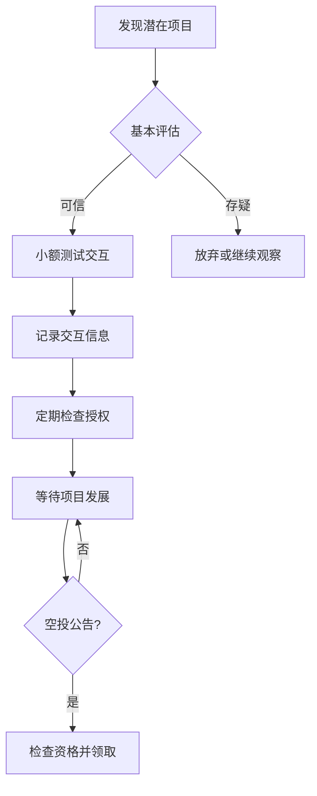

# 9.2 小额参与的正确姿势

> **学习目标**：完成本节后，你将能够：
> - 理解空投和撸毛生态的运作逻辑
> - 评估小额交互的成本、收益和风险
> - 掌握小额参与的风险控制方法

---

## 核心内容

### 1. 空投与撸毛生态简介

#### 什么是空投（Airdrop）

空投是指项目方向特定用户群体免费分发代币的行为。这是 Web3 独特的用户激励方式。

**空投的商业逻辑**：

| 角色 | 目的 | 价值 |
|-----|------|-----|
| 项目方 | 用户获取、社区建设 | 比传统营销更高效，用户变成利益共同体 |
| 用户 | 获取免费代币 | 早期参与可能获得可观回报 |

#### 什么是撸毛（Farming）

「撸毛」是指用户有意识地与潜在空投项目交互，以期获得未来空投的行为。

**撸毛的演变**：
- **早期**：简单使用产品即可获得空投
- **现在**：项目方设置复杂标准，反女巫机制严格
- **趋势**：收益下降，门槛提高，需要投入更多时间和资金

### 2. 空投的常见类型

| 类型 | 说明 | 案例 |
|-----|------|------|
| 追溯性空投 | 奖励项目发币前的历史用户 | Uniswap、Arbitrum |
| 预期空投 | 尚未发币项目，用户提前交互 | 各类未发币 L2、DeFi |
| 任务空投 | 完成指定任务获得奖励 | Galxe 任务、测试网任务 |
| 持有空投 | 持有特定资产获得新代币 | NFT 持有者空投 |

### 3. 空投的评估标准

项目方通常从以下维度评估用户质量：

| 维度 | 说明 | 权重趋势 |
|-----|------|---------|
| 交互次数 | 与协议的交互频率 | 中 |
| 交互金额 | 单次和累计交易金额 | 高 |
| 时间跨度 | 使用协议的时间长度 | 高 |
| 活跃天数 | 不同日期的活跃情况 | 高 |
| 链上身份 | ENS、早期用户等身份标识 | 中 |

> **Tips**：反女巫（Anti-Sybil）机制越来越严格。项目方会识别批量操作的地址，可能导致空投资格被取消。

### 4. 小额交互的风险控制

#### 4.1 合约授权风险

每次与 DeFi 协议交互时，通常需要授权合约使用你的代币。

**风险**：恶意合约可能转走你授权的所有资产

**控制措施**：
- 使用 [Revoke.cash](https://revoke.cash) 定期检查和撤销授权
- 尽量使用「限额授权」而非「无限授权」
- 交互后及时撤销不再需要的授权

#### 4.2 钓鱼和诈骗风险

**常见陷阱**：
- 假空投网站（URL 与官方相似）
- 假官方社交媒体账号
- 「领取空投」需要先转账或授权

**防范措施**：
- 只通过官方渠道获取链接
- 验证网站 URL 是否正确
- 任何要求你先付款的「空投」都是骗局

#### 4.3 成本控制

小额交互的成本包括：

| 成本类型 | 说明 | 控制方法 |
|---------|------|---------|
| Gas 费 | 每次链上交互的手续费 | 选择低 Gas 时段，使用 L2 |
| 本金 | 交互所需的资金 | 设定预算上限 |
| 时间成本 | 研究、操作、追踪的时间 | 评估时薪，设定时间边界 |

#### 4.4 预期管理

**现实情况**：
- 大多数项目不会空投
- 即使空投，金额可能很小
- 空投后代币可能快速贬值

**合理预期**：
- 将交互成本视为「学习成本」
- 不要为了空投影响正常生活
- 空投是意外之喜，不是稳定收入

### 5. 小额交互的实操建议

**操作原则**：

1. **研究先行**：了解项目背景、团队、融资情况
2. **小额试水**：首次交互金额控制在可接受损失范围内
3. **记录追踪**：记录交互的项目、时间、金额
4. **定期清理**：撤销不再需要的合约授权
5. **心态平和**：把交互当作学习，不过度投入

---

## 案例/故事

### 案例 1：Uniswap 空投（2020）

**背景**：Uniswap 是最大的去中心化交易所之一。2020 年 9 月，向所有历史用户空投 UNI 代币。

**结果**：
- 每个使用过的地址至少获得 400 UNI
- 空投时价值约 $1,200
- UNI 最高涨至 $40+，400 UNI 价值超过 $16,000

**启示**：真实使用优质产品，可能获得意外回报

### 案例 2：Arbitrum 空投（2023）

**背景**：Arbitrum 是以太坊最大的 L2 网络之一。2023 年 3 月空投 ARB 代币。

**结果**：
- 根据交互深度，用户获得 625-10,250 ARB 不等
- 空投时每个 ARB 约 $1.2
- 标准更复杂，考虑了交互次数、金额、时间等多个维度

**启示**：空投标准越来越复杂，简单的批量交互越来越难获得高额奖励

### 案例 3：失败案例

**某项目空投后归零**：
- 用户花费大量 Gas 费进行交互
- 项目确实进行了空投
- 但代币上线后快速下跌 99%，空投价值几乎为零
- Gas 费成本 > 空投收益

**启示**：不是所有空投都有价值，成本控制很重要

---

## 关键概念速查

| 概念 | 一句话解释 |
|-----|-----------|
| 空投（Airdrop） | 项目方向用户免费分发代币的激励方式 |
| 撸毛（Farming） | 有意识地与潜在空投项目交互以获取空投 |
| 女巫攻击（Sybil） | 用多个地址冒充多个用户，获取不当利益 |
| 反女巫（Anti-Sybil） | 项目方识别和排除批量操作地址的机制 |
| 合约授权 | 允许智能合约使用你的代币的权限 |
| Gas 费 | 链上交易需要支付的手续费 |

---

## 学习资料

### 必读
- [Revoke.cash](https://revoke.cash) - 检查和撤销合约授权的必备工具
- [DefiLlama Airdrops](https://defillama.com/airdrops) - 空投信息追踪平台

### 选读（进阶）
- [Uniswap UNI 空投公告](https://uniswap.org/blog/uni) - 经典空投案例分析
- [Arbitrum 空投标准解析](https://docs.arbitrum.io/) - 了解复杂的空投评估体系
- 安全机构关于合约授权风险的指南

---

## 学习任务

完成以下任务以检验学习效果：

- [ ] **任务 1**：使用 Revoke.cash 检查你的钱包地址（如有），列出当前的合约授权情况
- [ ] **任务 2**：分析一个已完成空投的项目（如 Uniswap 或 Arbitrum），总结其空投标准的 3 个关键维度
- [ ] **任务 3**：假设你有 $100 预算用于小额交互，制定一个成本控制计划，包括：Gas 费预算、交互项目数量、风险控制措施

> **提交方式**：将分析结果整理成文档

---

## 常见问题 FAQ

**Q1: 撸毛能赚钱吗？**

A: 可能，但不确定。成功的撸毛案例确实存在（如 Uniswap 早期用户），但这需要运气、眼光和时间投入。随着反女巫机制加强，纯靠批量交互获利越来越难。建议把它当作学习机会而非赚钱手段。

**Q2: 如何判断一个项目是否会空投？**

A: 没有确定的方法。可以参考的信号包括：项目有融资但尚未发币、官方暗示过代币计划、同类项目普遍有空投。但这些都不是保证。

**Q3: 需要多少资金才能参与？**

A: 取决于你选择的链和项目。在以太坊主网，单次交互可能需要 $5-50 Gas 费；在 L2 或其他链，可能只需 $0.1-1。建议从低成本的 L2 开始练习。

**Q4: 空投的代币应该立即卖出还是持有？**

A: 没有标准答案。历史数据显示，大多数空投代币在发放后会下跌，但也有例外。建议：领取后至少卖出一部分覆盖成本，剩余部分根据对项目的判断决定。

**Q5: 使用多个钱包撸毛可以吗？**

A: 技术上可以，但风险很高。项目方的反女巫机制越来越先进，能识别关联地址。一旦被标记为女巫，所有关联地址的空投资格都可能被取消。不建议这样做。

---

最后更新：2025-01-09
编写：Antony
审核：待审核
