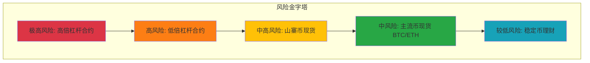
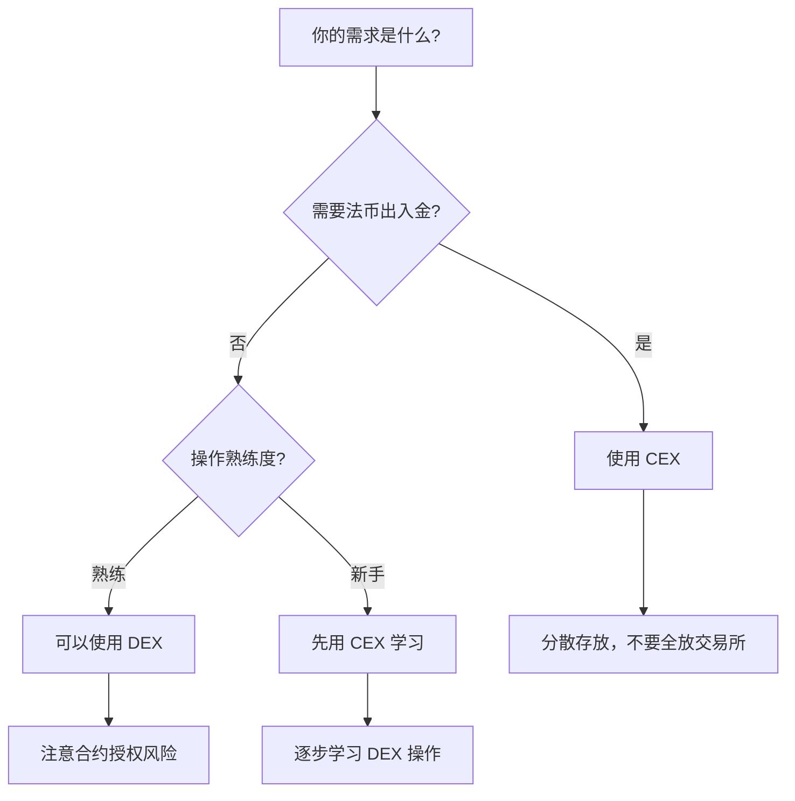

# 9.3 投资参与：从持币到交易

> **风险提示**
>
> 加密货币投资具有极高风险，价格波动剧烈，可能导致本金全部损失。本章节内容仅供教育目的，**不构成任何投资建议**。
>
> 在考虑投资之前，请确保：
> - 你充分了解相关风险
> - 你只使用可以承受完全损失的资金
> - 你的投资决策不会影响正常生活
>
> **如果你对投资没有充分准备，请认真考虑 9.1「只学习」的参与方式。**

---

> **学习目标**：完成本节后，你将能够：
> - 理解现货与合约交易的本质区别和风险差异
> - 了解 CEX 与 DEX 的各自特点和适用场景
> - 识别常见的投资陷阱，建立风险意识

---

## 核心内容

### 1. 现货持有 vs 合约交易

这是加密货币投资中最重要的区分之一。

#### 现货交易（Spot Trading）

**定义**：用法定货币或其他加密货币购买实际的加密资产。

**特点**：
- 你拥有实际的代币
- 最大亏损 = 投入本金
- 没有时间限制，可以长期持有
- 操作相对简单

#### 合约交易（Futures/Derivatives Trading）

**定义**：通过杠杆交易加密货币的价格变动，不持有实际资产。

**特点**：
- 不持有实际代币，只是对赌价格
- 使用杠杆放大收益和亏损
- 可能亏损超过本金（爆仓）
- 有强制平仓机制

#### 对比分析

| 维度 | 现货交易 | 合约交易 |
|-----|---------|---------|
| 风险等级 | 中等 | **极高** |
| 最大亏损 | 本金 | 可超过本金 |
| 收益模式 | 价格上涨获利 | 可做多/做空 |
| 杠杆 | 无 | 1x-125x |
| 持有时间 | 无限制 | 可能被强平 |
| 适合人群 | 普通投资者 | 专业交易者 |
| 心理压力 | 较低 | **极高** |

> **重要警示**：据多个交易所披露的数据，**超过 90% 的合约交易者最终亏损**。合约交易本质上接近零和博弈，普通人几乎不可能长期获利。**强烈不建议普通投资者参与合约交易。**

### 2. CEX vs DEX 的选择

#### CEX（中心化交易所）

**代表**：Binance、OKX、Coinbase

**特点**：
| 优势 | 劣势 |
|-----|------|
| 操作简单，类似传统金融 App | 资产托管在平台，存在平台风险 |
| 交易速度快，流动性好 | 需要 KYC 实名认证 |
| 支持法币出入金 | 可能面临监管限制 |
| 客服支持 | 平台可能限制提款 |

#### DEX（去中心化交易所）

**代表**：Uniswap、dYdX、Jupiter

**特点**：
| 优势 | 劣势 |
|-----|------|
| 资产自托管，无平台风险 | 操作复杂，有学习门槛 |
| 无需 KYC | 交易可能有滑点 |
| 抗审查 | 出错无法找回 |
| 更多长尾代币 | 可能遇到假币/诈骗币 |

#### FTX 事件的教训

2022 年 11 月，曾经排名前三的交易所 FTX 突然崩溃：
- 用户资产被挪用，无法提款
- 数十亿美元用户资金损失
- 创始人面临刑事指控

**启示**：
- CEX 的平台风险是真实存在的
- 「Not your keys, not your coins」（不是你的私钥，就不是你的币）
- 不要在单一平台存放过多资产

#### 选择建议

### 3. 仓位管理与投资心态

#### 仓位管理原则

| 原则 | 说明 |
|-----|------|
| **永不全仓** | 任何时候都保留一定现金/稳定币 |
| **可承受损失** | 只投入归零也不影响生活的资金 |
| **分散投资** | 不要把所有资金押在单一资产 |
| **设定止损** | 提前决定亏损多少就退出 |

#### 投资心态建设

**需要接受的现实**：
1. 没有人能准确预测市场
2. 亏损是投资的一部分
3. 暴富故事是幸存者偏差
4. 长期来看，大多数山寨币归零

**健康的投资心态**：
- 投资是概率游戏，不是确定性事件
- 控制风险比追求收益更重要
- 不要让投资影响睡眠和生活
- 接受自己的判断可能错误

### 4. 定投、波段、长持的适用场景

| 策略 | 适用场景 | 优势 | 劣势 |
|-----|---------|-----|------|
| **定投** | 长期看好、不想择时 | 平滑成本波动、纪律性强 | 牛市后期效果差 |
| **波段** | 有分析能力、愿意花时间 | 潜在更高收益 | 需要大量时间、容易出错 |
| **长持** | 坚定看好某资产 | 简单省心、避免频繁操作 | 可能错过卖点、心理考验大 |

> **Tips**：对于大多数普通投资者，如果决定参与，**定投主流币（BTC/ETH）+ 长期持有** 是相对稳健的策略。但请记住，即使是主流币也可能大幅下跌。

### 5. 常见投资陷阱

#### FOMO（Fear Of Missing Out）- 错过恐惧

**表现**：看到价格上涨，担心错过，冲动买入

**后果**：高位接盘，买在山顶

**应对**：
- 提前制定投资计划
- 不要因为价格上涨而改变计划
- 记住：涨得越多，风险越大

#### 追涨杀跌

**表现**：上涨时买入，下跌时恐慌卖出

**后果**：高买低卖，持续亏损

**应对**：
- 制定明确的买卖规则
- 不要频繁查看价格
- 情绪激动时不做决策

#### 杠杆爆仓

**表现**：使用高倍杠杆试图快速获利

**后果**：一次大幅波动就可能归零

**应对**：
- **不要使用杠杆**（最佳建议）
- 如果使用，仅用极小仓位
- 永远设置止损

#### 信息不对称 - 被 KOL 带节奏

**表现**：跟随 KOL 或「老师」的喊单买卖

**后果**：成为别人的退出流动性

**应对**：
- 任何人的建议都可能有利益冲突
- 独立研究，独立决策
- 不要相信「稳赚不赔」的承诺

#### 沉没成本谬误

**表现**：亏损后不愿止损，期待回本

**后果**：小亏变大亏，错过其他机会

**应对**：
- 提前设定止损点并严格执行
- 接受「认亏」是正确的决策
- 每笔投资独立评估

---

## 案例/故事

### 案例 1：杠杆爆仓

小李在 2021 年牛市期间，用 10 倍杠杆做多 BTC。初期确实获得了可观收益，信心大增。后来他加大仓位，在 BTC 价格 $60,000 时开了 20 倍杠杆多单。

结果：BTC 价格短期下跌 5%，触发强制平仓。小李不仅亏光了之前的盈利，还亏损了大部分本金。

**教训**：杠杆放大收益的同时也放大风险，一次失误可能抹去所有盈利。

### 案例 2：FTX 用户

2022 年 11 月，FTX 交易所突然暂停提款。数百万用户的资产被冻结，许多人损失了全部加密货币持仓。

一位用户回忆：「我把 90% 的加密资产都放在 FTX，因为觉得它是大平台很安全。一夜之间，这些钱全没了。」

**教训**：不要在任何单一平台存放过多资产，平台风险是真实存在的。

### 案例 3：理性投资者

相比之下，小陈的做法更为谨慎：
- 只用月收入的 10% 投资加密货币
- 80% 配置 BTC 和 ETH，20% 尝试其他项目
- 资产分散在 2 个 CEX + 1 个硬件钱包
- 严格执行定投计划，不追涨杀跌

结果：虽然也经历了熊市下跌，但因为仓位控制得当，心态稳定，没有恐慌卖出。在市场回暖时，获得了不错的回报。

**启示**：风险管理和纪律比追求高收益更重要。

---

## 关键概念速查

| 概念 | 一句话解释 |
|-----|-----------|
| 现货交易 | 买入并持有实际的加密货币资产 |
| 合约交易 | 通过杠杆交易价格变动，不持有实际资产 |
| 杠杆 | 借入资金放大交易规模，同时放大盈亏 |
| 爆仓 | 亏损达到一定程度，被强制平仓 |
| CEX | 中心化交易所，托管用户资产 |
| DEX | 去中心化交易所，用户自托管资产 |
| FOMO | 错过恐惧，因担心错过机会而冲动行动 |
| 定投 | 定期定额投资，平滑买入成本 |

---

## 学习资料

### 必读
- [Binance Academy - 交易基础](https://academy.binance.com/zh/articles?tags=trading) - 交易概念入门（预计阅读 1 小时）
- [CoinGecko Learn - 投资指南](https://www.coingecko.com/learn) - 投资教育内容（预计阅读 1 小时）

### 选读（进阶）
- FTX 暴雷事件深度报道 - 理解平台风险
- 《行为金融学》相关章节 - 理解投资心理陷阱
- 各交易所的风险披露文档 - 了解官方风险提示

---

## 学习任务

完成以下任务以检验学习效果：

- [ ] **任务 1**：制作一张「现货 vs 合约」的对比表，列出至少 5 个维度的差异，并写出你的选择理由
- [ ] **任务 2**：假设你决定投资 $1,000，设计一个仓位管理方案，包括：资产配置比例、存放位置（CEX/DEX/钱包）、止损规则
- [ ] **任务 3**：回顾本节提到的 5 个投资陷阱，写出你认为自己最容易掉入的陷阱，以及你的应对策略

> **提交方式**：将分析结果整理成文档

---

## 常见问题 FAQ

**Q1: 新手应该从现货还是合约开始？**

A: **一定是现货**。合约交易需要丰富的交易经验、严格的风险控制和强大的心理素质。对于新手，甚至对于大多数人，都不建议参与合约交易。

**Q2: 应该选择 CEX 还是 DEX？**

A: 建议从 CEX 开始，因为操作更简单，也支持法币出入金。但要注意分散风险，不要把所有资产放在一个平台。随着经验增加，可以学习使用 DEX。

**Q3: 定投是不是最好的策略？**

A: 定投是一种相对稳健的策略，适合大多数人，但不是「最好的」。在持续上涨的市场中，一次性投入收益更高；在持续下跌的市场中，定投也会持续亏损。没有完美的策略，只有适合自己的策略。

**Q4: 亏了怎么办？**

A: 首先接受亏损是投资的一部分。然后反思：是策略问题还是执行问题？是否超出了风险承受能力？如果投资已经影响到生活和情绪，建议暂停投资，回到「只学习」的状态。

**Q5: 看到很多人说某个币会涨 100 倍，可信吗？**

A: 极不可信。任何声称能准确预测涨幅的人，要么是骗子，要么是想让你成为他的退出流动性。加密货币市场没有确定性，所有预测都只是猜测。

---

最后更新：2025-01-09
编写：Antony
审核：待审核
