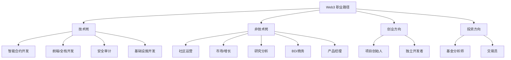
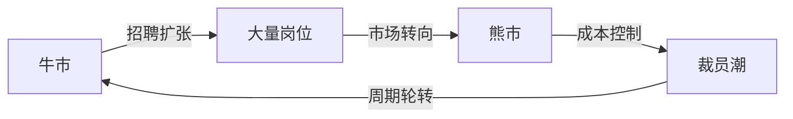

# 9.4 职业化参与的现实门槛

> **学习目标**：完成本节后，你将能够：
> - 了解 Web3 行业的主要职业路径和真实门槛
> - 评估自身条件与各职业路径的匹配度
> - 制定合理的职业规划和准备方案

---

## 核心内容

### 1. Web3 职业化参与的主要路径



### 2. 各路径的真实门槛

#### 2.1 技术岗位

| 岗位 | 技能要求 | 学习时间 | 入门难度 | 市场需求 |
|-----|---------|---------|---------|---------|
| **智能合约开发** | Solidity/Rust + 安全意识 + 区块链原理 | 6-12 个月 | 高 | 高 |
| **前端开发** | Web3.js/ethers.js + React/Vue + 钱包集成 | 3-6 个月 | 中 | 高 |
| **安全审计** | 智能合约 + 安全漏洞知识 + 审计方法论 | 12+ 个月 | 很高 | 中 |
| **基础设施** | 底层开发 + 分布式系统 + 密码学 | 12+ 个月 | 很高 | 中 |

**智能合约开发者进阶路线**：

```
编程基础 → Solidity 语法 → 常见合约模式 → 安全最佳实践 → 实战项目 → 开源贡献/工作
```

> **Tips**：如果你有编程背景，转型 Web3 开发是相对可行的路径。关键是要理解区块链的独特约束（Gas 优化、不可变性等）和安全要求。

#### 2.2 非技术岗位

| 岗位 | 技能要求 | 学习时间 | 入门难度 | 市场需求 |
|-----|---------|---------|---------|---------|
| **社区运营** | 沟通能力 + 英语 + 行业理解 | 1-3 个月 | 低 | 高 |
| **市场/增长** | 营销技能 + Web3 渠道理解 + 数据分析 | 2-4 个月 | 中 | 中 |
| **研究分析** | 研究方法 + 写作能力 + 数据分析 | 3-6 个月 | 中 | 中 |
| **BD/商务** | 商务拓展 + 行业人脉 + 谈判能力 | 3-6 个月 | 中 | 中 |
| **产品经理** | 产品方法论 + 区块链产品理解 + 用户研究 | 3-6 个月 | 中 | 中 |

**社区运营入门路线**：

```
了解行业 → 加入社区学习 → 参与社区活动 → 成为活跃成员 → 申请兼职/实习 → 全职工作
```

> **Tips**：社区运营是进入 Web3 最低门槛的路径之一，但「低门槛」不代表「容易做好」。优秀的社区运营需要真正理解项目和用户。

#### 2.3 创业方向

| 路径 | 要求 | 挑战 |
|-----|------|------|
| **项目创始人** | 技术能力或团队组建能力 + 行业洞察 + 融资能力 | 极高风险、极高压力 |
| **独立开发者** | 全栈能力 + 产品思维 + 自我驱动 | 收入不稳定、孤独 |

#### 2.4 投资方向

| 路径 | 要求 | 现实 |
|-----|------|------|
| **基金分析师** | 金融背景 + 区块链研究能力 + 人脉 | 岗位稀少，门槛极高 |
| **交易员** | 交易技能 + 风控能力 + 心理素质 | 大多数人亏损，不建议作为职业 |

### 3. 行业的真实状况

#### 薪资水平

Web3 薪资差异很大，受岗位、经验、公司、地区等多因素影响：

| 岗位 | 薪资范围（年薪，美元） | 说明 |
|-----|----------------------|------|
| 智能合约开发 | $80,000 - $300,000+ | 头部人才薪资极高 |
| 前端开发 | $60,000 - $180,000 | 与 Web2 相近或略高 |
| 社区运营 | $40,000 - $100,000 | 入门岗位薪资较低 |
| 研究分析 | $50,000 - $150,000 | 取决于机构和能力 |

> **注意**：这些数据仅供参考，实际薪资受多种因素影响，且行业薪资波动较大。

#### 工作节奏

- **远程工作普遍**：大多数 Web3 公司支持远程
- **时区挑战**：团队分布全球，可能需要配合不同时区
- **更新速度快**：技术和行业变化快，需要持续学习
- **边界模糊**：Crypto 市场 24/7，工作和生活边界可能模糊

#### 行业周期与稳定性

**残酷的现实**：

- 2022-2023 熊市期间，大量 Web3 公司裁员
- 即使是头部公司也可能大规模裁员
- 项目可能因资金问题或市场变化突然终止
- 行业稳定性远低于传统科技公司



### 4. 进入 Web3 行业的实际建议

#### 4.1 建立作品集/Portfolio

无论技术还是非技术岗位，展示你的能力比简历更重要：

| 岗位类型 | 作品集建议 |
|---------|-----------|
| 开发者 | GitHub 项目、部署的合约、开源贡献 |
| 研究分析 | 公开发表的研究文章、分析报告 |
| 运营 | 社区活动组织经历、内容创作 |
| 产品 | 产品分析文章、设计案例 |

#### 4.2 参与开源和社区

- 参与知名项目的 GitHub 贡献
- 加入项目 Discord，从志愿者做起
- 参加黑客松（Hackathon）积累经验
- 在社交媒体持续输出有价值的内容

#### 4.3 建立行业人脉

- 参加线下 Web3 活动和会议
- 在 Twitter/X 与行业从业者互动
- 加入高质量的行业社群
- 主动进行信息访谈（Informational Interview）

#### 4.4 从兼职/实习开始

- 不建议直接裸辞转型
- 利用业余时间做兼职项目
- 申请实习或兼职岗位积累经验
- 逐步过渡，降低风险

#### 4.5 持续学习和输出

- 跟进行业最新发展
- 学习新的技术和工具
- 通过写作和分享巩固学习
- 建立个人品牌和影响力

### 5. 职业化参与的隐性成本

在决定职业化参与之前，请考虑以下隐性成本：

| 成本类型 | 说明 |
|---------|------|
| **时间机会成本** | 学习和转型需要大量时间投入 |
| **稳定性风险** | 放弃稳定工作，面对行业波动 |
| **收入不确定性** | 初期收入可能下降，长期收入不确定 |
| **持续学习压力** | 行业变化快，需要不断更新知识 |
| **心理压力** | 市场波动、项目不确定性带来的压力 |

---

## 案例/故事

### 案例 1：成功转型 - Web2 开发者转 Web3

小张是一名有 5 年经验的 Web2 前端开发者。他的转型路径：

1. **第 1-3 个月**：业余时间学习 Solidity 和 Web3 前端技术
2. **第 4-6 个月**：参加了 2 个黑客松，虽然没获奖但积累了经验
3. **第 7-9 个月**：开源贡献了一个 DeFi 项目，建立了行业人脉
4. **第 10 个月**：通过内推获得一家 Web3 公司的 offer
5. **结果**：薪资提升 30%，工作内容更有挑战性

**关键成功因素**：有编程基础、持续学习、通过开源建立声誉

### 案例 2：现实挑战 - 熊市裁员

2022 年底，小王刚加入一家 Web3 创业公司 3 个月，就遭遇了裁员：

- 公司因融资困难，裁员 70%
- 小王失去工作，而此时整个行业都在裁员
- 找了 4 个月才找到新工作，期间非常焦虑

**教训**：
- 行业稳定性确实较低
- 需要有应对裁员的财务准备
- 人脉和持续学习帮助他最终找到新机会

### 案例 3：另一种选择 - 保持 Web2 工作

小李经过评估后，选择不完全转型：
- 保持 Web2 的稳定工作
- 业余时间参与 Web3 社区和开源
- 做自由职业的 Web3 咨询项目
- 等待合适的时机再考虑全职转型

**结果**：既保持了稳定收入，又积累了 Web3 经验和人脉。

---

## 关键概念速查

| 概念 | 一句话解释 |
|-----|-----------|
| 智能合约开发 | 编写运行在区块链上的程序代码 |
| 黑客松（Hackathon） | 限时编程竞赛，是展示能力和建立人脉的好机会 |
| 开源贡献 | 参与公开的软件项目开发，建立技术声誉 |
| 远程工作 | 不需要到办公室，通过网络协作的工作方式 |
| 作品集（Portfolio） | 展示个人能力和经验的项目集合 |
| 信息访谈 | 与从业者交流获取行业信息的非正式面谈 |

---

## 学习资料

### 必读
- [Web3 Career](https://web3.career/) - 主流 Web3 求职平台，了解市场需求（预计浏览 30 分钟）
- [Crypto Jobs List](https://cryptojobslist.com/) - 另一个求职平台，对比岗位要求（预计浏览 30 分钟）

### 选读（进阶）
- [ETH Global](https://ethglobal.com/) - 全球最大的以太坊黑客松组织
- [LearnWeb3](https://learnweb3.io/) - 免费的 Web3 开发学习平台
- [Buildspace](https://buildspace.so/) - 项目制 Web3 学习平台
- 从业者的 Twitter/X 分享 - 了解真实工作体验

---

## 学习任务

完成以下任务以检验学习效果：

- [ ] **任务 1**：在 Web3 Career 或 Crypto Jobs List 上浏览 10 个你感兴趣的岗位，总结它们的共同要求
- [ ] **任务 2**：评估自己的现有技能和经验，选择一个最可能的切入方向，写出你需要补充的能力清单
- [ ] **任务 3**：制定一个 3 个月的准备计划，包括：学习内容、要完成的项目、要建立的人脉

> **提交方式**：将计划整理成文档

---

## 常见问题 FAQ

**Q1: 没有技术背景能进入 Web3 吗？**

A: 可以。社区运营、市场、研究、BD 等岗位不需要编程能力。但你仍需要深入了解行业和产品。非技术岗位竞争同样激烈，需要展示你的独特价值。

**Q2: Web3 工作一定比 Web2 赚得多吗？**

A: 不一定。头部技术人才薪资确实很高，但普通岗位未必比 Web2 高。而且要考虑稳定性差异——Web2 大厂的总包（工资+股票+福利）可能更有保障。

**Q3: 应该先辞职再转型吗？**

A: 不建议。最好利用业余时间积累经验，通过兼职或开源建立声誉，拿到 offer 后再辞职。裸辞转型风险很高，尤其是在熊市期间。

**Q4: 英语不好怎么办？**

A: 英语确实很重要，大多数项目和团队使用英语交流。建议：从中文社区和项目开始，同时提升英语能力。长期来看，英语是进入更广阔 Web3 世界的必要技能。

**Q5: 年龄大了还能转型吗？**

A: Web3 行业相对不看重传统背景，更看重能力和贡献。关键是展示你能创造的价值。年龄不是障碍，但需要更清晰的定位和更多的准备。

---

## 下一步

完成 Part09 全部学习后：

**综合学习任务**：根据本章所学，完成课程大纲要求的任务：

> **根据自身情况，写下你打算以哪种方式参与 Web3，并列出 3 个你需要注意的风险点。**

你可以从以下四种方式中选择：
1. 只学习、不入局
2. 小额参与（空投交互）
3. 投资参与（持币或交易）
4. 职业化参与

无论选择哪种方式，都是有效的参与。关键是做出适合自己的选择，并清楚认识其中的风险。

继续阅读 [Part 10 最终路径建议与决策出口](../Part10-路径建议与决策/)，获得更具体的决策支持。

---

最后更新：2025-01-09
编写：Antony
审核：待审核
