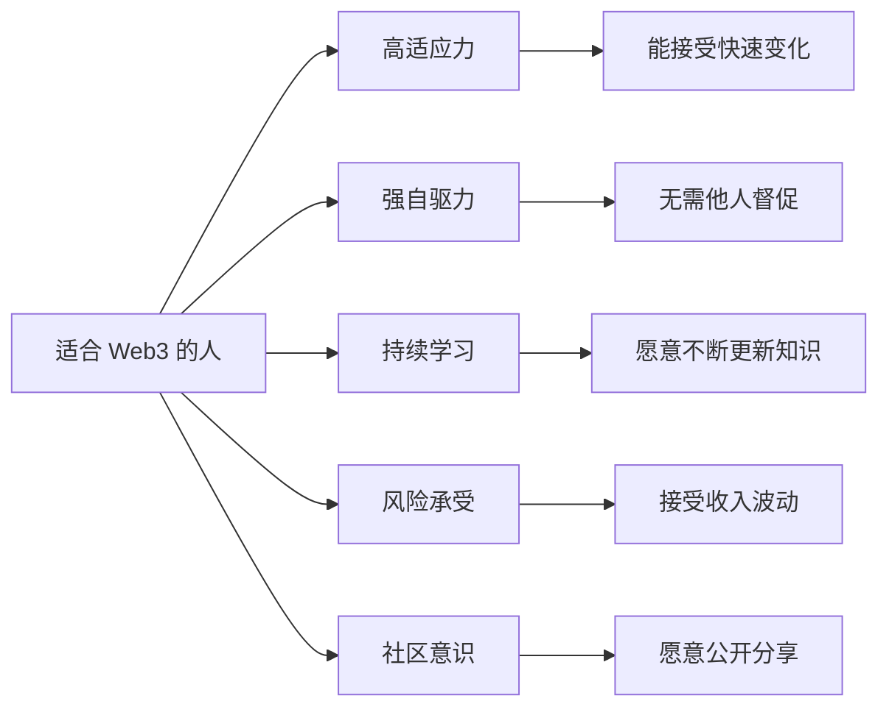
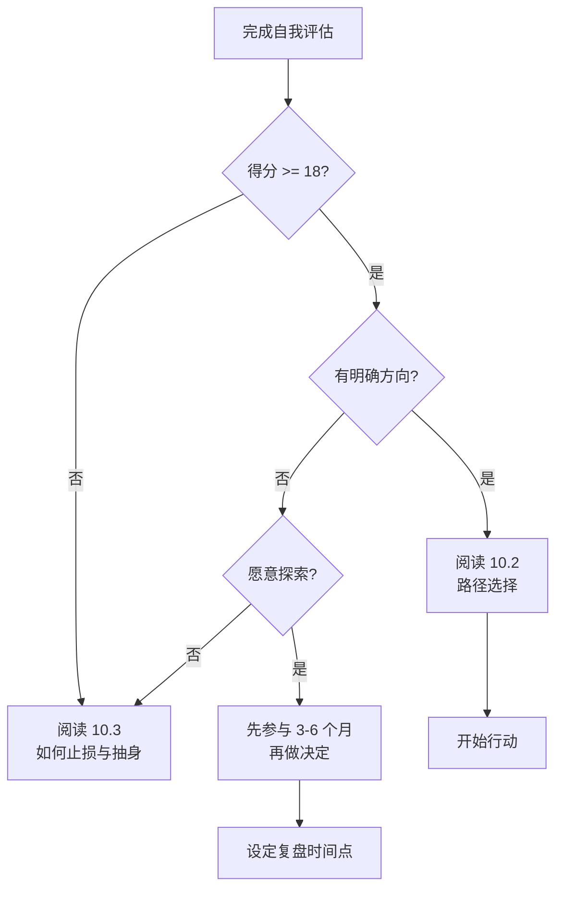

# 10.1 我是否适合长期投入 Web3

> **学习目标**：完成本节后，你将能够：
> - 运用自我评估框架，判断自己是否适合长期投入 Web3
> - 识别适合与不适合 Web3 的典型特质
> - 做出理性的个人决策，而非被 FOMO 驱动

---

## 核心内容

### 1. 为什么需要做这个判断

学完前面九个部分，你对 Web3 已经有了全面的认知。现在面临一个关键问题：**我是否要长期投入这个领域？**

这个问题没有标准答案。Web3 不是"必须上车"的机会，也不是"骗局"。它是一个有独特机会和风险的领域，适合某些人，但不适合所有人。

**做出明确判断的价值**：
- 避免半心半意地投入，既浪费时间又错失其他机会
- 如果决定投入，可以更坚定、更有策略
- 如果决定不投入，可以心安理得地离开

> **Tips**：不做选择本身也是一种选择——一种效率最低的选择。

### 2. Web3 行业的真实现状

根据 [Web3.Career 2025 年报告](https://web3.career/learn-web3/web3-intelligence-report)，Web3 领域目前的情况：

| 指标 | 数据 |
|-----|------|
| 全球从业人数 | 超过 46 万人 |
| 过去一年新增 | 约 10 万人 |
| 技术岗占比 | 约 65% |
| 非技术岗占比 | 约 35%（快速增长） |
| 项目管理岗需求占比 | 27%+ |

**行业变化趋势**：
- 从"来者不拒"转向"精挑细选"
- 从"实验期"进入"执行期"
- AI 技能要求从 2% 增长到 14%

这意味着：**机会仍在，但门槛在提高。**

### 3. 适合长期投入的特质

以下特质越多，越适合长期投入 Web3：

**详细说明**：

| 特质 | 表现 | 为什么重要 |
|-----|------|-----------|
| **适应力** | 能接受项目失败、市场下行、计划变化 | Web3 变化极快，今天的热点明天可能归零 |
| **自驱力** | 无需明确指令，能自行探索和学习 | 行业缺乏成熟培训体系，需要自己找路 |
| **学习意愿** | 每周愿意投入 5+ 小时学习新知识 | 技术和趋势更新速度远超传统行业 |
| **风险承受** | 能接受收入波动 50% 以上 | 项目方和初创公司的稳定性较低 |
| **社区意识** | 愿意公开分享、参与讨论 | Web3 重视"公开证明"和社区贡献 |

### 4. 不适合的警示信号

如果你有以下特质，可能需要慎重考虑：

- **追求稳定**：需要明确的晋升通道和稳定收入
- **风险厌恶**：无法接受本金损失或收入中断
- **被动学习**：期望有完善的培训体系和导师指导
- **短期心态**：只想快速获利，不愿长期积累
- **信息焦虑**：无法处理 FOMO 和信息过载

> **Tips**：这些特质本身没有好坏之分。追求稳定是理性选择，只是可能不适合 Web3。

### 5. 自我评估工具

用以下评分卡对自己进行评估（每项 1-5 分）：

| 评估维度 | 问题 | 你的得分 |
|---------|------|---------|
| **时间** | 未来 6 个月，我每周能投入多少小时？（<5h=1分, 5-10h=3分, >10h=5分） | __ |
| **资金** | 我有多少个月的生活储备金？（<3月=1分, 3-6月=3分, >6月=5分） | __ |
| **风险** | 如果投入的钱亏损 50%，我能接受吗？（完全不能=1分, 勉强=3分, 可以=5分） | __ |
| **学习** | 我学习新概念的速度如何？（很慢=1分, 一般=3分, 很快=5分） | __ |
| **心态** | 我对"失败"的态度？（非常害怕=1分, 不喜欢但能接受=3分, 视为学习机会=5分） | __ |
| **动机** | 我想进入 Web3 的主要原因？（只想赚钱=1分, 好奇+赚钱=3分, 真正感兴趣=5分） | __ |

**评分解读**：
- **24-30 分**：非常适合，可以考虑深度投入
- **18-23 分**：比较适合，建议从兼职/小额开始
- **12-17 分**：谨慎考虑，建议只做学习和观察
- **6-11 分**：可能不适合，建议阅读 10.3 章节

### 6. 决策流程图

---

## 案例/故事

**小李的故事：从犹豫到清晰**

小李是一名 28 岁的产品经理，2023 年开始关注 Web3。他被各种"暴富故事"吸引，花了三个月业余时间学习。

学完基础后，他用这个评估框架给自己打分：
- 时间：3 分（工作很忙，每周只能投入 5-8 小时）
- 资金：4 分（有 8 个月储备）
- 风险：2 分（有房贷，不能接受大额亏损）
- 学习：4 分（学习能力不错）
- 心态：3 分（对失败有些焦虑）
- 动机：3 分（主要还是想赚钱）

总分 19 分，属于"比较适合"区间。

但仔细分析后，他发现自己的风险承受能力（2分）是硬伤——房贷压力让他无法真正承受波动。

最终决定：**保持学习和关注，但不做大额投入，等房贷压力减轻后再重新评估。**

这个决定让他避免了 2024 年初的市场波动带来的焦虑，同时保持了对行业的了解。

---

## 关键概念速查

| 概念 | 一句话解释 |
|-----|-----------|
| 自我评估 | 基于客观标准判断自己是否适合某个领域 |
| 机会成本 | 选择一个方向意味着放弃其他可能性 |
| FOMO | Fear of Missing Out，害怕错过的焦虑心理 |
| 风险承受能力 | 能够接受损失而不影响正常生活和心态的程度 |
| 自驱力 | 无需外部督促，能自发学习和行动的能力 |

---

## 学习资料

### 必读
- [Web3.Career Intelligence Report 2025](https://web3.career/learn-web3/web3-intelligence-report) - 行业就业数据报告，了解真实市场情况（预计阅读 20 分钟）

### 选读（进阶）
- [2025年Web3求职市场报告](https://www.theblockbeats.info/news/58880) - BlockBeats 中文版行业调研
- [How to Get a Web3 Job in 2025](https://web3.career/learn-web3/how-to-get-web3-job-2025) - 如果决定继续，这是实用的求职指南

---

## 学习任务

完成以下任务以检验学习效果：

- [ ] **任务 1**：完成上述自我评估，计算你的总分，并写下你对结果的思考（100 字以内）
- [ ] **任务 2**：根据评估结果，写下你的初步决定：继续 / 观望 / 退出，以及理由（50 字以内）

> **提交方式**：将任务输出记录在个人学习笔记中

---

## 常见问题 FAQ

**Q1: 我的评估得分刚好在临界点（17-18分），该怎么办？**

A: 临界点意味着没有明显的优势或劣势。建议：1）用 3-6 个月时间小规模参与，积累真实体验；2）设定明确的复盘时间点；3）不要做大额投入。

**Q2: 我只是想投资，不想从业，还需要做这个评估吗？**

A: 需要。投资同样需要时间、资金、风险承受能力和学习意愿。如果只是想"放点钱进去不管"，建议直接买主流资产（BTC/ETH）并设好止损，不需要深度参与。

**Q3: 评估得分很低，但我真的很感兴趣，怎么办？**

A: 兴趣是好事，但不能替代客观条件。建议：1）先解决制约因素（如增加储蓄、减少债务）；2）用最小成本保持学习（关注信息、参与社区）；3）等条件改善后再重新评估。

**Q4: 我担心"错过"Web3，这种焦虑正常吗？**

A: 完全正常，但需要理性看待。Web3 不是"现在不进就永远错过"的机会。行业仍在早期，未来会有更多成熟的入场时机。与其焦虑地半投入，不如做出清晰决定。

---

最后更新：2025-01-09
编写：Antony
审核：待审核
